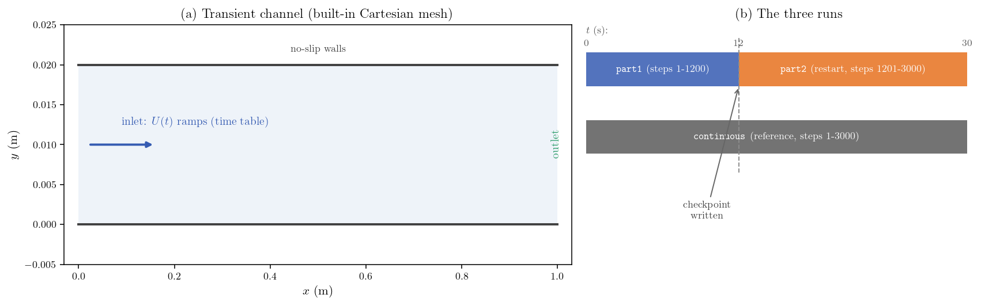
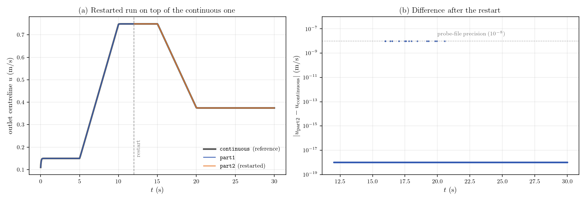

# Checkpoint and Restart (Splitting a Transient Calculation)

A step-by-step tutorial for **checkpointing and restarting** a code_saturne
calculation: a transient run is stopped after 1200 time steps, then a second run
restarts from its checkpoint and continues to step 3000. The restarted history
superposes the one of an uninterrupted reference run down to the write precision
of the probe files, demonstrating that a split calculation is equivalent to a
continuous one.

The transient is a laminar channel whose inlet velocity ramps between plateaus
(driven by a time table, see
[Inc_Time_Table_Inlet](../Inc_Time_Table_Inlet)): the restart happens in the
middle of the scenario, which also shows that time-dependent inputs resume
correctly.

Maintained by [Simvia](https://Simvia.tech/fr), part of the
[tutoriel-code_saturne](https://github.com/simvia-tech/tutorials-code_saturne) collection.

## Learning objectives

After completing this tutorial you will be able to:

1. Know what code_saturne writes in the `checkpoint/` directory of a run.
2. Configure a restart in the GUI (checkpoint path, or automatic mode) and understand that the iteration count is absolute.
3. Split a transient calculation into successive runs with named result directories.
4. Verify that a restarted calculation reproduces the uninterrupted one.

## Prerequisites

| Requirement | Detail |
|---|---|
| code_saturne | **v9.1** |
| Background | Any transient code_saturne case |

If code_saturne is not yet installed, build it from the
[official homepage](https://code-saturne.org/), pull a
ready-to-use Singularity image from the
[Open Simulation Center](https://open-simulation-center.org/downloads/code_saturne/code_saturne),
or pull the
[Simvia Docker image](https://hub.docker.com/r/Simvia/code_saturne) before continuing.

## Case files

```text
Inc_Checkpoint_Restart/
├── CASE/
│   └── DATA/
│       ├── setup.xml            # pre-configured GUI case (continuous reference)
│       └── inlet_velocity.csv   # time table driving the inlet ramps
├── FIGURES/                     # figures used in this README
└── README.md
```

There is no mesh file: the channel grid is built by code_saturne's internal
Cartesian mesher, directly from `setup.xml`.

## Physical model

The flow is laminar, incompressible and truly transient
($\Delta t=0.01\ \mathrm{s}$, 3000 steps, 30 s): a viscous fluid
($\rho=900\ \mathrm{kg\,m^{-3}}$, $\mu=0.09\ \mathrm{Pa\,s}$) enters a plane
channel ($L=1\ \mathrm{m}$, $H=0.02\ \mathrm{m}$, $Re_{D_h}=40$ to $200$) with a
velocity that ramps between plateaus (0.1, 0.5 and 0.25 m/s). The physics is
deliberately simple: the subject of the tutorial is the calculation workflow,
not the flow.

<p align="center">
  
  <br>
  <em>Figure 1: (a) The transient channel. (b) The three runs: part1 stops at
  step 1200 and writes a checkpoint; part2 restarts from it and continues to
  step 3000; the continuous run is the reference.</em>
</p>

## The checkpoint (the feature)

Every run writes a `checkpoint/` directory inside its result directory
(`RESU/<id>/checkpoint/`), containing the mesh (`mesh_input.csm`), the main
variables (`main.csc`), auxiliary data (`auxiliary.csc`) and, when relevant,
notebook and time-table state. By default it is written at the end of the run
and periodically during long calculations.

A restart is configured in the GUI under **Calculation management, Start/Restart**
by pointing to a previous checkpoint, which stores in `setup.xml`:

```xml
<start_restart>
  <restart path="RESU/part1/checkpoint"/>
</start_restart>
```

(`path="*"` selects the most recent checkpoint automatically.) Two important
behaviours:

- The **iteration count is absolute**: with 3000 iterations requested, a restart
  from step 1200 performs steps 1201 to 3000.
- Time-dependent inputs (time tables, notebook values saved in the checkpoint)
  resume at the restart time.

## Running the simulation

The shipped `setup.xml` is the continuous reference (3000 steps, no restart).
The split workflow changes one setting between runs:

```bash
cd CASE

# run A: set iterations to 1200 in the GUI, then
code_saturne run --n 4 --id part1

# run B: set iterations back to 3000 and select the restart
#        (Calculation management > Start/Restart > RESU/part1/checkpoint), then
code_saturne run --n 4 --id part2

# run C (reference): iterations 3000, restart disabled
code_saturne run --n 4 --id continuous
```

Each run creates its own `CASE/RESU/<id>/` with `run_solver.log`, `monitoring/`
(probe histories recorded at every step) and `checkpoint/`. The `part2` log
confirms the restart (`Reading file: restart/main.csc`).

## Results and verification

<p align="center">
  
  <br>
  <em>Figure 2: (a) The outlet velocity history of part1 and of the restarted
  part2, on top of the continuous reference. (b) Pointwise difference between
  part2 and the reference: zero at most steps, with isolated points at the
  $10^{-8}$ write precision of the probe files.</em>
</p>

| Comparison | Max difference |
|---|---:|
| part1 vs continuous (steps 1 to 1200) | 0 (bitwise identical) |
| part2 (restarted) vs continuous (steps 1201 to 3000) | $10^{-8}\ \mathrm{m\,s^{-1}}$ (probe-file precision) |

The split calculation is therefore indistinguishable from the uninterrupted one:
the checkpoint stores the complete solver state. The restart happened in the
middle of the inlet ramp scenario and the time table resumed exactly.

## Summary

This tutorial split a 3000-step transient calculation into two runs: a first run
stopped at step 1200 (writing its `checkpoint/`), and a second run restarted
from that checkpoint through the GUI setting
(`start_restart/restart path`), continuing to the absolute iteration target. The
restarted history matches the uninterrupted reference exactly, at the write
precision of the probe files. Checkpointing is the standard way to handle long
calculations (job time limits, staged convergence, model changes on a converged
state) and works identically for every code_saturne physics.

## References

1. code_saturne documentation: <https://code-saturne.org/doc/>.

## Authors

[Simvia](https://Simvia.tech/fr) - Questions, remarks and requests are welcome.