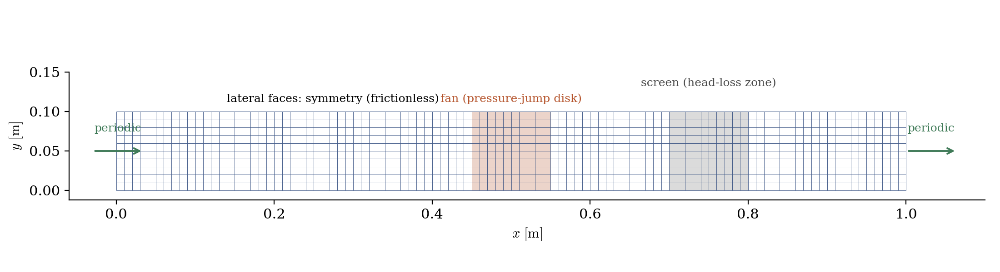
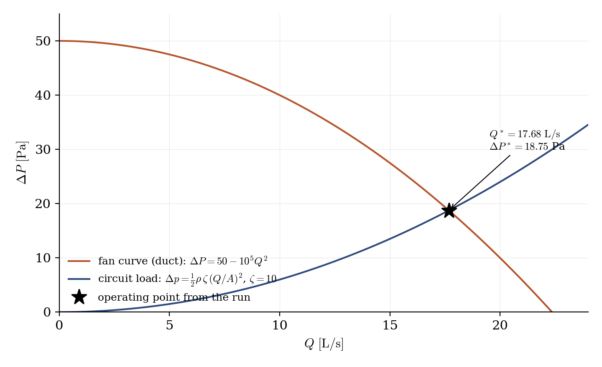
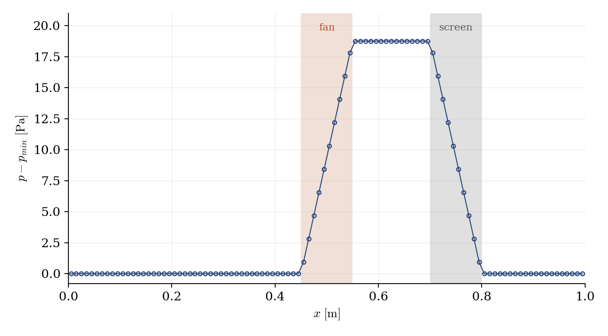

# Fan in a Duct (Actuator Disk with a Fan Curve)

A step-by-step tutorial for the **fan model** of **code_saturne**: a virtual disk placed inside the mesh, pushing the flow according to a prescribed characteristic curve $\Delta P(Q)$: the everyday tool for ventilation studies where meshing the real fan is out of the question. A duct is closed into a periodic loop with a fan and a resistance screen: the flow rate is imposed nowhere, and the computation settles on the **operating point**, the intersection of the fan curve with the circuit load.

Maintained by [Simvia](https://Simvia.tech/fr), part of the
[tutoriel-code_saturne](https://github.com/simvia-tech/tutorials-code_saturne) collection.

## Learning objectives

After completing this tutorial you will be able to:

1. Define a **fan** from the GUI (**Fans** page): axis, radii, and the characteristic curve given by its three coefficients $\Delta P = C_0 + C_1 Q + C_2 Q^2$.
2. Know the two traps of the model: the **pressure-jump mode** (blades and hub radii at zero) versus the blade-profile mode, and the **thrust conservation** factor when the theoretical disk does not match the meshed section.
3. Read the operating point live in the log (`Fans` block) and verify it against the curve intersection.

## Prerequisites

| Requirement | Detail |
|---|---|
| code_saturne | **v9.1** |
| Tutorials | [Inc_Head_Loss_Zone](../Inc_Head_Loss_Zone) (the screen), [Inc_Streamwise_Periodic](../Inc_Streamwise_Periodic) (periodicity) |

If code_saturne is not yet installed, build it from the
[official homepage](https://code-saturne.org/), pull a
ready-to-use Singularity image from the
[Open Simulation Center](https://open-simulation-center.org/downloads/code_saturne/code_saturne),
or pull the
[Simvia Docker image](https://hub.docker.com/r/Simvia/code_saturne) before continuing.

## Case files

```
Inc_Fan_Duct/
├── CASE/
│   └── DATA/setup.xml     # fan, screen, periodic loop: all GUI
├── FIGURES/               # figures used in this README
└── README.md
```

> Built-in cartesian mesher, no user routine, no mesh file.

## The case

A $1$ m duct of square section ($0.1 \times 0.1$ m, air, laminar) is closed into a **periodic loop**: no inlet, no outlet, so no boundary condition enters the balance. The loop carries two elements:

- the **fan** ($x = 0.45$ to $0.55$ m), used in pressure-jump mode (blades and hub radii at zero: uniform axial push, the ideal actuator);
- the **screen**, a head-loss zone: it stands for whatever a real fan must overcome (filter, coil, grilles, or a whole duct network aggregated into one coefficient) and gives the circuit its load curve $\Delta p = \frac{1}{2}\rho\,\zeta\,(Q/A)^2$. Its coefficient comes from the GUI head-loss zone exactly as in [Inc_Head_Loss_Zone](../Inc_Head_Loss_Zone): $K_{xx} = 100\ \mathrm{m^{-1}}$ is a resistance *per metre* of zone, so the screen of thickness $L = 0.1$ m totals $\zeta = K_{xx} L = 10$: at the operating point, $\Delta p = \frac{1}{2} \times 1.2 \times 10 \times 1.768^2 = 18.75$ Pa.

<p align="center">
  
  <br>
  <em>Figure 1: the computational domain: a periodic duct loop with the fan disk (orange) and the resistance screen (grey); lateral faces are frictionless symmetries.</em>
</p>

**The fan curve** $\Delta P = 50 - 10^5 Q^2$ is a didactic stand-in for a small axial fan: $50$ Pa at zero flow, free delivery at $22.4$ L/s. In a real study, the three coefficients are fitted on the manufacturer's curve. The negative slope is what makes the operating point stable.

**How the curve enters the setup.** The three coefficients are typed in the GUI **Fans** page and land in `setup.xml` as:

```xml
<curve_coeffs_x>24.868</curve_coeffs_x>     <!-- C0 [Pa] -->
<curve_coeffs_y>0.0</curve_coeffs_y>        <!-- C1 [Pa/(m3/s)] -->
<curve_coeffs_z>-49736.8</curve_coeffs_z>   <!-- C2 [Pa/(m3/s)2] -->
```

Beware the naming: the `_x`, `_y`, `_z` suffixes are **not directions** but the polynomial degrees $C_0$, $C_1$, $C_2$ of $\Delta P = C_0 + C_1 Q + C_2 Q^2$ ($Q$ in $\mathrm{m^3/s}$). At every iteration, the solver measures the flow $Q$ through the disk, evaluates $\Delta P(Q)$ from these coefficients, and applies the corresponding force: this feedback is what drives the run to the operating point.

**Why these values are not $50$ and $-10^5$**: the model conserves the thrust of the *theoretical* fan, $\Delta P \cdot \pi r_{fan}^2$, rescaling its force to the cells actually meshed. Our disk ($r_{fan} = 0.08$ m, chosen so that every duct cell is covered) is larger than the duct section, so the duct feels $\pi r_{fan}^2 / S = 2.01$ times the entered curve. The entered coefficients are therefore the target duct curve divided by that factor: $C_0 = 50/2.0106 = 24.868$ and $C_2 = -10^5/2.0106 = -49\,737$. Forget this division and the fan is twice too strong. (Consequence: the `deltaP` column of the log shows the raw entered curve, $9.3$ Pa at the operating point, while the duct actually receives $18.75$ Pa.)

The operating point follows:

$$
50 - 10^5\,Q^2 = \tfrac{1}{2}\rho\,\zeta\,(Q/A)^2
\quad\Rightarrow\quad
Q^* = 17.68\ \mathrm{L/s},\quad \Delta P^* = 18.75\ \mathrm{Pa}
$$

## Running the simulation

```bash
cd Inc_Fan_Duct/CASE
code_saturne run --id fan
```

A few seconds, serial. The log prints a `Fans` block at every iteration with the flow through the disk: the operating point converges live.

## Results

<p align="center">
  
  <br>
  <em>Figure 2: the two curves and the computed operating point (star): $Q = 17.678$ L/s, on the intersection to five digits.</em>
</p>

<p align="center">
  
  <br>
  <em>Figure 3: pressure along the loop: the fan raises exactly what the screen dissipates ($18.75$ Pa), with flat plateaus in the frictionless duct.</em>
</p>

The equilibrium is exact to display precision: uniform plug velocity of $1.7678$ m/s, pressure span of $18.75$ Pa, flow rate on the predicted intersection to five digits.

## Summary

This tutorial placed a virtual fan in a periodic duct loop, entirely from the GUI, and let the computation find the operating point of the fan curve against the circuit load: intersection reproduced to five digits. Two things to remember: use the pressure-jump mode (zero blade and hub radii) for an ideal actuator disk, and account for the thrust-conservation factor when the theoretical disk does not match the meshed section.

## References

- [code_saturne documentation](https://code-saturne.org/doc/)

## Authors

[Simvia](https://Simvia.tech/fr) - Questions, remarks and requests are welcome.
