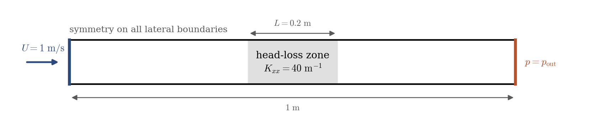
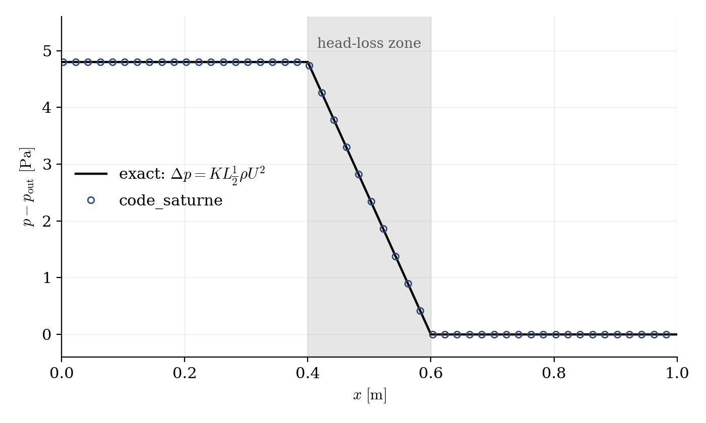

# Head-Loss Zone in a Duct

A step-by-step tutorial for using a **head-loss zone** in **code_saturne**: a volume region that mimics the pressure drop of a flow-through device (screen, filter, grille, heat-exchanger bundle, porous baffle) without meshing it. A uniform stream crosses a 0.2 m thick "porous screen" in a duct, and the computed pressure drop matches the prescribed one exactly. The whole setup is done in the GUI: no mesh file, no user routine.

Maintained by [Simvia](https://Simvia.tech/fr), part of the
[tutoriel-code_saturne](https://github.com/simvia-tech/tutorials-code_saturne) collection.

## Learning objectives

After completing this tutorial you will be able to:

1. Define a **volume zone** with a geometric criterion and flag it as a head-loss zone.
2. Set the **head-loss tensor** ($K_{xx}$, $K_{yy}$, $K_{zz}$) and understand its convention (per unit length).
3. Verify the result against the textbook pressure-drop formula.

## Prerequisites

| Requirement | Detail |
|---|---|
| code_saturne | **v9.1** |
| Background | None: this is one of the simplest possible cases |

If code_saturne is not yet installed, build it from the
[official homepage](https://code-saturne.org/), pull a
ready-to-use Singularity image from the
[Open Simulation Center](https://open-simulation-center.org/downloads/code_saturne/code_saturne),
or pull the
[Simvia Docker image](https://hub.docker.com/r/Simvia/code_saturne) before continuing.

## Case files

```
Inc_Head_Loss_Zone/
├── CASE/
│   └── DATA/
│       └── setup.xml            # pre-configured GUI case
├── FIGURES/                     # figures used in this README
└── README.md
```

> There is **no MESH directory** (built-in cartesian mesher) and **no SRC directory**: everything is set in the GUI.

## Physical model

A head-loss zone adds a resisting momentum source in a volume region:

$$
\mathbf{S} = -\frac{1}{2}\, \rho\, |\mathbf{u}|\, \mathsf{K}\, \mathbf{u}
$$

where $\mathsf{K}$ is the head-loss tensor in $\mathrm{m^{-1}}$ (a resistance **per unit length** of zone). For a uniform stream $U$ crossing a zone of thickness $L$ aligned with $x$, the integrated pressure drop is simply

$$
\Delta p = K_{xx}\, L\, \frac{1}{2} \rho U^2
$$

With the values of this case ($K_{xx} = 40\ \mathrm{m^{-1}}$, $L = 0.2$ m, $\rho = 1.2\ \mathrm{kg\,m^{-3}}$, $U = 1\ \mathrm{m\,s^{-1}}$): $\Delta p = 4.8$ Pa. In practice, $K$ is calibrated from a manufacturer curve or a correlation ($\Delta p$ at nominal flow rate divided by $L\,\frac{1}{2}\rho U^2$).

### Flow parameters

| Quantity | Symbol | Value | Source in `setup.xml` |
|---|---|---|---|
| Fluid (air-like) | $\rho$, $\mu$ | $1.2\ \mathrm{kg\,m^{-3}}$, $1.8 \times 10^{-5}\ \mathrm{Pa\,s}$ | `density`, `molecular_viscosity` |
| Inlet velocity | $U$ | $1\ \mathrm{m\,s^{-1}}$ | `inlet/velocity_pressure/norm` |
| Head-loss coefficient | $K_{xx}$ | $40\ \mathrm{m^{-1}}$ | `head_losses/head_loss` |
| Zone thickness | $L$ | $0.2$ m ($x = 0.4$ to $0.6$) | zone selector |
| Expected pressure drop | $\Delta p$ | $4.8$ Pa | derived |
| Domain, mesh | | $1 \times 0.1 \times 0.02$ m, $200 \times 20 \times 1$ cells | `mesh_cartesian` |
| Time | $\Delta t$, $N$ | $5 \times 10^{-3}$ s, $400$ steps | `time_parameters` |

## Geometry and boundary conditions

<p align="center">
  
  <br>
  <em>Figure 1: computational domain. All lateral boundaries are symmetries, so the stream stays a uniform plug flow and the measured pressure drop is due to the head-loss zone alone (no wall friction in the balance).</em>
</p>

| Boundary | Location | Nature | Zone selector |
|---|---|---|---|
| `Inlet` | $x = 0$ | Velocity inlet, $1\ \mathrm{m\,s^{-1}}$ | `X0` |
| `Outlet` | $x = 1$ | Free outlet | `X1` |
| `SymY`, `SymZ` | lateral faces | Symmetry | `Y0 or Y1`, `Z0 or Z1` |

### The head-loss zone in the GUI

Two steps:

1. **Volume zones**: add a zone (here `porous_screen`) with the selection criterion `box[0.4, -0.01, -0.01, 0.6, 0.11, 0.03]` and tick the **Head losses** nature.
2. **Volume conditions → Head losses**: select the zone and set the diagonal coefficients ($K_{xx} = 40$, $K_{yy} = K_{zz} = 0$) in the flow frame; the transformation matrix (identity here) allows a zone whose principal directions are not the coordinate axes.

> Note for hand-edited XML: the solver reads every missing node of the `head_loss` block as zero, **including the transformation matrix** `a11..a33`. The GUI always writes the identity matrix; if you write the XML by hand and omit it, the head-loss tensor is silently zero and the zone does nothing.

## Numerical setup

| Setting | Value | Rationale |
|---|---|---|
| Velocity-pressure coupling | **SIMPLEC** | Standard segregated coupling |
| Time-stepping | Fixed $\Delta t = 5 \times 10^{-3}$ s, $400$ steps | 2 flow-through times, steady well before the end |
| Turbulence | none (laminar) | Plug flow with slip boundaries: no shear anywhere |
| Initialization | $u = U$ everywhere | Converges in a handful of iterations |
| Probes | 6 along the axis | 2 upstream, 2 inside the zone, 2 downstream |

## Running the simulation

The commands below start from the tutorial directory:

```bash
cd Inc_Head_Loss_Zone/
```

### Option A: Graphical interface

```bash
code_saturne gui CASE/DATA/setup.xml &
```

The GUI opens the pre-configured `setup.xml`. Review the setup if you wish,
then launch the run with the **gear (Run) button** in the toolbar.

### Option B: Command line

The command-line launcher is run from inside the case directory:

```bash
cd CASE

# serial (a few seconds)
code_saturne run
```

## Results

<p align="center">
  
  <br>
  <em>Figure 2: pressure along the duct at steady state. The pressure is flat outside the zone (no wall friction by construction), drops linearly across it, and the total drop matches $K_{xx} L \frac{1}{2}\rho U^2 = 4.8$ Pa; the computed value agrees to machine accuracy, as it must, since the source term is exactly the discretized formula. The interest of the case is the workflow, and the sanity check that the coefficient convention (per unit length) is the one you think.</em>
</p>

The probe values at the final step: $4.800$ Pa on both upstream probes, $0.000$ on both downstream probes, and the two in-zone probes on the linear ramp. The velocity stays uniform at $1\ \mathrm{m\,s^{-1}}$ to $10^{-7}$ (mass conservation in a constant-section duct).

## Summary

This tutorial set up a head-loss zone in a duct: a volume zone selected by a geometric criterion, the head-loss tensor set in the GUI (with its per-unit-length convention and its transformation matrix), and the computed pressure drop equal to the prescribed $K_{xx} L \frac{1}{2}\rho U^2$. This is the standard way to represent screens, filters, grilles or tube bundles without meshing them.

## References

- I.E. Idelchik. Handbook of Hydraulic Resistance, 4th edition, Begell House, 2007 (the classic source of $K$ values).
- [code_saturne documentation](https://code-saturne.org/doc/)

## Authors

[Simvia](https://Simvia.tech/fr) - Questions, remarks and requests are welcome.
