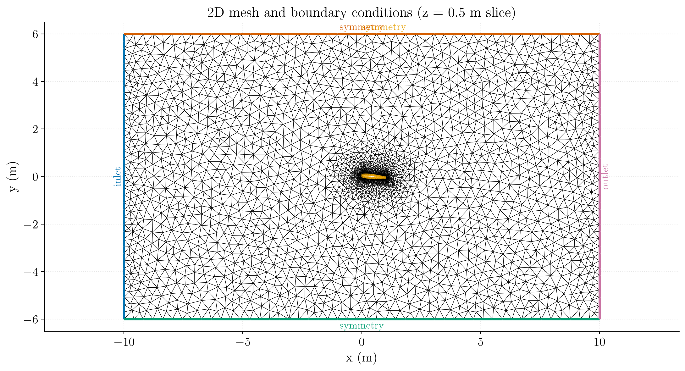
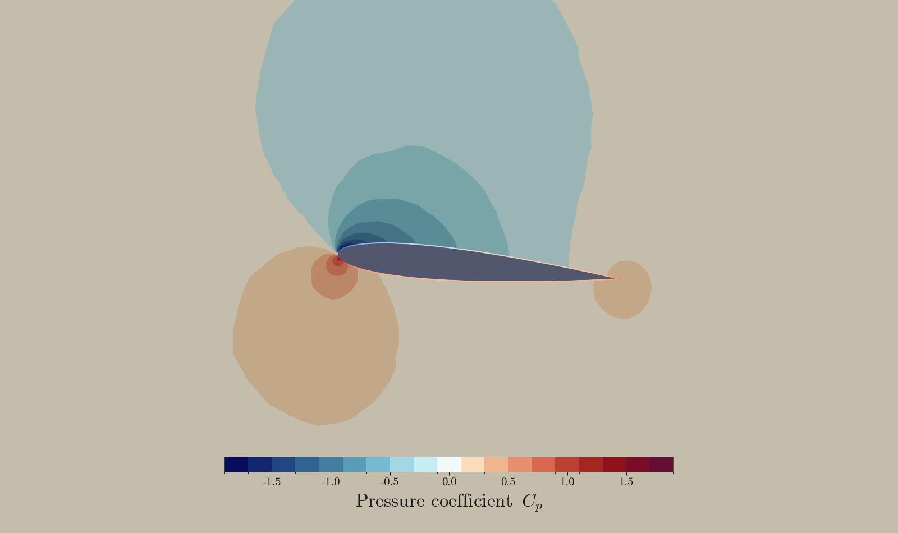
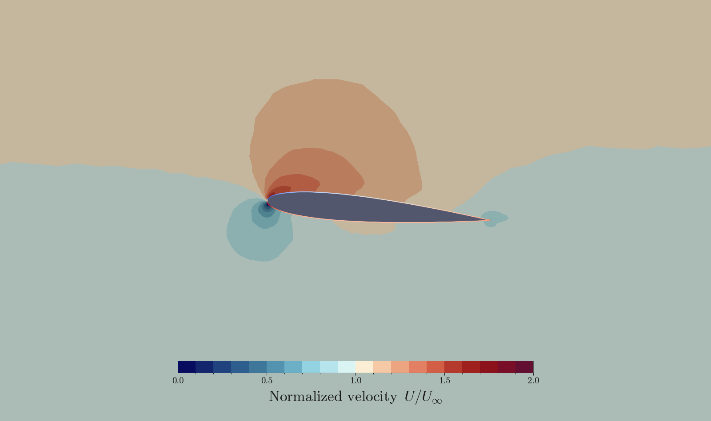
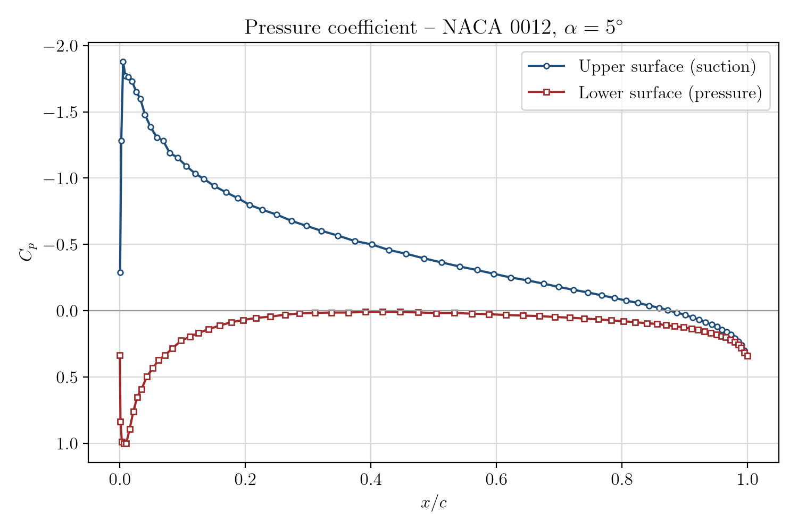

# Inviscid Hydrofoil

A step-by-step tutorial for simulating the incompressible, inviscid flow through a 2D channel around a NACA 0012 hydrofoil using **code_saturne**. The case is a showcase to get familiar with **code_saturne**.

Maintained by [Simvia](https://Simvia.tech/fr), part of the
[tutoriel-code_saturne](https://github.com/simvia-tech/tutorials-code_saturne) collection.

## Learning objectives

After completing this tutorial you will be able to:

1. Set up a steady, incompressible **inviscid** simulation in code_saturne from the GUI.
2. Apply inlet, outlet and symmetry (slip-wall) boundary conditions on an unstructured triangular mesh.
3. Drive a steady solution with **local (pseudo) time-stepping** and the **SIMPLEC** coupling.
4. Run the case in serial or parallel and locate the solver outputs (log, probes, EnSight fields).

## Prerequisites

| Requirement | Detail |
|---|---|
| code_saturne | **v9.1** |
| Background | Basic notions of incompressible aerodynamics and potential (inviscid) flow theory |

If code_saturne is not yet installed, build it from the
[official homepage](https://www.code-saturne.org/cms/web/Download), pull a
ready-to-use Singularity image from the
[Open Simulation Center](https://open-simulation-center.org/downloads/code_saturne/code_saturne),
or pull the
[Simvia Docker image](https://hub.docker.com/r/Simvia/code_saturne) before continuing.

## Case files

```
Inc_Inviscid_Hydrofoil/
├── CASE/
│   ├── DATA/
│   │   └── setup.xml          # pre-configured GUI case
│   └── SRC/
│       └── cs_user_extra_operations.cpp   # user routine: computes lift/drag coefficients (Cl, Cd)
├── MESH/
│   └── mesh_NACA0012_5deg_6814.msh
├── FIGURES/                   # figures used in this README
└── README.md
```

## Physical model

The flow is **steady, incompressible and inviscid**, governed by the Navier-Stokes equations which are simplified to obtain Euler Equations:

$$
\nabla\cdot\mathbf{u}=0,\qquad
\rho\,(\mathbf{u} \cdot \nabla)\,\mathbf{u} = -\nabla p $$

The case is run with the **incompressible**
solver, which is the natural choice for this low-speed flow ($U_\infty=1.775\ \mathrm{m\,s^{-1}}$,
Mach number effectively zero), with $\mu\to 0$ the viscous term vanishes entirely.

### Flow parameters

| Quantity | Symbol | Value | Source in `setup.xml` |
|---|---|---|---|
| Density | $\rho$ | $998.2\ \mathrm{kg\,m^{-3}}$ | `physical_properties/density` |
| Dynamic viscosity | $\mu$ | $1e-12\ \mathrm{Pa\,s}$ | `molecular_viscosity` ~negligible |
| Kinematic viscosity | $\nu=\mu/\rho$ | $1.001e-15\ \mathrm{m^2\,s^{-1}}$ | derived & negligible |
| Mean inlet velocity | $U_\infty$ | $1.775\ \mathrm{m\,s^{-1}}$ | `inlet/velocity_pressure/norm_formula` |
| Chord (reference length) | $c$ | $1\ \mathrm{m}$ | (geometry) |
| Reynolds number | $Re_c$ | $\infty$ | (see below) |

The Reynolds number is recovered directly from the prescribed properties:

$$
Re_c=\frac{\rho\,U_\infty\,c}{\mu}
=\frac{998.2\times 1.775\times 1}{\mu\to 0}\to\infty.
$$

## Geometry and boundary conditions

The domain is a water channel featuring a NACA 0012 hydrofoil in the centre. The
channel is $20c$ wide and $12c$ high, where $c=1\ \mathrm{m}$ is the airfoil chord,
the mesh extends over $x\in[-10,10]$, $y\in[-6,6]$ and a single cell in
$z\in[0,1]$. The hydrofoil is inclined at about 5 degrees angle of attack relative
to the parallel channel walls. The two spanwise ($xy$) planes carry a **symmetry**
condition, so the computation is effectively two-dimensional. The upper and lower
walls and the foil surface are also assigned a symmetry (slip-wall) boundary
condition, enforcing zero normal velocity and zero wall shear stress, consistent
with an inviscid, zero-viscosity flow assumption.

| Boundary | Location | Nature | Prescribed value | Zone id |
|---|---|---|---|---|
| `inlet` | left ($x=-10$) | Inlet | $U_\infty=1.775\ \mathrm{m\,s^{-1}}$ (mean) | 100 |
| `outlet` | right ($x=+10$) | Outlet | $\partial\mathbf{u}/\partial n=0$, $p$ Dirichlet | 200 |
| `body` | hydrofoil surface (centre) | Symmetry (slip) | (none) | 1000 |
| `wall1` | bottom ($y=-6$) | Symmetry (slip) | (none) | 1001 |
| `wall2` | top ($y=+6$) | Symmetry (slip) | (none) | 1002 |
| `sym1` | spanwise plane ($z=0$) | Symmetry | (none) | 600 |
| `sym2` | spanwise plane ($z=1$) | Symmetry | (none) | 601 |

<p align="center">
  
  <br>
  <em>Figure 1: Mesh and boundary conditions (z = 0.5 m slice): inlet (blue),
  outlet (pink), and symmetry (green/yellow/orange).</em>
</p>

> The computational mesh for the inviscid hydrofoil is composed of 6814 triangles with 3559 vertices per 2D plane (7118 vertices in the extruded mesh), 128 edges along the airfoil, and 49 edges along the upper and lower walls of the channel.
> The two spanwise planes (`sym1`/`sym2`) carry a symmetry condition, so the
> computation is effectively two-dimensional.

## Numerical setup

| Setting | Value | Rationale |
|---|---|---|
| Velocity-pressure coupling | **SIMPLEC** | Robust segregated coupling for steady incompressible flow |
| Time-stepping | **Local (pseudo) time step** | Accelerates convergence to steady state by using a per-cell time step |
| Reference time step | $\Delta t_\mathrm{ref}=0.01\ \mathrm{s}$ | Seed value, bounded by min/max factors $[0.1,\,1000]$ |
| Max Courant number | 1 | Caps the local time step away from the wall |
| Iterations | **2000** | Steady state reached well within this budget |
| Initialization | $\mathbf{u}=(U_\infty,0,0)$| Freestream start with a norm user law in the inlet |
| Gradient reconstruction Type | Least squares | Full (all vertex adjacent) |


Two monitoring **probes** track convergence inside the channel at
($x=0.034\ \mathrm{m}$, $y=0.097\ \mathrm{m}$) and ($x=0.80\ \mathrm{m}$, $y=0.015\ \mathrm{m}$). They are sensitive indicators of when the flow around the foil has reached steady state.

## Running the simulation

The commands below start from the tutorial directory:

```bash
cd Inc_Inviscid_Hydrofoil/
```

### Option A: Graphical interface

```bash
code_saturne gui CASE/DATA/setup.xml &
```

The GUI opens the pre-configured `setup.xml`. Review the setup if you wish,
then launch the run with the **gear (Run) button** in the toolbar. To run in
parallel, set the number of processes under
**Calculation management > Performance settings** before launching.

### Option B: Command line

The command-line launcher is run from inside the case directory:

```bash
cd CASE

# serial
code_saturne run

# parallel (e.g. 8 MPI ranks)
code_saturne run --nprocs 8
```
This small 2D case runs comfortably in serial, parallel execution is optional.

Each run creates a time-stamped directory `CASE/RESU/<YYYYMMDD-HHMM>/` containing:

- `run_solver.log`: solver log and residual history,
- `monitoring/`: probe time series (`probes_*.csv`),
- `postprocessing/`: volume and boundary fields in EnSight Gold format.

## Results and verification

The figures below show the converged fields in dimensionless form: the pressure
coefficient $C_p=(p-p_\infty)/\tfrac12\rho U_\infty^2$ and the velocity magnitude
normalized by the free stream, $U/U_\infty$. The reference $p_\infty$ is the
undisturbed upstream static pressure.

### Pressure coefficient field ($C_p$)

<p align="center">
  
  <br>
  <em>Figure 2: Pressure-coefficient $C_p$ field - leading-edge stagnation
  ($C_p\approx 1$) and suction ($C_p\approx -1.9$) over the upper surface.</em>
</p>

### Normalized velocity field ($U/U_\infty$)

<p align="center">
  
  <br>
  <em>Figure 3: Normalized velocity $U/U_\infty$ field - acceleration over the
  upper surface ($U/U_\infty>1$) and the leading-edge stagnation point
  ($U/U_\infty\to 0$).</em>
</p>

### Pressure Coefficient Distribution (Cₚ) over a NACA 0012 Airfoil at α = 5°
<p align="center">
  
  <br>
  <em>Figure 4: Pressure coefficient $C_p$ along the chord ($x/c$) on the upper and lower surfaces of the NACA 0012 at $\alpha = 5°$.</em>
</p>

This graph shows the pressure coefficient $C_p$ along the dimensionless chord
($x/c$) of the symmetric NACA 0012 airfoil. Two curves are plotted, one per
surface:

- **Upper surface (suction side)** - a peak near the leading edge at $C_p\approx-1.9$,
  characteristic of the accelerated flow over the upper surface. $C_p$ then
  gradually recovers (becomes less negative) toward the trailing edge, indicating
  flow deceleration. This low-pressure region is the primary contributor to lift.
- **Lower surface** - starts at the leading edge near the stagnation value
  $C_p\approx 1$, then rises to slightly positive or near-zero values. The pressure
  on the lower surface stays generally higher than the freestream reference,
  contributing positively to lift.

## Summary

This tutorial set up an incompressible, inviscid flow in a channel around a NACA 0012
hydrofoil in code_saturne. The computed $C_p$ distribution shows the expected
leading-edge stagnation point and the suction peak on the upper surface, consistent
with inviscid potential-flow theory for a NACA 0012 at $\alpha = 5°$. The user
routine `cs_user_extra_operations.cpp` additionally reports the lift and drag
coefficients ($C_l$, $C_d$) in `lift_drag.csv`. This case is a good starting point
for more complex incompressible CFD simulations.

## References

- A viscous/inviscid interactive approach and its application to hydrofoils and propellers with non−zero trailing edge thickness Resource, [Inviscid flow over an Hydrofoil](https://www.mit.edu/~panyulin/publication_files/Pan_MSTHS.pdf)
- [code_saturne documentation](https://www.code-saturne.org/cms/web/documentation)

## Authors

[Simvia](https://Simvia.tech/fr) - Questions, remarks and requests are welcome.
