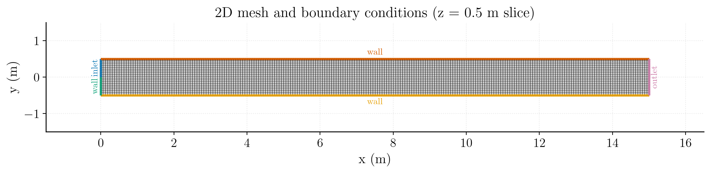
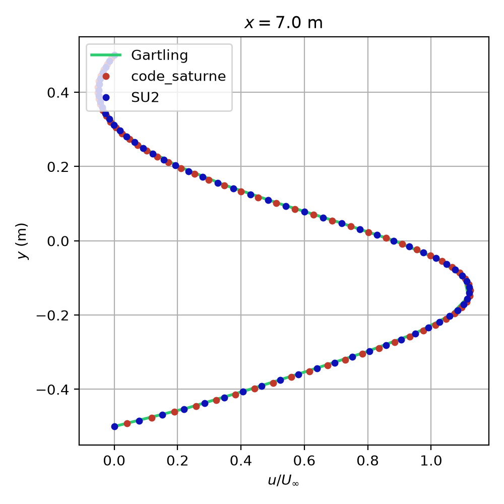
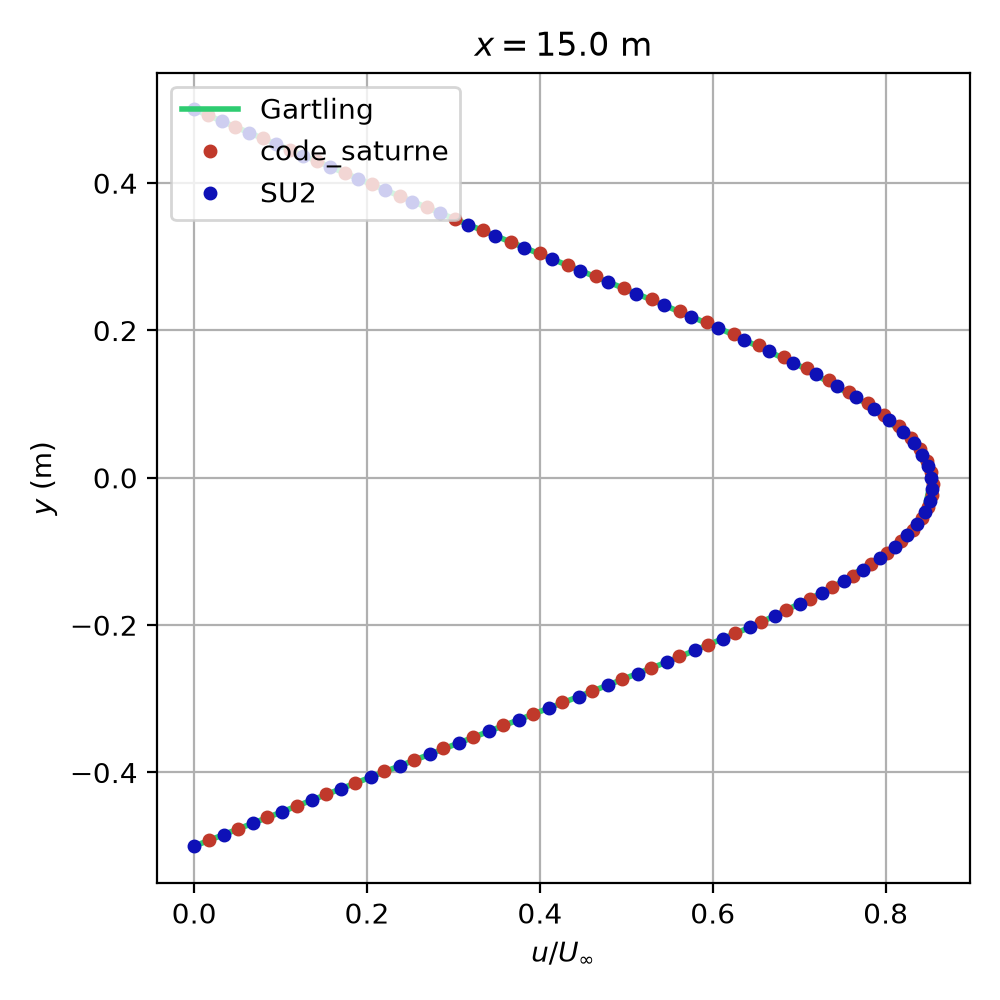
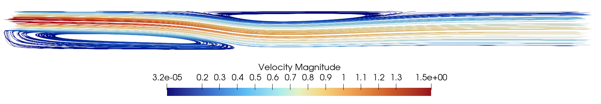

# Laminar Backward-facing Step

A step-by-step tutorial for simulating the incompressible laminar internal flow in a channel over a backward-facing step with **code_saturne**. Results are verified against reference data
from the
[Gartling](https://onlinelibrary.wiley.com/doi/10.1002/fld.1650110704).

Maintained by [Simvia](https://Simvia.tech/fr), part of the
[tutoriel-code_saturne](https://github.com/simvia-tech/tutorials-code_saturne) collection.

## Learning objectives

After completing this tutorial you will be able to:

1. Set up an incompressible, steady **Laminar** simulation in code_saturne from the GUI.
2. Apply inlet / outlet / symmetry / no-slip wall boundary conditions on a structured mesh.
3. Drive a steady solution with **local (pseudo) time-stepping** and the **SIMPLEC** coupling.
4. Run the case in serial or parallel and locate the solver outputs (log, probes, EnSight fields).

## Prerequisites

| Requirement | Detail |
|---|---|
| code_saturne | **v9.1** |
| Background | Basic notions of RANS turbulence modelling and boundary-layer theory |

If code_saturne is not yet installed, build it from the
[official homepage](https://code-saturne.org/), pull a
ready-to-use Singularity image from the
[Open Simulation Center](https://open-simulation-center.org/downloads/code_saturne/code_saturne),
or pull the
[Simvia Docker image](https://hub.docker.com/r/Simvia/code_saturne) before continuing.

## Case files

```
Inc_Laminar_Step/
├── CASE/
│   ├── DATA/
│   │   └── setup.xml          # pre-configured GUI case
├── MESH/
│   └── mesh_backward_step_481x65.msh
├── FIGURES/                   # figures used in this README
└── README.md
```

## Physical model

The flow is **steady, incompressible and laminar**, governed by the Navier-Stokes equations:

$$
\nabla\cdot\mathbf{u}=0,\qquad
\rho\,(\mathbf{u} \cdot \nabla)\,\mathbf{u} = -\nabla p + \mu\,\nabla^{2}\mathbf{u}$$

The case is run with the **incompressible**
solver, which is the natural choice for this low-speed flow ($U_\infty=1\ \mathrm{m\,s^{-1}}$,
Mach number effectively zero).

### Flow parameters

| Quantity | Symbol | Value | Source in `setup.xml` |
|---|---|---|---|
| Density | $\rho$ | $1.0\ \mathrm{kg\,m^{-3}}$ | `physical_properties/density` |
| Dynamic viscosity | $\mu$ | $0.00125\ \mathrm{Pa\,s}$ | `molecular_viscosity` |
| Kinematic viscosity | $\nu=\mu/\rho$ | $0.00125\ \mathrm{m^2\,s^{-1}}$ | derived |
| Mean inlet velocity | $U_\infty$ | $1.0\ \mathrm{m\,s^{-1}}$ (parabolic profile, peak $1.5$) | `inlet/velocity_pressure/norm_formula` |
| Reference length | $L$ | $1\ \mathrm{m}$ | (geometry) |
| Reynolds number | $Re_L$ | $800$ | derived (see below) |

The Reynolds number is recovered directly from the prescribed properties:

$$
Re_L=\frac{\rho\,U_\infty\,L}{\mu}
=\frac{1.0\times 1.0\times 1}{0.00125}\approx 800.
$$

## Geometry and boundary conditions

The domain is a channel $0\le x\le 15\ \mathrm{m}$ long and $1\ \mathrm{m}$ tall
($-0.5\le y\le 0.5$). At the inlet ($x=0$) the flow enters only through the
**upper half** of the channel ($0\le y\le 0.5$); the lower half ($-0.5\le y\le 0$)
is the backward-facing **step** face. The inlet carries a parabolic velocity
profile $$u(y) = 24.0 \, y\,(0.5 - y), \quad 0 \leq y \leq 0.5,$$ whose mean over
the inlet height is $U_\infty=1\ \mathrm{m\,s^{-1}}$ (peak $1.5\ \mathrm{m\,s^{-1}}$
at $y=0.25$). The two spanwise (XY) planes carry a **symmetry** condition, so the
computation is effectively two-dimensional.

| Boundary | Location | Nature | Prescribed value | Zone id |
|---|---|---|---|---|
| `inlet` | upper-half left ($x=0$, $0\le y\le0.5$) | Inlet | parabolic profile, $U_\infty=1.0\ \mathrm{m\,s^{-1}}$ (mean) | 100 |
| `outlet` | right ($x=15.0$) | Outlet | $\partial\mathbf{u}/\partial n=0$, $p$ Dirichlet | 200 |
| `wall1` | top ($y=0.5$) | No-slip wall | $\mathbf{u}=\mathbf{0}$ | 1000 |
| `wall2` | bottom ($y=-0.5$) | No-slip wall | $\mathbf{u}=\mathbf{0}$ | 1001 |
| `wall3` | step face, lower-half left ($x=0$, $-0.5\le y\le0$) | No-slip wall | $\mathbf{u}=\mathbf{0}$ | 1002 |
| `front` | spanwise plane ($z=0$) | Symmetry | (none) | 600 |
| `back` | spanwise plane ($z=1$) | Symmetry | (none) | 601 |
<p align="center">
  
  <br>
  <em>Figure 1: Mesh and boundary conditions (z = 0.5 m slice): inlet (blue),
  outlet (pink), and no-slip wall (green/yellow/orange).</em>
</p>

> The computational mesh for the backward-facing step is composed of quadrilaterals with 481 nodes in the x-direction and 65 nodes in the y-direction. The spacing of the nodes is uniform in the x- and y-directions. The domain is 15 channel heights in width.
> The two spanwise planes (`front`/`back`) carry a symmetry condition, so the
> computation is effectively two-dimensional.

## Numerical setup

| Setting | Value | Rationale |
|---|---|---|
| Velocity-pressure coupling | **SIMPLEC** | Robust segregated coupling for steady incompressible flow |
| Time-stepping | **Local (pseudo) time step** | Accelerates convergence to steady state by using a per-cell time step |
| Reference time step | $\Delta t_\mathrm{ref}=10^{-3}\ \mathrm{s}$ | Seed value, bounded by min/max factors $[0.1,\,1000]$ |
| Max Courant number | 30 | Caps the local time step away from the wall |
| Iterations | **500** | Steady state reached well within this budget |
| Initialization | $\mathbf{u}=(U_\infty,0,0)$| Freestream start with a norm user law in the inlet |

Two monitoring **probes** track convergence inside channel at
$x=5.0 \mathrm{m}$ , $y=-0.5 \mathrm{m}$ and $x=9.0\ \mathrm{m}$, $y=0 \mathrm{m}$. They are sensitive indicators of when the recirculation behind the step has reached steady state.

## Running the simulation

The commands below start from the tutorial directory:

```bash
cd Inc_Laminar_Step/
```

### Option A: Graphical interface

```bash
code_saturne gui CASE/DATA/setup.xml &
```

The GUI opens the pre-configured `setup.xml`. Review the setup if you wish,
then launch the run with the **gear (Run) button** in the toolbar. To run in
parallel, set the number of processes under
**Calculation management > Performance settings** before launching.

### Option B: Command line

The command-line launcher is run from inside the case directory:

```bash
cd CASE

# serial
code_saturne run

# parallel (e.g. 8 MPI ranks)
code_saturne run --n 8
```

Each run creates a time-stamped directory `CASE/RESU/<YYYYMMDD-HHMM>/` containing:

- `run_solver.log`: solver log and residual history,
- `monitoring/`: probe time series (`probes_*.csv`),
- `postprocessing/`: volume and boundary fields in EnSight Gold format.

## Results and verification

The figures below illustrate the converged solution and compare it against
reference data from the literature and work of Gartling. The quantity of
interest is the streamwise velocity profile $u/U_\infty$ across the channel
height, extracted at $x=7\ \mathrm{m}$ and $x=15\ \mathrm{m}$.

### Velocity profile 1

<p align="center">
  
  <br>
  <em>Figure 2: Velocity profile u/Uinf versus wall-normal distance at x = 7 m: code_saturne overlays the Gartling reference exactly.</em>
</p>


### Velocity profile 2

<p align="center">
  
  <br>
  <em>Figure 3: Velocity profile u/Uinf versus wall-normal distance at x = 15 m: code_saturne overlays the Gartling reference exactly.</em>
</p>

The velocity profiles match the reference, confirming a correctly resolved laminar simulation.

### Velocity profile in Paraview

<p align="center">
  
  <br>
  <em>Figure 4: Velocity field u/Uinf shown in ParaView with streamlines.</em>
</p>

## Summary

This tutorial set up and validated an incompressible Laminar Backward facing Step
simulation in code_saturne. The velocity profiles match the Gartling reference
across the channel, and the user norm-formula imposes the parabolic inlet profile
on the upper half of the inlet. This case is a good starting point for more
complex incompressible CFD simulations.

## References

- A test problem for outflow boundary conditions—flow over a backward-facing step Resource, [Flow over a backward-facing step](https://onlinelibrary.wiley.com/doi/10.1002/fld.1650110704)
- Gartling D.K., A test problem for outflow boundary conditions – flow over a backward- facing step, International Journal of Numerical Methods in Fluids, 11, 953-967, 1990.
- [code_saturne documentation](https://code-saturne.org/doc/)

## Authors

[Simvia](https://Simvia.tech/fr) - Questions, remarks and requests are welcome.
