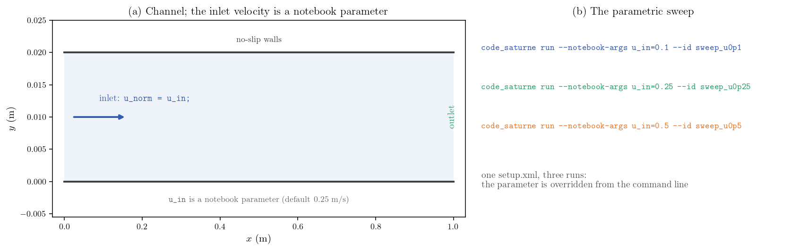
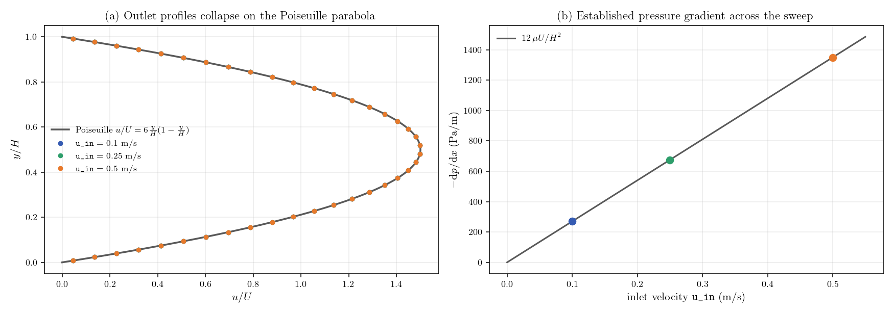

# Notebook Parameters (Parametric Sweep from the Command Line)

A step-by-step tutorial for **notebook parameters** in **code_saturne**: named
values declared in the GUI, usable in any MEG formula, and overridable from the
command line with `--notebook-args`. One `setup.xml` then drives a whole
parametric study without ever editing the case. Here the inlet velocity of a
laminar channel is a parameter, swept over three values, and each run is
verified against the analytic Poiseuille solution.

Maintained by [Simvia](https://Simvia.tech/fr), part of the
[tutoriel-code_saturne](https://github.com/simvia-tech/tutorials-code_saturne) collection.

## Learning objectives

After completing this tutorial you will be able to:

1. Declare a notebook parameter in the GUI (name, default value, editable flag).
2. Use it by name inside any MEG formula (boundary conditions, initialization, properties).
3. Override it from the command line with `code_saturne run --notebook-args name=value`.
4. Organize a parametric sweep with named result directories (`--id`).
5. Verify each run of the sweep against the analytic Poiseuille solution.

## Prerequisites

| Requirement | Detail |
|---|---|
| code_saturne | **v9.1** |
| Background | Basic notions of laminar channel flow |

If code_saturne is not yet installed, build it from the
[official homepage](https://code-saturne.org/), pull a
ready-to-use Singularity image from the
[Open Simulation Center](https://open-simulation-center.org/downloads/code_saturne/code_saturne),
or pull the
[Simvia Docker image](https://hub.docker.com/r/Simvia/code_saturne) before continuing.

## Case files

```text
Inc_Notebook_Parameters/
├── CASE/
│   └── DATA/
│       └── setup.xml     # pre-configured GUI case (holds the notebook parameter)
├── FIGURES/              # figures used in this README
└── README.md
```

There is no mesh file: the channel grid is built by code_saturne's internal
Cartesian mesher, directly from `setup.xml`.

## Physical model

The flow is laminar and incompressible in a plane channel; each run is marched
to steady state with local pseudo-time stepping. Once developed, the solution is
the plane Poiseuille flow:

$$
u(y)=6\,U\,\frac{y}{H}\Big(1-\frac{y}{H}\Big),
\qquad
u_{\max}=1.5\,U,
\qquad
-\frac{\mathrm{d}p}{\mathrm{d}x}=\frac{12\,\mu\,U}{H^{2}},
$$

which gives an exact reference for every value of the swept inlet velocity $U$.

### Flow parameters

| Parameter | Value | Unit | Source |
|---|---:|---|---|
| Density $\rho$ | 900 | $\mathrm{kg\,m^{-3}}$ | `setup.xml`: `density` |
| Dynamic viscosity $\mu$ | 0.09 | $\mathrm{Pa\,s}$ | `setup.xml`: `molecular_viscosity` |
| Inlet velocity `u_in` | 0.1 / 0.25 / 0.5 | $\mathrm{m\,s^{-1}}$ | notebook parameter (default 0.25) |
| Reynolds number $Re_{D_h}$ | 40 to 200 | - | derived ($D_h=2H$) |

At the highest velocity the development length is
$L_{\mathrm{dev}}\approx0.05\,Re_{D_h}\,D_h\approx0.4\ \mathrm{m}<L$: the outlet
region is fully developed for every value of the sweep.

## The notebook parameter (the feature)

The parameter is declared in the GUI (**Physical properties, Notebook**), which
stores in `setup.xml`:

```xml
<notebook>
  <var name="u_in" value="0.25" editable="Yes"
       description="inlet bulk velocity [m/s]"/>
</notebook>
```

and is then available **by name in every MEG formula** of the case. Here it
drives both the inlet velocity and the initialization:

```c
u_norm = u_in;              /* inlet boundary condition  */
velocity[0] = u_in;         /* initialization            */
```

The `editable="Yes"` flag allows the value to be overridden at run time,
without touching `setup.xml`:

```bash
code_saturne run --notebook-args u_in=0.5 --id sweep_u0p5
```

`--id` names the result directory, which keeps the sweep tidy. Notebook
parameters can also be read from user C routines with
`cs_notebook_parameter_value_by_name("u_in")`.

## Geometry and boundary conditions

Plane channel, $L=1\ \mathrm{m}$, $H=0.02\ \mathrm{m}$, one cell thick in $z$;
built-in Cartesian mesh of $100\times40$ cells, refined toward both walls
(parabolic law).

| Boundary | Type | Condition |
|---|---|---|
| `inlet` ($x=0$) | Inlet | `u_norm = u_in;` (notebook parameter) |
| `outlet` ($x=L$) | Outlet | Standard outlet |
| `bottom_wall`, `top_wall` | Wall | No slip |
| `front` / `back` | Symmetry | Quasi-2D |

<p align="center">
  
  <br>
  <em>Figure 1: (a) Channel; the inlet velocity is the notebook parameter
  <code>u_in</code>. (b) The sweep: one setup, three runs, the parameter
  overridden from the command line.</em>
</p>

## Numerical setup

| Setting | Value |
|---|---:|
| Steady strategy | Local (pseudo) time-stepping |
| Iterations | 800 |
| Velocity-pressure algorithm | SIMPLEC |
| Turbulence | Off (laminar) |

## Running the simulation

From the tutorial directory:

### Option A: Graphical interface

```bash
code_saturne gui CASE/DATA/setup.xml &
```

The parameter is visible under **Physical properties, Notebook**; run with the
default value (0.25 m/s) using the **Run** button.

### Option B: Command line (the sweep)

```bash
cd CASE

code_saturne run --n 4 --notebook-args u_in=0.1  --id sweep_u0p1
code_saturne run --n 4 --notebook-args u_in=0.25 --id sweep_u0p25
code_saturne run --n 4 --notebook-args u_in=0.5  --id sweep_u0p5
```

Each run creates its own named directory `CASE/RESU/sweep_*/` with
`run_solver.log` and the EnSight fields used below.

## Results and verification

Every run of the sweep is compared with the analytic Poiseuille solution at its
own value of `u_in`:

| `u_in` (m/s) | $u_{\max}$ | $1.5\,U$ | $-\mathrm{d}p/\mathrm{d}x$ (Pa/m) | $12\mu U/H^2$ | error |
|---:|---:|---:|---:|---:|---:|
| 0.10 | 0.1498 | 0.1500 | 269.6 | 270.0 | 0.15 % |
| 0.25 | 0.3744 | 0.3750 | 674.0 | 675.0 | 0.15 % |
| 0.50 | 0.7488 | 0.7500 | 1347.9 | 1350.0 | 0.15 % |

<p align="center">
  
  <br>
  <em>Figure 2: (a) The outlet profiles of the three runs, normalized by their
  own <code>u_in</code>, collapse on the single Poiseuille parabola. (b) The
  established pressure gradient of each run sits on the analytic line
  $12\mu U/H^{2}$.</em>
</p>

The three runs agree with the analytic solution to 0.15 percent (the
discretization error of the $100\times40$ grid), confirming that the value
passed with `--notebook-args` is the one actually used by the solver.

## Summary

This tutorial declared the inlet velocity of a laminar channel as a **notebook
parameter**, used it by name in the inlet and initialization formulas, and ran a
three-value parametric sweep from the command line with `--notebook-args` and
named result directories, without ever editing `setup.xml`. Each run matches the
analytic Poiseuille solution to 0.15 percent. Notebook parameters are the
lightest way to parameterize a code_saturne case (geometry-independent values,
boundary conditions, material properties) and plug naturally into scripts and
optimization loops.

## References

1. code_saturne documentation: <https://code-saturne.org/doc/>.
2. F. M. White, *Viscous Fluid Flow*, McGraw-Hill.

## Authors

[Simvia](https://Simvia.tech/fr) - Questions, remarks and requests are welcome.
