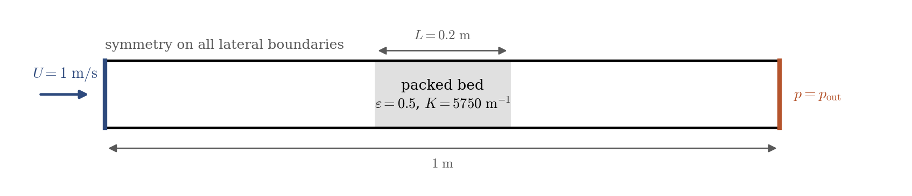
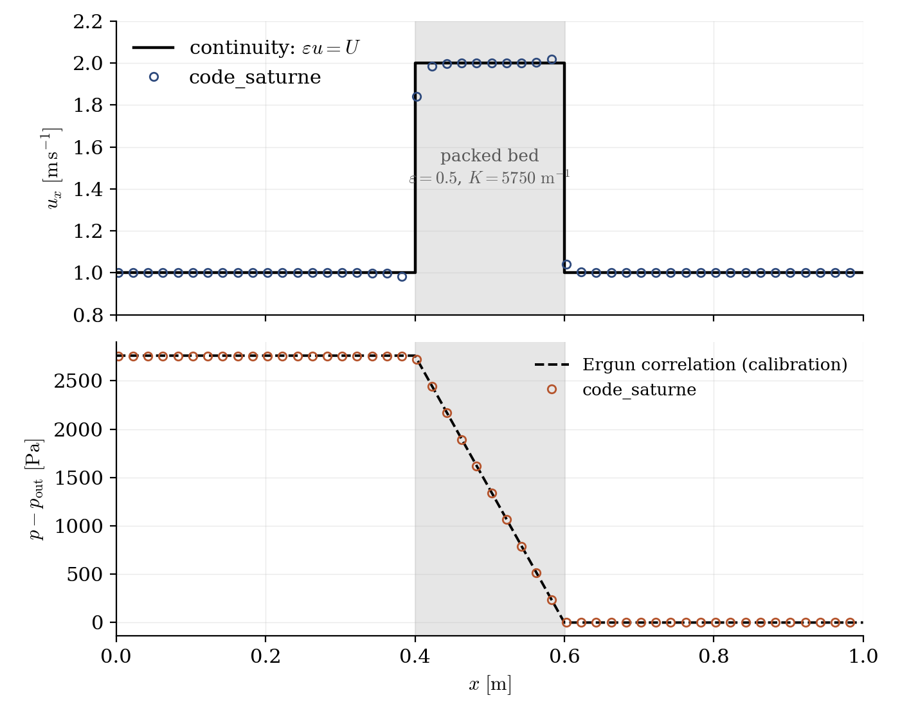

# Packed Bed in a Duct

A step-by-step tutorial for modelling a **real porous medium** in **code_saturne**, by combining the two features introduced separately in [Inc_Head_Loss_Zone](../Inc_Head_Loss_Zone) and [Inc_Porous_Plug](../Inc_Porous_Plug): a **porosity zone** for the kinematics (the flow accelerates in the reduced section) and a **head-loss zone** for the distributed friction of the solid matrix, with the coefficient calibrated from the **Ergun correlation** for a bed of spheres. This is the standard industrial recipe for packed beds, filters and tube bundles. The whole setup is done in the GUI: no mesh file, no user routine.

Maintained by [Simvia](https://Simvia.tech/fr), part of the
[tutoriel-code_saturne](https://github.com/simvia-tech/tutorials-code_saturne) collection.

## Learning objectives

After completing this tutorial you will be able to:

1. Give a single volume zone **both natures** (porosity and head losses).
2. **Calibrate the head-loss coefficient from the Ergun correlation**, taking care of the velocity convention (the resolved velocity is interstitial).
3. Choose a time step compatible with the **stiffness of the head-loss term**.

## Prerequisites

| Requirement | Detail |
|---|---|
| code_saturne | **v9.1** |
| Cases | [Inc_Head_Loss_Zone](../Inc_Head_Loss_Zone) and [Inc_Porous_Plug](../Inc_Porous_Plug) (the two halves assembled here) |

If code_saturne is not yet installed, build it from the
[official homepage](https://www.code-saturne.org/cms/web/Download), pull a
ready-to-use Singularity image from the
[Open Simulation Center](https://open-simulation-center.org/downloads/code_saturne/code_saturne),
or pull the
[Simvia Docker image](https://hub.docker.com/r/Simvia/code_saturne) before continuing.

## Case files

```
Inc_Packed_Bed/
├── CASE/
│   └── DATA/
│       └── setup.xml            # pre-configured GUI case
├── FIGURES/                     # figures used in this README
└── README.md
```

> There is **no MESH directory** (built-in cartesian mesher) and **no SRC directory**: everything is set in the GUI.

## Physical model

The bed is a 0.2 m thick pack of $d = 1$ mm spheres with porosity $\varepsilon = 0.5$, crossed by air at the superficial velocity $U = 1\ \mathrm{m\,s^{-1}}$. The **Ergun correlation** gives its pressure gradient as a viscous (Darcy) plus an inertial (Forchheimer) contribution:

$$
\frac{\Delta p}{L} = 150\,\frac{\mu (1-\varepsilon)^2}{\varepsilon^3 d^2}\, U
              + 1.75\,\frac{(1-\varepsilon)}{\varepsilon^3 d}\, \rho U^2
              = 5400 + 8400 = 13800\ \mathrm{Pa\,m^{-1}}
$$

i.e. $\Delta p = 2760$ Pa across the bed: three orders of magnitude above the singular entry/exit effects seen in [Inc_Porous_Plug](../Inc_Porous_Plug), which is why a porosity zone alone badly under-predicts the resistance of a real bed.

### Calibrating the head-loss coefficient

The head-loss source of code_saturne is $-\frac{1}{2}\rho K |\mathbf{u}| \mathbf{u}$ per unit **fluid** volume, with $\mathbf{u}$ the resolved velocity, which in a porosity zone is the **interstitial** one ($u = U/\varepsilon = 2\ \mathrm{m\,s^{-1}}$ here). Matching the Ergun pressure drop at the operating point therefore gives

$$
K = \frac{\Delta p_{\mathrm{Ergun}}}{\frac{1}{2} \rho\, u^2 L}
  = \frac{2760}{0.5 \times 1.2 \times 2^2 \times 0.2} = 5750\ \mathrm{m^{-1}}
$$

Two honest remarks on this calibration. First, it is a **point calibration**: the GUI head loss is quadratic in velocity, so the linear (Darcy) part of Ergun is folded into $K$ at the nominal flow rate, and the case would not follow Ergun at other flow rates (a true Darcy-Forchheimer law needs the `cs_user_head_losses` user routine, where $K$ can depend on $|\mathbf{u}|$). Second, mind the **velocity convention**: calibrating $K$ with the superficial velocity instead of the interstitial one would miss the pressure drop by a factor $1/\varepsilon^2 = 4$.

### Flow parameters

| Quantity | Symbol | Value | Source in `setup.xml` |
|---|---|---|---|
| Fluid (air-like) | $\rho$, $\mu$ | $1.2\ \mathrm{kg\,m^{-3}}$, $1.8 \times 10^{-5}\ \mathrm{Pa\,s}$ | `density`, `molecular_viscosity` |
| Superficial velocity | $U$ | $1\ \mathrm{m\,s^{-1}}$ | `inlet/velocity_pressure/norm` |
| Bed porosity, particle size | $\varepsilon$, $d$ | $0.5$, $1$ mm | `porosities` (MEG formula), Ergun inputs |
| Head-loss coefficient | $K$ | $5750\ \mathrm{m^{-1}}$ (isotropic) | `head_losses/head_loss` |
| Bed thickness | $L$ | $0.2$ m ($x = 0.4$ to $0.6$) | zone selector |
| Ergun pressure drop | $\Delta p$ | $2760$ Pa ($13800\ \mathrm{Pa\,m^{-1}}$) | derived |
| Domain, mesh | | $1 \times 0.1 \times 0.02$ m, $200 \times 20 \times 1$ cells | `mesh_cartesian` |
| Time | $\Delta t$, $N$ | $2 \times 10^{-4}$ s, $5000$ steps | `time_parameters` |

## Geometry and boundary conditions

<p align="center">
  
  <br>
  <em>Figure 1: computational domain, identical to the two previous cases of the series; the middle zone now carries both natures.</em>
</p>

| Boundary | Location | Nature | Zone selector |
|---|---|---|---|
| `Inlet` | $x = 0$ | Velocity inlet, $1\ \mathrm{m\,s^{-1}}$ | `X0` |
| `Outlet` | $x = 1$ | Free outlet | `X1` |
| `SymY`, `SymZ` | lateral faces | Symmetry | `Y0 or Y1`, `Z0 or Z1` |

### The packed-bed zone in the GUI

In **Volume zones**, the `packed_bed` zone (criterion `box[0.4, -0.01, -0.01, 0.6, 0.11, 0.03]`) gets **both natures ticked**: *Porosity* and *Head losses*. Then, in **Volume conditions**:

1. **Porosity**: `isotropic` model, MEG formula `porosity = 0.5;`
2. **Head losses**: $K_{xx} = K_{yy} = K_{zz} = 5750$ (isotropic bed), identity transformation matrix.

## Numerical setup

| Setting | Value | Rationale |
|---|---|---|
| Velocity-pressure coupling | **SIMPLEC** | Standard segregated coupling |
| Velocity convection scheme | 1st-order upwind (`blending_factor` 0) | Same rationale as [Inc_Porous_Plug](../Inc_Porous_Plug) |
| Time-stepping | Fixed $\Delta t = 2 \times 10^{-4}$ s, $5000$ steps | Matched to the head-loss **stiffness**: $K u \Delta t / 2 \approx 1$ (see below) |
| Turbulence | none (laminar) | Plug flow with slip boundaries |
| Initialization | $u = U$ everywhere | Short transient |
| Probes | 6 along the axis | 2 upstream, 2 inside the bed, 2 downstream |

A sizing lesson learned while building the case: the head-loss term introduces its own time scale, $\tau_K = 2/(K u) \approx 1.7 \times 10^{-4}$ s here, far shorter than the convective one. With the time step of the previous episodes ($2 \times 10^{-3}$ s, i.e. $K u \Delta t/2 \approx 11$), the coupled velocity-pressure iteration develops a slowly **growing** oscillation at the bed interfaces. Keeping $K u \Delta t / 2 \lesssim 1$ restores a clean machine-level convergence: it is the head-loss analogue of the CFL condition.

## Running the simulation

The commands below start from the tutorial directory:

```bash
cd Inc_Packed_Bed/
```

### Option A: Graphical interface

```bash
code_saturne gui CASE/DATA/setup.xml &
```

The GUI opens the pre-configured `setup.xml`. Review the setup if you wish,
then launch the run with the **gear (Run) button** in the toolbar.

### Option B: Command line

The command-line launcher is run from inside the case directory:

```bash
cd CASE

# serial (a few seconds)
code_saturne run
```

## Results

<p align="center">
  
  <br>
  <em>Figure 2: velocity (top) and pressure (bottom) along the duct at steady state. The interstitial velocity doubles in the bed exactly as in the porosity-only case; the pressure now falls <strong>linearly</strong> across it, with the slope of the Ergun calibration (dashed line).</em>
</p>

The three signatures of the series come together:

- the **velocity** step is that of the porosity ($u = U/\varepsilon = 2.000\ \mathrm{m\,s^{-1}}$, exact);
- the **in-bed pressure gradient** is $-13800.0\ \mathrm{Pa\,m^{-1}}$, the calibrated Ergun slope to machine accuracy (the head-loss source is exactly the discretized formula), where the porosity-only case showed a flat plateau;
- the **net pressure drop** is $2752$ Pa for $2760$ Pa calibrated: the $0.3\%$ difference is the residual entry/exit singular effects, now drowned by the matrix friction, as a real bed demands.

## Summary

This tutorial assembled the porous-media recipe of code_saturne: one volume zone carrying both a porosity (kinematics: interstitial acceleration) and a head loss (distributed matrix friction), the latter calibrated from the Ergun correlation with the interstitial-velocity convention. The computed bed reproduces the calibrated gradient exactly and the end effects become negligible, closing the three-episode series started with [Inc_Head_Loss_Zone](../Inc_Head_Loss_Zone) and [Inc_Porous_Plug](../Inc_Porous_Plug).

## References

- S. Ergun. Fluid flow through packed columns, Chem. Eng. Prog., 48:89-94, 1952.
- I.E. Idelchik. Handbook of Hydraulic Resistance, 4th edition, Begell House, 2007.
- [code_saturne documentation](https://www.code-saturne.org/cms/web/documentation)

## Authors

[Simvia](https://Simvia.tech/fr) - Questions, remarks and requests are welcome.
