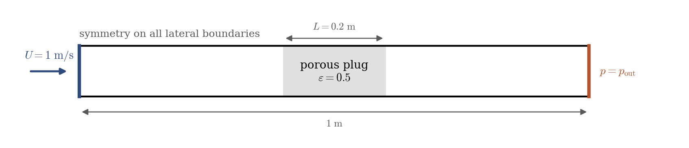
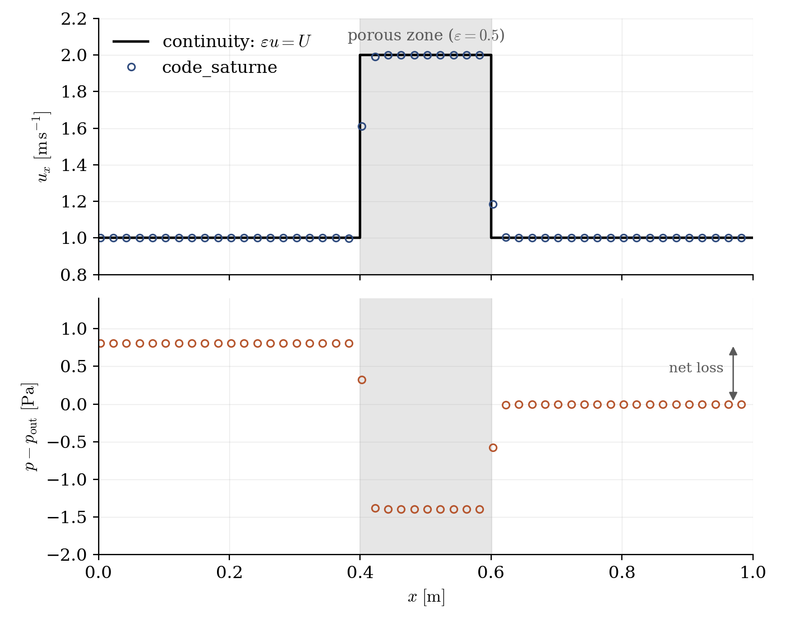

# Porous Plug in a Duct

A step-by-step tutorial for using a **porosity zone** in **code_saturne**: a volume region where only a fraction $\varepsilon$ of the space is open to the flow, as in a packed bed, a tube bundle or a debris screen. A uniform stream crosses a 0.2 m plug of porosity $\varepsilon = 0.5$, and the velocity inside doubles, exactly as mass conservation dictates. The case is the mirror of [Inc_Head_Loss_Zone](../Inc_Head_Loss_Zone): **porosity rescales the flow geometry seen by all the conservation equations without adding any source term, whereas a head loss adds an explicit friction source term to the momentum equation**; a real porous medium generally needs both. The whole setup is done in the GUI: no mesh file, no user routine.

Maintained by [Simvia](https://Simvia.tech/fr), part of the
[tutoriel-code_saturne](https://gitlab.com/Simvia/common-tools/tutoriel-code_saturne) collection.

## Learning objectives

After completing this tutorial you will be able to:

1. Define a **porosity zone** with a geometric criterion and a MEG formula.
2. Know which velocity code_saturne resolves in a porous region (the **interstitial** one), and verify it with mass conservation.
3. Tell apart the roles of **porosity** and **head losses**, and know when each (or both) is needed.

## Prerequisites

| Requirement | Detail |
|---|---|
| code_saturne | **v9.1** |
| Case | [Inc_Head_Loss_Zone](../Inc_Head_Loss_Zone) (the momentum half of the story) |

If code_saturne is not yet installed, build it from the
[official homepage](https://www.code-saturne.org/cms/web/Download), pull a
ready-to-use Singularity image from the
[Open Simulation Center](https://open-simulation-center.org/downloads/code_saturne/code_saturne),
or pull the
[Simvia Docker image](https://hub.docker.com/r/Simvia/code_saturne) before continuing.

## Case files

```
Inc_Porous_Plug/
├── CASE/
│   └── DATA/
│       └── setup.xml            # pre-configured GUI case
├── FIGURES/                     # figures used in this README
└── README.md
```

> There is **no MESH directory** (built-in cartesian mesher) and **no SRC directory**: everything is set in the GUI.

## Physical model

In a porosity zone, only the fraction $\varepsilon$ of each cell (and of each face) is open to the flow. code_saturne resolves the **interstitial velocity** $\mathbf{u}$ (the velocity of the fluid where it actually flows), and weights the fluxes by the porosity: mass conservation through a constant-section duct then reads

$$
\varepsilon\, u = U = \mathrm{const}
$$

so the flow **accelerates** inside the plug: with $\varepsilon = 0.5$ and $U = 1\ \mathrm{m\,s^{-1}}$, the interstitial velocity is $u = 2\ \mathrm{m\,s^{-1}}$. The porosity weights the momentum equation as well (fluid volumes, convective fluxes): the model adds **no friction term anywhere**, but the flow still pays **singular head losses at the two ends of the plug**, where it sees a sudden contraction (entry) and a sudden expansion (exit), exactly as it would at abrupt section changes of a duct.

To represent a real porous medium (a packed bed, a filter cake), the porosity must be **combined with a head-loss zone** carrying the Darcy-Forchheimer resistance of the matrix: porosity for the kinematics, head loss for the friction. That combination, calibrated with the Ergun correlation, is the object of a follow-up case.

### Flow parameters

| Quantity | Symbol | Value | Source in `setup.xml` |
|---|---|---|---|
| Fluid (air-like) | $\rho$, $\mu$ | $1.2\ \mathrm{kg\,m^{-3}}$, $1.8 \times 10^{-5}\ \mathrm{Pa\,s}$ | `density`, `molecular_viscosity` |
| Inlet velocity | $U$ | $1\ \mathrm{m\,s^{-1}}$ | `inlet/velocity_pressure/norm` |
| Plug porosity | $\varepsilon$ | $0.5$ | `porosities/porosity` (MEG formula) |
| Plug thickness | $L$ | $0.2$ m ($x = 0.4$ to $0.6$) | zone selector |
| Expected in-plug velocity | $U/\varepsilon$ | $2\ \mathrm{m\,s^{-1}}$ | derived |
| Domain, mesh | | $1 \times 0.1 \times 0.02$ m, $200 \times 20 \times 1$ cells | `mesh_cartesian` |
| Time | $\Delta t$, $N$ | $2 \times 10^{-3}$ s, $1000$ steps | `time_parameters` |

## Geometry and boundary conditions

<p align="center">
  
  <br>
  <em>Figure 1: computational domain, identical to the head-loss case except for the nature of the zone. All lateral boundaries are symmetries: the stream is a uniform plug flow and the profiles below are one-dimensional.</em>
</p>

| Boundary | Location | Nature | Zone selector |
|---|---|---|---|
| `Inlet` | $x = 0$ | Velocity inlet, $1\ \mathrm{m\,s^{-1}}$ | `X0` |
| `Outlet` | $x = 1$ | Free outlet | `X1` |
| `SymY`, `SymZ` | lateral faces | Symmetry | `Y0 or Y1`, `Z0 or Z1` |

### The porosity zone in the GUI

Two steps, exactly parallel to the head-loss workflow:

1. **Volume zones**: add a zone (here `porous_plug`) with the selection criterion `box[0.4, -0.01, -0.01, 0.6, 0.11, 0.03]` and tick the **Porosity** nature.
2. **Volume conditions → Porosity**: select the zone, the `isotropic` model, and enter the MEG formula `porosity = 0.5;` (a formula rather than a constant: the porosity may vary in space).

## Numerical setup

| Setting | Value | Rationale |
|---|---|---|
| Velocity-pressure coupling | **SIMPLEC** | Standard segregated coupling |
| Velocity convection scheme | 1st-order upwind (`blending_factor` 0) | The centered scheme sustains a small standing wave trapped between the two porosity jumps (a limit cycle at the plug transit period); upwind damps it, at no cost on a piecewise-constant solution |
| Time-stepping | Fixed $\Delta t = 2 \times 10^{-3}$ s, $1000$ steps | In-plug CFL $< 1$ (the velocity doubles there), 2 flow-through times |
| Turbulence | none (laminar) | Plug flow with slip boundaries |
| Initialization | $u = U$ everywhere | Converges in a handful of iterations |
| Probes | 6 along the axis | 2 upstream, 2 inside the plug, 2 downstream |

## Running the simulation

The commands below start from the tutorial directory:

```bash
cd Inc_Porous_Plug/
```

### Option A: Graphical interface

```bash
code_saturne gui CASE/DATA/setup.xml &
```

The GUI opens the pre-configured `setup.xml`. Review the setup if you wish,
then launch the run with the **gear (Run) button** in the toolbar.

### Option B: Command line

The command-line launcher is run from inside the case directory:

```bash
cd CASE

# serial (a few seconds)
code_saturne run
```

## Results

<p align="center">
  
  <br>
  <em>Figure 2: velocity (top) and pressure (bottom) along the duct at steady state. The interstitial velocity inside the plug is $2.000\ \mathrm{m\,s^{-1}}$, matching $\varepsilon u = U$ exactly (the transition spans the one or two cells over which the porosity jumps). The pressure drops where the flow accelerates into the plug and recovers only partially at the exit: the difference between the two plateaus is the sum of the singular losses of the sudden contraction (entry) and the sudden expansion (exit).</em>
</p>

The net loss between the two plateaus ($0.81$ Pa) is the signature of these two singular losses. Its exact value should not be over-interpreted: the section change is not resolved (the porosity jumps across a single mesh face), and for a real porous medium these end effects are lumped into the bed correlations anyway.

Note that the pressure is **flat inside the plug** : the porosity model exerts **no distributed friction**, only the singular entry/exit effects of the section change. For a real packed bed this is the wrong balance by orders of magnitude: with $1$ mm spheres at $\varepsilon = 0.5$ under the same flow, the Ergun correlation gives an internal gradient of $\approx 14\,\mathrm{kPa/m}$, i.e. $\approx 2800$ Pa across these $0.2$ m, against the $0.8$ Pa of entry/exit losses computed here. That distributed friction is exactly what a **head-loss zone** carries, hence the follow-up case combining both.

Contrast with [Inc_Head_Loss_Zone](../Inc_Head_Loss_Zone): there, the velocity stayed uniform and the zone created a prescribed pressure drop; here, the velocity jumps and the pressure change is a consequence of the kinematics alone. The two features answer two different questions, and a real porous medium needs both.

## Summary

This tutorial set up a porosity zone in a duct: a volume zone selected by a geometric criterion, the porosity given by a MEG formula, and the computed interstitial velocity equal to $U/\varepsilon$ exactly, as mass conservation requires. Together with the head-loss case it clarifies the division of labor: porosity changes the geometry seen by all the equations (interstitial acceleration and singular entry/exit effects follow from conservation, with no added term), head losses add the explicit distributed friction of the matrix; combining them, with coefficients from the Ergun correlation, models a real packed bed.

## References

- I.E. Idelchik. Handbook of Hydraulic Resistance, 4th edition, Begell House, 2007.
- S. Ergun. Fluid flow through packed columns, Chem. Eng. Prog., 48:89-94, 1952.
- [code_saturne documentation](https://www.code-saturne.org/cms/web/documentation)

## Authors

[Simvia](https://Simvia.tech/fr) - Questions, remarks and requests are welcome.
