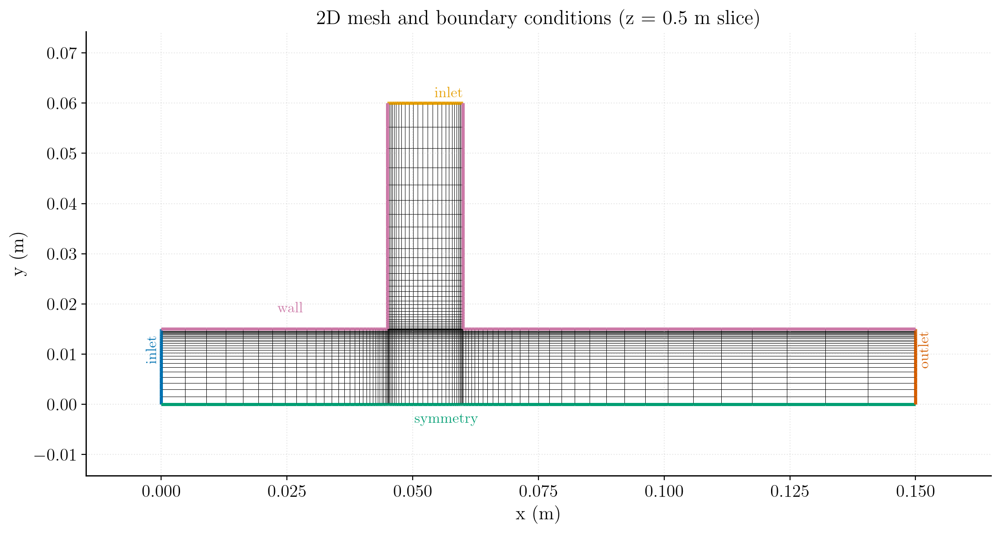
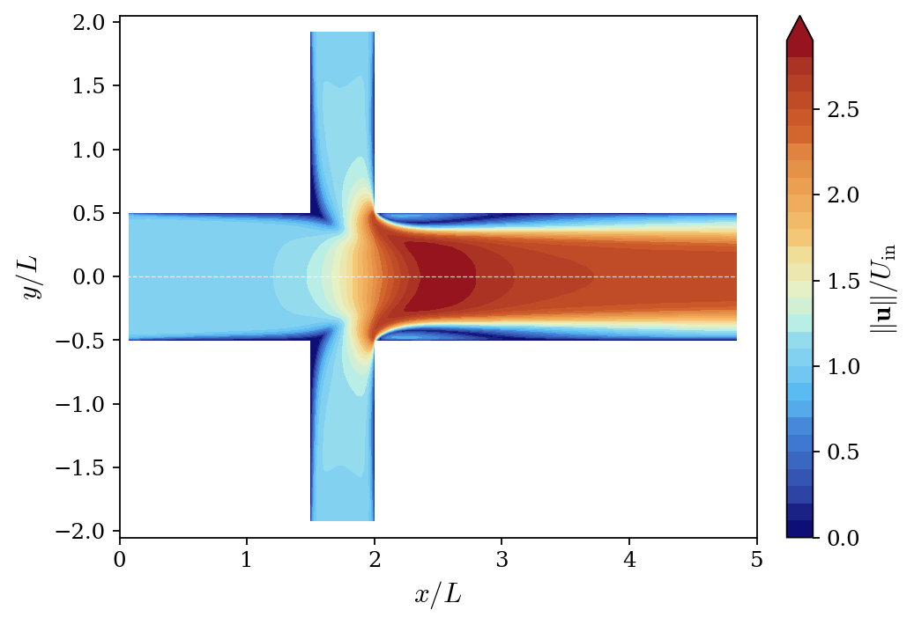
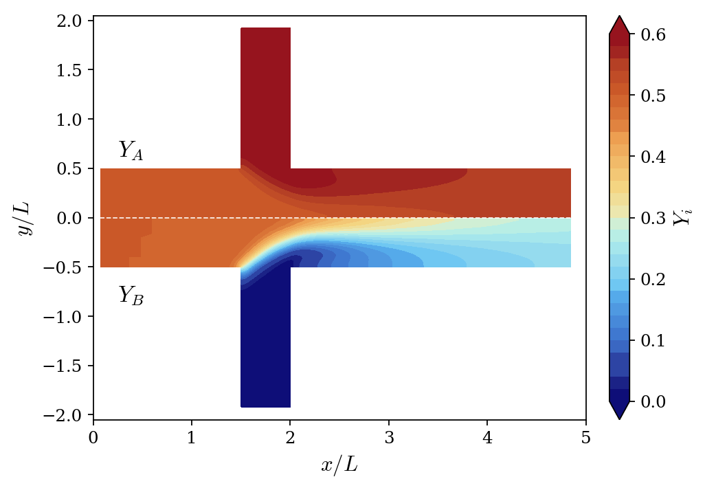

# Turbulent Species Transport in a Mixing Channel

A step-by-step tutorial for simulating the steady, incompressible, turbulent flow in a mixing channel with **passive species transport**, using **code_saturne**. Two streams of different composition merge at a T-junction and mix along the downstream duct.

Maintained by [Simvia](https://Simvia.tech/fr), part of the
[tutoriel-code_saturne](https://github.com/simvia-tech/tutorials-code_saturne) collection.

## Learning objectives

After completing this tutorial you will be able to:

1. Set up a steady, incompressible **turbulent** (k-$\omega$ SST) simulation in code_saturne from the GUI.
2. Add **passive species** (user scalars) with inlet Dirichlet and zero-flux boundary conditions.
3. Apply the N-species closure: solve N-1 transport equations and deduce the last mass fraction.
4. Drive a steady solution with **local (pseudo) time-stepping** and the **SIMPLEC** coupling.
5. Verify the computed mixing against an **analytic species mass balance**.
6. Run the case in serial or parallel and locate the solver outputs (log, probes, EnSight fields).

## Limitations

Mixture-dependent fluid properties are not available at this stage: the density and viscosity do not depend on the local composition, and a single constant mass diffusion coefficient is applied to all species. The species are therefore **passive scalars**.

## Prerequisites

| Requirement | Detail |
|---|---|
| code_saturne | **v9.1** |
| Background | Basic notions of incompressible turbulent flow and mass transfer theory |
| Case | [Inc_Turbulent_Plate](../../10_turbulence_rans/Inc_Turbulent_Plate) |

If code_saturne is not yet installed, build it from the
[official homepage](https://code-saturne.org/), pull a
ready-to-use Singularity image from the
[Open Simulation Center](https://open-simulation-center.org/downloads/code_saturne/code_saturne),
or pull the
[Simvia Docker image](https://hub.docker.com/r/Simvia/code_saturne) before continuing.

## Case files

```
Inc_Species_Transport/
├── CASE/
│   └── DATA/
│       └── setup.xml          # pre-configured GUI case
├── MESH/
│   └── primitiveVenturi.msh
├── FIGURES/                   # figures used in this README
└── README.md
```

## Physical model

The flow is **steady, incompressible, isothermal and turbulent** (RANS with the k-$\omega$ SST model). The mixture contains **three species** A, B and C with identical physical properties, so the composition does not influence the flow: the mass fractions are passive scalars. Following the standard closure, only **N-1 = 2 transport equations** are solved (for $Y_A$ and $Y_B$), and the third mass fraction is deduced from

$$\sum_{i} Y_i = 1 \quad \Longrightarrow \quad Y_C = 1 - Y_A - Y_B$$

The solver marches the following system to steady state:

$$
\begin{cases}
\nabla \cdot \mathbf{u} = 0 \\[6pt]
\rho \, (\mathbf{u} \cdot \nabla) \, \mathbf{u} =
  -\nabla p + \nabla \cdot \left[ (\mu + \mu_t) \left( \nabla\mathbf{u} + (\nabla\mathbf{u})^T \right) \right] \\[6pt]
\rho \, (\mathbf{u} \cdot \nabla) \, Y_i =
  \nabla \cdot \left[ \left( \rho D + \dfrac{\mu_t}{\sigma_t} \right) \nabla Y_i \right], \qquad i = A, B \\[6pt]
Y_C = 1 - Y_A - Y_B
\end{cases}
$$

where the turbulent viscosity $\mu_t$ is given by the **k-$\omega$ SST** model (two additional transport equations for $k$ and $\omega$, see the code_saturne theory guide), $D$ is the molecular mass diffusivity and $\sigma_t = 1$ is the turbulent Schmidt number (code_saturne default).

> Note on units: the species diffusion coefficient entered in the GUI is the **kinematic** diffusivity $D$ in m²/s; code_saturne converts it internally to the dynamic diffusivity $\rho D$. When setting it through `cs_user_parameters.cpp` instead, the dynamic value is expected.

### Flow parameters

| Quantity | Symbol | Value | Source in `setup.xml` |
|---|---|---|---|
| Density | $\rho$ | $1.1766\ \mathrm{kg\,m^{-3}}$ | `physical_properties/density` |
| Dynamic viscosity | $\mu$ | $1.716 \times 10^{-5}\ \mathrm{Pa\,s}$ | `molecular_viscosity` |
| Kinematic viscosity | $\nu = \mu/\rho$ | $1.459 \times 10^{-5}\ \mathrm{m^2\,s^{-1}}$ | derived |
| Mass diffusivity (all species) | $D$ | $10^{-3}\ \mathrm{m^2\,s^{-1}}$ | `Y_A_diffusivity`, `Y_B_diffusivity` |
| Schmidt number | $Sc = \nu/D$ | $0.015$ | derived |
| Inlet velocity (both inlets) | $U_{in}$ | $1.0\ \mathrm{m\,s^{-1}}$ | `inlet/velocity_pressure/norm` |
| Duct height (with mirror symmetry) | $L$ | $0.03\ \mathrm{m}$ | `hydraulic_diameter` |
| Reynolds number | $Re_L = \rho U_{in} L / \mu$ | $\approx 2057$ | derived |

Two remarks for the honest reader:

- At $Re \approx 2000$ the flow is only weakly turbulent (transitional in a straight duct). The k-$\omega$ SST model is kept; this case is meant as a **mass-transfer feature demonstration**, not as a turbulence validation.
- The mass diffusivity is deliberately large ($Sc = 0.015 \ll 1$): molecular diffusion dominates the mixing, which produces smooth, well-mixed profiles within the short domain.

## Geometry and boundary conditions

The domain is a T-shaped mixing channel. A first stream enters horizontally on the left (`east_inlet`, $x = 0$, $0 \le y \le 0.015$), a second stream enters from the top of a vertical branch (`north_inlet`, $y = 0.06$, $0.045 \le x \le 0.06$); the two streams merge at the junction and exit through the outlet on the right ($x = 0.15$). The bottom boundary ($y = 0$) is a **symmetry axis**: the physical duct is twice as high as the modeled half. The two spanwise ($xy$) planes also carry a symmetry condition, so the computation is effectively two-dimensional. Turbulence at both inlets is prescribed with a 5% intensity and a hydraulic diameter of 0.03 m.

The inlet compositions define the mixing problem (each row sums to 1):

| Inlet | $Y_A$ | $Y_B$ | $Y_C = 1 - Y_A - Y_B$ |
|---|---|---|---|
| `east_inlet` | 0.5 | 0.5 | 0.0 |
| `north_inlet` | 0.6 | 0.0 | 0.4 |

| Boundary | Location | Nature | Prescribed value | Zone id |
|---|---|---|---|---|
| `east_inlet` | left ($x=0$, $0<y<0.015$) | Velocity inlet | $U_{in} = 1\ \mathrm{m\,s^{-1}}$ (normal), $Y_A$, $Y_B$ Dirichlet | 1000 |
| `north_inlet` | top of the branch ($y=0.06$) | Velocity inlet | $U_{in} = 1\ \mathrm{m\,s^{-1}}$ (normal), $Y_A$, $Y_B$ Dirichlet | 1001 |
| `outlet` | right ($x=0.15$) | Outlet | $\partial \mathbf{u}/\partial n = 0$, $p$ fixed, $\partial Y_i/\partial n = 0$ | 200 |
| `wall` | channel walls | No-slip wall | $\mathbf{u} = \mathbf{0}$, $\partial Y_i/\partial n = 0$ | 500 |
| `sym1` | bottom axis ($y=0$) | Symmetry | (none) | 1002 |
| `sym2` | spanwise plane ($z=0$) | Symmetry | (none) | 600 |
| `sym3` | spanwise plane ($z=1$) | Symmetry | (none) | 601 |

<p align="center">
  
  <br>
  <em>Figure 1: Mesh and boundary conditions (z = 0.5 m slice): inlets (blue/yellow),
  outlet (orange), symmetry axis (green) and no-slip walls (pink).</em>
</p>

> The computational mesh is fully structured, composed of 3364 quadrilaterals (3510 points), refined toward the walls.

## Numerical setup

| Setting | Value | Rationale |
|---|---|---|
| Velocity-pressure coupling | **SIMPLEC** | Robust segregated coupling for steady incompressible flow |
| Time-stepping | **Local (pseudo) time step** | Accelerates convergence to steady state by using a per-cell time step |
| Reference time step | $\Delta t_\mathrm{ref}=0.1\ \mathrm{s}$ | Seed value, bounded by min/max factors $[0.1,\,1000]$ |
| Iterations | **200** | Steady state reached well within this budget |
| Initialization | $\mathbf{u}=(1,0,0)\ \mathrm{m\,s^{-1}}$, $Y_A = Y_B = 0$ | Uniform seed field |
| Convection scheme | 1st-order upwind | Accuracy for the flow; robustness and boundedness for the scalars |
| Species bounds | $Y_i \in [0, 1]$ | Physical clipping of the mass fractions |
| Gradient reconstruction | Automatic | Default choice |

Three monitoring **probes** track convergence in the downstream channel at
($x=0.06$, $y=0.012$), ($x=0.08$, $y=0.012$) and ($x=0.12$, $y=0.012$) m. They are sensitive indicators of when the mixing layer has reached steady state.

## Running the simulation

The commands below start from the tutorial directory:

```bash
cd Inc_Species_Transport/
```

### Option A: Graphical interface

```bash
code_saturne gui CASE/DATA/setup.xml &
```

The GUI opens the pre-configured `setup.xml`. Review the setup if you wish,
then launch the run with the **gear (Run) button** in the toolbar. To run in
parallel, set the number of processes under
**Calculation management > Performance settings** before launching.

### Option B: Command line

The command-line launcher is run from inside the case directory:

```bash
cd CASE

# serial
code_saturne run

# parallel (e.g. 2 MPI ranks)
code_saturne run --nprocs 2
```

With only 3364 cells this case runs comfortably in serial.

Each run creates a time-stamped directory `CASE/RESU/<YYYYMMDD-HHMM>/` containing:

- `run_solver.log`: solver log and residual history,
- `monitoring/`: probe time series (`probes_*.csv`),
- `postprocessing/`: volume and boundary fields in EnSight Gold format.

## Results and verification

In the figures below the domain is **mirrored across the symmetry axis** ($y=0$) to display the full physical duct.

### Velocity field

<p align="center">
  
  <br>
  <em>Figure 2: Nondimensional velocity magnitude $\|\mathbf{u}\|/U_\mathrm{in}$, with axes normalized by $L = 0.03$ m. The domain is mirrored across the symmetry axis (dashed line).</em>
</p>

The vertical stream impinges on the horizontal one at the junction and the merged flow accelerates along the axis, leaving low-velocity regions behind the junction corners. Downstream, the flow relaxes toward a duct flow whose bulk velocity is set by mass conservation: both inlets have the same area and velocity, so the outlet bulk velocity is $2 U_{in}$, i.e. $\|\mathbf{u}\|/U_\mathrm{in} = 2$.

### Species mass fractions

<p align="center">
  
  <br>
  <em>Figure 3: Mass fraction fields, with axes normalized by $L = 0.03$ m: $Y_A$ on the top half and $Y_B$ on the bottom (mirrored) half of the symmetry axis (dashed line). Both species share the same color scale.</em>
</p>

Each inlet carries its own composition ($Y_A = 0.5$ on the east stream, $0.6$ on the north stream); the two streams mix in the junction region and the fields homogenize downstream, helped by the low Schmidt number.


## Summary

This tutorial set up a steady, incompressible, turbulent mixing-channel simulation with passive species transport in code_saturne, using the k-$\omega$ SST model and the N-1 equations closure for a three-species mixture. This case is a good baseline for RANS simulations involving species transport, before moving to composition-dependent properties or reacting flows.

## References

- [code_saturne documentation](https://code-saturne.org/doc/)

## Authors

[Simvia](https://Simvia.tech/fr) - Questions, remarks and requests are welcome.
