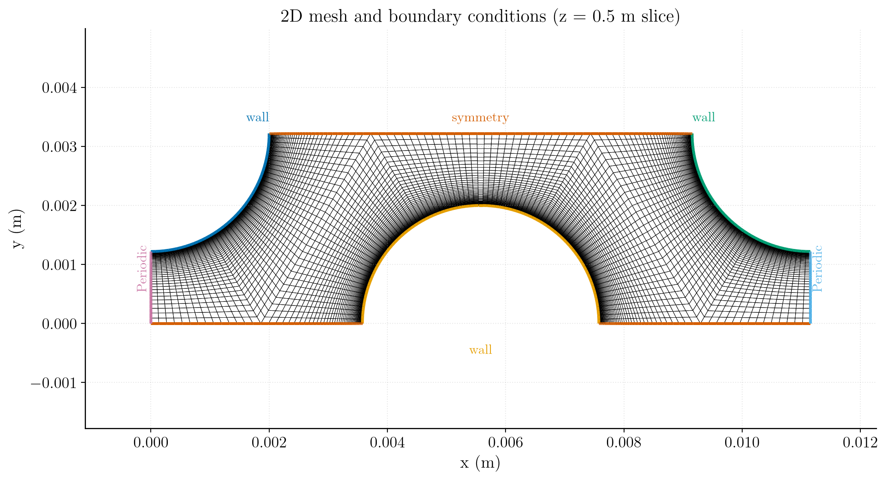
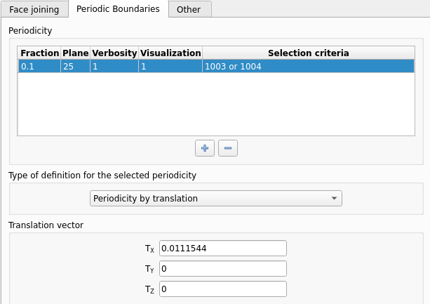
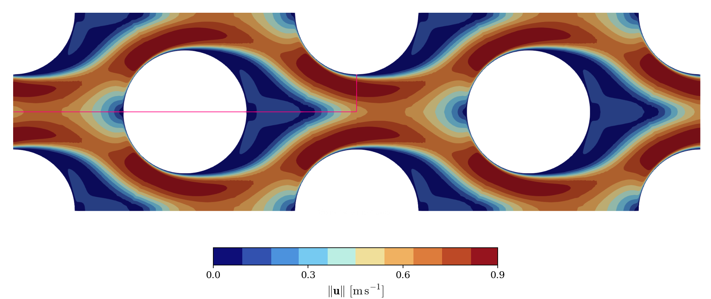
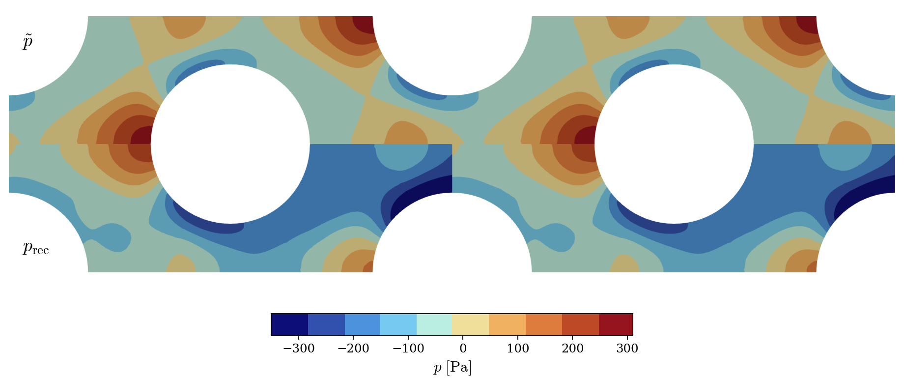
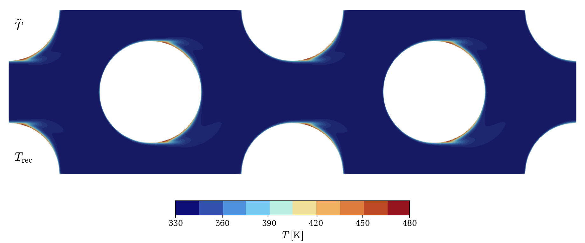

# Streamwise Periodic Flow in a Pin-Fin Array

A step-by-step tutorial for simulating the steady, incompressible, turbulent flow through a **streamwise periodic** unit cell of a pin-fin heat exchanger, using **code_saturne**. Instead of meshing a long array of pins with an inlet and an outlet, a single periodic cell is computed: the flow is driven by a prescribed pressure drop, and a user source term keeps the temperature field periodic despite the heated walls.

Maintained by [Simvia](https://Simvia.tech/fr), part of the
[tutoriel-code_saturne](https://github.com/simvia-tech/tutorials-code_saturne) collection.

## Learning objectives

After completing this tutorial you will be able to:

1. Replace inlet/outlet boundaries by **translational periodicity** in code_saturne.
2. Drive a periodic flow with a **prescribed pressure drop** through a momentum source term.
3. Keep the temperature field periodic with heated walls, using a **user source term** (`cs_user_source_terms.cpp`).
4. Understand the periodic/recovered decomposition of the pressure and temperature fields.
5. Drive a steady solution with **local (pseudo) time-stepping** and the **SIMPLEC** coupling.
6. Run the case in serial or parallel and locate the solver outputs (log, probes, EnSight fields).

## Prerequisites

| Requirement | Detail |
|---|---|
| code_saturne | **v9.1** |
| Background | Basic notions of RANS turbulence modelling and convective heat transfer |
| Case | [Inc_Turbulent_Plate](../../10_turbulence_rans/Inc_Turbulent_Plate) |

If code_saturne is not yet installed, build it from the
[official homepage](https://code-saturne.org/), pull a
ready-to-use Singularity image from the
[Open Simulation Center](https://open-simulation-center.org/downloads/code_saturne/code_saturne),
or pull the
[Simvia Docker image](https://hub.docker.com/r/Simvia/code_saturne) before continuing.

## Case files

```
Inc_Streamwise_Periodic/
├── CASE/
│   ├── DATA/
│   │   └── setup.xml                  # pre-configured GUI case
│   └── SRC/
│       └── cs_user_source_terms.cpp   # volumetric heat sink keeping T periodic
├── MESH/
│   └── fluid_FFD.msh
├── FIGURES/                           # figures used in this README
└── README.md
```

## Physical model

The flow is **steady, incompressible and turbulent** (RANS with the k-$\omega$ SST model), with heat transfer. The geometry repeats itself in the streamwise direction with period $L_x$, and we seek the **fully developed** regime, in which the velocity field is $L_x$-periodic while the pressure and temperature are not: the pressure decreases along $x$ (friction) and the temperature increases along $x$ (heated walls).

Following Patankar, Liu and Sparrow (1977), both fields are split into a periodic part and a linear streamwise drift:

$$
p(x, y) = \tilde{p}(x, y) - \frac{\Delta p}{L_x} \, x,
\qquad
T(x, y) = \tilde{T}(x, y) + \gamma \, x
$$

where $\tilde{p}$ and $\tilde{T}$ are $L_x$-periodic, $\Delta p$ is the pressure drop per period, and $\gamma = Q_w / (\dot{m} \, c_p \, L_x)$ balances the wall heat input $Q_w$. The periodic parts are the variables actually solved; injecting the decomposition into the equations turns the linear drifts into **source terms**:

$$
\begin{cases}
\nabla \cdot \mathbf{u} = 0 \\[6pt]
\rho \, (\mathbf{u} \cdot \nabla) \, \mathbf{u} =
  -\nabla \tilde{p} + \nabla \cdot \left[ (\mu + \mu_t) \left( \nabla\mathbf{u} + (\nabla\mathbf{u})^T \right) \right]
  + \dfrac{\Delta p}{L_x} \, \mathbf{e}_x \\[8pt]
\rho \, c_p \, (\mathbf{u} \cdot \nabla) \, \tilde{T} =
  \nabla \cdot \left[ \left( \lambda + \dfrac{\mu_t c_p}{\sigma_t} \right) \nabla \tilde{T} \right] + S_T
\end{cases}
$$

where the turbulent viscosity $\mu_t$ is given by the **k-$\omega$ SST** model (see the code_saturne theory guide) and $\sigma_t = 1$ is the turbulent Prandtl number (code_saturne default).

The two source terms are the heart of this tutorial:

- **Momentum**: the uniform driving force $\Delta p / L_x \, \mathbf{e}_x$ replaces the missing inlet/outlet pressure difference. It is entered in the GUI (**Volume zones > Source terms**) as `Su = 208.023676 / 0.0111544;`, i.e. $\Delta p = 208.02$ Pa over $L_x = 0.0111544$ m, giving $S_u \approx 1.865 \times 10^4\ \mathrm{N\,m^{-3}}$. The resulting mass flow rate is an **outcome** of the computation, not a prescribed quantity.
- **Energy**: the walls inject a constant heat flux, so without correction the periodic domain would heat up indefinitely (what leaves through the right face re-enters on the left). The shipped user routine `cs_user_source_terms.cpp` removes at every iteration exactly the power added by the walls, through a volumetric sink weighted by the local streamwise velocity:

$$
S_T(\mathbf{x}) = \frac{q_w A_w}{V} \, \frac{u_x(\mathbf{x})}{\langle u_x \rangle},
\qquad
\int_V S_T \, dV = q_w A_w
$$

with $q_w A_w < 0$ in the code_saturne sign convention (heat entering the fluid). This keeps $\tilde{T}$ periodic and statistically steady; it is the source-term counterpart of the $\gamma x$ drift in the Patankar decomposition.

### Flow parameters

| Quantity | Symbol | Value | Source in `setup.xml` |
|---|---|---|---|
| Density | $\rho$ | $1045\ \mathrm{kg\,m^{-3}}$ | `physical_properties/density` |
| Dynamic viscosity | $\mu$ | $1.385 \times 10^{-3}\ \mathrm{Pa\,s}$ | `molecular_viscosity` |
| Specific heat | $c_p$ | $3540\ \mathrm{J\,kg^{-1}\,K^{-1}}$ | `specific_heat` |
| Thermal conductivity | $\lambda$ | $0.42\ \mathrm{W\,m^{-1}\,K^{-1}}$ | `thermal_conductivity` |
| Prandtl number | $Pr = \mu c_p / \lambda$ | $11.7$ (water-glycol type coolant) | derived |
| Pressure drop per period | $\Delta p$ | $208.023676\ \mathrm{Pa}$ | `source_terms/momentum_formula` |
| Streamwise period | $L_x$ | $0.0111544\ \mathrm{m}$ | `periodicity/translation` |
| Wall heat flux | $q_w$ | $5 \times 10^5\ \mathrm{W\,m^{-2}}$ into the fluid | walls, Neumann $-5 \times 10^5$ |
| Initial velocity | $u_0$ | $0.1\ \mathrm{m\,s^{-1}}$ | `velocity_pressure/initialization` |
| Turbulent Prandtl number | $\sigma_t$ | $1$ | code_saturne default |

> The initial velocity is only a seed: since the flow is driven by the prescribed $\Delta p$, the converged bulk velocity (hence the Reynolds number) is a **result** of the simulation, to be extracted from the run.

> Sign convention: in the code_saturne GUI, a **negative** Neumann value for the temperature means a heat flux **entering** the fluid, hence the $-5 \times 10^5$ prescribed on the pin walls.

## Geometry and boundary conditions

The domain is a 2D slice through one unit cell of a staggered pin-fin heat exchanger, filled with a water-glycol type coolant. The streamwise faces carry the **translational periodicity**; the pin surfaces are no-slip heated walls; the remaining lateral boundary is a symmetry, and the two spanwise ($xy$) planes carry a symmetry condition, so the computation is effectively two-dimensional.

| Boundary | Location | Nature | Prescribed value | Zone id |
|---|---|---|---|---|
| periodic pair | left ($x=0$) and right ($x=L_x$) | Periodicity | translation $\Delta x = 0.0111544\ \mathrm{m}$ | 1003 / 1004 |
| `wall1` | top-left quarter-pin | No-slip wall | $\mathbf{u}=\mathbf{0}$, Neumann $-5\times10^5\ \mathrm{W\,m^{-2}}$ | 1000 |
| `wall2` | top-right quarter-pin | No-slip wall | $\mathbf{u}=\mathbf{0}$, Neumann $-5\times10^5\ \mathrm{W\,m^{-2}}$ | 1001 |
| `wall3` | bottom half-pin | No-slip wall | $\mathbf{u}=\mathbf{0}$, Neumann $-5\times10^5\ \mathrm{W\,m^{-2}}$ | 1002 |
| `sym_body` | top centre | Symmetry | (none) | 1005 |
| `sym_front` | spanwise plane ($z=0$) | Symmetry | (none) | 600 |
| `sym_back` | spanwise plane ($z=1$) | Symmetry | (none) | 601 |

<p align="center">
  
  <br>
  <em>Figure 1: Mesh and boundary conditions (z = 0.5 m slice): periodic faces (pink/blue), symmetry (orange) and heated no-slip walls (blue/yellow/green).</em>
</p>

> The computational mesh has 8477 quadrilaterals and is fully structured. The periodic faces are meshed with 50 points and a wall-normal progression such that $y^+ < 1$ everywhere, as required by the low-Reynolds SST wall treatment; each quarter-pin is meshed with 45 points in the streamwise direction.

## Numerical setup

| Setting | Value | Rationale |
|---|---|---|
| Velocity-pressure coupling | **SIMPLEC** | Robust segregated coupling for steady incompressible flow |
| Time-stepping | **Local (pseudo) time step** | Accelerates convergence to steady state by using a per-cell time step |
| Reference time step | $\Delta t_\mathrm{ref}=10^{-2}\ \mathrm{s}$ | Seed value, bounded by min/max factors $[0.1,\,1000]$ |
| Max Courant number | 1.0 | Caps the local time step |
| Iterations | **1000** | Steady state reached well within this budget |
| Initialization | $\mathbf{u}=(0.1,0,0)\ \mathrm{m\,s^{-1}}$, $T = 338\ \mathrm{K}$ | Uniform seed field; the flow is then driven by $\Delta p$ |
| Gradient reconstruction | Automatic | Default choice |

Three monitoring **probes** track convergence at
($x=0.0028$, $y=0.0013$), ($x=0.006$, $y=0.0025$) and ($x=0.01$, $y=0.00043$) m. They are sensitive indicators of when the pin wakes and the mean temperature level have reached a statistically steady state.

## Running the simulation

The commands below start from the tutorial directory:

```bash
cd Inc_Streamwise_Periodic/
```

### Option A: Graphical interface

```bash
code_saturne gui CASE/DATA/setup.xml &
```

The GUI opens the pre-configured `setup.xml`. Review the setup if you wish,
then launch the run with the **gear (Run) button** in the toolbar. To run in
parallel, set the number of processes under
**Calculation management > Performance settings** before launching.

### Option B: Command line

The command-line launcher is run from inside the case directory:

```bash
cd CASE

# serial
code_saturne run

# parallel (e.g. 8 MPI ranks)
code_saturne run --n 8
```

The user routine `SRC/cs_user_source_terms.cpp` is compiled automatically at the beginning of the run.

Each run creates a time-stamped directory `CASE/RESU/<YYYYMMDD-HHMM>/` containing:

- `run_solver.log`: solver log and residual history,
- `monitoring/`: probe time series (`probes_*.csv`),
- `postprocessing/`: volume and boundary fields in EnSight Gold format.

## Periodic boundary conditions in the GUI

A periodic boundary condition treats two boundary faces as if they were physically connected: what leaves one face re-enters through the other. In code_saturne the pair is declared under **Mesh > Preprocessing > Periodicity**, by selecting the two face groups (here with the selection criterion `1003 or 1004`) and specifying the type and geometry of the periodicity: here a **translation** of $L_x = 0.0111544$ m along the $x$-axis.

<p align="center">
  
  <br>
  <em>Figure 2: Declaration of the translational periodicity in the code_saturne GUI.</em>
</p>

## Results and verification

The figures below illustrate the converged solution. The quantities of interest are the velocity magnitude, the pressure and the temperature. For visualization, the domain is duplicated with the Reflect (across the symmetry) and Transform (across the periodic interface) filters, so that several unit cells are displayed; the magenta line delimits the actual simulation domain.

### Velocity magnitude

<p align="center">
  
  <br>
  <em>Figure 3: Velocity magnitude contour lines. The magenta line delimits the simulation domain.</em>
</p>

### Pressure: periodic and recovered fields

<p align="center">
  
  <br>
  <em>Figure 4: Pressure contour lines. Top: periodic pressure $\tilde{p}$ used as solution variable. Bottom: recovered pressure obtained by re-adding the linear drift $-\Delta p \, x / L_x$.</em>
</p>

The solved variable is the periodic pressure $\tilde{p}$ (top): it is identical on the two periodic faces and reflects local phenomena only. The physical pressure (bottom) is recovered in post-processing by re-adding the linear drift, which restores the prescribed pressure drop $\Delta p$ per period. Note that negative values are possible with the incompressible solver: only pressure differences are physically meaningful.

### Temperature: periodic and recovered fields

<p align="center">
  
  <br>
  <em>Figure 5: Temperature contour lines. Top: periodic temperature $\tilde{T}$ used as solution variable. Bottom: recovered temperature obtained by re-adding the linear drift $\gamma x$.</em>
</p>

Thanks to the volumetric heat sink of `cs_user_source_terms.cpp`, the solved temperature $\tilde{T}$ (top) is strictly periodic and statistically steady. The physical temperature (bottom) is recovered by re-adding the streamwise drift $\gamma x$, showing the actual heating of the coolant as it traverses successive unit cells.

## Summary

This tutorial set up an incompressible, turbulent, streamwise periodic flow with heat transfer in code_saturne. The periodic pair replaces the inlet and outlet, a uniform momentum source term imposes the pressure drop $\Delta p / L_x$ that drives the flow, and a user-defined volumetric heat sink balances the wall heat input so that the periodic temperature stays bounded, following the decomposition of Patankar, Liu and Sparrow (1977). This case is a good foundation for unit-cell analyses of heat exchangers and other periodic geometries.

## References

- S.V. Patankar, C.H. Liu, and E.M. Sparrow. Fully developed flow and heat transfer in ducts having streamwise-periodic variations of cross-sectional area, [Journal of Heat Transfer, 99(2):180-186, 1977.](https://doi.org/10.1115/1.3450666)
- Steven B. Beale. On the implementation of stream-wise periodic boundary conditions. [ASME 2005 Summer Heat Transfer Conference, pages 771-777, 2005.](https://doi.org/10.1115/HT2005-72271)
- [code_saturne documentation](https://code-saturne.org/doc/)

## Authors

[Simvia](https://Simvia.tech/fr) - Questions, remarks and requests are welcome.
