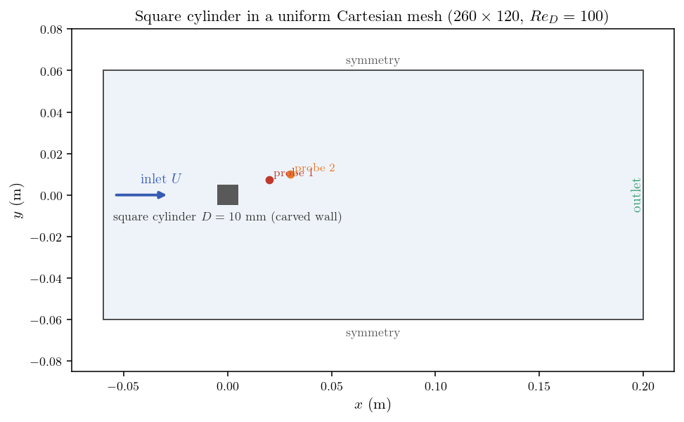
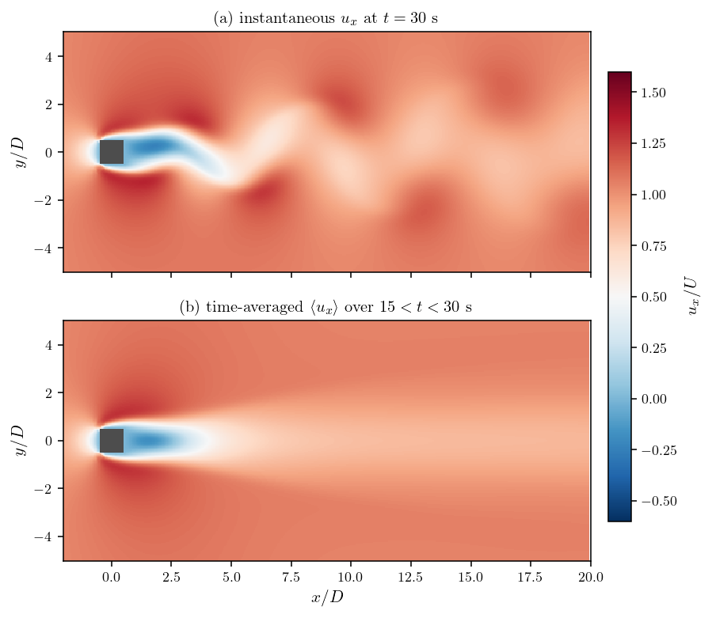
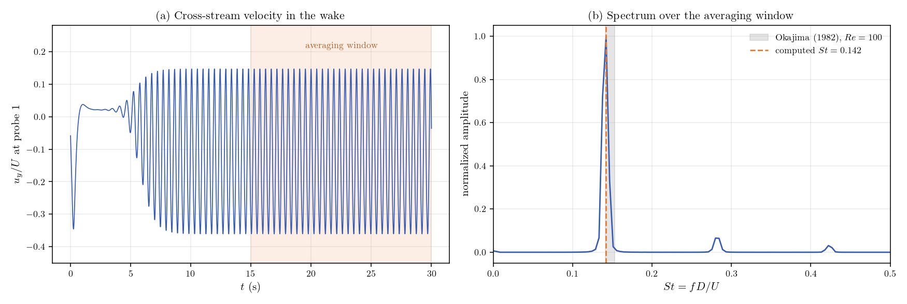

# Time Averages (Mean Fields of an Unsteady Wake)

A step-by-step tutorial for **time averages** (temporal moments) in
**code_saturne**: mean fields accumulated in-line by the solver over a chosen
time window, configured entirely from the GUI. The carrier flow is the periodic
vortex shedding behind a square cylinder at $Re_D=100$: the instantaneous wake
is unsteady and asymmetric while its time average is smooth and symmetric. The
computed moment is verified against an offline average of the probe signals, and
the shedding Strouhal number against the experimental band of Okajima.

Maintained by [Simvia](https://Simvia.tech/fr), part of the
[tutoriel-code_saturne](https://github.com/simvia-tech/tutorials-code_saturne) collection.

## Learning objectives

After completing this tutorial you will be able to:

1. Define a time average (mean of a variable) in the GUI, started at a physical time.
2. Know the subtlety that starting at a physical time requires the iteration start to be disabled (set to -1).
3. Post-process mean fields next to instantaneous ones (they are ordinary fields, also recorded at probes).
4. Choose an averaging window from the probe signals (established shedding, whole number of periods).
5. Verify the moment against an offline average and extract a Strouhal number from a probe spectrum.

## Prerequisites

| Requirement | Detail |
|---|---|
| code_saturne | **v9.1** |
| Background | Basic notions of unsteady laminar wakes |

If code_saturne is not yet installed, build it from the
[official homepage](https://code-saturne.org/), pull a
ready-to-use Singularity image from the
[Open Simulation Center](https://open-simulation-center.org/downloads/code_saturne/code_saturne),
or pull the
[Simvia Docker image](https://hub.docker.com/r/Simvia/code_saturne) before continuing.

## Case files

```text
Inc_Time_Averages/
├── CASE/
│   ├── DATA/
│   │   └── setup.xml          # pre-configured GUI case (holds the time averages)
│   └── SRC/
│       └── cs_user_mesh.cpp   # carves the square cylinder out of the mesh
├── FIGURES/                   # figures used in this README
└── README.md
```

There is no mesh file: the box is built by code_saturne's internal Cartesian
mesher and the square cylinder is carved out of it at run time
(`cs_mesh_remove_cells_from_selection_criteria`, as in
[Pre_Cell_Removal](../../05_preprocessing/Pre_Cell_Removal)), the freed faces
being tagged `obstacle` for the wall boundary zone.

## Physical model

The flow is laminar, incompressible and truly transient. Air
($\rho=1.2\ \mathrm{kg\,m^{-3}}$, $\mu=1.8\times10^{-5}\ \mathrm{Pa\,s}$) flows
at $U=0.15\ \mathrm{m\,s^{-1}}$ past a square cylinder of side
$D=10\ \mathrm{mm}$:

$$
Re_D=\frac{\rho\,U\,D}{\mu}=100,
$$

above the onset of vortex shedding for a square cylinder, so the wake settles
into the classical periodic von Karman street with Strouhal number
$St=fD/U\approx0.14$ (Okajima, 1982).

## Geometry and boundary conditions

The domain spans $-6D\le x\le20D$ and $|y|\le6D$, one cell thick in $z$, meshed
uniformly with $260\times120$ cells ($D/10$ resolution). The cylinder is centred
at the origin.

| Boundary | Type | Condition |
|---|---|---|
| `inlet` ($x=-6D$) | Inlet | $U=0.15\ \mathrm{m\,s^{-1}}$ |
| `outlet` ($x=20D$) | Outlet | Standard outlet |
| `top`, `bottom` ($y=\pm6D$) | Symmetry | Free-slip lateral boundaries |
| `front` / `back` | Symmetry | Quasi-2D |
| `cylinder` (carved) | Wall | No slip |

<p align="center">
  
  <br>
  <em>Figure 1: Domain and boundary conditions. Two probes record the wake at
  every time step.</em>
</p>

## The time averages (the feature)

Two temporal moments are declared in the GUI
(**Calculation control, Time averages**), which stores in `setup.xml`:

```xml
<time_averages>
  <time_average id="1" name="mean_velocity" label="mean_velocity">
    <var_prop name="velocity"/>
    <time_step_start>-1</time_step_start>
    <time_start>15.0</time_start>
  </time_average>
  <time_average id="2" name="mean_pressure" label="mean_pressure">
    <var_prop name="pressure"/>
    <time_step_start>-1</time_step_start>
    <time_start>15.0</time_start>
  </time_average>
</time_averages>
```

The averaging starts at $t=15\ \mathrm{s}$, once the shedding is fully
established, and runs to the end (30 s, about 32 shedding periods). One
subtlety is worth knowing: **starting at a physical time requires
`time_step_start = -1`**; if the iteration start is left at its default of 0 it
takes precedence and the average silently runs from $t=0$, polluting the mean
with the initial transient.

The resulting `mean_velocity` and `mean_pressure` are ordinary fields: they are
written by the EnSight writer and recorded at the probes
(`monitoring/probes_mean_*.csv`) like any other variable.

## Numerical setup

| Setting | Value |
|---|---:|
| Time scheme | True transient, fixed $\Delta t=0.004\ \mathrm{s}$ |
| Time steps | 7500 (30 s, about 64 shedding periods) |
| Velocity-pressure algorithm | SIMPLEC |
| Turbulence | Off (laminar) |

## Running the simulation

From the tutorial directory:

```bash
cd CASE
code_saturne run              # serial
code_saturne run --n 4        # parallel (4 MPI ranks)
```

The user routine in `CASE/SRC/` (mesh carving) is compiled automatically. Each
run creates `CASE/RESU/<id>/` with `run_solver.log`, `monitoring/` (probe
histories at every step, including the moments) and `postprocessing/`.

## Results and verification

### Instantaneous vs mean field

<p align="center">
  
  <br>
  <em>Figure 2: (a) Instantaneous $u_x$ at $t=30$ s: the alternating vortex
  street makes the wake asymmetric at every instant. (b) The time average over
  $15<t<30$ s is smooth and symmetric, with the mean recirculation bubble
  attached to the cylinder.</em>
</p>

The wake asymmetry $|u_x(y)-u_x(-y)|/U$ averages 0.11 on the instantaneous
field and 0.0008 on the mean field: the 32-period average restores the symmetry
of the geometry to 0.1 percent.

### The moment equals the true average

The moments are recorded at the probes, at the same location and with the same
convention as the instantaneous signals, which allows an exact check: the final
value of `mean_velocity` at probe 2 is compared with the offline average of the
`Velocity` signal over the accumulation steps ($15<t\le30$ s):

| Quantity | Value |
|---|---:|
| GUI moment at probe 2 | 0.131459 m/s |
| Offline average of the probe signal | 0.131459 m/s |
| Difference | $1.7\times10^{-9}$ m/s |

### Strouhal number

<p align="center">
  
  <br>
  <em>Figure 3: (a) Cross-stream velocity at probe 1: the shedding is fully
  periodic well before the averaging window. (b) Spectrum over the window: the
  peak gives $St=0.142$, inside the experimental band of Okajima (1982),
  0.141 to 0.153 at $Re=100$.</em>
</p>

## Summary

This tutorial computed in-line time averages of an unsteady wake: the vortex
street behind a square cylinder at $Re_D=100$, carved out of a built-in
Cartesian mesh. The GUI moments, started at a physical time (with the
`time_step_start = -1` subtlety made explicit), reproduce the offline average of
the probe signals to $10^{-9}$, turn the asymmetric instantaneous wake into a
symmetric mean field, and the shedding Strouhal number matches the Okajima
band. Time averages are the standard tool for extracting mean quantities from
every unsteady calculation (LES, vortex shedding, sloshing) without storing and
re-processing full time series.

## References

1. A. Okajima, "Strouhal numbers of rectangular cylinders", *Journal of Fluid Mechanics*, vol. 123, pp. 379-398, 1982.
2. code_saturne documentation: <https://code-saturne.org/doc/>.

## Authors

[Simvia](https://Simvia.tech/fr) - Questions, remarks and requests are welcome.
