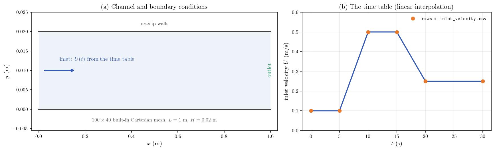
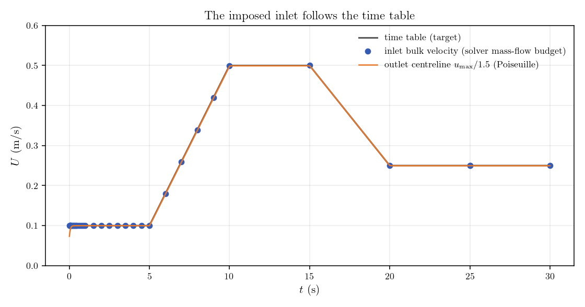
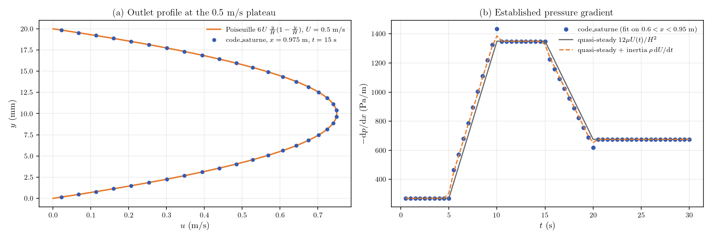

# Time-Table Inlet (Transient Boundary Condition from a CSV File)

A step-by-step tutorial for **time tables** in **code_saturne**: a boundary
condition that follows a time scenario read from a CSV file. The inlet velocity
of a laminar channel ramps between plateaus according to
`DATA/inlet_velocity.csv`, entirely from the GUI (no user routine): the table is
declared in the setup and used inside the boundary formula as
`inlet_law[velocity]`. The response is verified against the table itself, the
analytic Poiseuille solution, and the quasi-steady pressure-gradient model with
its inertial correction.

Maintained by [Simvia](https://Simvia.tech/fr), part of the
[tutoriel-code_saturne](https://github.com/simvia-tech/tutorials-code_saturne) collection.

## Learning objectives

After completing this tutorial you will be able to:

1. Declare a time table from a CSV file in the GUI (name, delimiter, skipped header rows, column names).
2. Use the table inside any MEG formula with the `table[column]` syntax, interpolated at the current time.
3. Drive a transient inlet velocity through plateaus and ramps without writing code.
4. Check from the solver log (mass-flow budget) that the imposed inlet follows the table.
5. Verify the response against the Poiseuille solution and the quasi-steady pressure-gradient model.

## Prerequisites

| Requirement | Detail |
|---|---|
| code_saturne | **v9.1** |
| Background | Basic notions of laminar channel flow |

If code_saturne is not yet installed, build it from the
[official homepage](https://code-saturne.org/), pull a
ready-to-use Singularity image from the
[Open Simulation Center](https://open-simulation-center.org/downloads/code_saturne/code_saturne),
or pull the
[Simvia Docker image](https://hub.docker.com/r/Simvia/code_saturne) before continuing.

## Case files

```text
Inc_Time_Table_Inlet/
├── CASE/
│   └── DATA/
│       ├── setup.xml            # pre-configured GUI case
│       └── inlet_velocity.csv   # the time table (shipped with the case)
├── FIGURES/                     # figures used in this README
└── README.md
```

There is no mesh file: the channel grid is built by code_saturne's internal
Cartesian mesher, directly from `setup.xml`.

## Physical model

The flow is **laminar, incompressible and truly transient**. A viscous fluid
enters a plane channel with a velocity that follows the time table; between the
inlet transients, the flow relaxes to the steady plane Poiseuille solution

$$
u(y)=6\,U\,\frac{y}{H}\Big(1-\frac{y}{H}\Big),
\qquad
-\frac{\mathrm{d}p}{\mathrm{d}x}=\frac{12\,\mu\,U}{H^{2}},
$$

and during the ramps the established region follows the quasi-steady model
augmented by the uniform inertial contribution:

$$
-\frac{\mathrm{d}p}{\mathrm{d}x}
=\frac{12\,\mu\,U(t)}{H^{2}}+\rho\,\frac{\mathrm{d}U}{\mathrm{d}t}.
$$

### Flow parameters

| Parameter | Value | Unit | Source |
|---|---:|---|---|
| Density $\rho$ | 900 | $\mathrm{kg\,m^{-3}}$ | `setup.xml`: `density` |
| Dynamic viscosity $\mu$ | 0.09 | $\mathrm{Pa\,s}$ | `setup.xml`: `molecular_viscosity` |
| Inlet velocity $U(t)$ | 0.1 to 0.5 | $\mathrm{m\,s^{-1}}$ | `DATA/inlet_velocity.csv` |
| Reynolds number $Re_{D_h}$ | 40 to 200 | - | derived ($D_h=2H$) |

The development length at the highest plateau is
$L_{\mathrm{dev}}\approx0.05\,Re_{D_h}\,D_h\approx0.4\ \mathrm{m}<L$: the outlet
region is fully developed at every plateau.

## The time table (the feature)

The scenario lives in a plain CSV file, `DATA/inlet_velocity.csv`:

```text
time,velocity
0,0.1
5,0.1
10,0.5
15,0.5
20,0.25
30,0.25
```

It is declared in the GUI (**Physical properties, Time tables**), which stores in
`setup.xml`:

```xml
<time_tables>
  <table id="0" name="inlet_law" file_name="inlet_velocity.csv" delimiter=",">
    <skip_rows>1</skip_rows>
    <headers_list>time,velocity</headers_list>
  </table>
</time_tables>
```

and used in the inlet velocity formula simply as:

```c
u_norm = inlet_law[velocity];
```

At every time step, `inlet_law[velocity]` is interpolated linearly at the
current physical time (first column = time). The same syntax works in any MEG
formula (boundary conditions, source terms, properties). For sources that are
not CSV files, the same tables can be created in C with `cs_user_time_table`.

## Geometry and boundary conditions

Plane channel, $L=1\ \mathrm{m}$, $H=0.02\ \mathrm{m}$, one cell thick in $z$;
built-in Cartesian mesh of $100\times40$ cells, refined toward both walls
(parabolic law).

| Boundary | Type | Condition |
|---|---|---|
| `inlet` ($x=0$) | Inlet | $U(t)$ from the time table |
| `outlet` ($x=L$) | Outlet | Standard outlet |
| `bottom_wall`, `top_wall` | Wall | No slip |
| `front` / `back` | Symmetry | Quasi-2D |

<p align="center">
  
  <br>
  <em>Figure 1: (a) Channel and boundary conditions. (b) The inlet scenario:
  plateaus at 0.1, 0.5 and 0.25 m/s connected by linear ramps, defined by the
  six rows of the CSV file.</em>
</p>

## Numerical setup

| Setting | Value |
|---|---:|
| Time scheme | True transient, fixed $\Delta t=0.01\ \mathrm{s}$ |
| Time steps | 3000 (30 s) |
| Velocity-pressure algorithm | SIMPLEC |
| Turbulence | Off (laminar) |

Two probes record every time step: one at the inlet centreline, one at the
outlet centreline ($x=0.995\ \mathrm{m}$).

## Running the simulation

From the tutorial directory:

### Option A: Graphical interface

```bash
code_saturne gui CASE/DATA/setup.xml &
```

The time table is visible under **Physical properties, Time tables**; the inlet
formula under **Boundary conditions**. Launch with the **Run** button.

### Option B: Command line

```bash
cd CASE
code_saturne run              # serial
code_saturne run --n 4        # parallel (4 MPI ranks)
```

The CSV file is staged automatically with the rest of `DATA/`. Each run creates
a time-stamped `CASE/RESU/<id>/` containing `run_solver.log` (including the
boundary mass-flow budgets used below), `monitoring/` and `postprocessing/`.

## Results and verification

### The inlet follows the table

<p align="center">
  
  <br>
  <em>Figure 2: The inlet bulk velocity recovered from the solver mass-flow
  budget (dots) sits on the time table (line) through plateaus and ramps; the
  outlet centreline velocity divided by 1.5 (Poiseuille) follows the same
  scenario quasi-steadily.</em>
</p>

The mass-flow budgets printed in `run_solver.log` give an inlet bulk velocity
equal to the interpolated table within **0.16 percent** of the maximum velocity
(one time step of lag at the sampling instants). The outlet centreline velocity
matches $1.5\,U(t)$ with a mean deviation of 0.14 percent: the flow responds
quasi-steadily at every point of the scenario.

### Poiseuille profile and pressure gradient

<p align="center">
  
  <br>
  <em>Figure 3: (a) Outlet profile at the 0.5 m/s plateau against the Poiseuille
  parabola. (b) Established pressure gradient (fit on $0.6<x<0.95$ m) against
  the quasi-steady model: during the ramps the measured gradient departs from
  the pure quasi-steady curve by exactly the inertial term
  $\rho\,\mathrm{d}U/\mathrm{d}t$.</em>
</p>

At the 0.5 m/s plateau, the established pressure gradient is
$1348\ \mathrm{Pa\,m^{-1}}$ against $12\mu U/H^{2}=1350\ \mathrm{Pa\,m^{-1}}$
(0.2 percent). During the ramps the measured gradient follows the quasi-steady
value shifted by $\rho\,\mathrm{d}U/\mathrm{d}t$ ($\pm$72 and $-45\ \mathrm{Pa\,m^{-1}}$
on the two ramps), the expected inertial cost of accelerating the whole channel.

## Summary

This tutorial drove a transient inlet with a **time table**: a six-row CSV file
declared in the GUI and used in the inlet formula as `inlet_law[velocity]`, with
no user routine. The solver mass-flow budget reproduces the interpolated table
to within a fraction of a percent; between and during the ramps the channel
responds quasi-steadily, matching the Poiseuille profile and the quasi-steady
pressure gradient with its inertial correction. The same `table[column]` syntax
applies to any MEG formula, which makes time tables the lightest way to impose
measured or scripted scenarios (flow rates, temperatures, source terms) on a
code_saturne calculation.

## References

1. code_saturne documentation: <https://code-saturne.org/doc/>.
2. F. M. White, *Viscous Fluid Flow*, McGraw-Hill.

## Authors

[Simvia](https://Simvia.tech/fr) - Questions, remarks and requests are welcome.
