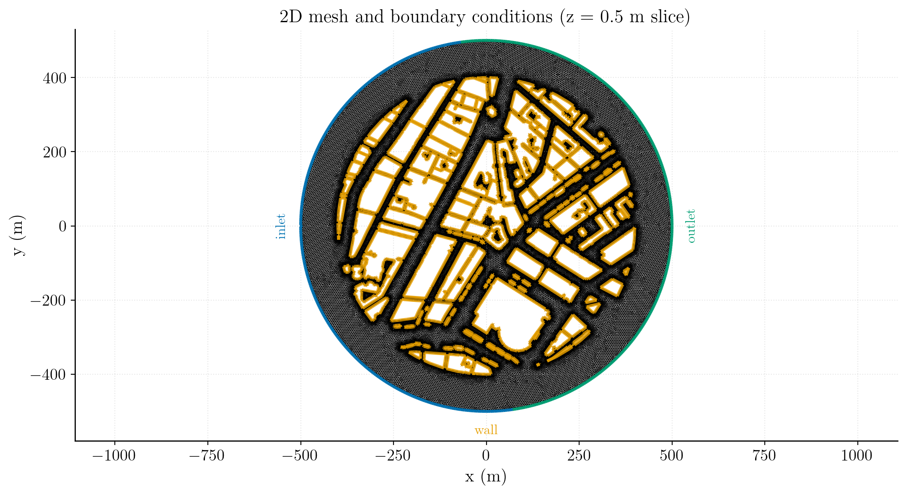
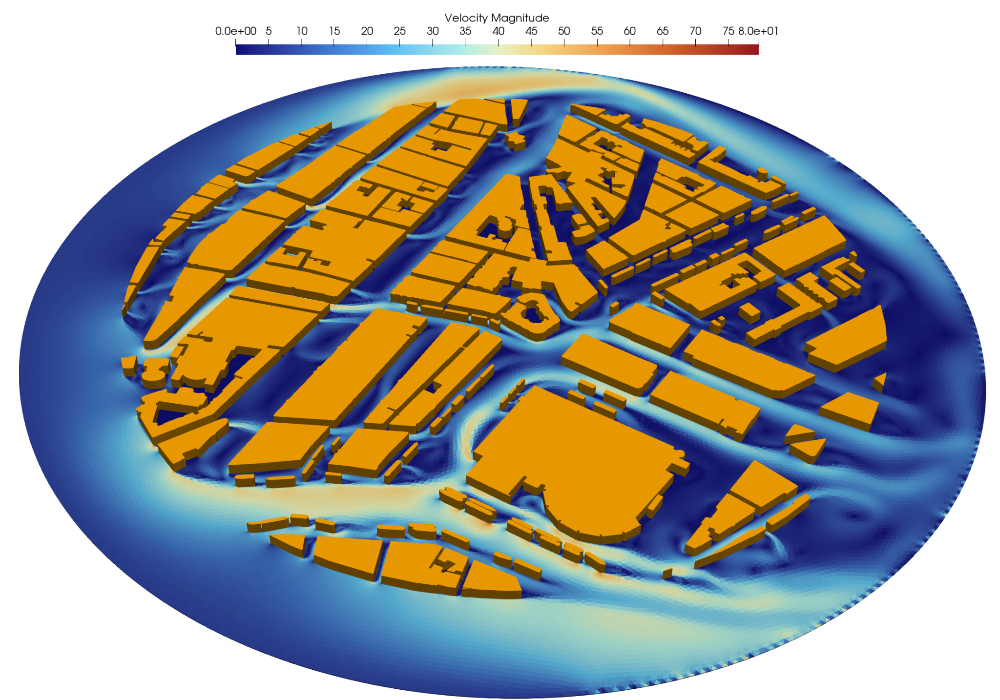
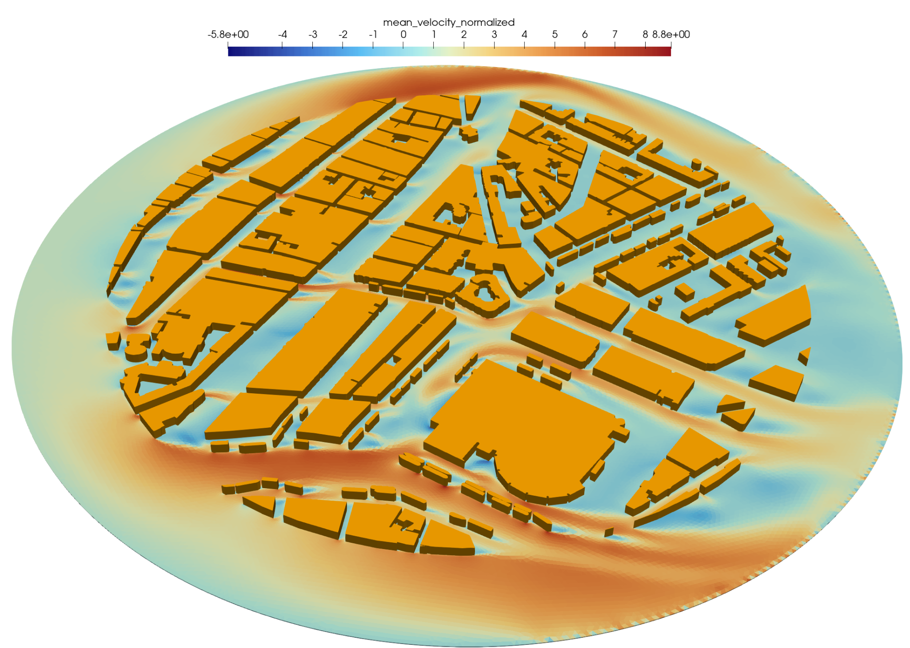
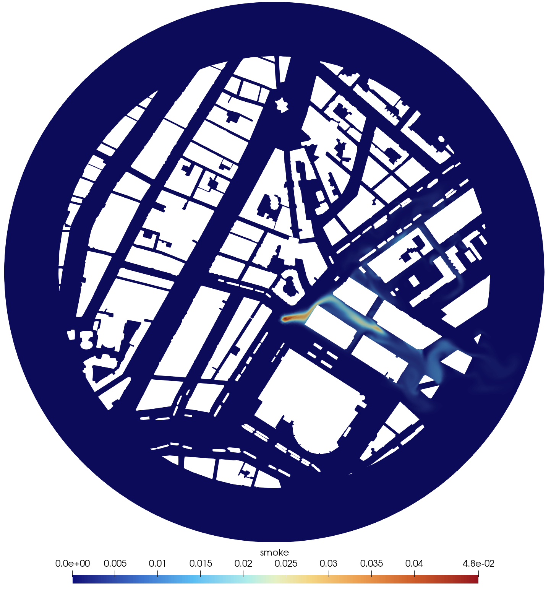

# Wind velocity and pollutant dispersion in a city


This tutorial models wind flow through a two-dimensional representation of the city centre of Amsterdam and, in a second step, the transport of smoke released from a localized source. The case demonstrates how a complex urban geometry can be simulated in **code_saturne** using an incompressible turbulent RANS formulation together with passive-scalar transport.

Maintained by [Simvia](https://Simvia.tech/fr), part of the
[tutoriel-code_saturne](https://gitlab.com/Simvia/common-tools/tutoriel-code_saturne) collection.

## Learning objectives

This case illustrates how to:

- Import and use a complex unstructured urban mesh in code_saturne;
- Impose wind inflow, outlet, wall and symmetry boundary conditions;
- Solve an incompressible turbulent flow using the $k$-$\omega$ SST model;
- Compute a time-averaged velocity field for pedestrian-wind assessment;
- Add a passive scalar representing smoke;
- Define a localized volumetric source term for pollutant release;
- Visualize urban flow acceleration, recirculation and pollutant dispersion.

## Prerequisites

| Requirement | Detail |
|---|---|
| code_saturne | **v9.1** |
| Background | Basic notions of RANS turbulence modelling and boundary-layer theory |

If code_saturne is not yet installed, build it from the
[official homepage](https://www.code-saturne.org/cms/web/Download), pull a
ready-to-use Singularity image from the
[Open Simulation Center](https://open-simulation-center.org/downloads/code_saturne/code_saturne),
or pull the
[Simvia Docker image](https://hub.docker.com/r/Simvia/code_saturne) before continuing.

## Case files

```
Inc_Urban_City/
├── CASE/
│   ├── DATA/
│   │   └── setup.xml          # pre-configured GUI case
├── MESH/
│   └── amsterdam_coarse_io.msh
├── FIGURES/                   # figures used in this README
└── README.md
```

## Physical model

The computational domain represents the streets and buildings of central Amsterdam. The buildings are treated as solid no-slip obstacles, while the surrounding circular boundary is divided into inlet, outlet and symmetry portions according to the imposed wind direction.

The reference wind speed is

$$
U_{\mathrm{in}} = 6.81\ \mathrm{m\,s^{-1}}.
$$

The flow is assumed to be:

- incompressible;
- isothermal;
- turbulent;
- two-dimensional in practice, using a thin three-dimensional mesh;
- unaffected by buoyancy, atmospheric stratification or building-height variations.

The air properties used in the case are:

| Property | Value |
|---|---:|
| Density, $\rho$ | $1.2\ \mathrm{kg\,m^{-3}}$ |
| Dynamic viscosity, $\mu$ | $1.716\times10^{-5}\ \mathrm{Pa\,s}$ |
| Reference pressure | $101325\ \mathrm{Pa}$ |
| Reference temperature | $293.15\ \mathrm{K}$ |

## Governing equations

The mean flow is governed by the incompressible Reynolds-averaged Navier--Stokes equations:

$$
\nabla\cdot\mathbf{u}=0,
$$

$$
\rho\left(\frac{\partial\mathbf{u}}{\partial t}
+\mathbf{u}\cdot\nabla\mathbf{u}\right)
=-\nabla p+\nabla\cdot\left[\left(\mu+\mu_t\right)
\left(\nabla\mathbf{u}+\nabla\mathbf{u}^{T}\right)\right].
$$

Turbulent stresses are closed using the $k$-$\omega$ SST model.

For the pollutant-dispersion stage, smoke is represented by a passive scalar $Y_s$ satisfying

$$
\frac{\partial (\rho Y_s)}{\partial t}
+\nabla\cdot(\rho\mathbf{u}Y_s)
=\nabla\cdot\left(\Gamma_{\mathrm{eff}}\nabla Y_s\right)+S_s,
$$

where $\Gamma_{\mathrm{eff}}$ combines molecular and turbulent diffusion. The molecular diffusivity assigned to the scalar is

$$
D_s=2\times10^{-5}\ \mathrm{m^2\,s^{-1}}.
$$

## Mesh

The supplied Gmsh mesh is located at:

```text
MESH/amsterdam_coarse_io.msh
```

It contains the fluid streets surrounding the building footprints and uses a thin extrusion in the $z$ direction. The principal boundary groups are:

| Mesh group | code_saturne label | Type |
|---:|---|---|
| 100 | `inlet` | Velocity inlet |
| 200 | `outlet` | Pressure outlet |
| 600 | `sym1` | Symmetry |
| 601 | `sym2` | Symmetry |
| 1000 | `wall` | No-slip building walls |



*Figure 1: Computational mesh and boundary-condition assignment.*

The mesh and geometry are intentionally simplified. In particular, the city is represented as a planar configuration and the influence of different building heights is neglected. The case is therefore intended primarily as a qualitative urban-flow demonstration rather than a high-fidelity pedestrian-wind study.

### Flow model

The main settings are:

| Setting | Value |
|---|---|
| Solver | Incompressible flow |
| Turbulence model | $k$-$\omega$ SST |
| Velocity-pressure coupling | SIMPLEC |
| Gradient reconstruction | Least squares |
| Extended neighbourhood | Complete |
| Reference time step | $0.01\ \mathrm{s}$ |
| Number of time steps | 5000 |
| Result-writing frequency | Every 100 time steps |

The initial velocity is uniform:

$$
\mathbf{u}_0=(6.81,\ 0,\ 0)\ \mathrm{m\,s^{-1}}.
$$

The turbulence variables are initialized and imposed at the inlet using

$$
k=0.1737\ \mathrm{m^2\,s^{-2}},
\qquad
\omega=1214.95\ \mathrm{s^{-1}}.
$$

### Boundary conditions

- **Inlet:** normal velocity of $6.81\ \mathrm{m\,s^{-1}}$, prescribed $k$ and $\omega$, and zero smoke concentration.
- **Outlet:** standard outlet condition with zero diffusive smoke flux.
- **Building walls:** no-slip velocity and zero normal smoke flux.
- **Symmetry boundaries:** zero normal velocity and zero normal gradients of transported quantities.

### Time averaging

A time average named `mean_velocity` is accumulated from time step 25 onward. It is used to evaluate the persistent wind pattern after the initial transient.

Three monitoring probes are also included in `setup.xml`, and their values are written in CSV format at every time step.

## Part 1: urban wind field only

The supplied `setup.xml` corresponds to the complete second part of the tutorial, including smoke transport.

To run only the wind-flow calculation:

1. remove the user scalar `smoke` from **Additional scalars**;
2. remove the volumetric zone `fire_source`;
3. remove the scalar source term associated with that zone;
4. remove the smoke boundary conditions if they remain in the GUI.

No other modification is required. The velocity, turbulence model, mesh and flow boundary conditions can be kept unchanged.

## Part 2: smoke release

The smoke source is defined in the cylindrical volume zone `fire_source`:

```text
cylinder[15.56, -87.93, 0, 15.56, -87.93, 1, 5]
```

This corresponds to a cylinder of radius $5\ \mathrm{m}$ spanning the thin computational domain. Inside this zone, the scalar source is

$$
S_s=0.1,
\qquad
\frac{\partial S_s}{\partial Y_s}=0.
$$

In code_saturne notation, the source-term formula is:

```text
S = 0.1;
dS = 0;
```

The scalar behaves as a passive pollutant: it is transported by the computed wind field but does not modify the density, momentum equations or turbulence model.

## Running the case

From the tutorial directory, run:

```bash
cd CASE
code_saturne run
```

For a parallel calculation, for example with six MPI processes as specified in `run.cfg`:

```bash
code_saturne run --n 6
```

The simulation results are written to:

```text
CASE/RESU/<run_id>/
```

The EnSight post-processing files are written in the `postprocessing` subdirectory and can be opened with ParaView.

## Post-processing

The main fields of interest are:

- velocity magnitude;
- streamwise velocity and recirculation zones;
- time-averaged velocity;
- normalized mean streamwise velocity;
- smoke concentration;
- turbulent quantities $k$, $\omega$ and turbulent viscosity;
- wall $y^+$, when assessing near-wall resolution.

## Results

###  Velocity magnitude

<p align="center">
  
  <br>
  <em>Figure 2: Instantaneous velocity magnitude through the streets of the city.</em>
</p>
The flow accelerates in narrow streets and around building corners, while low-speed and recirculating regions develop in sheltered areas and behind large obstacles. The highest velocities form preferential paths aligned with the imposed wind direction.

### Normalized mean velocity

<p align="center">
  
  <br>
  <em>Figure 3: Normalized mean streamwise velocity, $\overline{u}_x/U_{\mathrm{in}}$.</em>
</p>

The time-averaged field highlights persistent acceleration corridors and regions of mean reverse flow. Negative values correspond to recirculation, whereas values greater than one indicate local acceleration relative to the imposed inlet velocity.

### Smoke dispersion

<p align="center">
  
  <br>
  <em>Figure 4: Passive-smoke concentration released from the localized source in the city centre.</em>
</p>

The pollutant plume is advected through the connected street network. Its trajectory is controlled by the local wind field, building wakes and street-channeling effects. Concentration decreases away from the source due to advection and turbulent diffusion.

## Discussion and limitations

This case reproduces the main qualitative behaviour expected for wind and pollutant transport in a complex urban layout. It is useful for learning mesh handling, turbulent external-flow setup, scalar transport and volumetric source terms in code_saturne.

The following limitations should be considered when interpreting the results:

- the city geometry is treated as effectively two-dimensional;
- all buildings have the same extruded height in the thin domain;
- the surrounding city outside the circular domain is omitted;
- atmospheric boundary-layer profiles and thermal stratification are not modelled;
- the mesh is relatively coarse for quantitative wall-resolved predictions;
- the smoke is passive and does not include heat release, buoyancy, combustion or deposition;
- the source strength is illustrative and is not calibrated to a particular fire scenario.

Consequently, the results should be interpreted as a numerical demonstration and qualitative risk-visualization case, not as a certified urban-safety assessment.


## References

1. code_saturne documentation: https://www.code-saturne.org/
2. F. R. Menter, “Two-equation eddy-viscosity turbulence models for engineering applications,” *AIAA Journal*, 32(8), 1994, pp. 1598–1605.


## Authors

[Simvia](https://Simvia.tech/fr) - Questions, remarks and requests are welcome.

