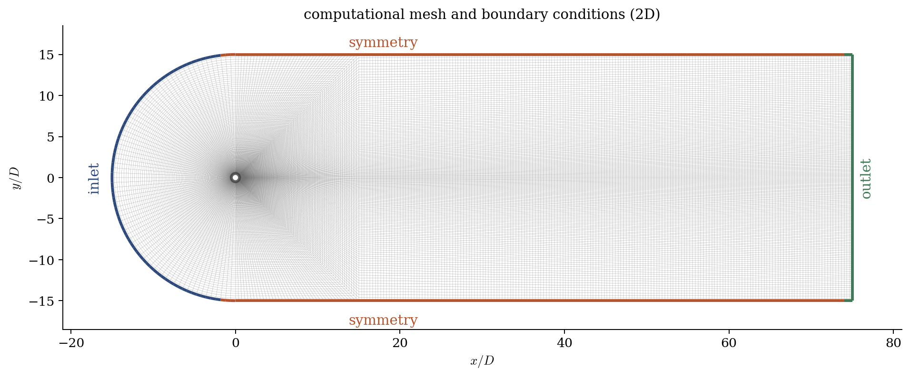
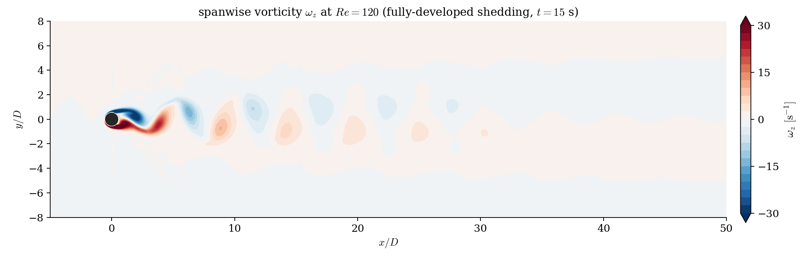
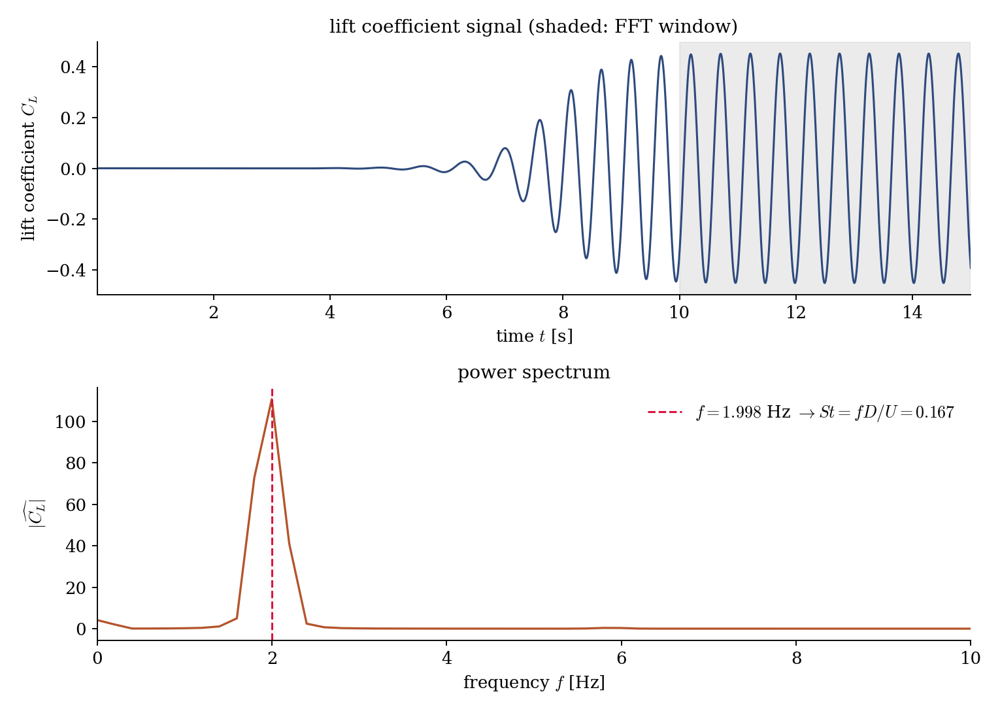
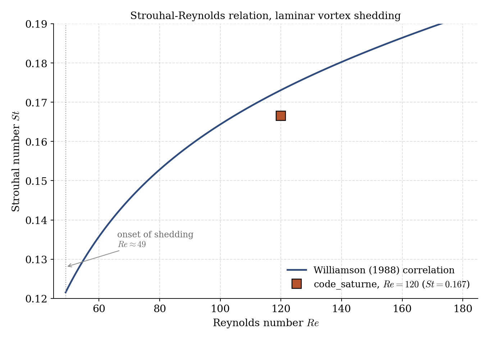

# Unsteady Laminar Vortex Shedding (von Karman Street)

A step-by-step tutorial for a **time-accurate unsteady** incompressible simulation in **code_saturne**: the laminar von Karman vortex street behind a 2D circular cylinder at $Re = 120$. The flow sheds a periodic, alternating street of counter-rotating vortices. The tutorial's purpose is the **unsteady workflow**: drive a time-accurate run to a statistically periodic state, extract the shedding frequency from the lift signal with a small user routine plus an FFT, and validate the resulting **Strouhal number** against the classical Williamson correlation.

Maintained by [Simvia](https://Simvia.tech/fr), part of the
[tutoriel-code_saturne](https://github.com/simvia-tech/tutorials-code_saturne) collection.

## Learning objectives

After completing this tutorial you will be able to:

1. Set up a **2D unsteady incompressible laminar** simulation on an imported mesh, advanced with a **constant time step** and **SIMPLEC** coupling.
2. Recognise when a self-sustained instability has reached a **statistically periodic** limit cycle, and flush the initial transient before taking statistics.
3. Add a **`cs_user_extra_operations`** routine that integrates the boundary stress over the cylinder to record the **lift coefficient** $C_L(t)$.
4. Extract the **vortex-shedding frequency** by FFT of $C_L(t)$ and form the **Strouhal number** $St = fD/U_\infty$, then compare it with reference data.

## Prerequisites

| Requirement | Detail |
|---|---|
| code_saturne | **v9.1** |
| Background | Basic incompressible solver usage (see [Inc_Laminar_Step](../Inc_Laminar_Step)) |

If code_saturne is not yet installed, build it from the
[official homepage](https://code-saturne.org/), pull a
ready-to-use Singularity image from the
[Open Simulation Center](https://open-simulation-center.org/downloads/code_saturne/code_saturne),
or pull the
[Simvia Docker image](https://hub.docker.com/r/Simvia/code_saturne) before continuing.

## Case files

```
Inc_Von_Karman/
├── CASE/
│   ├── DATA/setup.xml                    # pre-configured GUI case
│   └── SRC/cs_user_extra_operations.cpp  # records the lift coefficient Cl(t)
├── MESH/
│   └── cylinder_wake.msh                 # 2D C-grid around the cylinder (Git LFS)
├── FIGURES/                              # figures used in this README
└── README.md
```

> The mesh is tracked with Git LFS. The only user code is the lift-coefficient probe.

## Physical model

The flow is **2D, unsteady, incompressible and laminar**, governed by the unsteady Navier-Stokes equations,

$$
\nabla\cdot\mathbf{U} = 0, \qquad
\rho\left(\frac{\partial \mathbf{U}}{\partial t} + (\mathbf{U}\cdot\nabla)\mathbf{U}\right)
= -\nabla p + \mu\,\nabla^2\mathbf{U}.
$$

Above a critical Reynolds number ($Re \approx 49$), the steady wake becomes absolutely unstable and the cylinder sheds a periodic street of counter-rotating vortices: the **von Karman street**. At $Re = 120$ the shedding is laminar and strictly periodic, so **no turbulence model** is used (molecular viscosity only). The instability is self-sustained: from a uniform start it grows out of numerical asymmetry over a few cycles and saturates into a limit cycle.

The shedding is characterised by the **Strouhal number**

$$
St = \frac{f\,D}{U_\infty},
$$

with $f$ the shedding frequency, $D$ the cylinder diameter and $U_\infty$ the free-stream velocity. The lift coefficient $C_L = F_L / (\tfrac12 \rho U_\infty^2 D)$ oscillates **at the shedding frequency** $f$ (the drag oscillates weakly at $2f$), which is why $f$ is read from $C_L(t)$.

### Flow parameters

| Quantity | Symbol | Value | Source in `setup.xml` |
|---|---|---|---|
| Density | $\rho$ | $1.0\ \mathrm{kg\,m^{-3}}$ | `fluid_properties/density` |
| Dynamic viscosity | $\mu$ | $1\times10^{-5}\ \mathrm{Pa\,s}$ | `molecular_viscosity` |
| Kinematic viscosity | $\nu = \mu/\rho$ | $1\times10^{-5}\ \mathrm{m^2\,s^{-1}}$ | derived |
| Free-stream velocity | $U_\infty$ | $0.12\ \mathrm{m\,s^{-1}}$ | `inlet/velocity_pressure/norm` |
| Cylinder diameter | $D$ | $0.01$ m | mesh |
| Reynolds number | $Re = \rho U_\infty D/\mu$ | $120$ | derived |

$$
Re = \frac{1.0 \times 0.12 \times 0.01}{1\times10^{-5}} = 120
$$

## Geometry and boundary conditions

The domain is a 2D slice around a circular cylinder of diameter $D = 0.01$ m centred at the origin. A C-grid wraps the cylinder (an O-grid layer resolves the boundary layer, refined into the wake) inside a rounded box: the curved **inlet** stands $15D$ upstream, the flat lateral **symmetry** boundaries are $15D$ above and below, and the **outlet** is $75D$ downstream to let the street convect out without reflecting. The two spanwise faces (`front`, `back`) carry a symmetry condition, so the computation is effectively two-dimensional.

| Boundary | Nature | Prescribed | Zone id |
|---|---|---|---|
| `farfield_in` | inlet | uniform $U_\infty = 0.12$ m/s along $x$ | 1000 |
| `farfield_side` | symmetry | lateral free-stream boundary | 1001 |
| `farfield_out` | outlet | $p = 0$, zero-gradient velocity | 1002 |
| `cylinder` | no-slip wall | $\mathbf{u} = 0$ | 1003 |
| `front`, `back` | symmetry | spanwise planes (2D) | 600, 601 |

<p align="center">
  
  <br>
  <em>Figure 1: the computational mesh and boundary conditions (coordinates normalized by the diameter $D$). The C-grid wraps the cylinder with an O-grid boundary layer and refines into the wake; the curved inlet (blue) is $15D$ upstream, the lateral symmetry boundaries (orange) are $\pm 15D$, and the outlet (green) is $75D$ downstream.</em>
</p>

## Numerical setup

| Setting | Value | Rationale |
|---|---|---|
| Coupling | SIMPLEC | robust segregated incompressible coupling |
| Convection scheme | **2nd-order centred** (with slope test) | low numerical diffusion, to preserve the shed vortices |
| Time scheme | **1st-order implicit Euler** ($\theta = 1$) | robust unconditionally-stable transient advance |
| Time step | **constant** $\Delta t = 5\times10^{-3}$ s | uniform, time-accurate advance of a periodic flow |
| Physical time | $15$ s ($3000$ steps) | reaches and samples the limit cycle |
| Turbulence | **none** (laminar) | $Re = 120$ is below transition |
| Initialization | $\mathbf{u} = (U_\infty, 0, 0)$ | uniform free-stream start |

The convection of momentum uses the code_saturne default **centred second-order** scheme (blending factor `blencv = 1`, `ischcv = 1`) with a slope test, chosen because a diffusive first-order upwind scheme would smear the shed vortices and depress the shedding frequency. Time is advanced with the first-order implicit Euler scheme.

The shedding period is $T = 1/f \approx 0.5$ s, so $\Delta t = 5\times10^{-3}$ s gives about **100 time steps per cycle**, comfortably resolving the periodic dynamics. A monitoring probe in the wake at $(x, y) = (0.15, 0)$ m tracks the transition to the periodic state: its signal is not constant but becomes **periodically stable** once the street is established.

## Running the simulation

The commands below start from the tutorial directory.

### Graphical interface

```bash
code_saturne gui CASE/DATA/setup.xml &
```

The GUI opens the pre-configured `setup.xml`; launch with the **Run** button (set the number of processes under **Calculation management** for a parallel run).

### Command line

```bash
cd CASE
code_saturne run                 # serial
code_saturne run --nprocs 4      # parallel
```

Each run writes a timestamped `CASE/RESU/<id>/` with `run_solver.log`, `monitoring/probes_*.csv`, the EnSight fields in `postprocessing/`, and the `cl_profile.dat` written by the user routine.

## Results and verification

Once the transient is flushed, the wake settles into the periodic von Karman street: a staggered double row of counter-rotating vortices convected downstream.

<p align="center">
  
  <br>
  <em>Figure 2: spanwise vorticity $\omega_z$ at $Re = 120$ (fully-developed shedding), axes normalized by $D$. Alternating positive (red) and negative (blue) vortices form the staggered Karman street, shed at the frequency $f$ and convected downstream where they slowly diffuse.</em>
</p>

### Extracting the Strouhal number

The user routine `cs_user_extra_operations.cpp` records the lift each time step: it retrieves the `boundary_stress` field, sums the stress times face area over the `cylinder` zone to get the aerodynamic force, projects it onto the lift direction $(0, 1, 0)$, non-dimensionalizes by $\tfrac12 \rho U_\infty^2 D$, and appends the physical time, force and $C_L$ to `cl_profile.dat`. An FFT of $C_L(t)$, taken over the saturated window, gives the dominant frequency and hence $St = fD/U_\infty$.

<p align="center">
  
  <br>
  <em>Figure 3: lift coefficient $C_L(t)$ (top) and its power spectrum (bottom). The signal grows out of the initial transient and saturates into a clean limit cycle; the FFT, taken over the shaded window ($t \geq 10$ s), peaks at $f \approx 2.0$ Hz, giving $St = fD/U_\infty = 0.167$.</em>
</p>

### Comparison with reference data

<p align="center">
  
  <br>
  <em>Figure 4: the computed Strouhal number against the Williamson (1988) laminar-shedding correlation. At $Re = 120$ the run gives $St = 0.167$, about $4\%$ below the correlation value ($St \approx 0.173$).</em>
</p>

The computed $St = 0.167$ reproduces the shedding frequency to within about $4\%$ of the Williamson correlation. The small under-prediction is the expected consequence of this deliberately compact foundation setup: the lateral boundaries stand at $\pm 15D$, so a mild blockage slightly lowers the shedding frequency, and the near-wake mesh is coarse. The **workflow**, not a converged $St$, is the point: drive an unsteady flow to its limit cycle, measure a force history through a user routine, and recover a physical frequency by spectral analysis.

## Summary

This tutorial ran a time-accurate unsteady incompressible simulation of the laminar von Karman street behind a cylinder at $Re = 120$, advanced with a constant time step and SIMPLEC. A `cs_user_extra_operations` routine recorded the lift coefficient, whose FFT over the saturated limit cycle gave the shedding frequency and a Strouhal number $St = 0.167$, within about $4\%$ of the Williamson correlation. The lesson that carries beyond this case: for a self-sustained unsteady flow, flush the transient before taking statistics, and read frequencies from a force signal rather than from a single probe.

## References

- C. H. K. Williamson. Defining a universal and continuous Strouhal-Reynolds number relationship for the laminar vortex shedding of a circular cylinder, Physics of Fluids 31, 2742-2744, 1988.
- [code_saturne documentation](https://code-saturne.org/doc/)

## Authors

[Simvia](https://Simvia.tech/fr), from an initial setup by Abderrazak (Simvia intern). Questions, remarks and requests are welcome.
