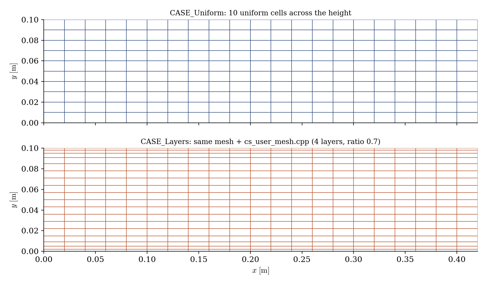
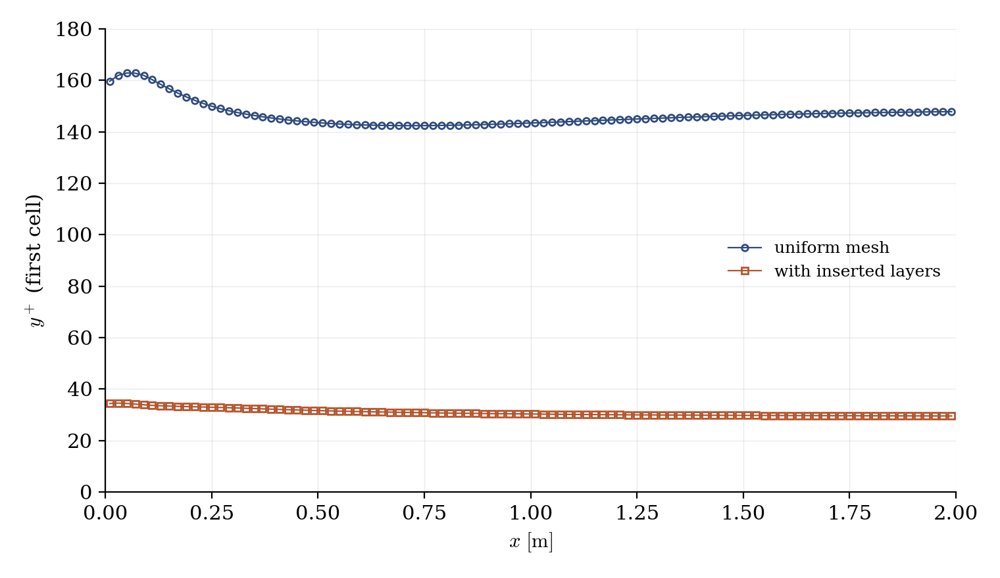

# Boundary-Layer Insertion (Prism Layers at the Walls)

A step-by-step tutorial for the **boundary-layer insertion** operation of **code_saturne**: starting from a mesh with no near-wall refinement, `cs_mesh_boundary_layer_insert` deflates the interior mesh away from selected walls and fills the freed space with **layers of prisms**, at run time. This is the rescue tool for meshes that arrive without boundary layers (imported geometries, quick cartesian blocks). Two cases are shipped, identical but for one file: the 25-line user routine that inserts the layers.

Unlike face joining or extrusion, this operation has **no GUI page** in this version: it lives in `cs_user_mesh.cpp` (the `cs_user_mesh_modify` function). Everything else in the case remains GUI-configured.

Maintained by [Simvia](https://Simvia.tech/fr), part of the
[tutoriel-code_saturne](https://gitlab.com/Simvia/common-tools/tutoriel-code_saturne) collection.

## Learning objectives

After completing this tutorial you will be able to:

1. Insert **prism layers** on selected walls from `cs_user_mesh_modify` (the `extrude_face_info` → `extrude_vectors` → `boundary_layer_insert` API trio).
2. Choose the layer parameters (number, total thickness, expansion factor) and avoid the sign trap of the expansion semantics.
3. Check the operation: insertion report in the log, mesh inspection, near-wall cell size before/after.

## Prerequisites

| Requirement | Detail |
|---|---|
| code_saturne | **v9.1** |
| Tutorial | [Pre_Face_Joining](../Pre_Face_Joining) (the 05_preprocessing workflow: preprocessing runs, reading the mesh reports) |

If code_saturne is not yet installed, build it from the
[official homepage](https://www.code-saturne.org/cms/web/Download), pull a
ready-to-use Singularity image from the
[Open Simulation Center](https://open-simulation-center.org/downloads/code_saturne/code_saturne),
or pull the
[Simvia Docker image](https://hub.docker.com/r/Simvia/code_saturne) before continuing.

## Case files

```
Pre_Boundary_Layer/
├── CASE_Uniform/
│   └── DATA/setup.xml        # coarse uniform mesh, no SRC
├── CASE_Layers/
│   ├── DATA/setup.xml        # identical
│   └── SRC/cs_user_mesh.cpp  # THE difference: 4 layers on the walls
├── FIGURES/                  # figures used in this README
└── README.md
```

> The mesh is generated by the built-in cartesian mesher; the two `setup.xml` are identical (only the case name differs). The whole operation is the one routine.

## The case

The support flow is deliberately unremarkable: a turbulent air channel ($0.1 \times 2$ m, $10$ m/s, $k$-$\varepsilon$ with wall functions) on a coarse $100 \times 10$ cartesian mesh: $10$ uniform cells across the height, so a wall-adjacent cell of $10$ mm. The routine inserts, on both walls:

- **4 layers** over a **total thickness of 15 mm** with an **expansion factor of 0.7**;
- the wall selection reuses the same criteria string as the boundary condition (`Y0 or Y1`).

One semantic trap is worth the detour: the expansion factor is the ratio between *successive layers along the insertion direction*, which runs from the deflated interior surface **toward the wall**. A factor **below one** therefore puts the thinnest layer against the wall ($\approx 2$ mm here); a factor above one would put it against the interior, the opposite of a boundary layer.

### Sizing the layers

The layer widths form a geometric sequence: first width $a$ on the interior side, then $ar, ar^2, \dots, ar^{\,n-1}$ down to the wall. The two useful relations, with $e_{tot}$ the total thickness (the API argument) and $e_{wall}$ the wall-adjacent width (what you are after):

$$
e_{tot} = a\,\frac{1 - r^{\,n}}{1 - r},
\qquad
e_{wall} = a\,r^{\,n-1}
$$

In practice you know the interior cell size $h$ and the wall width $e_{wall}$ you want; taking $a \approx h$ for size continuity at the layer/interior junction, choose the number of layers $n$ and the two API parameters follow:

$$
r = \Big(\frac{e_{wall}}{h}\Big)^{\frac{1}{n-1}},
\qquad
e_{tot} = h\,\frac{1 - r^{\,n}}{1 - r}
$$

Here: $h \approx 7$ mm (the 10 interior cells share the height minus the two inserted thicknesses), target $e_{wall} = 2$ mm, $n = 4$ → $r = (2/7)^{1/3} \approx 0.7$ and $e_{tot} \approx 15$ mm, the values in the routine. Note that $h$ itself shrinks a little when the layers take their room (the deflation), so one quick iteration of these formulas is enough to converge the design.

Two safeguards are worth knowing: the `min_volume_factor` argument (here $0.2$) limits how much the deflation may squeeze any interior cell, and the deflation displacement is solved as a CDO mesh-deformation problem at startup (a few extra lines in the log, negligible cost).

## Running the simulation

The commands below start from the tutorial directory:

```bash
cd Pre_Boundary_Layer/
```

Run both cases (GUI: open each `setup.xml` and use the Run button; the routine in `SRC/` is compiled automatically):

```bash
cd CASE_Uniform
code_saturne run --id uniform

cd ../CASE_Layers
code_saturne run --id layers
```

In the `CASE_Layers` log, the insertion reports itself during mesh preparation:

```
Extrusion: 200 boundary faces selected.
           800 cells added.
```

and the mesh summary goes from $1000$ cells (`CASE_Uniform`) to $1800$. A mesh-preprocessing-only run (`code_saturne run --initialize`) is the natural first step here too, to inspect the modified mesh before computing.

## Results

<p align="center">
  
  <br>
  <em>Figure 1: the mesh near the inlet, before (top) and after (bottom) the insertion. The interior mesh is deflated away from the walls and four layers of thickness ratio $0.7$ fill the freed $15$ mm, the thinnest ($\approx 2$ mm) against each wall.</em>
</p>

<p align="center">
  
  <br>
  <em>Figure 2: the practical effect, read through the standard indicator of near-wall resolution: the first-cell $y^+$ drops from $\approx 146$ to $\approx 30$, i.e. into the range wall functions are designed for.</em>
</p>

## Summary

This tutorial inserted prism layers on the walls of an existing mesh with `cs_mesh_boundary_layer_insert`, driven by a 25-line `cs_user_mesh_modify` routine, the only difference between the two shipped cases (this operation has no GUI page in this version). Key facts to remember: the wall selection is an ordinary criteria string, the expansion factor must be **below one** for the thinnest layer to land against the wall, and the log reports the operation (`800 cells added`). The near-wall cell size drops by a factor of five, as Figure 2 shows on the $y^+$ indicator.

## References

- [code_saturne documentation](https://www.code-saturne.org/cms/web/documentation)

## Authors

[Simvia](https://Simvia.tech/fr) - Questions, remarks and requests are welcome.
