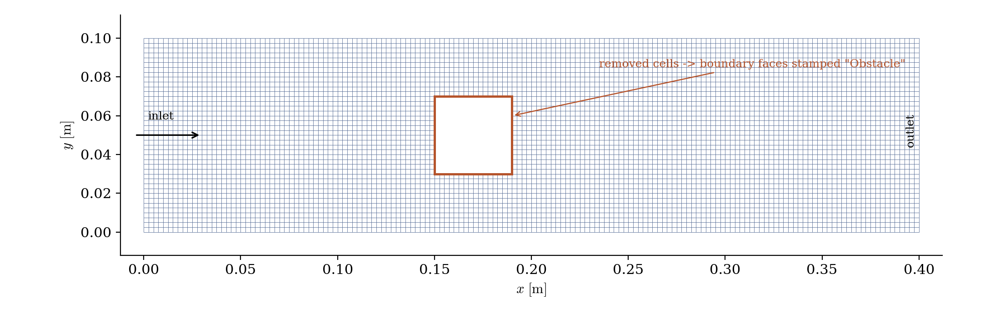
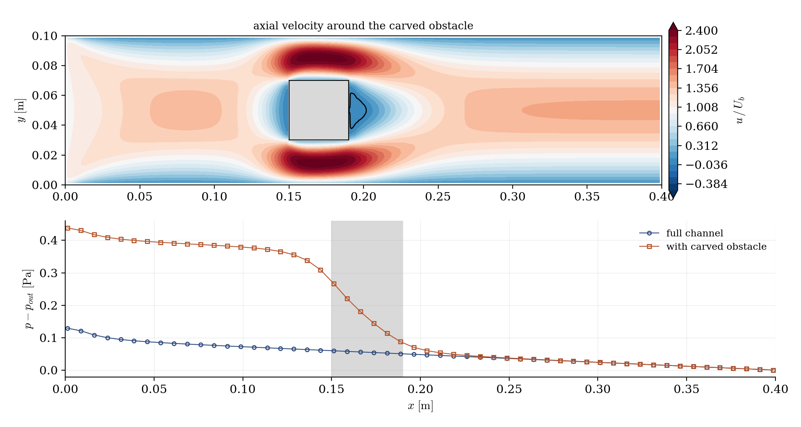

# Cell Removal (Carving an Obstacle Out of the Mesh)

A step-by-step tutorial for the **cell removal** operation of **code_saturne**: deleting the cells of a selected region at run time, the faces freed by the removal becoming boundary faces. This is the quickest way to put an obstacle in an existing mesh (no remeshing, no CAD round-trip: one selection criteria), and the same function is the rescue tool for amputating degenerate cells from an imported mesh. Two cases are shipped, identical but for one file: the 10-line routine that carves a square obstacle out of a channel.

Like the other `cs_user_mesh_modify` operations of this section, cell removal has **no GUI page** in this version; everything else in the case remains GUI-configured.

Maintained by [Simvia](https://Simvia.tech/fr), part of the
[tutoriel-code_saturne](https://gitlab.com/Simvia/common-tools/tutoriel-code_saturne) collection.

## Learning objectives

After completing this tutorial you will be able to:

1. Remove a selected cell region with `cs_mesh_remove_cells_from_selection_criteria`, and give the freed boundary faces a **group name** directly (unlike the thin-wall insertion, which leaves its faces anonymous).
2. Check the operation in the log: cell count, and the new boundary zone with its exact face count and surface.
3. Know the second use of the same function: **amputating degenerate cells** from a damaged imported mesh (flag-array variant).

## Prerequisites

| Requirement | Detail |
|---|---|
| code_saturne | **v9.1** |
| Tutorial | [Pre_Thin_Wall](../Pre_Thin_Wall) (the surface counterpart: obstacles of zero thickness) |

If code_saturne is not yet installed, build it from the
[official homepage](https://www.code-saturne.org/cms/web/Download), pull a
ready-to-use Singularity image from the
[Open Simulation Center](https://open-simulation-center.org/downloads/code_saturne/code_saturne),
or pull the
[Simvia Docker image](https://hub.docker.com/r/Simvia/code_saturne) before continuing.

## Case files

```
Pre_Cell_Removal/
├── CASE_Full/
│   └── DATA/setup.xml        # plain channel, no SRC
├── CASE_Carved/
│   ├── DATA/setup.xml        # identical + the Obstacle wall zone
│   └── SRC/cs_user_mesh.cpp  # THE difference: carve the obstacle
├── FIGURES/                  # figures used in this README
└── README.md
```

> Built-in cartesian mesher. The `setup.xml` differ only by the `Obstacle` wall zone, which selects the group **by name**: the removal stamps it on the faces it creates.

## The case

The support flow is a laminar channel ($0.4 \times 0.1$ m, $160 \times 40$ cells of $2.5$ mm, uniform inlet at $U_b = 0.2$ m/s). The routine removes the cells of a $40 \times 40$ mm square block in the middle:

```c
cs_mesh_remove_cells_from_selection_criteria(mesh,
                                             "box[0.15, 0.03, -0.01, 0.19, 0.07, 0.02]",
                                             "Obstacle");
```

The third argument is the point to remember: the faces freed by the removal are stamped with the given **group name**, so the boundary-condition zone selects `Obstacle` like any named group: no geometric selection needed this time (contrast with [Pre_Thin_Wall](../Pre_Thin_Wall), where the created faces stay anonymous).

The log carries the verification: the mesh drops from $6\,400$ to $6\,144$ cells ($256$ removed), and the boundary-zone summary shows `Obstacle` with $64$ faces (the $4 \times 16$ perimeter) and the exact surface of the four flanks.

<p align="center">
  
  <br>
  <em>Figure 1: the carved mesh. The cells of the orange square are gone; the faces freed by the removal are boundary faces carrying the `Obstacle` group.</em>
</p>

### The second use: amputating bad cells

The same operation exists in a flag-array form, `cs_mesh_remove_cells(mesh, flag, group)`, where the user marks any cells to delete: this is the rescue tool for imported meshes carrying a few degenerate cells (near-zero volume, extreme non-orthogonality, typically spotted with the `cs_mesh_bad_cells` criteria) that would poison or crash the run. Keep its consequence in mind: the hole left by the amputation becomes a wall inside the domain, so it is only acceptable where removing the cells is physically harmless.

## Running the simulation

The commands below start from the tutorial directory:

```bash
cd Pre_Cell_Removal/
```

Run both cases (GUI: open each `setup.xml` and use the Run button; the routine in `SRC/` is compiled automatically):

```bash
cd CASE_Full
code_saturne run --id full

cd ../CASE_Carved
code_saturne run --id carved
```

## Results

<p align="center">
  
  <br>
  <em>Figure 2: top, axial velocity: the flow splits around the carved obstacle, accelerates to about $2.5\,U_b$ in the passages and leaves a small steady recirculation behind it; bottom, pressure along the channel: the extra loss is concentrated across the obstacle (shaded), more than tripling the full-channel value.</em>
</p>

The checks behave as expected: the flow rate is identical upstream and downstream of the obstacle, the passage velocities match the blocked section, and the obstacle behaves exactly like a meshed body: because after the removal, it is one.

## Summary

This tutorial carved a square obstacle out of an existing channel mesh with a one-call routine: `cs_mesh_remove_cells_from_selection_criteria` deletes the selected cells and stamps a group name on the boundary faces it creates, so the wall zone selects `Obstacle` by name. The log verifies the surgery (cell count, zone face count and surface), and the flow responds as around any meshed body. The flag-array variant of the same function is the amputation tool for degenerate cells in damaged imported meshes, to be used only where the hole it leaves is physically harmless.

## References

- [code_saturne documentation](https://www.code-saturne.org/cms/web/documentation)

## Authors

[Simvia](https://Simvia.tech/fr) - Questions, remarks and requests are welcome.
