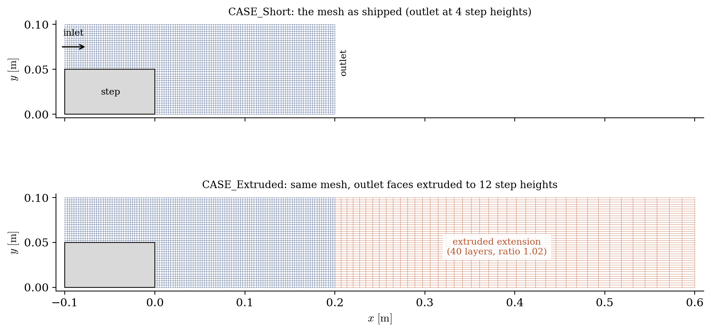
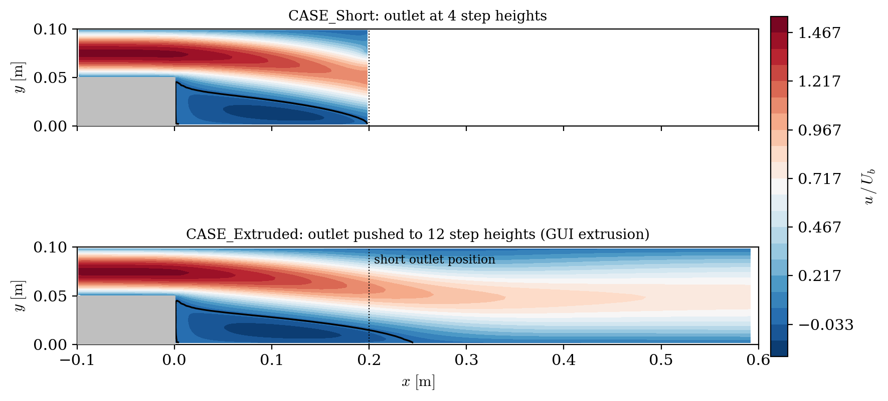
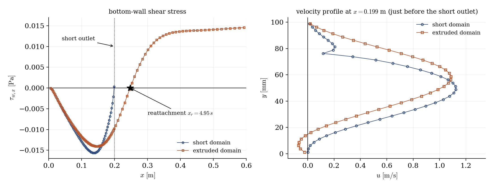

# Outlet Extrusion (Extending a Domain Without Remeshing)

A step-by-step tutorial for the **boundary-face extrusion** of **code_saturne**: extending a computational domain by extruding some of its boundary faces, directly from the GUI, without touching the original mesh. The use case is a classic of everyday CFD: an **outlet placed too close to a recirculation**. The backward-facing step shipped here has its outlet at only 4 step heights; the extrusion pushes it to 12, and the two shipped cases (identical but for the extrusion node) show what the short domain does to the solution.

Maintained by [Simvia](https://Simvia.tech/fr), part of the
[tutoriel-code_saturne](https://gitlab.com/Simvia/common-tools/tutoriel-code_saturne) collection.

## Learning objectives

After completing this tutorial you will be able to:

1. Extrude selected boundary faces from the GUI (**Mesh** section: selection criteria, number of layers, thickness, geometric ratio) to extend a domain.
2. Know what happens to the boundary groups: the extruded end keeps its group (the outlet stays the outlet), and the new lateral faces inherit the groups of their neighbours (the wall extensions stay walls), so **the boundary conditions need no change**.
3. Recognize the symptoms of an outlet placed too close: backflow warnings in the log, and a solution distorted well upstream of the outlet.

## Prerequisites

| Requirement | Detail |
|---|---|
| code_saturne | **v9.1** |
| gmsh | only to regenerate the mesh (the `.geo` source and `.msh` file are shipped) |

If code_saturne is not yet installed, build it from the
[official homepage](https://www.code-saturne.org/cms/web/Download), pull a
ready-to-use Singularity image from the
[Open Simulation Center](https://open-simulation-center.org/downloads/code_saturne/code_saturne),
or pull the
[Simvia Docker image](https://hub.docker.com/r/Simvia/code_saturne) before continuing.

## Case files

```
Pre_Extrude_Outlet/
├── CASE_Short/
│   └── DATA/setup.xml       # the mesh as it comes: outlet at 4 step heights
├── CASE_Extruded/
│   └── DATA/setup.xml       # identical + the extrusion node (outlet at 12)
├── MESH/
│   └── step_channel.geo/.msh  # backward-facing step, short outlet section
├── FIGURES/                 # figures used in this README
└── README.md
```

> The two `setup.xml` differ only by the `extrusion` node: diff them. No user routine.

## The case

The support flow is a laminar backward-facing step (step height $s = 0.05$ m, expansion ratio 1:2, $Re = 200$ on the outlet height): a parabolic profile enters the upper channel, separates at the step, and reattaches a few step heights downstream. The shipped mesh stops at **4 step heights**: too short for the recirculation, which is the point.

`CASE_Extruded` fixes it from the GUI (**Mesh** section, extrusion): the faces selected by the `Outlet` criteria are extruded over **40 layers and 0.4 m** with a geometric ratio of $1.02$ (first layer close to the local cell size, growing toward the new outlet). Two things make the operation painless:

- the extruded end faces **keep their group**: the new far plane is still `Outlet`;
- the lateral faces created along the way **inherit the groups of the adjacent boundary faces**: the extensions of the top and bottom walls are still `Wall`, the spanwise sides still `Sym`.

The boundary-condition section of the setup is therefore strictly identical in both cases. In the log, the operation reports itself at mesh preparation: `Extrusion: 40 boundary faces selected. 1600 cells added.`

<p align="center">
  
  <br>
  <em>Figure 1: geometry and mesh of the two cases. The original mesh (blue) stops at 4 step heights; the extrusion (orange) extends it to 12, with layers growing geometrically toward the new outlet.</em>
</p>

## Running the simulation

The commands below start from the tutorial directory:

```bash
cd Pre_Extrude_Outlet/
```

Run both cases (GUI: open each `setup.xml`, the extrusion parameters are in the **Mesh** section, then the Run button):

```bash
cd CASE_Short
code_saturne run --id short

cd ../CASE_Extruded
code_saturne run --id extruded
```

The short run litters its log with messages such as

```
Incoming flow detained for 1 out of 40 outlet faces (time step 163)
```

(the recirculation tries to re-enter through the outlet, and the code clips it); the extruded run prints none.

## Results

<p align="center">
  
  <br>
  <em>Figure 2: axial velocity and zero-velocity contour (black). In the extruded domain (bottom), the recirculation closes at about 5 step heights, beyond the position of the short outlet (dotted line): the short domain (top) simply cannot contain it.</em>
</p>

<p align="center">
  
  <br>
  <em>Figure 3: left, bottom-wall shear stress: the short domain forces the reattachment against its outlet, while the extruded one reattaches freely (star); right, velocity profile just before the short-outlet position: the two solutions differ strongly, and the short-domain profile carries the kink of the backflow clipping near the top wall.</em>
</p>

The comparison speaks for itself: the recirculation of the extruded case closes at about $5$ step heights, past the short outlet, so the short domain squeezes it against its exit boundary (about $20\%$ short on the reattachment length). The contamination is not confined to the last cells: the velocity profiles differ visibly a full step height upstream of the short outlet. Pushing the outlet away with the extrusion, at the cost of a few seconds in the GUI and $40\%$ more cells, removes the warnings and frees the solution.

## Summary

This tutorial extended a too-short backward-facing-step domain by extruding its outlet faces from the GUI: 40 layers over 0.4 m, boundary conditions untouched since the extruded end keeps its group and the lateral faces inherit their neighbours'. The short domain shows the symptoms to recognize (backflow warnings at the outlet, recirculation squeezed against the exit, solution distorted upstream); the extruded one lets the recirculation close freely.

## References

- [code_saturne documentation](https://www.code-saturne.org/cms/web/documentation)

## Authors

[Simvia](https://Simvia.tech/fr) - Questions, remarks and requests are welcome.
