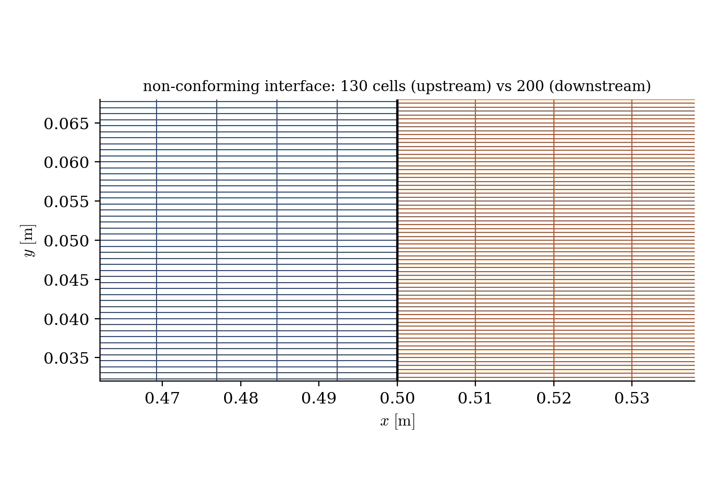
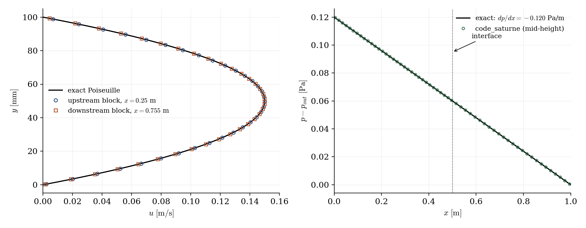

# Face Joining (Non-Conforming Mesh Assembly)

A step-by-step tutorial for the **face joining** operation of **code_saturne**: assembling a computational domain from several independently meshed blocks whose interfaces do not match. A channel is split into two blocks (130 faces against 200 at the interface), glued at run time, and a Poiseuille flow is pushed through the junction to check that the assembly behaves like a single mesh.

Maintained by [Simvia](https://Simvia.tech/fr), part of the
[tutoriel-code_saturne](https://github.com/simvia-tech/tutorials-code_saturne) collection.

## Learning objectives

After completing this tutorial you will be able to:

1. Assemble a case from **several mesh files** (`meshes_list`) and glue them with a **face joining** operation (selection criteria, fraction, plane angle).
2. Run the **mesh preprocessing mode** first, and read the joining report in the log before spending any solver time.
3. Check the effect of a non-conforming junction on a flow that crosses it.

## Prerequisites

| Requirement | Detail |
|---|---|
| code_saturne | **v9.1** |
| gmsh | only to regenerate the meshes (the `.geo` sources and `.msh` files are shipped) |

If code_saturne is not yet installed, build it from the
[official homepage](https://www.code-saturne.org/cms/web/Download), pull a
ready-to-use Singularity image from the
[Open Simulation Center](https://open-simulation-center.org/downloads/code_saturne/code_saturne),
or pull the
[Simvia Docker image](https://hub.docker.com/r/Simvia/code_saturne) before continuing.

## Case files

```
Pre_Face_Joining/
├── CASE/
│   └── DATA/setup.xml              # meshes_list (2 blocks) + face joining
├── MESH/
│   ├── channel_upstream.geo/.msh   # 0 < x < 0.5 m,  65 x 130 cells
│   └── channel_downstream.geo/.msh # 0.5 < x < 1 m,  50 x 200 cells
├── FIGURES/                        # figures used in this README
└── README.md
```

The two blocks are generated by the shipped gmsh `.geo` sources (`gmsh <file>.geo -3 -format msh41 -o <file>.msh`): structured quadrangles, one cell thick, with named groups (`Inlet`, `Outlet`, `Wall`, `Sym`, and the interface groups `JoinA` / `JoinB`).

## The case

The support flow is a laminar Poiseuille channel ($H = 0.1$ m, $L = 1$ m, $Re = 10$): the exact parabolic profile ($u_{max} = 0.15$ m/s, $dp/dx = -0.12$ Pa/m) is imposed at the inlet and used as initialization, so any disturbance appearing downstream can be traced to the junction.

The two blocks meet at $x = 0.5$ m with **130 faces against 200**: a 20:13 pattern, so that edges only coincide every tenth upstream line (more demanding than a nesting ratio such as 1:2, where every coarse face is exactly covered by fine ones). The joining intersects the two face sets and builds a conforming set of sub-faces. Its parameters, in the GUI **Mesh** section: the **selection criteria** (`JoinA or JoinB`), and the shortest-edge **fraction** ($0.1$) and maximum **plane angle** ($25°$), these two at their default values.

After the joining, `JoinA`/`JoinB` no longer exist as boundary zones: their faces have become interior faces. The remaining boundaries are the inlet, the outlet, the walls (the `Wall` group exists in both files and merges into one zone) and the spanwise symmetries.

## Running the simulation

The commands below start from the tutorial directory:

```bash
cd Pre_Face_Joining/
```

The recommended workflow on any joining case has two steps: run the **mesh preprocessing alone** first and inspect the joining report, then run the computation.

```bash
code_saturne gui CASE/DATA/setup.xml &
```

The mesh assembly lives in **Mesh**: the list of mesh files, and the **Face joining** page. To run the preprocessing alone, open the run window (gear button) and select the **mesh preprocessing only** run type; switch back to the standard run type for the computation (a few seconds, serial).

In the preprocessing run, the joining reports itself in `run_solver.log`:

- the parameters are echoed (`Selection criteria: "JoinA or JoinB"`, fraction, plane);
- `Global number of border faces to add: 0` and zero cleaned degenerate faces: every interface face found its counterpart;
- the boundary-zone summary lists `Inlet` (130 faces), `Outlet` (200), `Walls` (230), and **no JoinA/JoinB zone**.

The `postprocessing/` directory of this run also contains a `JOINING` EnSight case showing the sub-faces built at the interface. The computation itself redoes the joining at startup, so the preprocessing run is a checkpoint, not a prerequisite.

## Results

<p align="center">
  
  <br>
  <em>Figure 1: the interface at $x = 0.5$ m (close-up around mid-height): 130 upstream faces meet 200 downstream faces.</em>
</p>

<p align="center">
  
  <br>
  <em>Figure 2: left, velocity profiles in the upstream ($x = 0.25$ m) and downstream ($x = 0.755$ m) blocks, both on the exact parabola; right, mid-height pressure, linear through the interface.</em>
</p>

The junction is essentially invisible in the solution. The velocity profiles extracted on either side of the interface are indistinguishable from the exact parabola, with no distortion in the cells adjacent to the junction; the mid-height pressure stays on a single straight line through the interface, with no jump and no change of slope; and the flow rate leaving the upstream block is recovered in the downstream one. In other words, once joined, the two blocks behave as one mesh.

## Summary

This tutorial assembled a channel from two independently meshed blocks with mismatched interface resolutions (130 vs 200 faces) using the face joining operation, entirely from the GUI (`meshes_list` + joining criteria). The mesh preprocessing mode provides the checkpoint: joining report in the log, no residual interface boundary faces, and a visualization of the built sub-faces. The Poiseuille flow pushed through the junction confirms the assembly behaves like a single mesh: profiles on the exact parabola on both sides, pressure linear through the interface, flow rate conserved.

## References

- [code_saturne documentation](https://www.code-saturne.org/cms/web/documentation)

## Authors

[Simvia](https://Simvia.tech/fr) - Questions, remarks and requests are welcome.
