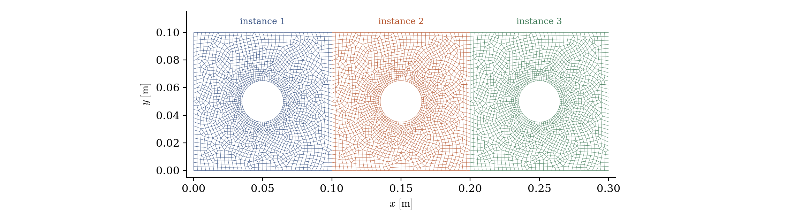
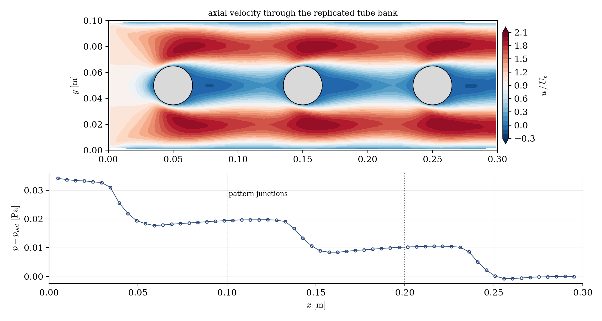

# Mesh Replication (One Pattern, Read N Times)

A step-by-step tutorial for the **mesh input transformations** of **code_saturne**: reading the *same* mesh file several times, each instance with its own translation and group renames, to assemble a domain from a repeated pattern. This is the industrial reflex for periodic equipment (tube banks, heat-exchanger passes, fuel assemblies): mesh the pattern **once**, replicate it at run time. Here a single "tube in a channel segment" pattern becomes a three-tube bank: one `.msh`, three instances, two joinings.

Maintained by [Simvia](https://Simvia.tech/fr), part of the
[tutoriel-code_saturne](https://gitlab.com/Simvia/common-tools/tutoriel-code_saturne) collection.

## Learning objectives

After completing this tutorial you will be able to:

1. Read a mesh file several times with `cs_preprocessor_data_add_file` (`cs_user_mesh_input`): homogeneous transformation matrix, and **group renames** per instance.
2. Combine the replication with **face joinings** to glue the instances into one domain ([Pre_Face_Joining](../Pre_Face_Joining) is the prerequisite skill).
3. Check the assembly in the log: the file read N times, the renamed zones, the merged shared groups.

## Prerequisites

| Requirement | Detail |
|---|---|
| code_saturne | **v9.1** |
| Tutorial | [Pre_Face_Joining](../Pre_Face_Joining) (face joining, reading the preprocessing report) |
| gmsh | only to regenerate the pattern (the `.geo` source and `.msh` are shipped) |

If code_saturne is not yet installed, build it from the
[official homepage](https://www.code-saturne.org/cms/web/Download), pull a
ready-to-use Singularity image from the
[Open Simulation Center](https://open-simulation-center.org/downloads/code_saturne/code_saturne),
or pull the
[Simvia Docker image](https://hub.docker.com/r/Simvia/code_saturne) before continuing.

## Case files

```
Pre_Mesh_Replication/
├── CASE/
│   ├── DATA/setup.xml       # pattern listed ONCE + the two joinings
│   └── SRC/cs_user_mesh.cpp # three reads, translated and renamed
├── MESH/
│   └── tube_pattern.geo/.msh  # THE pattern: one tube in a channel segment
├── FIGURES/                 # figures used in this README
└── README.md
```

## The case

The pattern is a $0.1 \times 0.1$ m channel segment crossed by a tube ($D = 30$ mm), meshed once (unstructured quadrangles, refined on the tube, $2\,007$ cells) with groups `Left`, `Right`, `Walls`, `Tube`, `Sym`. The assembly plays in two places:

**The staging trick.** The GUI lists `tube_pattern.msh` once, as any case would: the staging step converts it to `mesh_input.csm` in the execution directory. The routine then **replaces** this default input: the first `cs_preprocessor_data_add_file` call overrides it, the following ones append. Each call reads the same `mesh_input.csm` with its own transformation (translations of $0$, $0.1$, $0.2$ m) and its own renames:

| Instance | `Left` becomes | `Right` becomes |
|---|---|---|
| 1 | `Inlet` | `R1` |
| 2 | `L2` | `R2` |
| 3 | `L3` | `Outlet` |

Groups that are **not** renamed (`Walls`, `Tube`, `Sym`) keep their name in every instance and merge into single zones: one wall boundary condition covers the three tubes.

**The gluing.** The internal interfaces are joined by two face joinings defined in the GUI (`R1 or L2` and `R2 or L3`), exactly as in [Pre_Face_Joining](../Pre_Face_Joining): here the two sides even match node for node (same mesh, translated), the easy case.

<p align="center">
  
  <br>
  <em>Figure 1: the assembled mesh, one color per instance: the same 2007-cell pattern, read three times.</em>
</p>

The log carries the whole story: `Reading file: mesh_input.csm` printed **three times**, the assembled mesh at $3 \times 2\,007 = 6\,021$ cells, the boundary-zone list showing `Inlet` and `Outlet` ($34$ faces each), the merged `Tube` zone ($192$ faces, three tubes), and no `R1`/`L2`/`R2`/`L3` zones left after the joinings.

## Running the simulation

The commands below start from the tutorial directory:

```bash
cd Pre_Mesh_Replication/
```

The support flow is laminar ($Re_D = 30$ on the tube, uniform inlet at $U_b = 0.1$ m/s). Run (GUI: open `setup.xml` and use the Run button; the routine in `SRC/` is compiled automatically):

```bash
cd CASE
code_saturne run --id replication
```

## Results

<p align="center">
  
  <br>
  <em>Figure 2: top, axial velocity through the bank: the flow accelerates to about twice the inlet velocity in the passages (the tube blocks $30\%$ of the height) and leaves a weak steady wake behind each tube; bottom, section-averaged pressure: a staircase with one drop per tube and plateaus in between.</em>
</p>

The flow reads like the assembly: the same jet-and-wake structure repeats behind each tube, and the pressure falls in three steps, one per pattern. The second and third patterns, which receive similar incoming profiles, drop nearly the same pressure (within about $5\%$); the first one pays in addition the development of the uniform inlet profile. Mass is conserved through the whole bank.

## Summary

This tutorial assembled a three-tube bank from a single pattern mesh: the GUI lists the pattern once, and a short `cs_user_mesh_input` routine reads the staged `mesh_input.csm` three times, each instance translated and its side groups renamed; two GUI face joinings glue the interfaces, and the unrenamed groups merge into shared zones. Mesh the pattern once, replicate at run time: the mesh file stays as small as its pattern, and changing the number of instances is a loop bound.

## References

- [code_saturne documentation](https://www.code-saturne.org/cms/web/documentation)

## Authors

[Simvia](https://Simvia.tech/fr) - Questions, remarks and requests are welcome.
