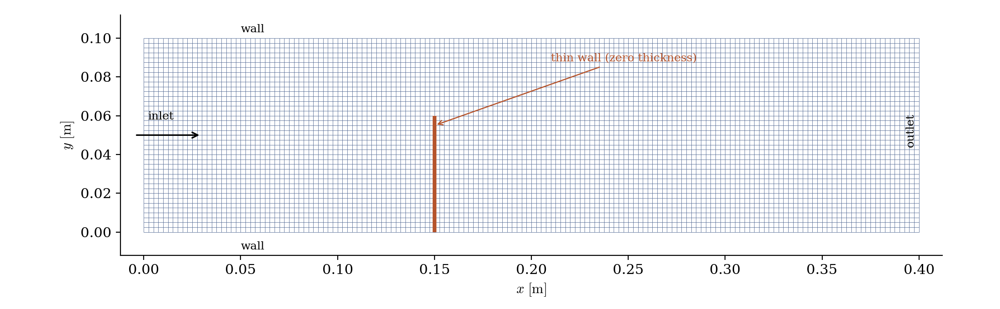
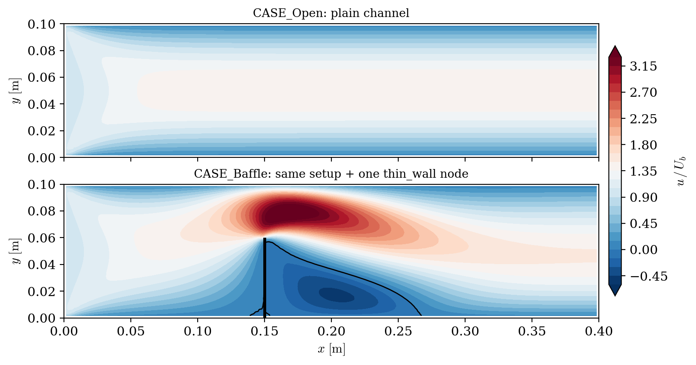
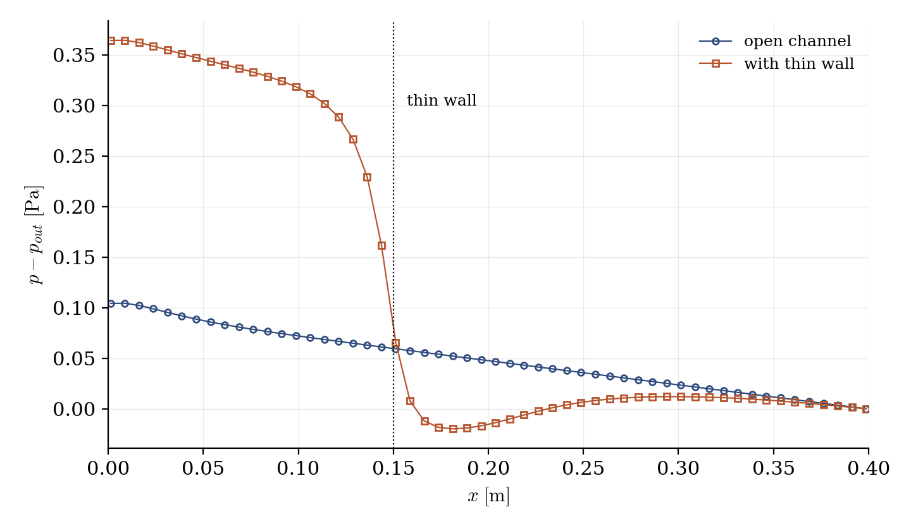

# Thin Wall Insertion (Zero-Thickness Baffle)

A step-by-step tutorial for the **thin wall** operation of **code_saturne**: turning a set of interior faces into a zero-thickness internal wall, directly from the GUI. This is how baffles, guide vanes or splitter plates enter a mesh **without being meshed as solids**: no thickness to resolve, no remeshing, one selection criteria. A channel is shipped in two versions, identical but for the thin-wall node: open, and with a baffle blocking the lower 60% of the height.

Maintained by [Simvia](https://Simvia.tech/fr), part of the
[tutoriel-code_saturne](https://gitlab.com/Simvia/common-tools/tutoriel-code_saturne) collection.

## Learning objectives

After completing this tutorial you will be able to:

1. Insert a **zero-thickness wall** on selected interior faces from the GUI (**Mesh** section, thin walls: one selection criteria).
2. Give the created faces a boundary condition: they carry **no group**, so the wall zone is selected **geometrically** (the same `plane[...]` criteria as the insertion).
3. Check the operation: the new boundary zone in the log (two back-to-back faces per selected interior face), flow blocked, mass conserved.

## Prerequisites

| Requirement | Detail |
|---|---|
| code_saturne | **v9.1** |
| Tutorial | [Pre_Face_Joining](../Pre_Face_Joining) (the 05_preprocessing workflow) |

If code_saturne is not yet installed, build it from the
[official homepage](https://www.code-saturne.org/cms/web/Download), pull a
ready-to-use Singularity image from the
[Open Simulation Center](https://open-simulation-center.org/downloads/code_saturne/code_saturne),
or pull the
[Simvia Docker image](https://hub.docker.com/r/Simvia/code_saturne) before continuing.

## Case files

```
Pre_Thin_Wall/
├── CASE_Open/
│   └── DATA/setup.xml     # plain channel
├── CASE_Baffle/
│   └── DATA/setup.xml     # identical + thin_wall node + its wall zone
├── FIGURES/               # figures used in this README
└── README.md
```

> Built-in cartesian mesher, no user routine. Diff the two `setup.xml`: the thin-wall node and the boundary zone it requires are the whole difference.

## The case

The support flow is a laminar channel ($0.4 \times 0.1$ m, $160 \times 40$ cells of $2.5$ mm, uniform inlet at $U_b = 0.2$ m/s). `CASE_Baffle` inserts a baffle at $x = 0.15$ m blocking the height from $y = 0$ to $0.06$ m, by selecting the interior faces of that plane:

```
plane[1, 0, 0, -0.15, epsilon = 0.0001] and y <= 0.0601
```

The criteria reads like the geometry: the **plane** ($x = 0.15$ m, in $ax+by+cz+d=0$ form) defines the sheet of faces, and the **extent bound** (`y <= 0.0601`) cuts the baffle at $60\%$ of the height (a full-height wall would use the plane alone). One trap: always give the plane an `epsilon` **smaller than the local cell size**. Its default is $10^{-2}$, i.e. $10$ mm here: four sheets of faces would match, each becoming its own zero-thickness wall, with the cells caught in between turned into sealed, meaningless fluid pockets.

The selection gives the wall no thickness: it only picks **existing interior faces** (the sheet whose centers sit at $x = 0.15$ m, the neighbouring sheets being one cell away), and the wall *is* that sheet. The mesh counters in the log say it all: the cell count is unchanged, $24$ interior faces disappear, $48$ boundary faces appear. The operation converts faces; it never solidifies volume (a thick obstacle is meshed as a hole in the geometry, not inserted this way).

Each selected interior face is split into **two back-to-back boundary faces** (one per side of the baffle). Two points deserve attention:

- the created faces carry **no group**: a boundary zone selected by name would miss them. The `Baffle` wall zone therefore reuses the **same geometric criteria** as the insertion: geometric selections work for boundary conditions too;
- the insertion is checked in the log: the `Baffle` zone lists $48$ faces for the $24$ selected interior faces, with the expected surface (both sides count).

<p align="center">
  
  <br>
  <em>Figure 1: geometry and mesh. The thin wall (orange) lives on existing interior faces: the mesh is untouched, only the connectivity across those faces is cut.</em>
</p>

## Running the simulation

The commands below start from the tutorial directory:

```bash
cd Pre_Thin_Wall/
```

Run both cases (GUI: open each `setup.xml`, the thin-wall criteria sits in the **Mesh** section, then the Run button):

```bash
cd CASE_Open
code_saturne run --id open

cd ../CASE_Baffle
code_saturne run --id baffle
```

## Results

<p align="center">
  
  <br>
  <em>Figure 2: axial velocity (normalized by the inlet velocity). The baffle forces the whole flow through the upper opening, where the velocity reaches about three times the inlet value; a recirculation (zero contour in black) fills the region behind the baffle.</em>
</p>

<p align="center">
  
  <br>
  <em>Figure 3: pressure along the channel (at the opening height). The baffle concentrates a pressure drop at the obstacle, roughly tripling the total loss of the open channel.</em>
</p>

The checks behave as expected: the flow rate is the same on every cross-section (upstream, through the opening, downstream), the mean velocity in the opening is the inlet value divided by the opening fraction, no flow crosses the baffle, and a recirculation develops behind it over about three opening heights.

## Summary

This tutorial inserted a zero-thickness baffle on interior faces from the GUI: one selection criteria in the thin-walls page, plus one wall zone selected by the same geometric criteria, since the created faces carry no group. The mesh itself is untouched: the operation only cuts the connectivity across the selected faces, and the flow responds as it should: blocked at the baffle, squeezed through the opening, recirculating behind, with the added pressure drop concentrated at the obstacle.

## References

- [code_saturne documentation](https://www.code-saturne.org/cms/web/documentation)

## Authors

[Simvia](https://Simvia.tech/fr) - Questions, remarks and requests are welcome.
