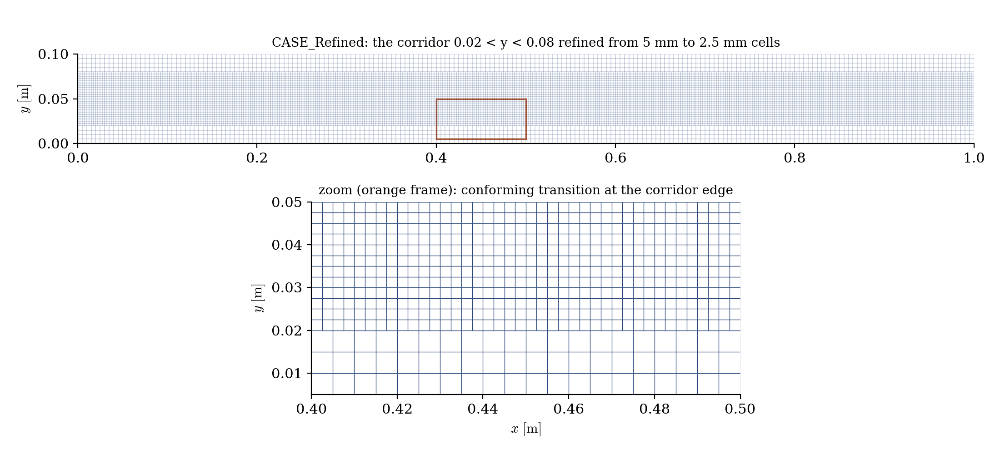
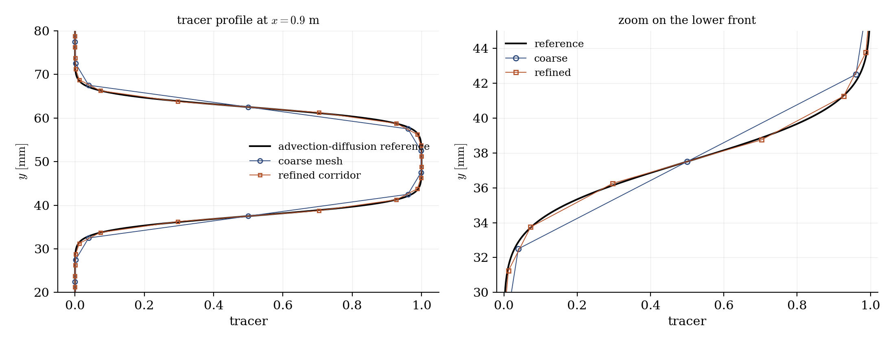

# Zone Refinement (Local Mesh Subdivision)

A step-by-step tutorial for the **local refinement** operation of **code_saturne**: subdividing the cells of a selected region at run time, leaving the rest of the mesh untouched. This is the tool for meshes that are fine enough everywhere except where something sharp happens: a plume, a front, a wake corridor. Two cases are shipped, identical but for one file: the user routine that refines the corridor carrying a tracer band.

Like the boundary-layer insertion, this operation has **no GUI page** in this version: it lives in `cs_user_mesh.cpp` (the `cs_user_mesh_modify` function). Everything else in the case remains GUI-configured.

Maintained by [Simvia](https://Simvia.tech/fr), part of the
[tutoriel-code_saturne](https://github.com/simvia-tech/tutorials-code_saturne) collection.

## Learning objectives

After completing this tutorial you will be able to:

1. Refine a selected cell zone from `cs_user_mesh_modify` (`cs_selector_get_cell_list` + `cs_mesh_refine_simple_selected`).
2. Know what the operation produces: each selected hexahedron split into $8$ children, and a **conforming transition** to the unrefined neighbourhood handled by the code.
3. See what local resolution buys on a sharp feature: a tracer front kept at its physical thickness instead of being smeared by the coarse cells.

## Prerequisites

| Requirement | Detail |
|---|---|
| code_saturne | **v9.1** |
| Tutorial | [Pre_Boundary_Layer](../Pre_Boundary_Layer) (the `cs_user_mesh_modify` entry point) |

If code_saturne is not yet installed, build it from the
[official homepage](https://code-saturne.org/), pull a
ready-to-use Singularity image from the
[Open Simulation Center](https://open-simulation-center.org/downloads/code_saturne/code_saturne),
or pull the
[Simvia Docker image](https://hub.docker.com/r/Simvia/code_saturne) before continuing.

## Case files

```
Pre_Zone_Refinement/
├── CASE_Coarse/
│   └── DATA/setup.xml        # uniform 5 mm mesh, no SRC
├── CASE_Refined/
│   ├── DATA/setup.xml        # identical
│   └── SRC/cs_user_mesh.cpp  # THE difference: refine the tracer corridor
├── FIGURES/                  # figures used in this README
└── README.md
```

> Built-in cartesian mesher, identical `setup.xml`. The whole operation is the one routine.

## The case

The support flow is deliberately trivial: a uniform stream ($1$ m/s, symmetry on all lateral faces, so no wall effect at all) carrying a **band of passive tracer** ($12.5$ mm wide, smooth edges) down a $1$ m channel, with a small diffusivity ($2 \times 10^{-6}\ \mathrm{m^2/s}$). Physically, the band edges spread into fronts a few millimetres thick: about the size of the $5$ mm cells of the base mesh, which therefore smears them numerically.

The routine refines the corridor containing the band ($0.02 < y < 0.08$, all along the channel):

- the selection is an ordinary cell criteria (`box[...]`, the volume counterpart of what the previous tutorials did with faces);
- `cs_mesh_refine_simple_selected` splits each selected hexahedron into $8$ children ($5$ mm → $2.5$ mm here), and the `conforming` flag lets the code build the transition cells at the corridor edge. The factor-of-two subdivision is built into the operation (there is no level argument): for deeper refinement, call the function again, redoing the cell selection between calls since the cell numbering changes;
- the log reports the operation (`Mesh before refinement` / `Mesh after refinement`), the mesh going from $4\,000$ to $24\,000$ cells.

<p align="center">
  
  <br>
  <em>Figure 1: the refined corridor (top) and a close-up of its edge (bottom): the selected cells are subdivided, and the transition to the untouched cells below is built by the code.</em>
</p>

## Running the simulation

The commands below start from the tutorial directory:

```bash
cd Pre_Zone_Refinement/
```

Run both cases (GUI: open each `setup.xml` and use the Run button; the routine in `SRC/` is compiled automatically):

```bash
cd CASE_Coarse
code_saturne run --id coarse

cd ../CASE_Refined
code_saturne run --id refined
```

## Results

<p align="center">
  
  <br>
  <em>Figure 2: tracer profile near the outlet ($x = 0.9$ m), against the advection-diffusion reference (the inlet band diffused over the travel time). The refined corridor follows the reference through the fronts; the coarse mesh cuts the corners and widens them.</em>
</p>

The effect is where it was expected: the $10$-$90\%$ front thickness measures $6.6$ mm on the reference, $6.9$ mm in the refined corridor, and $8.7$ mm on the coarse mesh, a third too wide. The band peak and the absence of undershoots are preserved in both cases; only the local resolution of the fronts changes, at the cost of refining $60\%$ of the domain instead of all of it.

## Summary

This tutorial refined a selected zone of an existing mesh at run time: one `cs_user_mesh_modify` routine selecting a cell box and calling `cs_mesh_refine_simple_selected` (no GUI page for this operation in this version). Each selected cell is split into $8$, the conforming transition at the zone edge is handled by the code, and the log reports the operation. On a tracer band crossing the domain, the refined corridor keeps the fronts at their physical thickness where the coarse mesh widens them by a third.

## References

- [code_saturne documentation](https://code-saturne.org/doc/)

## Authors

[Simvia](https://Simvia.tech/fr) - Questions, remarks and requests are welcome.
