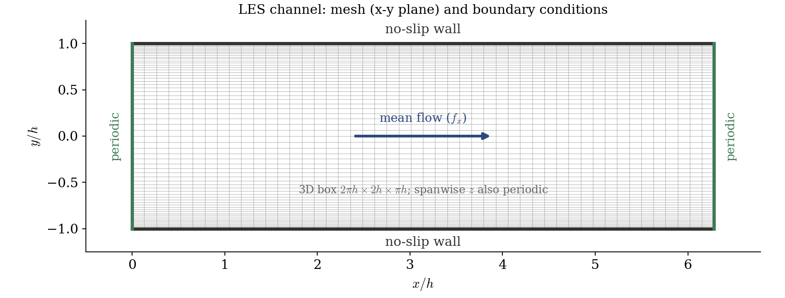
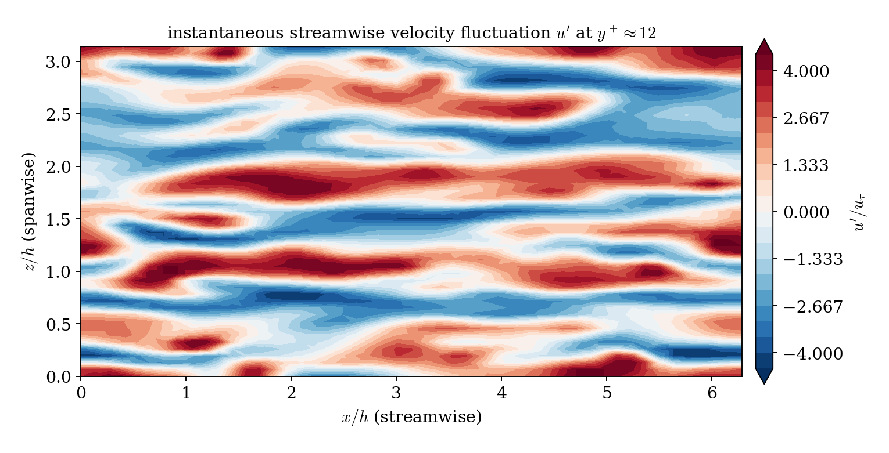
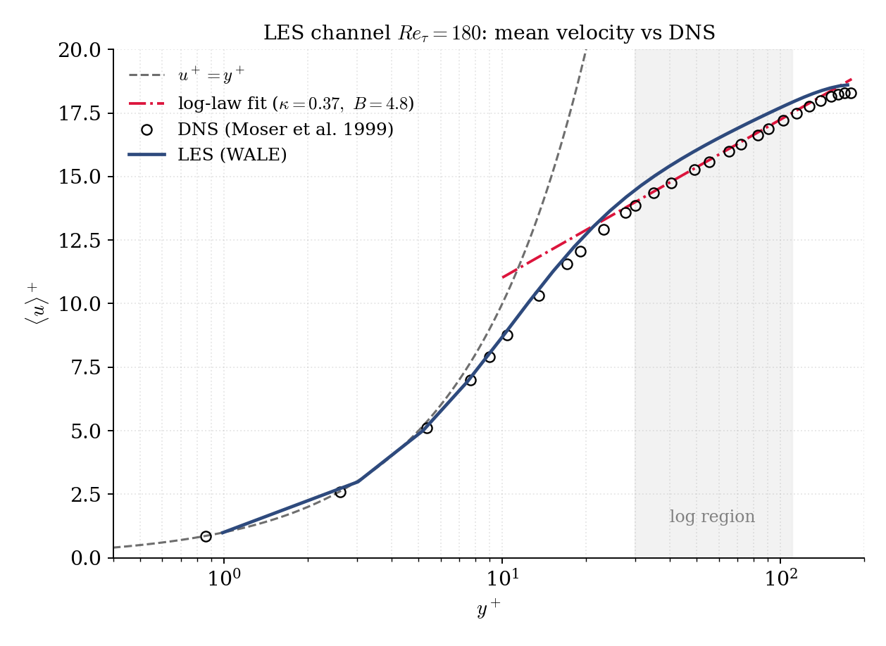
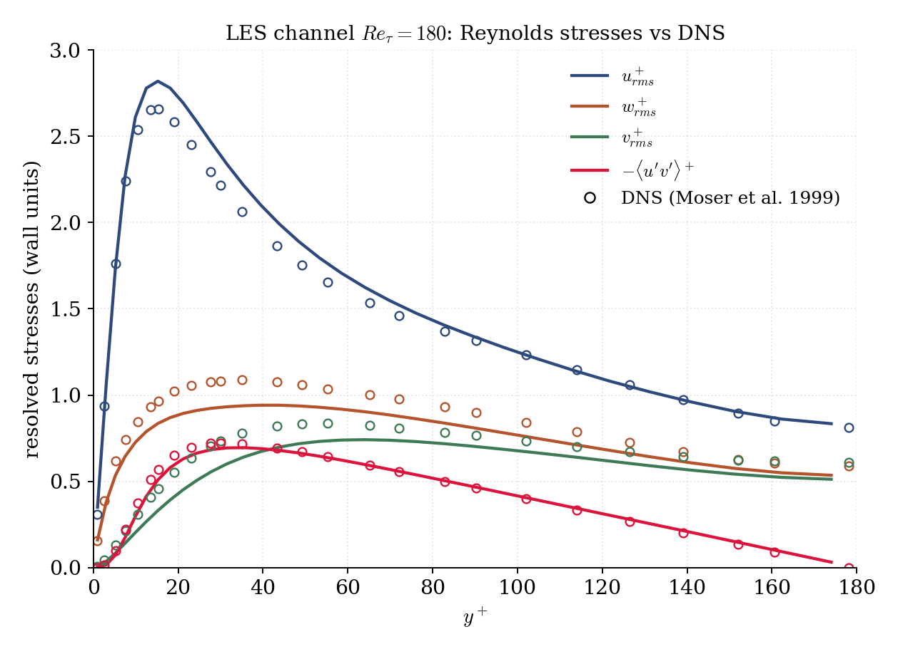

# Large-Eddy Simulation of a Turbulent Channel (WALE)

A step-by-step tutorial for **scale-resolving turbulence** in **code_saturne**: a wall-resolved **Large-Eddy Simulation (LES)** of the fully-developed turbulent channel at $Re_\tau = 180$. Where the RANS counterpart ([Inc_Turbulent_Channel](../Inc_Turbulent_Channel)) models all of the turbulence, the LES **resolves** the energy-containing eddies and models only the sub-grid scales. The tutorial's purpose is the LES workflow: a 3D periodic box driven by a momentum source, transition triggered from a perturbed field, and **time-averaged statistics** accumulated in-solver, validated against the law of the wall and the resolved Reynolds stresses.

Maintained by [Simvia](https://Simvia.tech/fr), part of the
[tutoriel-code_saturne](https://gitlab.com/Simvia/common-tools/tutoriel-code_saturne) collection.

## Learning objectives

After completing this tutorial you will be able to:

1. Set up a **wall-resolved LES** (WALE sub-grid model) on a 3D periodic box built with the built-in cartesian mesher.
2. Drive the flow with a constant **momentum source term** and **trigger transition** from a perturbed initial field.
3. Accumulate **time-averaged statistics** in-solver (mean velocity and the Reynolds stress tensor) with code_saturne's time moments.
4. Validate the mean profile against the **law of the wall** and inspect the **resolved Reynolds stresses** that an eddy-viscosity RANS model cannot represent.

## Prerequisites

| Requirement | Detail |
|---|---|
| code_saturne | **v9.1** |
| Tutorials | [Inc_Turbulent_Channel](../Inc_Turbulent_Channel) (the RANS counterpart, same driving), [Inc_Streamwise_Periodic](../../00_foundations/Inc_Streamwise_Periodic) |

If code_saturne is not yet installed, build it from the
[official homepage](https://www.code-saturne.org/cms/web/Download), pull a
ready-to-use Singularity image from the
[Open Simulation Center](https://open-simulation-center.org/downloads/code_saturne/code_saturne),
or pull the
[Simvia Docker image](https://hub.docker.com/r/Simvia/code_saturne) before continuing.

## Case files

```
Inc_LES_Channel/
├── CASE/
│   ├── DATA/setup.xml                    # cartesian box, periodicity, WALE LES
│   └── SRC/
│       ├── cs_user_source_terms.cpp      # constant streamwise body force f_x
│       ├── cs_user_initialization.cpp    # perturbed field to trigger turbulence
│       └── cs_user_parameters.cpp        # time-averaged statistics (moments)
├── FIGURES/
└── README.md
```

> No mesh file: the 3D box is built by the **built-in cartesian mesher**.

## Physical model

LES applies a spatial filter to the Navier-Stokes equations: the resolved
(large) scales are computed directly, and the unresolved sub-grid scales are
represented by a sub-grid viscosity. Here the **WALE** model (Nicoud and Ducros
1999) is used, which recovers the correct near-wall scaling without any ad hoc
damping, so the LES can be integrated **down to the wall**.

The channel is periodic in the streamwise ($x$) and spanwise ($z$) directions
and driven by a constant body force $f_x = \rho\,u_\tau^2/h$, exactly as in the
RANS channel: this fixes the friction Reynolds number by construction. Because
LES fields are instantaneous, the statistics (mean profile, Reynolds stresses)
are obtained by **time-averaging** once the flow is statistically steady, and
additionally by averaging over the two homogeneous directions ($x$, $z$).

The case is written in **wall units**: $h = 1$, $\rho = 1$, $u_\tau = 1$, so
$f_x = 1$ and $\nu = 1/Re_\tau$. Choosing $\nu = 1/180$ gives $Re_\tau = 180$.

### Flow and grid parameters

| Quantity | Symbol | Value |
|---|---|---|
| Friction Reynolds number | $Re_\tau$ | $180$ |
| Box size | $L_x \times 2h \times L_z$ | $2\pi h \times 2h \times \pi h$ |
| Grid | $n_x \times n_y \times n_z$ | $48 \times 64 \times 48$ |
| Streamwise resolution | $\Delta x^+$ | $\approx 24$ |
| Spanwise resolution | $\Delta z^+$ | $\approx 12$ |
| First cell (wall) | $\Delta y_1^+$ | $\approx 1$ |
| Sub-grid model | | WALE |

<p align="center">
  
  <br>
  <em>Figure 1: mesh ($x$-$y$ plane, in half-heights $h$) and boundary conditions: no-slip walls at $y = \pm h$, periodic in $x$ and $z$, driven by the momentum source $f_x$.</em>
</p>

## Numerical setup

| Setting | Value | Rationale |
|---|---|---|
| Sub-grid model | WALE, wall-resolved | resolves the near-wall turbulence |
| Convection scheme | 2nd-order centred | low numerical dissipation (essential for LES) |
| Time scheme | 2nd order | time-accurate |
| Time step | constant $\Delta t = 3.5\times10^{-3}$ | Courant number $\lesssim 1$ |
| Duration | $12000$ steps | transient + averaging |
| Statistics | time moments from step $5000$ | after the transient |
| Initialization | perturbed field (`cs_user_initialization`) | trigger transition |

A laminar start would stay laminar: `cs_user_initialization.cpp` superimposes
coherent perturbations and random noise on a plug profile to trigger transition,
after which the body force sustains the turbulence. The statistics are defined in
`cs_user_parameters.cpp` as two time moments: the mean velocity $\langle u\rangle$
and the variance (the Reynolds stress tensor $\langle u_i'u_j'\rangle$), started
at step 5000 once the flow is statistically steady.

## Running the simulation

```bash
cd CASE
code_saturne run --nprocs 4
```

The mesh is generated internally. LES is more expensive than the RANS case
(a longer, time-accurate run); parallel execution is recommended. The run writes
`CASE/RESU/<id>/` with the instantaneous fields and the time-averaged moments
`u_mean` and `u_variance` in `postprocessing/`.

## Results and verification

Once transition is complete, the near-wall region fills with the streamwise
**streaks** that are the signature of wall turbulence: alternating high- and
low-speed elongated structures, spaced about 100 wall units apart in the
spanwise direction. These are resolved by the LES, not modelled.

<p align="center">
  
  <br>
  <em>Figure 2: instantaneous streamwise fluctuation $u'$ at $y^+ \approx 12$. The elongated streaks (spaced $\approx 100$ wall units in $z$) are the resolved near-wall turbulence.</em>
</p>

<p align="center">
  
  <br>
  <em>Figure 3: mean velocity $\langle u\rangle^+$ versus $y^+$, LES against the DNS of Moser et al. (1999) at the same $Re_\tau$. At this low $Re_\tau$ there is no genuine log layer; the dash-dot line is a near-wall log-law fit drawn only to guide the eye (see discussion). The LES follows the DNS.</em>
</p>

<p align="center">
  
  <br>
  <em>Figure 4: resolved Reynolds stresses (lines) versus the Moser et al. (1999) DNS (circles). The near-wall peaks and the shear stress $-\langle u'v'\rangle^+$ are captured, structure an eddy-viscosity RANS model cannot resolve.</em>
</p>

The LES
agrees well with the DNS (Figures 3 and 4): the mean velocity matches through the
sublayer and buffer, with a small over-prediction in the outer layer (beyond
$y^+ \approx 40$) from the moderate grid, and the resolved stresses recover the
near-wall structure, the shear stress $-\langle u'v'\rangle^+$ peaking at about
$0.70$ (DNS $\approx 0.72$) and the streamwise fluctuation at about $2.8$ (DNS
$\approx 2.65$), with a slightly too-strong near-wall anisotropy.

The statistics are converged:
the top and bottom halves of every profile coincide to within a few percent
(thanks to the averaging over the two homogeneous directions), the practical
convergence check for the second-order moments. These residual differences from
the DNS are the expected footprint of the moderate grid; the
resolved streaks and Reynolds stresses are the point: scale-resolving turbulence
that the RANS model can only represent statistically.

## Summary

This tutorial ran a wall-resolved LES of the $Re_\tau = 180$ turbulent channel
on a 3D periodic box, driven by the same momentum source as the RANS channel,
with the WALE sub-grid model and 2nd-order numerics. Transition was triggered
from a perturbed field, and the statistics were accumulated in-solver as time
moments and averaged over the homogeneous directions. The LES resolves the
near-wall streaks and the anisotropic Reynolds stresses and matches the Moser et al. DNS
closely, including the low-Reynolds mean profile that departs from the standard
log law (no genuine log layer exists at $Re_\tau = 180$); the second-order moments
are converged, verified by the top/bottom symmetry of the profiles. The lesson that carries
beyond this case: LES resolves the turbulence RANS only models, at the price of a
3D, time-accurate, well-resolved and long-averaged computation.

## References

- R. D. Moser, J. Kim, N. N. Mansour. Direct numerical simulation of turbulent channel flow up to $Re_\tau = 590$, Physics of Fluids 11, 943-945, 1999.
- F. Nicoud, F. Ducros. Subgrid-scale stress modelling based on the square of the velocity gradient tensor, Flow, Turbulence and Combustion 62, 183-200, 1999.
- [code_saturne documentation](https://www.code-saturne.org/cms/web/documentation)

## Authors

[Simvia](https://Simvia.tech/fr). Questions, remarks and requests are welcome.
