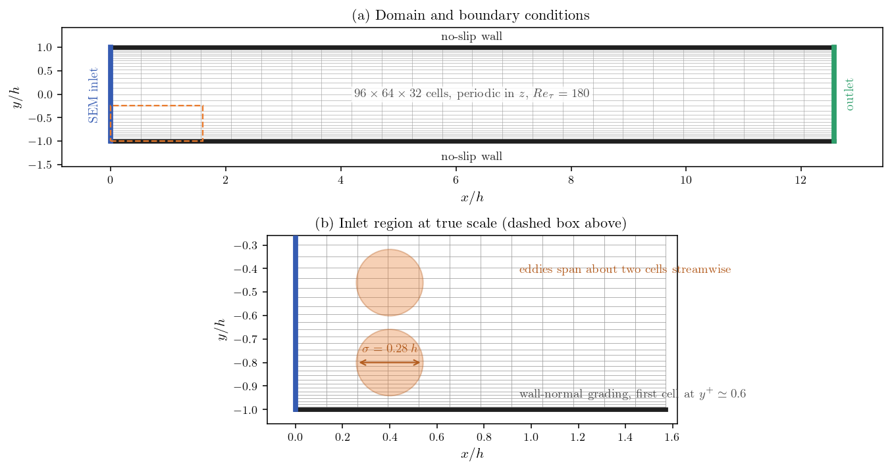
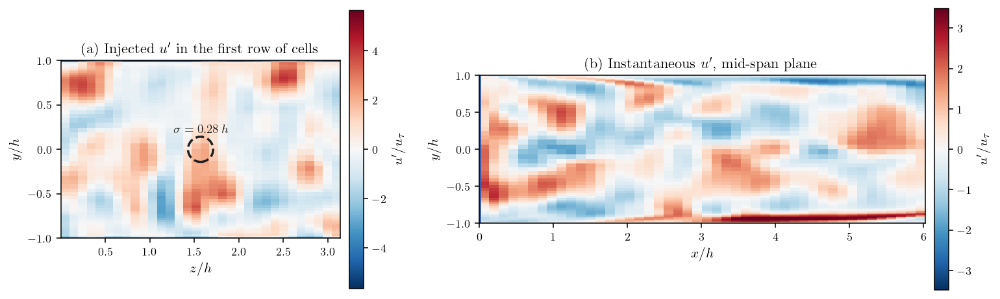
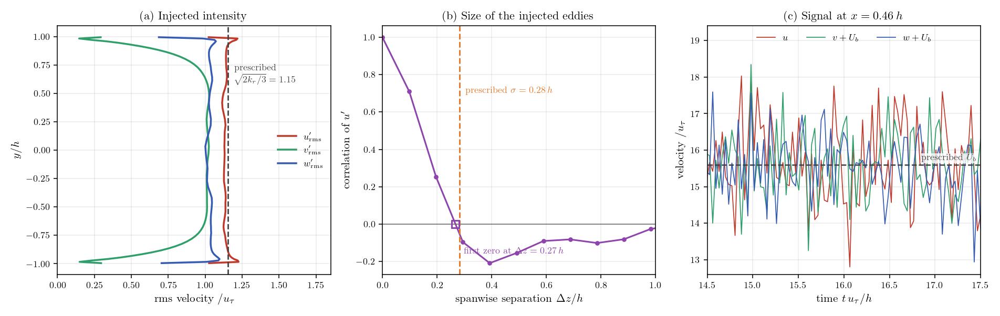
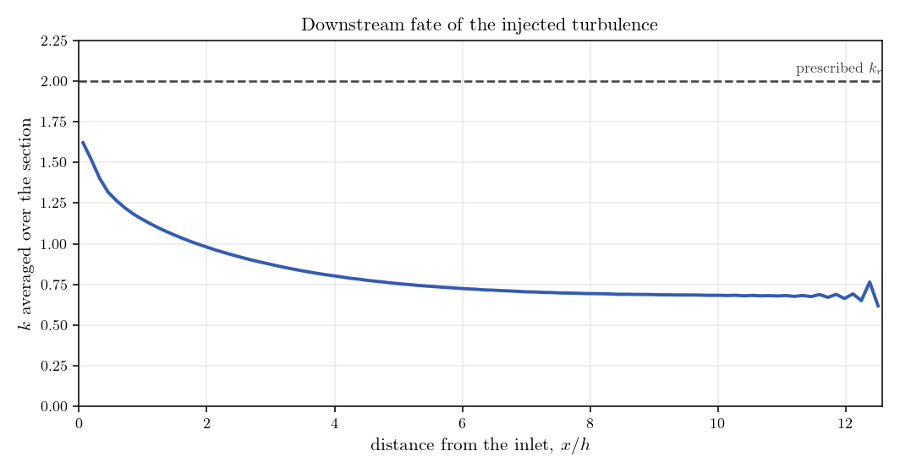

# Synthetic Turbulence at an LES Inlet

An LES resolves turbulent structures in space and time, so its inlet has to
deliver some. Prescribing a mean velocity profile, however carefully, feeds the
domain with a smooth sheet of fluid: there is nothing for the subgrid model to
work on, and the calculation has to manufacture turbulence from numerical noise
over a long distance before the results mean anything.

A synthetic turbulence generator solves this by fabricating a fluctuating
velocity field at the inlet, unsteady and three-dimensional, whose statistics are
the ones you prescribe. code_saturne ships several; this tutorial uses the
**Synthetic Eddy Method (SEM)**, which fills a box around the inlet plane with a
population of eddies, convects them through it, and sums their contributions into
a velocity signal.

The whole thing is switched on from one short user routine. The point of this
tutorial is to write that routine, and then to check on the results that the
inlet really delivers what was asked: eddies of the right size, fluctuations of
the right intensity in all three directions, and a genuinely unsteady signal.

Maintained by [Simvia](https://Simvia.tech/fr), part of the
[tutoriel-code_saturne](https://github.com/simvia-tech/tutorials-code_saturne) collection.

## Learning objectives

After completing this tutorial you will be able to:

1. Activate a synthetic turbulence generator on an LES inlet zone with `cs_les_inflow_add_inlet`, and set the three reference statistics it needs.
2. Work out the eddy length scale that follows from those statistics, and use the solver's clipping diagnostic to confirm that the mesh resolves it.
3. Verify on the results that the injected field has the prescribed mean velocity, intensity and eddy size, and that it is unsteady and three-dimensional.

## Prerequisites

| Requirement | Detail |
|---|---|
| code_saturne | **v9.1** |
| Tutorials | [Inc_LES_Channel](../Inc_LES_Channel) (LES of a channel, time averaging) |
| Background | Large eddy simulation, wall-bounded turbulence |

If code_saturne is not yet installed, build it from the
[official homepage](https://code-saturne.org/), pull a
ready-to-use Singularity image from the
[Open Simulation Center](https://open-simulation-center.org/downloads/code_saturne/code_saturne),
or pull the
[Simvia Docker image](https://hub.docker.com/r/Simvia/code_saturne) before continuing.

## Case files

```text
Inc_LES_Synthetic_Inflow/
├── CASE/
│   ├── DATA/
│   │   └── setup.xml                 # pre-configured GUI case
│   └── SRC/
│       └── cs_user_les_inflow.cpp    # the showcased feature
├── FIGURES/                          # figures used in this README
└── README.md
```

The channel is built by the internal Cartesian mesher from `setup.xml`, so there
is no mesh file to ship.

## Physical model

The flow is incompressible and turbulent between two parallel walls a distance
$2h$ apart, computed with **LES** closed by the **WALE** subgrid model and
integrated down to the wall. The case is written in wall units, so that
$\rho=u_\tau=h=1$ and the viscosity alone carries the Reynolds number.

| Parameter | Value | Source |
|---|---:|---|
| Density $\rho$ | 1 | `setup.xml`: `density` |
| Dynamic viscosity $\mu$ | $5.5556\times10^{-3}$ ($=1/180$) | `setup.xml`: `molecular_viscosity` |
| Half-height $h$ | 1 | mesh |
| Imposed bulk velocity $U_b$ | 15.6 | `setup.xml`: `inlet/velocity_pressure/norm` |
| Friction Reynolds number $Re_\tau$ | 180 | $\rho u_\tau h/\mu$ |

## Geometry and boundary conditions

The domain is a plane channel $4\pi h$ long, $2h$ high and $\pi h$ wide, meshed
with $96\times64\times32$ cells. The wall-normal spacing follows a parabolic law
that places the first cell centre at $y^+\simeq0.6$, so the viscous sublayer is
resolved rather than modelled. The spanwise direction is periodic, which lets a
narrow box represent a wide channel.

| Boundary | Type | Condition |
|---|---|---|
| `inlet` ($x=0$) | Inlet | flow rate from `setup.xml`, fluctuations from the SEM generator |
| `outlet` ($x=4\pi h$) | Outlet | Standard outlet |
| `walls` ($y=\pm h$) | Wall | No slip |
| $z$ planes | Periodicity | Translation over $\pi h$ |

<p align="center">
  
  <br>
  <em>Figure 1: (a) The channel and its boundary conditions. (b) The inlet region
  drawn at true scale: the synthetic eddies are about twice the streamwise cell
  size, which is the condition for the mesh to carry them.</em>
</p>

## The synthetic inlet

Everything is in `CASE/SRC/cs_user_les_inflow.cpp`, and it comes down to a single
call that ties a generator to a boundary zone:

```c
cs_real_t vel_r[3] = {15.6, 0., 0.};   /* mean velocity    */
cs_real_t k_r      = 2.0;              /* turbulent energy */
cs_real_t eps_r    = 5.0;              /* dissipation rate */

cs_les_inflow_add_inlet(CS_INFLOW_SEM,
                        false,        /* inlet plane, not volume mode */
                        cs_boundary_zone_by_name("inlet"),
                        200,          /* number of eddies */
                        1,            /* verbosity */
                        vel_r, k_r, eps_r);
```

The generator is driven by three reference statistics, and it is worth being
clear about what each one does. `vel_r` is the mean velocity the fluctuations are
added to. `k_r` sets their intensity: SEM builds an isotropic field, so each
component receives $\sqrt{2k_r/3}$ of rms. `eps_r` never appears in the signal
directly; it is there to fix a length scale.

`cs_les_inflow_set_restart(false, false)` on the first line asks for the eddies
to be regenerated from scratch rather than read from, or written to, a restart
file. In a production run continued in several steps you would want the opposite,
so that the inflow signal carries on smoothly across restarts.

### Sizing the eddies

The eddy size follows from the two turbulence scales:

$$\sigma = \frac{k_r^{3/2}}{2\,\varepsilon_r}$$

With $k_r=2$ and $\varepsilon_r=5$ this gives $\sigma=0.28h$, against a
streamwise cell size $\Delta x = 4\pi h/96 = 0.13h$: the eddies span a little more
than two cells, and the mesh can carry them.

This is the one place where the setup can quietly go wrong, because the
requirement is not on $k_r$ and $\varepsilon_r$ separately but on the $\sigma$
they produce. An eddy smaller than a cell cannot be represented, so the solver
enlarges it to the cell size and tells you it did, in `run_solver.log`:

```text
Max. size of synthetic eddies:
   max(sigma_x) = 0.282843, ...

Number of min. clippings (eddy size equals grid size):
   sigma_x clipped 0 times
```

Read those lines on the first run. A large clipping count means the injected
field no longer has the length scale you asked for: it has the mesh spacing
instead, and the eddies will dissipate almost immediately.

## Numerical setup

| Setting | Value |
|---|---:|
| Turbulence model | LES, WALE subgrid model |
| Generator | SEM (`CS_INFLOW_SEM`), 200 eddies |
| Time step | 0.0035 (constant) |
| Iterations | 5000 (final time $17.5\,h/u_\tau$) |
| Statistics started at | $t=6\,h/u_\tau$ |
| Velocity-pressure algorithm | SIMPLEC |

Time averages of the velocity and of the three normal stresses are declared in
`setup.xml`, started after the initial transient has been convected out. They are
what the verification below is measured on.

## Running the simulation

From the tutorial directory:

```bash
cd CASE
code_saturne run              # serial
code_saturne run --n 8        # parallel (8 MPI ranks)
```

The user routine is compiled automatically. The run takes about 40 minutes on 8
cores.

## Results and verification

The question is narrow and can be answered on the case alone: does the inlet
deliver the field it was asked for? Three checks answer it, on the shape of the
injected field, on its statistics, and on its unsteadiness.

### The inlet carries eddies

<p align="center">
  
  <br>
  <em>Figure 2: Instantaneous streamwise fluctuation. (a) In the first row of
  cells, the field is a collection of compact patches whose size matches the
  prescribed $\sigma$ (dashed circle). (b) In the mid-span plane, those patches
  enter at the left and are stretched by the shear into elongated streaks.</em>
</p>

The inlet plane is covered with alternating positive and negative patches rather
than a uniform value, which is already the essential point: the boundary
condition is unsteady and varies across the plane. Their size is set by
$\sigma$, and the streaks that form downstream are the signature of the shear
acting on them.

### The statistics are the prescribed ones

<p align="center">
  
  <br>
  <em>Figure 3: (a) Rms of the three velocity components in the first row of
  cells, against the isotropic level implied by $k_r$. (b) Spanwise two-point
  correlation of $u'$: it vanishes at a separation equal to the prescribed
  $\sigma$. (c) Velocity signal at a probe half a channel height downstream.</em>
</p>

| Quantity | Prescribed | Measured |
|---|---:|---:|
| Mean velocity | 15.60 | 15.57 |
| $u'_{\rm rms}$ in the core | 1.155 | 1.130 |
| $v'_{\rm rms}$ in the core | 1.155 | 1.015 |
| $w'_{\rm rms}$ in the core | 1.155 | 1.027 |
| Turbulent energy $k$ in the core | 2.00 | 1.68 |
| Eddy size (first zero of the correlation) | 0.283 | 0.267 |
| Eddy clippings | 0 | 0 |

The measurements are taken in the first row of cells, one half-cell downstream of
the boundary, which is the closest the results let you look.

The mean velocity is reproduced exactly, and the three fluctuation intensities
come out close to one another, which is what an isotropic generator should
produce. They sit slightly below the prescribed level, and the energy with them:
part of the injected signal lives at scales the mesh cannot carry and is lost in
the first cell. The wall-normal component falls off near the walls, as it must,
since the wall blocks it and the generator knows nothing about that.

The two-point correlation is the most direct check of all. It falls to zero at a
spanwise separation of $0.27h$, against a prescribed $\sigma=0.28h$: the
structures in the injected field have the size that was asked for. The probe
signal confirms the last property, that the inflow is genuinely unsteady in all
three components, with the transverse ones fluctuating about zero.

### What happens downstream

<p align="center">
  
  <br>
  <em>Figure 4: Resolved turbulent energy averaged over the section, against the
  distance from the inlet.</em>
</p>

Injecting the right statistics is not the same as injecting turbulence. A real
turbulent field has phase relations between its components and between scales
that a generator does not reproduce, so a good part of the synthetic energy is
not sustained by the flow and decays over the first few channel heights, while
the walls start producing genuine turbulence of their own. Any LES fed this way
needs a development length before its statistics can be trusted, and the length
depends on how close the prescribed statistics are to the real ones.

This is worth planning for at the meshing stage: place the inlet far enough
upstream of the region you care about. When the target inflow is simply a
developed profile for the same geometry, recycling a downstream plane is the more
economical option, and is the subject of
[Inc_Mapped_Inlet](../Inc_Mapped_Inlet).

## Summary

A synthetic inflow is switched on with one call. `cs_les_inflow_add_inlet`
attaches a generator to a boundary zone and takes three reference statistics: the
mean velocity, the turbulent energy that sets the intensity of the fluctuations,
and the dissipation rate that, with the energy, sets the eddy size
$\sigma=k_r^{3/2}/2\varepsilon_r$. That size is the number to watch, because the
mesh has to resolve it; the solver reports how often it had to clip eddies to the
cell size, and that line is the first thing to read in the log.

Checked on the results, the inlet does what it claims: the mean velocity is
reproduced, the three components fluctuate at comparable and nearly the
prescribed intensity, the spanwise correlation vanishes at the prescribed eddy
size, and the signal is unsteady. What it does not do is hand you developed
turbulence, since the prescribed statistics here are uniform over the plane and
isotropic, while a channel is neither. For inflows whose real profiles are known,
`cs_user_les_inflow_advanced` allows the mean velocity and the Reynolds stresses
to be set face by face, which is how the development length is shortened.

## References

1. code_saturne documentation: <https://code-saturne.org/doc/>.
2. N. Jarrin, S. Benhamadouche, D. Laurence, R. Prosser, "A synthetic-eddy-method for generating inflow conditions for large-eddy simulations", *International Journal of Heat and Fluid Flow*, vol. 27, pp. 585-593, 2006.
3. S. B. Pope, *Turbulent Flows*, Cambridge University Press, 2000.

## Authors

[Simvia](https://Simvia.tech/fr) - Questions, remarks and requests are welcome.
