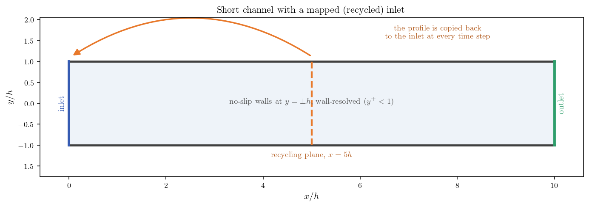
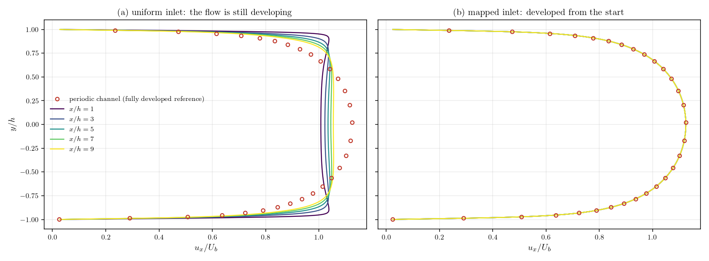
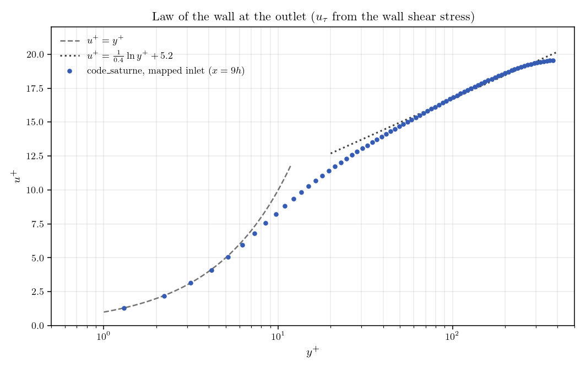

# Mapped Inlet (Recycling a Downstream Profile)

Turbulent studies almost always need a fully developed profile at the inlet, and
there is no cheap way to write one down. An analytical log-law profile never
quite matches the mesh and the turbulence model you actually use, so the flow
spends the first part of your domain readjusting. Meshing a long upstream
development section works, but you pay for cells that carry no result.

Recycling sidesteps the problem. Instead of prescribing the inlet, you copy it
from a plane a few channel heights downstream, at every time step. The flow feeds
itself, and what it converges to is the profile that this mesh and this
turbulence model produce on their own.

This tutorial does that on a turbulent channel and measures what it is worth. On
a domain ten half-heights long the profile is developed from the first cell, and
it reproduces the independent periodic-channel computation of
[Inc_Turbulent_Channel](../Inc_Turbulent_Channel). The same
domain fed with a uniform inlet is still 3 percent away from that profile at its
outlet.

Maintained by [Simvia](https://Simvia.tech/fr), part of the
[tutoriel-code_saturne](https://github.com/simvia-tech/tutorials-code_saturne) collection.

## Learning objectives

After completing this tutorial you will be able to:

1. Build the locator that links every inlet face to the cell found a prescribed distance downstream (`cs_boundary_conditions_map`).
2. Copy the downstream values onto the inlet at every time step, rescaled so that the mass flow rate imposed in the GUI is preserved (`cs_boundary_conditions_mapped_set`).
3. Check that the resulting inlet is fully developed, by comparing profiles along the channel, against a periodic-channel computation, and against the law of the wall.

## Prerequisites

| Requirement | Detail |
|---|---|
| code_saturne | **v9.1** |
| Tutorials | [Inc_Turbulent_Channel](../Inc_Turbulent_Channel) (the periodic channel used here as reference) |
| Background | Wall-bounded turbulence and the law of the wall |

If code_saturne is not yet installed, build it from the
[official homepage](https://code-saturne.org/), pull a
ready-to-use Singularity image from the
[Open Simulation Center](https://open-simulation-center.org/downloads/code_saturne/code_saturne),
or pull the
[Simvia Docker image](https://hub.docker.com/r/Simvia/code_saturne) before continuing.

## Case files

```text
Inc_Mapped_Inlet/
├── CASE/
│   ├── DATA/
│   │   └── setup.xml                        # pre-configured GUI case
│   └── SRC/
│       └── cs_user_boundary_conditions.cpp  # the showcased feature
├── FIGURES/                                 # figures used in this README
└── README.md
```

The channel is built by the internal Cartesian mesher from `setup.xml`, so there
is no mesh file to ship.

## Physical model

The flow is incompressible, statistically steady and fully turbulent between two
parallel walls a distance $2h$ apart, closed with the **k-$\omega$ SST** model
integrated down to the wall rather than through a wall function.

The channel is the one of the periodic tutorial, in the same non-dimensional
form, which is what makes the two computations directly comparable.

| Parameter | Value | Source |
|---|---:|---|
| Density $\rho$ | 1 | `setup.xml`: `density` |
| Dynamic viscosity $\mu$ | $2.5316\times10^{-3}$ ($=1/395$) | `setup.xml`: `molecular_viscosity` |
| Half-height $h$ | 1 | mesh |
| Imposed bulk velocity $U_b$ | 16.9 | `setup.xml`: `inlet/velocity_pressure/norm` |

The bulk velocity is the one the periodic computation settles at, so both cases
carry the same mass flow rate; the bulk Reynolds number is
$Re_b=\rho\,U_b\,2h/\mu\simeq1.34\times10^{4}$.

## Geometry and boundary conditions

The domain is a plane channel $10h$ long and $2h$ high, one cell thick in $z$,
meshed with $100\times150$ cells. The wall-normal spacing follows a parabolic law
that puts the first cell centre at $y^+\simeq0.4$, inside the viscous sublayer.

| Boundary | Type | Condition |
|---|---|---|
| `inlet` ($x=0$) | Inlet | flow rate from `setup.xml`, profile recycled from $x=5h$ |
| `outlet` ($x=10h$) | Outlet | Standard outlet |
| `walls` ($y=\pm h$) | Wall | No slip |
| `sym` ($z$ planes) | Symmetry | Quasi-2D |

<p align="center">
  
  <br>
  <em>Figure 1: The short channel. At every time step the values found on the
  recycling plane ($x=5h$) are copied onto the inlet.</em>
</p>

## The mapped inlet

Everything is in `CASE/SRC/cs_user_boundary_conditions.cpp`, and it comes down to
two calls.

At the first time step, a locator associates every inlet face with the cell that
contains the point (face centre + shift). The shift is the recycling length:

```c
cs_real_3_t coord_shift[1] = {{5.0, 0., 0.}};

_inlet_locator = cs_boundary_conditions_map(CS_MESH_LOCATION_CELLS,
                                            n_cells, zn->n_elts,
                                            cells_ids, zn->elt_ids,
                                            coord_shift,
                                            0,       /* uniform shift */
                                            0.10);   /* location tolerance */
```

The locator is stored in a `static` variable: building it involves a geometric
search, so it is done once and reused, not rebuilt at every step.

From the second step on, the values found there are copied onto the inlet, field
by field:

```c
const int normalize = (f == CS_F_(vel)) ? 1 : 0;

cs_boundary_conditions_mapped_set(f, _inlet_locator, CS_MESH_LOCATION_CELLS,
                                  normalize, 0,
                                  zn->n_elts, zn->elt_ids, nullptr);
```

### Why this converges

Nothing here imposes a developed profile; the loop finds it. The inlet at step
$n$ is the interior solution at step $n-1$, so at convergence the inlet profile
is equal to the profile at $x=5h$. A flow whose profile is the same at $x=0$ and
at $x=5h$ is, by definition, invariant in the streamwise direction, which is
what "fully developed" means. The developed profile is the fixed point of the
recycling loop, and the calculation walks to it on its own.

### The two choices that matter

`normalize = 1` on the velocity is not a detail. The copied profile is rescaled
so that its surface integral matches the one prescribed in the GUI: the mapping
sets the *shape* of the profile and you keep control of the *mass flow rate*.
Without it, nothing pins the flow rate and it drifts with the loop. The
turbulence variables have no such constraint and are copied as they are
(`normalize = 0`).

The recycling length is the second choice. It must be long enough that the plane
you sample has forgotten the inlet: sampling too close means copying back your
own boundary condition, which is degenerate. It also has to stay well inside the
domain, since the shifted point must land in a real cell. Five half-heights is
comfortable here, and the verification below shows the loop does its job.

One consequence surprises people: the inlet velocity and turbulence set in the
GUI only serve the very first time step. Refining them is wasted effort, since
the mapping overwrites them from step two onwards.

## Numerical setup

| Setting | Value |
|---|---:|
| Turbulence model | k-$\omega$ SST, wall-resolved |
| Steady strategy | Local (pseudo) time-stepping |
| Iterations | 4000 |
| Velocity-pressure algorithm | SIMPLEC |
| Recycling length | $5h$ (`_recycling_length` in the routine) |

## Running the simulation

From the tutorial directory:

```bash
cd CASE
code_saturne run              # serial
code_saturne run --n 4        # parallel (4 MPI ranks)
```

The user routine is compiled automatically. To reproduce the comparison below,
run the case a second time with `CASE/SRC/` emptied: the inlet then keeps the
uniform profile of the GUI, and you get the developing-flow reference.

## Results and verification

Three checks, from the weakest to the strongest. Streamwise invariance is
necessary but not sufficient, since a wrong profile could also be invariant.
Agreement with an independent computation of the same channel is the real test.
The law of the wall and the friction then confirm the physics.

### Streamwise invariance

<p align="center">
  
  <br>
  <em>Figure 2: Streamwise velocity at $x/h=1,3,5,7,9$ (lines), with the
  periodic-channel profile as circles. With a uniform inlet (a) the profiles
  change all along the channel and none reaches the reference. With the mapped
  inlet (b) the five stations are indistinguishable and pass through the
  reference points.</em>
</p>

| Quantity | Mapped inlet | Uniform inlet |
|---|---:|---:|
| Profile change between $x=1h$ and $x=9h$ | 0.00 % of $U_b$ | 30.6 % of $U_b$ |
| Profile change between $x=7h$ and $x=9h$ | 0.00 % of $U_b$ | 3.0 % of $U_b$ |
| Deviation from the periodic reference at $x=9h$ | 0.03 % max, 0.01 % mean | 9.8 % max, 5.7 % mean |
| Friction velocity $u_\tau$ at $x=9h$ | 0.973 | 1.026 |

The recycled case is invariant to the printing precision, and its profile is the
periodic one. The uniform case tells the other half of the story: ten
half-heights are not enough to develop a channel from a flat profile, and the
error it makes is not only on the profile shape. Its wall friction is 5 percent
too high, because a thin boundary layer shears harder than a developed one.

### Wall friction

Measured the same way on both, the friction velocity of the recycled case and of
the periodic computation agree to 0.03 percent, which gives $Re_\tau=384$. Since
agreeing with another computation only proves consistency, the Dean (1978)
correlation for plane channels, $c_f=0.073\,Re_b^{-0.25}$, provides an external
reference: it sits 1.2 percent above the computed friction.

### Law of the wall

<p align="center">
  
  <br>
  <em>Figure 3: Outlet profile in wall units, with $u_\tau$ from the wall shear
  stress written by the solver. The near-wall points follow $u^+=y^+$ and the
  outer points the logarithmic law.</em>
</p>

The profile follows $u^+=y^+$ through the viscous sublayer, then the logarithmic
law $u^+=\frac{1}{0.4}\ln y^+ + 5.2$ across the log layer: the boundary layer
delivered by the recycled inlet is the one expected of a wall-resolved channel.

## Summary

A mapped inlet buys a fully developed turbulent inflow for the price of a short
recycling section. Two calls do the work: `cs_boundary_conditions_map` builds,
once, the locator that ties each inlet face to a cell $5h$ downstream, and
`cs_boundary_conditions_mapped_set` copies the values there at every time step,
rescaled so the imposed mass flow rate is preserved. The loop converges to the
profile that is invariant in $x$, which is the developed one: here it reproduces
an independent periodic-channel computation, both on the velocity profile and on
the wall friction, agrees with the Dean friction correlation, and recovers the
law of the wall. The same domain with a uniform inlet is still developing at its
outlet.

The profile obtained this way is developed for the geometry that produces it,
which is exactly why it is consistent with your mesh and your turbulence model,
and also why it cannot represent an inflow whose upstream history is genuinely
different. In unsteady computations, keep in mind that recycling also feeds the
turbulent structures back to the inlet, which can lock the solution onto the
travel time of the recycling section.

## References

1. code_saturne documentation: <https://code-saturne.org/doc/>.
2. R. B. Dean, "Reynolds number dependence of skin friction and other bulk flow variables in two-dimensional rectangular duct flow", *Journal of Fluids Engineering*, vol. 100, pp. 215-223, 1978.
3. S. B. Pope, *Turbulent Flows*, Cambridge University Press, 2000.

## Authors

[Simvia](https://Simvia.tech/fr) - Questions, remarks and requests are welcome.
