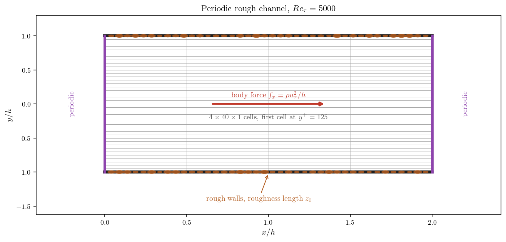
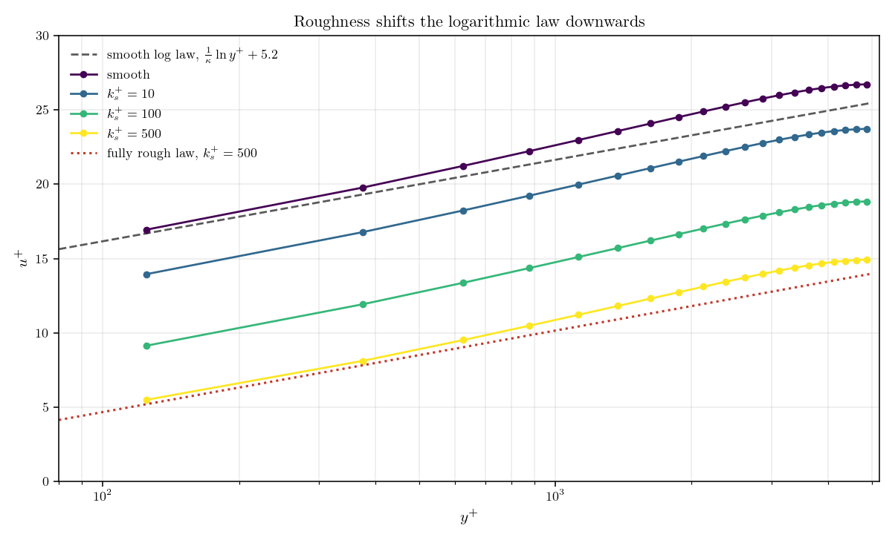
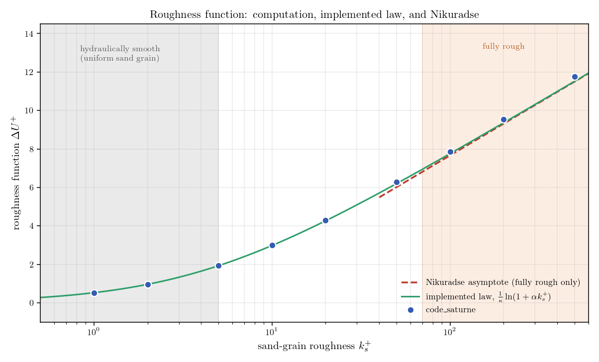
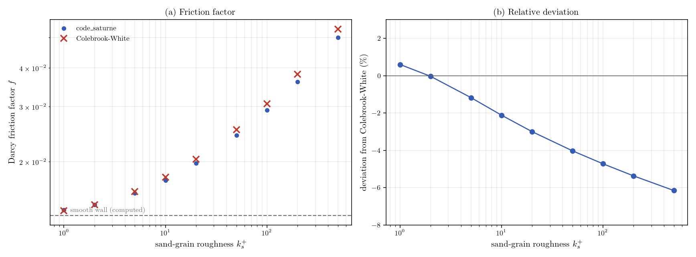

# Rough Walls (Sand-Grain Roughness and the Roughness Function)

Real walls are not smooth. Corroded pipes, concrete channels, ship hulls and
weathered blades all carry a surface texture far too small to mesh and far too
consequential to ignore: roughness thickens the wall layer, raises the friction,
and can double the pressure drop of a duct. Rather than resolve the grains, a
wall function represents them statistically, through a single length that
characterises the surface.

The mechanism is simple to picture. A rough wall obeys the same logarithmic law
as a smooth one, displaced downwards: the fluid near the surface is held back,
the velocity gradient steepens, and the friction rises. That displacement is
called the roughness function, and reproducing it is the whole job of a
rough-wall model.

This tutorial puts a roughness on the walls of a turbulent channel, sweeps it
from barely perceptible to fully rough, and measures the displacement at each
step. Two setup subtleties decide whether the case does what you intended, and
both fail silently: the number you type is not the grain height, and not every
wall function uses it.

Maintained by [Simvia](https://Simvia.tech/fr), part of the
[tutoriel-code_saturne](https://github.com/simvia-tech/tutorials-code_saturne) collection.

## Learning objectives

After completing this tutorial you will be able to:

1. Set a wall roughness on a wall boundary condition, knowing that the value requested is the roughness length $z_0$ and not the sand-grain height $k_s$.
2. Choose a wall function that actually applies the roughness, and recognise the ones that accept the value and ignore it.
3. Measure the roughness function over a sweep of roughness heights, and compare it with Nikuradse's fully rough asymptote and the Colebrook-White correlation.

## Prerequisites

| Requirement | Detail |
|---|---|
| code_saturne | **v9.1** |
| Tutorials | [Inc_Turbulent_Channel](../Inc_Turbulent_Channel) (periodic channel driven by a body force), [Inc_Turbulent_Bend_Wallfunctions](../Inc_Turbulent_Bend_Wallfunctions) (wall functions) |
| Background | Wall-bounded turbulence and the law of the wall |

If code_saturne is not yet installed, build it from the
[official homepage](https://code-saturne.org/), pull a
ready-to-use Singularity image from the
[Open Simulation Center](https://open-simulation-center.org/downloads/code_saturne/code_saturne),
or pull the
[Simvia Docker image](https://hub.docker.com/r/Simvia/code_saturne) before continuing.

## Case files

```text
Inc_Rough_Wall_Channel/
├── CASE/
│   ├── DATA/
│   │   └── setup.xml                 # pre-configured GUI case, roughness included
│   └── SRC/
│       └── cs_user_source_terms.cpp  # constant body force driving the channel
├── FIGURES/                          # figures used in this README
└── README.md
```

The channel is built by the internal Cartesian mesher from `setup.xml`, so there
is no mesh file to ship.

## Physical model

The flow is incompressible and fully turbulent between two parallel rough walls,
closed with the **standard k-$\varepsilon$ model** used with wall functions. That
pairing is not incidental: roughness is a wall-function property, so the
near-wall region must be modelled rather than resolved.

The case is written in wall units and driven by a constant body force rather than
by an imposed flow rate. This is the choice that makes the study clean. At
equilibrium the force is balanced by the wall friction, so **the friction
velocity is the same in every run whatever the roughness**. The bulk velocity
becomes the output, and the drop in bulk velocity from one run to the next is the
roughness function itself, with no wall shear stress to extract and no
normalisation to argue about.

| Parameter | Value | Source |
|---|---:|---|
| Density $\rho$ | 1 | `setup.xml`: `density` |
| Dynamic viscosity $\mu$ | $2\times10^{-4}$ | `setup.xml`: `molecular_viscosity` |
| Half-height $h$ | 1 | mesh |
| Body force $f_x$ | 1 | `cs_user_source_terms.cpp` |
| Friction Reynolds number $Re_\tau$ | 5000 | $\rho u_\tau h/\mu$ |

## Geometry and boundary conditions

The domain is a short slice of plane channel, made independent of $x$ by
streamwise periodicity, so a handful of cells in the flow direction is enough.
The wall-normal spacing is deliberately uniform and coarse: with wall functions
the first cell must sit **in** the logarithmic layer, not resolve the viscous
sublayer beneath it.

| Boundary | Type | Condition |
|---|---|---|
| `walls` ($y=\pm h$) | Wall | No slip, roughness length $z_0$ |
| $x$ planes | Periodicity | Translation over $2h$ |
| `sym` ($z$ planes) | Symmetry | Quasi-2D |

<p align="center">
  
  <br>
  <em>Figure 1: The channel. Periodicity removes the need for an inlet and an
  outlet, and the body force fixes the friction velocity by construction.</em>
</p>

## The rough wall

The roughness is an attribute of the wall boundary condition, set in the GUI
under the wall's velocity panel. No user routine is involved:

```xml
<wall label="walls" field_id="none">
  <velocity_pressure choice="off">
    <dirichlet name="velocity" component="0">0</dirichlet>
    <dirichlet name="velocity" component="1">0</dirichlet>
    <dirichlet name="velocity" component="2">0</dirichlet>
    <roughness>5.631170736e-04</roughness>
  </velocity_pressure>
</wall>
```

### The value is a length scale, not a grain height

Here is the first trap, and it costs a factor of thirty-five. The number entered
is the **roughness length** $z_0$, the height at which the rough logarithmic
profile extrapolates to zero velocity. The sand-grain height $k_s$, which is what
tables of surface roughness quote, is a different and much larger quantity. The
solver converts between them in `cs_wall_functions.cpp`:

```c
cs_real_t sg_rough = rough_d * exp(cs_turb_xkappa * cs_turb_cstlog_rough);
```

With the constants of the code, $\kappa=0.42$ and $C_{rough}=8.5$, this gives

$$k_s = z_0\,e^{\kappa C_{rough}} \simeq 35.5\,z_0$$

so a surface quoted at one millimetre of sand-grain roughness must be entered as
some thirty microns. Type the grain height directly and the wall becomes thirty
five times rougher than intended, quietly.

### Not every wall function uses it

The second trap lives in the turbulence panel. Whether the roughness reaches the
velocity profile depends on the wall function, and the two pieces of source that
decide this do not agree with each other.

| `<wall_function>` | Name | Roughness |
|---:|---|---|
| 0, 1, 4, 7 | disabled, power law, scalable, all $y^+$ | rejected, the field is never created |
| 2 | one scale log law | **accepted and silently ignored** |
| 3 | two scales log law | applied |
| 5 | two scales Van Driest | applied |
| **6** | **two scales smooth/rough** | **applied** (used here) |

The GUI reader filters out only the first group, so a roughness entered alongside
the one-scale log law is stored, written to the setup, and never handed to the
routine that would use it. Running this case that way gives a bulk velocity
indistinguishable from a smooth wall. Nothing in the log mentions it.

Options 3 and 6 deserve a word too, because they are the same thing: both
dispatch to the same routine, which reduces to the smooth log law when the
roughness is zero. The default two-scales log law therefore already handles rough
walls, and option 6 mainly makes the intent explicit.

### What the wall function does

Roughness and viscosity enter the log law side by side, in the same denominator:

$$u^+ = \frac{1}{\kappa}
        \ln\!\left(\frac{(y+z_0)\,u_k}{\nu + \alpha\,k_s\,u_k}\right)
        + C_{smooth}$$

When the grains are small compared with the viscous length the first term
dominates and the smooth law is recovered; when they are large the second takes
over and the law becomes fully rough. One expression covers both regimes, with
nothing to switch by hand. Written as a displacement from the smooth law, it
amounts to

$$\Delta U^+ = \frac{1}{\kappa}\ln\!\left(1 + \alpha\,k_s^+\right),
\qquad \alpha = e^{-\kappa\,(C_{rough}-C_{smooth})} \simeq 0.25$$

This is the expression the sweep below measures, and it is worth keeping in mind:
it tends to the smooth wall as the grains vanish, and to the fully rough law as
they grow.

## Numerical setup

| Setting | Value |
|---|---:|
| Turbulence model | standard k-$\varepsilon$ |
| Wall function | 6, two scales smooth/rough |
| Mesh | $4\times40\times1$ cells, first cell at $y^+=125$ |
| Roughness length $z_0$ (shipped case) | $5.6312\times10^{-4}$, that is $k_s^+=100$ |
| Steady strategy | Local (pseudo) time-stepping |
| Iterations | 4000 |

## Running the simulation

From the tutorial directory:

```bash
cd CASE
code_saturne run
```

Each run takes a few seconds, which is what makes a sweep affordable. To
reproduce the one below, edit `<roughness>` in `DATA/setup.xml` and run again,
once per value. The roughness length for a target $k_s^+$ follows from the
conversion above,

$$z_0 = \frac{k_s^+}{Re_\tau}\,e^{-\kappa C_{rough}}$$

and the smooth reference is obtained by removing the `<roughness>` line
altogether.

## Results and verification

Only the bulk velocity is measured. Since the friction velocity is fixed by the
body force, it carries everything: the roughness function is its drop from the
smooth run, and the friction factor follows from it directly. Reading the
displacement off the bulk velocity assumes the profile moves as a rigid block,
which is the classical outer-layer similarity hypothesis; comparing the profiles
point by point confirms it, well within the differences being measured.

### The log law shifts downwards

<p align="center">
  
  <br>
  <em>Figure 2: Mean velocity in wall units. Each roughness moves the profile
  down as a block, without changing its slope, and the roughest case follows the
  fully rough law over the near-wall part of the channel.</em>
</p>

The profiles stay parallel. Roughness does not change the slope of the log law,
which belongs to $\kappa$ alone, it only lowers the intercept. That is the entire
content of the model, and it is why one number can stand in for a surface.

### The roughness function

<p align="center">
  
  <br>
  <em>Figure 3: Roughness function against $k_s^+$. The computed points sit on
  the law the wall function implements, which joins Nikuradse's asymptote in the
  fully rough regime. The asymptote is drawn only there, since it has no meaning
  at lower roughness.</em>
</p>

| $k_s^+$ | $U_b^+$ | $\Delta U^+$ | Implemented law | Nikuradse (fully rough only) |
|---:|---:|---:|---:|---:|
| smooth | 24.42 | 0 | 0 | |
| 1 | 23.89 | 0.53 | 0.53 | |
| 2 | 23.46 | 0.96 | 0.97 | |
| 5 | 22.49 | 1.94 | 1.93 | |
| 10 | 21.42 | 3.00 | 2.98 | |
| 20 | 20.12 | 4.30 | 4.27 | |
| 50 | 18.15 | 6.27 | 6.20 | 6.01 |
| 100 | 16.55 | 7.87 | 7.76 | 7.66 |
| 200 | 14.89 | 9.53 | 9.36 | 9.32 |
| 500 | 12.66 | 11.77 | 11.52 | 11.50 |

Two readings of this table matter, and they are different in kind.

The first is a verification: the computed shift reproduces the law the wall
function is built on, over the whole sweep. The small residual at
the rough end comes from the wall-distance shift, which depends on where the
first cell sits; it is a discretisation effect, not a modelling one.

The second is physical. In the fully rough regime the points settle onto
Nikuradse's asymptote, which is the result one wants, and which is the only
regime where that asymptote means anything. Below it the model transitions
monotonically, with no hydraulically smooth plateau: it behaves like Colebrook's
commercial pipes rather than Nikuradse's calibrated sand grains, and the friction
comparison below shows it follows Colebrook closely there. That is a modelling
choice rather than a defect, and a defensible one for engineering surfaces, but
it does mean a small roughness is never quite free.

### Friction

<p align="center">
  
  <br>
  <em>Figure 4: (a) Darcy friction factor, each Colebrook-White cross evaluated
  at the Reynolds number and relative roughness of the computation it faces,
  since both change from run to run. (b) The relative deviation.</em>
</p>

Agreement with Nikuradse tests the model against the law it was built to
reproduce, so an independent check is worth having. The Colebrook-White
correlation supplies one: an experimental fit for commercial pipes, applied here
to the channel through its hydraulic diameter, and one that covers the
transitional regime the Nikuradse asymptote says nothing about. The computed
friction is closest to it on smooth and lightly rough walls, which is what
supports the reading above, and drifts a few percent low as the wall gets
rougher. That drift is expected rather than troubling, since a plane channel is
not a pipe and the hydraulic diameter only papers over the difference.

## Summary

Wall roughness needs no user routine, but it needs two things right. The value is
a roughness length, smaller than the sand-grain height of the standard tables by
a factor of about thirty-five, so entering a grain height makes the wall far
rougher than intended. And the wall function has to be one that consumes it:
several do, several refuse it outright, and one accepts the value and quietly
ignores it, which is the failure mode worth remembering because nothing will warn
you.

Set up correctly, the model earns its keep. It shifts the logarithmic law
downwards without touching its slope, follows Nikuradse's fully rough asymptote
closely once the grains are large enough to matter, and tracks the Colebrook
friction correlation across the range. Its transition to the smooth wall is
monotonic, closer to Colebrook's commercial pipes than to Nikuradse's calibrated
sand grains, so a small roughness is never quite free.

Worth stating plainly as well: a single length cannot describe a surface. Two
walls with the same $k_s$ but different grain shape, packing or directionality do
not behave alike, and the equivalent sand-grain roughness of a real surface is
obtained by experiment, not with a profilometer. The model is only ever as good
as the number fed into it.

## References

1. code_saturne documentation: <https://code-saturne.org/doc/>.
2. J. Nikuradse, "Stromungsgesetze in rauhen Rohren", *VDI-Forschungsheft* 361, 1933 (English translation: NACA TM 1292, 1950).
3. C. F. Colebrook, "Turbulent flow in pipes, with particular reference to the transition region between the smooth and rough pipe laws", *Journal of the Institution of Civil Engineers*, vol. 11, pp. 133-156, 1939.
4. S. B. Pope, *Turbulent Flows*, Cambridge University Press, 2000.

## Authors

[Simvia](https://Simvia.tech/fr) - Questions, remarks and requests are welcome.
