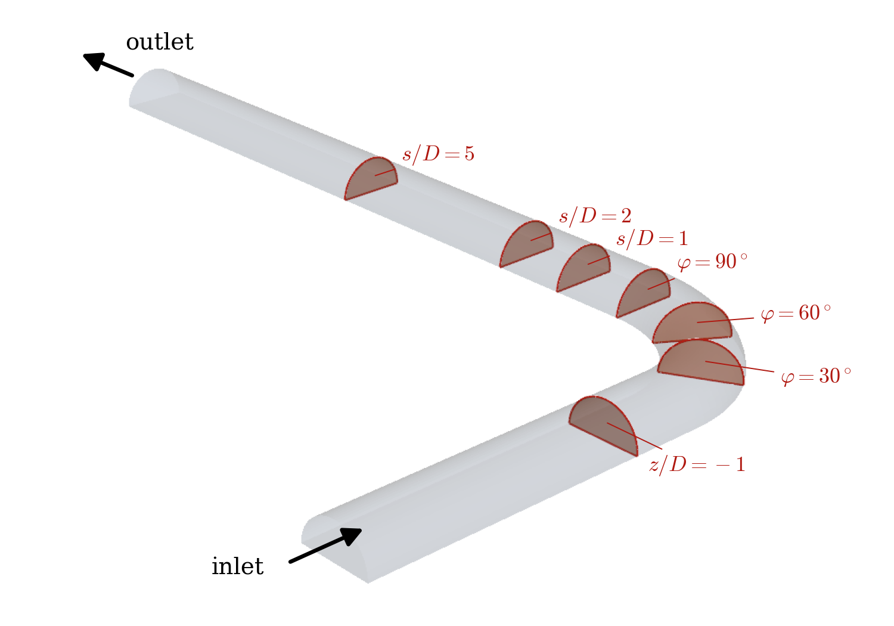
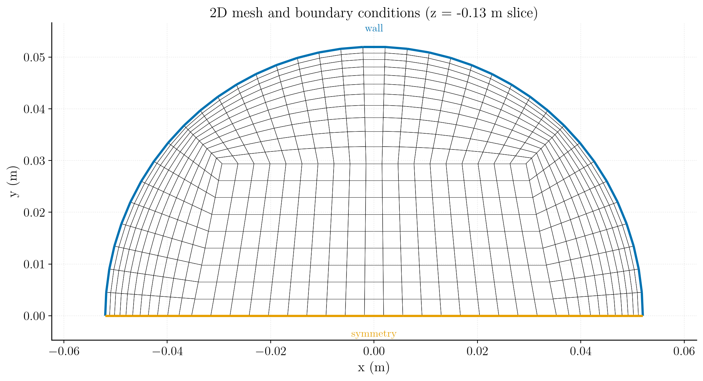
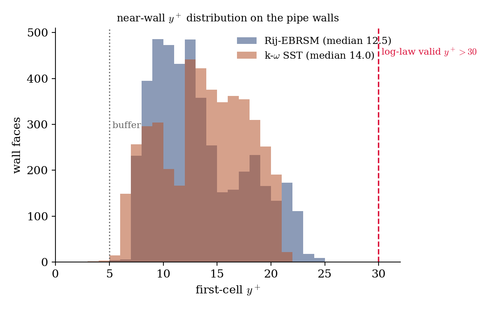
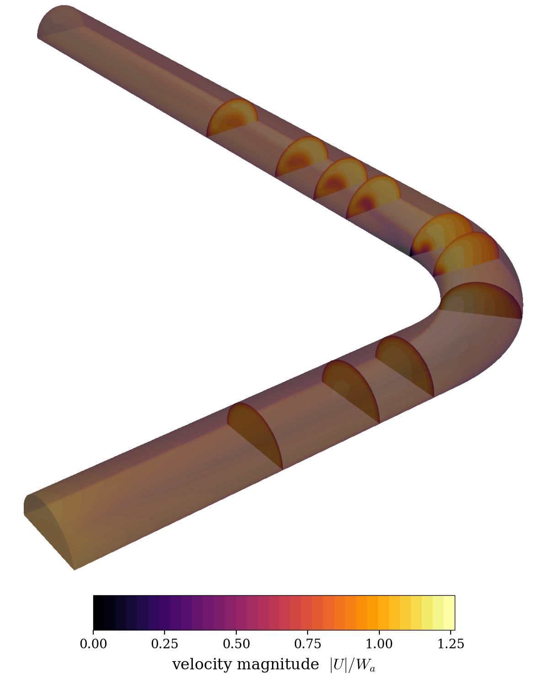
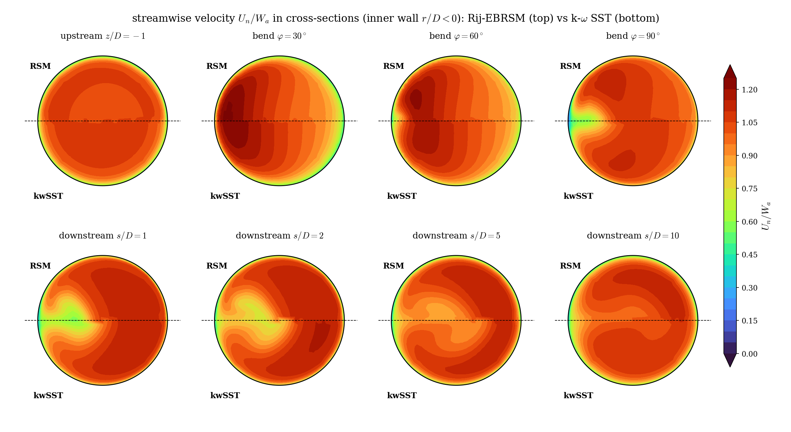
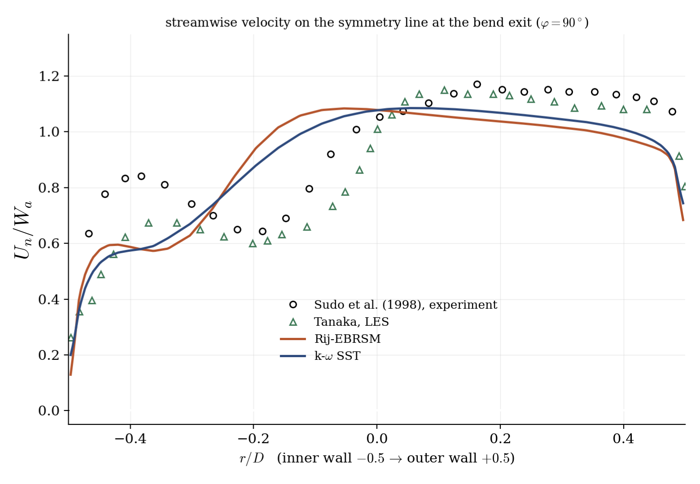

# Turbulent Bend with Wall Functions (RANS Model Comparison)

A step-by-step tutorial for **RANS turbulence modelling with wall functions** in **code_saturne**, on the reference experiment of Sudo et al. (1998): the steady turbulent flow through a circular 90 degree pipe bend. The bend generates strong curvature-driven secondary flow and a low-velocity region near the inner wall, a demanding test where turbulence closures disagree. Two models are compared on the same mesh and the same near-wall treatment, and confronted with the experimental data and a reference LES: the tutorial's purpose is the **model comparison workflow**, the validation being the bonus.

Maintained by [Simvia](https://Simvia.tech/fr), part of the
[tutoriel-code_saturne](https://github.com/simvia-tech/tutorials-code_saturne) collection.

## Learning objectives

After completing this tutorial you will be able to:

1. Set up a steady incompressible **RANS** simulation on an imported 3D mesh, driven to steady state with **local (pseudo) time-stepping** and SIMPLEC.
2. Run the **same case with two turbulence models** (k-$\omega$ SST and Rij-EBRSM) by changing a single GUI setting, and compare them cleanly (identical mesh, numerics and wall treatment).
3. Understand and justify the **all-$y^+$ wall function** from the actual near-wall $y^+$ of the run.
4. Post-process a bend flow: cross-section velocity contours, symmetry-line profiles, and comparison against experimental and LES data.

## Prerequisites

| Requirement | Detail |
|---|---|
| code_saturne | **v9.1** |
| Tutorial | [Inc_Turbulent_Plate](../Inc_Turbulent_Plate) (RANS basics and wall functions) |

If code_saturne is not yet installed, build it from the
[official homepage](https://www.code-saturne.org/cms/web/Download), pull a
ready-to-use Singularity image from the
[Open Simulation Center](https://open-simulation-center.org/downloads/code_saturne/code_saturne),
or pull the
[Simvia Docker image](https://hub.docker.com/r/Simvia/code_saturne) before continuing.

## Case files

```
Inc_Turbulent_Bend_Wallfunctions/
├── CASE_kwSST/
│   └── DATA/setup.xml     # k-omega SST
├── CASE_RSM/
│   └── DATA/setup.xml     # Rij-EBRSM; identical but for the turbulence model
├── MESH/
│   └── sudo_coarse.msh    # 90-degree bend, half pipe (Git LFS)
├── FIGURES/               # figures used in this README
└── README.md
```

> The two `setup.xml` differ **only** by the turbulence model (and its variables): same mesh, same boundary conditions, same numerics, same all-$y^+$ wall function. Diff them to see it. The mesh is tracked with Git LFS.

## Physical model

The flow is steady, incompressible and fully turbulent, governed by the Reynolds-Averaged Navier-Stokes equations. The turbulent stress is closed with two models compared here:

- **k-$\omega$ SST** (Menter): a two-equation eddy-viscosity model, isotropic, robust in adverse pressure gradients;
- **Rij-EBRSM**: a seven-equation Reynolds-stress model that transports the stress tensor itself, capturing the **anisotropy** that curvature-driven secondary flow produces.

The bend is precisely the flow where these differ: the mean strain rotates through the curve and the turbulence becomes strongly anisotropic, which an eddy-viscosity model cannot represent by construction.

### Flow parameters (Sudo et al. 1998)

| Quantity | Symbol | Value | Source |
|---|---|---|---|
| Pipe diameter | $D = 2a$ | $0.104$ m | mesh |
| Bend curvature radius | $R_c$ | $0.208$ m ($R_c/a = 4$) | mesh |
| Bulk velocity | $W_a$ | $8.7$ m/s | inlet |
| Density | $\rho$ | $1.185\ \mathrm{kg\,m^{-3}}$ | `fluid_properties` |
| Dynamic viscosity | $\mu$ | $1.785\times10^{-5}\ \mathrm{Pa\,s}$ | `fluid_properties` |
| Reynolds number | $Re = \rho W_a D/\mu$ | $\approx 6\times10^{4}$ | derived |

$$
Re = \frac{1.185 \times 8.7 \times 0.104}{1.785\times10^{-5}} \approx 60\,000
$$

## Geometry and boundary conditions

A 90 degree bend of diameter $D = 0.104$ m and curvature radius $R_c = 2D$, with a straight upstream tangent of $5D$ and a downstream tangent of $10D$. Only the **upper half** of the pipe is meshed, with a symmetry plane on the bend mid-plane ($y = 0$): this halves the cost. Note that this is **not** a 2D computation: the bend drives a genuine three-dimensional secondary flow (a pair of counter-rotating Dean vortices), and the symmetry plane only exploits the top/bottom mirror symmetry of that flow.

<p align="center">
  
  <br>
  <em>Figure 1: the computational domain (isometric view, transparent walls). Flow enters the $5D$ upstream tangent, turns through the $90°$ bend ($R_c = 2D$), and leaves through the $10D$ downstream tangent; only the upper half of the pipe is meshed (flat symmetry plane visible underneath). The half-disks locate the cross-section stations used below: $z/D = -1$ upstream, $\varphi = 30/60/90°$ in the bend, and $s/D = 1/2/5$ downstream.</em>
</p>

| Boundary | Nature | Prescribed |
|---|---|---|
| `inlet` | inlet | uniform $W_a = 8.7$ m/s, turbulence from hydraulic diameter |
| `outlet` | outlet | $p = 0$ |
| `wall_1`, `wall_bend`, `wall_2` | no-slip wall + all-$y^+$ | $\mathbf{u} = 0$ |
| `symmetry_1`, `symmetry_bend`, `symmetry_2` | symmetry | mid-plane |

<p align="center">
  
  <br>
  <em>Figure 2: the cross-section mesh (half pipe, O-grid topology). The curved outer boundary is a no-slip wall (blue), the flat bottom is the symmetry mid-plane (orange). This section is swept along the upstream tangent, through the bend and along the downstream tangent.</em>
</p>

Two honest limitations of this coarse setup, relative to the experiment: the upstream tangent is $5D$ (the experiment has $100D$, giving a fully-developed inlet profile), and the inlet here is **uniform** rather than a developed pipe profile. The bend dynamics dominate the comparison, but these choices explain part of the departure from the measurements.

## Numerical setup

| Setting | Value | Rationale |
|---|---|---|
| Coupling | SIMPLEC | robust steady segregated coupling |
| Time-stepping | local (pseudo) time step | accelerates convergence to steady state |
| Wall function | **all $y^+$** (2-scale) on both models | see below |
| Turbulence | k-$\omega$ SST / Rij-EBRSM | the compared closures |
| Iterations | to residual plateau (a few hundred to ~1000) | steady state |

### Why the all-$y^+$ wall function

On this coarse mesh the first-cell $y^+$ does not sit cleanly in the logarithmic layer ($y^+ > 30$) where the standard log-law wall function is valid, nor in the viscous sublayer ($y^+ \approx 1$) required by a low-Reynolds model. Instead it falls almost entirely in the **buffer layer** ($5 < y^+ < 30$), and varies along the walls with the acceleration and separation. The **all-$y^+$** treatment (Menter's 2-scale blending) is designed exactly for this range, which is why it is used, and used identically on both models so the comparison isolates the turbulence closure alone.

<p align="center">
  
  <br>
  <em>Figure 3: distribution of the first-cell $y^+$ over the pipe walls for both models. Every wall face lies below the $y^+ = 30$ log-law validity threshold, mostly in the buffer layer ($5 < y^+ < 30$): the regime the all-$y^+$ treatment is built for.</em>
</p>

## Running the simulation

The commands below start from the tutorial directory. Run each case (parallel recommended, ~70k cells):

```bash
cd CASE_kwSST
code_saturne run --nprocs 4

cd ../CASE_RSM
code_saturne run --nprocs 4
```

To switch model in the GUI instead, open either `setup.xml` and change the model under **Thermophysical models → Turbulence**. Convergence is reached when the residuals plateau (a few hundred iterations); the monitoring probe and `residuals.csv` track it.

## Results and verification

<p align="center">
  
  <br>
  <em>Figure 4: three-dimensional overview (Rij-EBRSM) with cross-section slices coloured by the velocity magnitude normalized by the bulk velocity, $|U|/W_a$. The fast fluid hugs the inner wall entering the bend and the secondary flow redistributes it downstream: the signature of a strongly curved pipe.</em>
</p>

<p align="center">
  
  <br>
  <em>Figure 5: streamwise velocity in the eight cross-sections located in Figure 1 (Rij-EBRSM top half, k-$\omega$ SST bottom half of each disk). The fast fluid moves to the inner wall entering the bend, a low-velocity depression forms near the inner wall by $\varphi = 90°$, and the secondary flow smears it into the characteristic two-lobe pattern downstream, fading by $s/D = 10$. The two models tell the same qualitative story with visible quantitative differences.</em>
</p>

<p align="center">
  
  <br>
  <em>Figure 6: streamwise velocity on the symmetry line at the bend exit ($\varphi = 90°$), against Sudo et al.'s experiment and Tanaka's LES. Both RANS models reproduce the shape (inner-wall depression, core acceleration) but under-predict the inner-wall velocity and stay below the measurements toward the outer wall.</em>
</p>

The comparison is honest about what RANS captures here. Both models give the correct qualitative profile at $\varphi = 90°$ and are close to each other, the Rij-EBRSM being slightly fuller near the inner wall. Neither reproduces the detailed inner-wall velocity distribution measured by Sudo (the shoulder-and-dip structure driven by the secondary flow), and both sit below the experiment and the LES across much of the section. This is the expected behaviour of steady RANS on a strongly curved bend, and it is compounded here by the coarse mesh, the short $5D$ upstream tangent and the uniform inlet.

## Summary

This tutorial ran the Sudo 90 degree bend with two RANS closures (k-$\omega$ SST and Rij-EBRSM) sharing one mesh, one set of numerics and one all-$y^+$ wall treatment, so the comparison isolates the turbulence model. The near-wall $y^+$ justifies the all-$y^+$ choice (buffer layer throughout). Both models capture the bend physics qualitatively (inner-wall depression, secondary-flow two-lobe pattern) and are confronted with experiment and LES; the quantitative gaps are stated honestly and traced to the closures and the coarse, short-inlet setup.

## References

- K. Sudo, M. Sumida, H. Hibara. Experimental investigation on turbulent flow in a circular-sectioned 90-degree bend, Experiments in Fluids 25, 42-49, 1998.
- [code_saturne documentation](https://www.code-saturne.org/cms/web/documentation)

## Authors

[Simvia](https://Simvia.tech/fr), from an initial setup by Abderrazak (Simvia intern). Questions, remarks and requests are welcome.
