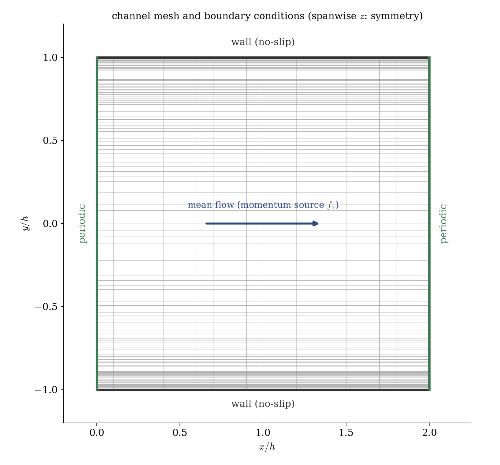
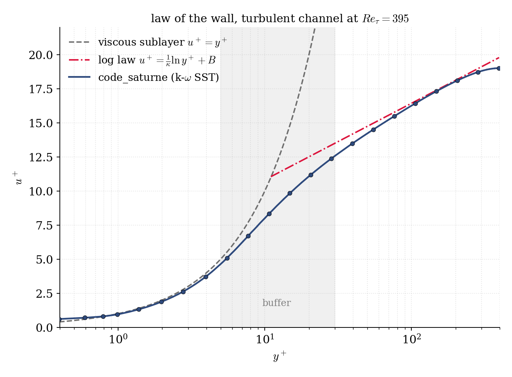

# Turbulent Channel Flow (Periodic, Law of the Wall)

A step-by-step tutorial for a **fully-developed turbulent channel** in **code_saturne**: an incompressible RANS flow between two parallel walls, made streamwise-periodic and **driven by a constant momentum source term** instead of an inlet/outlet. The tutorial's purpose is that **periodic + source-term workflow** and its canonical validation: a wall-resolved computation that recovers the **law of the wall** ($u^+$ versus $y^+$) at $Re_\tau = 395$.

Maintained by [Simvia](https://Simvia.tech/fr), part of the
[tutoriel-code_saturne](https://github.com/simvia-tech/tutorials-code_saturne) collection.

## Learning objectives

After completing this tutorial you will be able to:

1. Build a **streamwise-periodic** channel with the **built-in cartesian mesher**, using a **parabolic grading** to resolve both walls ($y^+ \approx 1$).
2. Drive a periodic flow with a **constant momentum source term** (`cs_user_source_terms`) that replaces the mean pressure gradient and **fixes the friction Reynolds number** by construction.
3. Run a **wall-resolved k-$\omega$ SST** RANS computation to steady state.

## Prerequisites

| Requirement | Detail |
|---|---|
| code_saturne | **v9.1** |
| Tutorials | [Inc_Streamwise_Periodic](../../00_foundations/Inc_Streamwise_Periodic) (periodicity + source term), [Inc_Turbulent_Plate](../Inc_Turbulent_Plate) (RANS near walls) |

If code_saturne is not yet installed, build it from the
[official homepage](https://code-saturne.org/), pull a
ready-to-use Singularity image from the
[Open Simulation Center](https://open-simulation-center.org/downloads/code_saturne/code_saturne),
or pull the
[Simvia Docker image](https://hub.docker.com/r/Simvia/code_saturne) before continuing.

## Case files

```
Inc_Turbulent_Channel/
├── CASE/
│   ├── DATA/setup.xml                # cartesian mesh, periodicity, k-omega SST
│   └── SRC/cs_user_source_terms.cpp  # constant streamwise body force f_x
├── FIGURES/                          # figures used in this README
└── README.md
```

> No mesh file: the domain is built by the **built-in cartesian mesher** from `setup.xml`, so the case is fully self-contained.

## Physical model

The flow is incompressible, statistically steady and fully turbulent between two
parallel walls a distance $2h$ apart. It is closed with the **k-$\omega$ SST**
model, integrated **down to the wall** (no wall function needed), so the profile
is resolved through the viscous sublayer.

Because the channel is **periodic in the streamwise direction** there is no inlet
or outlet, and the mean pressure gradient that would drive the flow is instead
supplied as a **constant body force** $f_x$ added to the streamwise momentum
equation. At statistical steady state this force is balanced exactly by the wall
friction, which pins the wall shear and therefore the **friction velocity**:

$$
f_x = \frac{\rho\,u_\tau^2}{h}
\quad\Longrightarrow\quad
\tau_w = f_x\,h = \rho\,u_\tau^2 .
$$

The case is written in **wall units**: $h = 1$, $\rho = 1$, $u_\tau = 1$, so
$f_x = 1$ and the molecular viscosity alone sets the friction Reynolds number,
$Re_\tau = u_\tau h/\nu = 1/\nu$. Choosing $\nu = 1/395$ gives $Re_\tau = 395$.
The **bulk velocity is then an output** of the run.

The near-wall mean profile follows the **law of the wall**:

$$
u^+ = y^+ \ (\text{viscous sublayer}, y^+ \lesssim 5), \qquad
u^+ = \tfrac{1}{\kappa}\ln y^+ + B \ (\text{log region}, y^+ \gtrsim 30),
$$

with $\kappa = 0.41$, $B = 5.2$, and $u^+ = U_x/u_\tau$, $y^+ = y_w u_\tau/\nu$
($y_w$ the distance to the nearest wall).

### Flow parameters (wall units)

| Quantity | Symbol | Value | Source in `setup.xml` |
|---|---|---|---|
| Half-height | $h$ | $1$ | mesh |
| Density | $\rho$ | $1$ | `fluid_properties/density` |
| Friction velocity | $u_\tau$ | $1$ (by construction) | momentum balance |
| Molecular viscosity | $\nu$ | $1/395 \approx 2.532\times10^{-3}$ | `molecular_viscosity` |
| Streamwise body force | $f_x = \rho u_\tau^2/h$ | $1$ | `cs_user_source_terms.cpp` |
| Friction Reynolds number | $Re_\tau = u_\tau h/\nu$ | $395$ | derived |

To run a different $Re_\tau$, change a single number: $\nu = 1/Re_\tau$.

## Geometry and boundary conditions

The domain is a cartesian box, $2h$ long in $x$, $2h$ tall in $y$ (wall to wall),
and one cell thick in $z$. The wall-normal direction uses a **parabolic grading**
that refines toward both walls (first cell centre at $y^+ \approx 0.4$). Because
the mean flow is statistically one-dimensional, the streamwise and spanwise
extents can be small.

| Boundary | Group | Nature | Prescribed |
|---|---|---|---|
| bottom, top | `Y0`, `Y1` | no-slip wall | $\mathbf{u} = 0$ |
| inlet/outlet planes | `X0`, `X1` | periodic (translation) | streamwise periodicity |
| spanwise planes | `Z0`, `Z1` | symmetry | quasi-2D |

<p align="center">
  
  <br>
  <em>Figure 1: the cartesian mesh (coordinates in half-heights $h$) and boundary conditions. The wall-normal grading (parabolic) clusters cells at both no-slip walls; the streamwise planes are periodic and the flow is driven by the constant momentum source $f_x$; the spanwise planes are symmetry.</em>
</p>

## Numerical setup

| Setting | Value | Rationale |
|---|---|---|
| Coupling | SIMPLEC | robust segregated incompressible coupling |
| Convection scheme | 2nd-order centred | low numerical diffusion |
| Time-stepping | local (pseudo) time step | drives to steady state |
| Turbulence | k-$\omega$ SST, **wall-resolved** ($y^+ \approx 0.4$) | resolves the sublayer, no wall function |
| Driving | constant momentum source $f_x = 1$ | replaces the mean pressure gradient |
| Iterations | to residual plateau (a few thousand) | steady state |

The momentum source is added in `cs_user_source_terms.cpp` as an explicit term
$f_x$ integrated over each cell volume, on the streamwise velocity component only.

## Running the simulation

The commands below start from the tutorial directory.

### Graphical interface

```bash
code_saturne gui CASE/DATA/setup.xml &
```

### Command line

```bash
cd CASE
code_saturne run                 # serial
code_saturne run --n 4      # parallel
```

The mesh is generated internally, so no mesh import is needed. Each run writes a
timestamped `CASE/RESU/<id>/` with `run_solver.log`, the monitoring probe and the
EnSight fields in `postprocessing/`.

## Results and verification

<p align="center">
  
  <br>
  <em>Figure 2: mean velocity in wall units, $u^+$ versus $y^+$. The wall-resolved k-$\omega$ SST follows $u^+ = y^+$ in the viscous sublayer, bends through the buffer layer, and lies on the logarithmic law $u^+ = \tfrac{1}{\kappa}\ln y^+ + B$ ($\kappa = 0.41$, $B = 5.2$) in the log region.</em>
</p>

The validation is the law of the wall itself (Figure 2): the profile recovers
$u^+ = y^+$ through the viscous sublayer and lies on the logarithmic law in the
log region, where the match is close ($u^+ = 16.3$ at $y^+ = 100$ against $16.4$
from the log law, and $18.1$ against $18.1$ at $y^+ = 200$).

## Summary

This tutorial built a fully-developed turbulent channel entirely from the
built-in cartesian mesher, made it streamwise-periodic, and drove it with a
constant momentum source term that fixes $Re_\tau = 395$ by construction. A
wall-resolved k-$\omega$ SST computation recovers the law of the wall (viscous
sublayer $u^+ = y^+$ and the logarithmic region). The lesson that carries beyond this case: a periodic domain plus a
momentum source is the natural, boundary-condition-free way to compute a
fully-developed internal flow.

## References

- R. D. Moser, J. Kim, N. N. Mansour. Direct numerical simulation of turbulent channel flow up to $Re_\tau = 590$, Physics of Fluids 11, 943-945, 1999.
- [code_saturne documentation](https://code-saturne.org/doc/)

## Authors

[Simvia](https://Simvia.tech/fr). Questions, remarks and requests are welcome.
