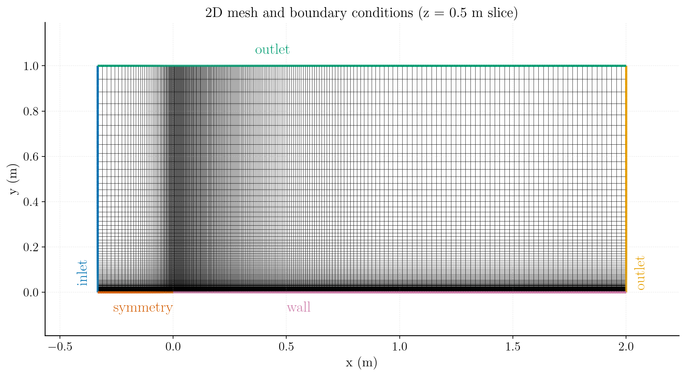
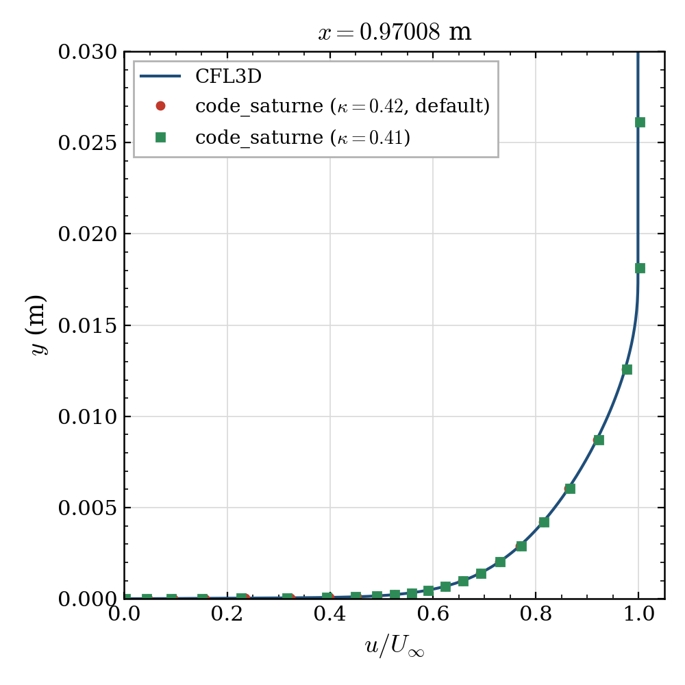
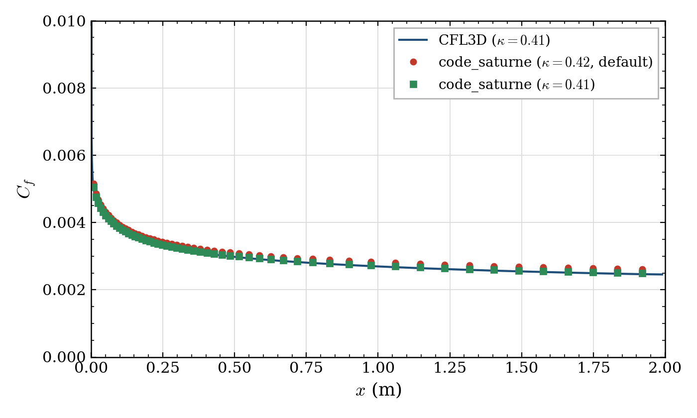
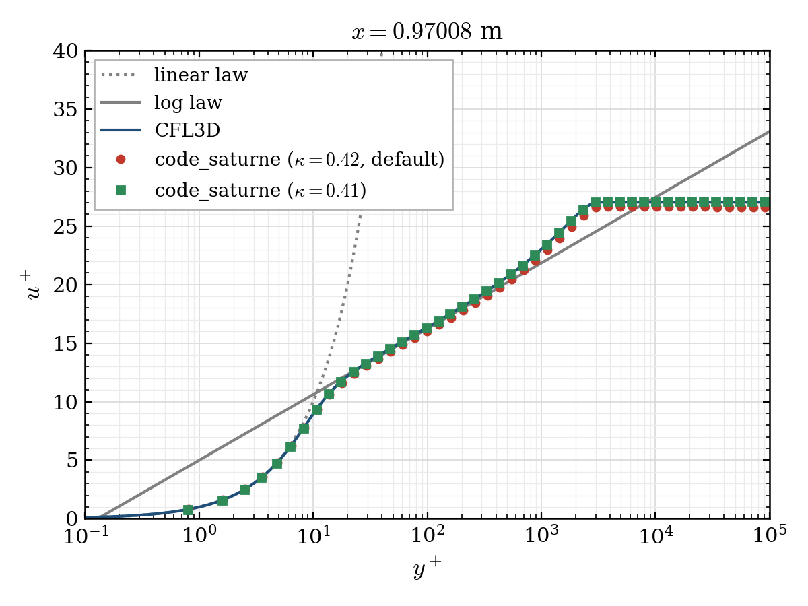

# Turbulent Flat Plate (Zero Pressure Gradient)

A step-by-step tutorial for simulating the incompressible turbulent
boundary layer over a flat plate with **code_saturne**, using the
Spalart-Allmaras (SA) RANS model. Results are verified against reference data
from the
[NASA Langley Turbulence Modeling Resource (TMR)](https://turbmodels.larc.nasa.gov/flatplate.html).

Maintained by [Simvia](https://Simvia.tech/fr), part of the
[tutoriel-code_saturne](https://gitlab.com/Simvia/common-tools/tutoriel-code_saturne) collection.

## Learning objectives

After completing this tutorial you will be able to:

1. Set up an incompressible, steady **RANS** simulation in code_saturne from the GUI.
2. Configure the **Spalart-Allmaras** turbulence model and consistent freestream values.
3. Apply inlet / outlet / symmetry / no-slip wall boundary conditions on a structured mesh.
4. Drive a steady solution with **local (pseudo) time-stepping** and the **SIMPLEC** coupling.
5. Run the case in serial or parallel and locate the solver outputs (log, probes, EnSight fields).

## Prerequisites

| Requirement | Detail |
|---|---|
| code_saturne | **v9.1** |
| Background | Basic notions of RANS turbulence modelling and boundary-layer theory |

If code_saturne is not yet installed, build it from the
[official homepage](https://www.code-saturne.org/cms/web/Download), pull a
ready-to-use Singularity image from the
[Open Simulation Center](https://open-simulation-center.org/downloads/code_saturne/code_saturne),
or pull the
[Simvia Docker image](https://hub.docker.com/r/Simvia/code_saturne) before continuing.

## Case files

```
Inc_Turbulent_Plate/
├── CASE/
│   ├── DATA/
│   │   └── setup.xml          # pre-configured GUI case
│   └── SRC/
│       └── cs_user_parameters.cpp   # user routine: sets the SA von Karman constant
├── FIGURES/                   # figures used in this README
└── README.md
```

## Physical model

The flow is **steady, incompressible and fully turbulent**, governed by the
Reynolds-Averaged Navier-Stokes (RANS) equations closed with the one-equation
**Spalart-Allmaras** model for the modified eddy viscosity $\tilde{\nu}$:

$$
\nabla\cdot\mathbf{u}=0,\qquad
\rho\,(\mathbf{u}\cdot\nabla)\mathbf{u}
= -\nabla p + \nabla\cdot\!\big[(\mu+\mu_t)\,(\nabla\mathbf{u}+\nabla\mathbf{u}^{\mathsf T})\big].
$$

The eddy viscosity is $\mu_t=\rho\,\tilde{\nu}\,f_{v1}$, with $\tilde{\nu}$ obtained
from its own transport equation. The case is run with the **incompressible**
solver, the freestream Mach number ($M_\infty\approx0.2$) is low enough that
compressibility is negligible for this verification exercise.

### Flow parameters

| Quantity | Symbol | Value | Source in `setup.xml` |
|---|---|---|---|
| Density | $\rho$ | $1.32905\ \mathrm{kg\,m^{-3}}$ | `physical_properties/density` |
| Dynamic viscosity | $\mu$ | $1.84592\times10^{-5}\ \mathrm{Pa\,s}$ | `molecular_viscosity` |
| Kinematic viscosity | $\nu=\mu/\rho$ | $1.389\times10^{-5}\ \mathrm{m^2\,s^{-1}}$ | derived |
| Inlet velocity | $U_\infty$ | $69.4448\ \mathrm{m\,s^{-1}}$ | `inlet/velocity_pressure/norm` |
| Reference length | $L$ | $1\ \mathrm{m}$ | (geometry) |
| Reynolds number | $Re_L$ | $5\times10^{6}$ | derived (see below) |
| Freestream $\tilde{\nu}$ | $\tilde{\nu}_\infty$ | $4.2\times10^{-5}\ \mathrm{m^2\,s^{-1}}$ | `turbulence/formula` |

The Reynolds number is recovered directly from the prescribed properties:

$$
Re_L=\frac{\rho\,U_\infty\,L}{\mu}
=\frac{1.32905\times 69.4448\times 1}{1.84592\times10^{-5}}\approx 5\times10^{6}.
$$

The SA freestream value follows the standard recommendation
$\tilde{\nu}_\infty=3\nu\approx4.2\times10^{-5}\ \mathrm{m^2\,s^{-1}}$, which yields a
small but non-trivial freestream turbulent viscosity and matches the TMR setup.

## Geometry and boundary conditions

The plate spans $0\le x\le 2\ \mathrm{m}$ with its leading edge at the origin.
Upstream of the leading edge ($-0.33\le x\le 0$) a **symmetry** plane removes the
inlet boundary layer so that it starts developing exactly at $x=0$. The domain is
$1\ \mathrm{m}$ tall.

| Boundary | Location | Nature | Prescribed value | Zone id |
|---|---|---|---|---|
| `inlet` | left ($x=-0.33$) | Inlet | $U_\infty=69.4448\ \mathrm{m\,s^{-1}}$, $\tilde{\nu}=4.2\times10^{-5}$ | 100 |
| `outlet1` | right ($x=2$) | Outlet | $\partial\mathbf{u}/\partial n=0$, $p$ Dirichlet | 200 |
| `outlet2` | top ($y=1$) | Outlet (free-stream) | $\partial\mathbf{u}/\partial n=0$, $p$ Dirichlet | 300 |
| `sym` | bottom, $x<0$ | Symmetry | (none) | 400 |
| `wall` | bottom, $0\le x\le2$ | No-slip wall | $\mathbf{u}=\mathbf{0}$ | 500 |
| `front` | spanwise plane ($z=0$) | Symmetry | (none) | 600 |
| `back` | spanwise plane ($z=1$) | Symmetry | (none) | 601 |

<p align="center">
  
  <br>
  <em>Figure 1: Mesh and boundary conditions (z = 0.5 m slice): inlet (blue),
  outlets (green/yellow), symmetry (orange) and no-slip wall (pink). The mesh is
  strongly refined toward the wall to resolve the viscous sublayer
  ($y^+\lesssim 1$).</em>
</p>

> The figure is illustrative (coarsened). The grid is built directly by
> code_saturne's **built-in cartesian mesher** (defined in `setup.xml`, no
> external mesh file): **546 x 67 cells** (one cell thick in $z$). The wall-normal
> direction uses a **geometric law with growth ratio 1.2** from the wall, giving a
> first-cell height of about $1\times10^{-6}\ \mathrm{m}$ ($y^+\approx0.2$,
> wall-resolved); the streamwise direction is uniform with a node at the leading
> edge. The two spanwise planes (`front`/`back`) carry a symmetry condition, so the
> computation is effectively two-dimensional.

## Numerical setup

| Setting | Value | Rationale |
|---|---|---|
| Velocity-pressure coupling | **SIMPLEC** | Robust segregated coupling for steady incompressible flow |
| Time-stepping | **Local (pseudo) time step** | Accelerates convergence to steady state by using a per-cell time step |
| Reference time step | $\Delta t_\mathrm{ref}=10^{-5}\ \mathrm{s}$ | Seed value, bounded by min/max factors $[0.1,\,1000]$ |
| Max Courant number | 20 | Caps the local time step away from the wall |
| Iterations | **3000** | Steady state reached well within this budget |
| Turbulence model | Spalart-Allmaras | One-equation model, well suited to attached wall-bounded flows |
| Initialization | $\mathbf{u}=(U_\infty,0,0)$, $\tilde{\nu}=4.2\times10^{-5}$ | Freestream start consistent with the inlet |

Four monitoring **probes** track convergence inside the boundary layer at
$x=0.5$ and $x=1.0\ \mathrm{m}$, placed close to the wall at $y=0.0005\ \mathrm{m}$
and $y=0.002\ \mathrm{m}$. Sitting in the near-wall region, they are sensitive
indicators of when the boundary layer has reached steady state.

## Running the simulation

The commands below start from the tutorial directory:

```bash
cd Inc_Turbulent_Plate/
```

### Option A: Graphical interface

```bash
code_saturne gui CASE/DATA/setup.xml &
```

The GUI opens the pre-configured `setup.xml`. Review the setup if you wish,
then launch the run with the **gear (Run) button** in the toolbar. To run in
parallel, set the number of processes under
**Calculation management > Performance settings** before launching.

### Option B: Command line

The command-line launcher is run from inside the case directory:

```bash
cd CASE

# serial
code_saturne run

# parallel (e.g. 4 MPI ranks)
code_saturne run --nprocs 4
```

The mesh is light (about 37 k cells), so the case runs quickly; parallel is
optional but still convenient.

Each run creates a time-stamped directory `CASE/RESU/<YYYYMMDD-HHMM>/` containing:

- `run_solver.log`: solver log and residual history,
- `monitoring/`: probe time series (`probes_*.csv`),
- `postprocessing/`: volume and boundary fields in EnSight Gold format.

## Results and verification

The figures below illustrate the converged solution and compare it against
reference data from the NASA Langley TMR database. The two quantities of
interest are the boundary-layer velocity profile (taken at $x=0.97\ \mathrm{m}$
and normalized by $U_\infty$) and the wall skin-friction coefficient:

$$
C_f=\frac{\tau_w}{\tfrac{1}{2}\,\rho\,U_\infty^{2}},
$$

where $\tau_w$ is the wall shear stress.

### Velocity profile

<p align="center">
  
  <br>
  <em>Figure 2: Boundary-layer velocity profile at x = 0.97 m. code_saturne
  (both $\kappa=0.42$ and $\kappa=0.41$) overlays the CFL3D reference (blue) across
  the whole boundary layer.</em>
</p>

### Skin-friction coefficient

<p align="center">
  
  <br>
  <em>Figure 3: Skin-friction coefficient along the plate. With the default
  $\kappa = 0.42$ (red), code_saturne lies a few percent above the CFL3D
  reference (blue), forcing the SA-standard $\kappa = 0.41$ (green) brings it
  onto the reference. See the discussion below.</em>
</p>

The figure compares code_saturne against CFL3D for two values of the
Spalart-Allmaras von Karman constant $\kappa$:

- **$\kappa = 0.42$ (code_saturne default), red.** With the built-in constant,
  $C_f$ sits about 3 to 4% above the reference. The standard SA model used by the
  NASA codes uses $\kappa = 0.41$, and through the log law this difference sets
  the offset.
- **$\kappa = 0.41$ (green).** The case ships with a small user routine,
  `CASE/SRC/cs_user_parameters.cpp`, that overrides the default to the
  SA-standard value. $C_f$ then lands on CFL3D (agreement to within 0.1% at
  $x = 0.97$ m). This file doubles as a minimal example of how to customize a
  model constant in code_saturne.

The velocity profile and
the law of the wall match the reference across the boundary layer, confirming a
correctly resolved SA simulation.

### Law of the wall

<p align="center">
  
  <br>
  <em>Figure 4: Wall-unit velocity profile at x = 0.97 m. code_saturne follows
  the linear law in the viscous sublayer ($y^+\lesssim 5$) then the log law. The
  near-wall resolution ($y^+<1$) is confirmed by the points reaching down to
  $y^+\approx0.2$. In the wake, $\kappa=0.41$ (green) reaches the CFL3D plateau,
  while the default $\kappa=0.42$ (red) sits slightly below it.</em>
</p>

## Summary

This tutorial set up and validated an incompressible turbulent flat-plate
simulation in code_saturne with the Spalart-Allmaras model. The velocity profile
and the law of the wall match the CFL3D reference across the boundary layer, and
the skin-friction coefficient agrees to within a few percent, the small offset
being fully explained by the model constant ($\kappa$) and the Mach number of
the reference. This case is a good starting point for more complex attached
wall-bounded RANS simulations.

## References

- NASA Langley Turbulence Modeling Resource, [2D Zero Pressure Gradient Flat Plate](https://tmbwg.github.io/turbmodels/flatplate.html)
- P. R. Spalart and S. R. Allmaras, *A One-Equation Turbulence Model for Aerodynamic Flows*, AIAA Paper 92-0439, 1992.
- [code_saturne documentation](https://www.code-saturne.org/cms/web/documentation)

## Authors

[Simvia](https://Simvia.tech/fr) - Questions, remarks and requests are welcome.
