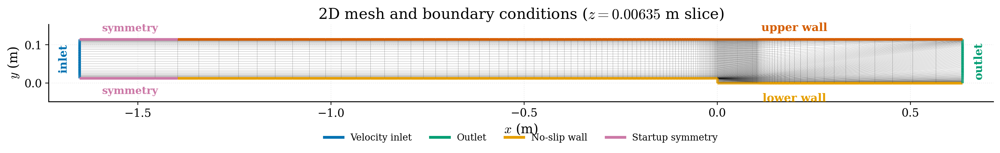
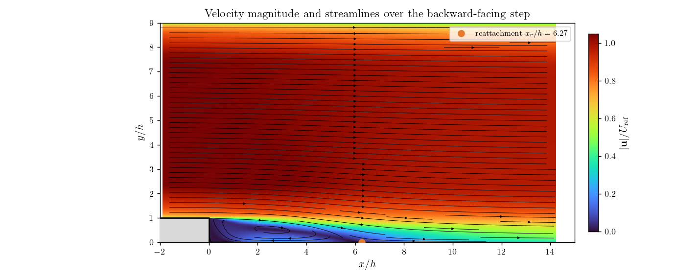
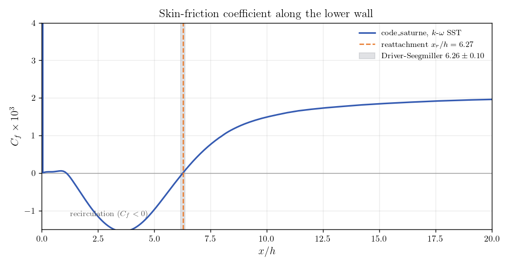

# Turbulent Backward-Facing Step (Driver-Seegmiller)

A step-by-step tutorial for simulating the incompressible turbulent flow over a
backward-facing step with **code_saturne**, using the $k$-$\omega$ **SST** RANS
model. The sudden expansion separates the boundary layer at the step edge and
produces a recirculation bubble that reattaches downstream. The reattachment
length is verified against the
[Driver & Seegmiller (1985)](https://doi.org/10.2514/3.8890) experiment, also
distributed as a
[NASA Turbulence Modeling Resource](https://turbmodels.larc.nasa.gov/backstep_val.html)
validation case.

Maintained by [Simvia](https://Simvia.tech/fr), part of the
[tutoriel-code_saturne](https://github.com/simvia-tech/tutorials-code_saturne) collection.

## Learning objectives

After completing this tutorial you will be able to:

1. Set up an incompressible, steady **RANS** simulation of a separated internal flow in code_saturne.
2. Configure the **$k$-$\omega$ SST** turbulence model with consistent inlet values.
3. Apply inlet / outlet / no-slip wall / symmetry boundary conditions on a wall-refined mesh.
4. Drive a steady solution with **local (pseudo) time-stepping** and the **SIMPLEC** coupling.
5. Extract the wall skin-friction coefficient and verify the **reattachment length** against experiment.

## Prerequisites

| Requirement | Detail |
|---|---|
| code_saturne | **v9.1** |
| Background | Basic notions of RANS turbulence modelling, boundary-layer separation and reattachment |

If code_saturne is not yet installed, build it from the
[official homepage](https://code-saturne.org/), pull a
ready-to-use Singularity image from the
[Open Simulation Center](https://open-simulation-center.org/downloads/code_saturne/code_saturne),
or pull the
[Simvia Docker image](https://hub.docker.com/r/Simvia/code_saturne) before continuing.

## Case files

```
Inc_Turbulent_Step/
├── CASE/
│   └── DATA/
│       └── setup.xml          # pre-configured GUI case
├── MESH/
│   └── backwardFacingStep.med # wall-refined hexahedral mesh
├── FIGURES/                   # figures used in this README
└── README.md
```

## Physical model

The flow is **steady, incompressible and fully turbulent**, governed by the
Reynolds-Averaged Navier-Stokes (RANS) equations closed with the two-equation
$k$-$\omega$ **SST** model:

$$
\nabla\cdot\mathbf{u}=0,\qquad
\rho\,(\mathbf{u}\cdot\nabla)\mathbf{u}
= -\nabla p + \nabla\cdot\!\big[(\mu+\mu_t)\,(\nabla\mathbf{u}+\nabla\mathbf{u}^{\mathsf T})\big].
$$

The SST model blends a near-wall $k$-$\omega$ formulation with a $k$-$\varepsilon$
behaviour in the free stream and is a standard choice for adverse-pressure-gradient
and separated flows such as this one. The flow is isothermal, single-phase and
gravity is neglected.

### Flow parameters

| Quantity | Symbol | Value | Source in `setup.xml` |
|---|---|---|---|
| Density | $\rho$ | $1\ \mathrm{kg\,m^{-3}}$ | `physical_properties/.../density` |
| Dynamic viscosity | $\mu$ | $1.56\times10^{-5}\ \mathrm{Pa\,s}$ | `molecular_viscosity` |
| Kinematic viscosity | $\nu=\mu/\rho$ | $1.56\times10^{-5}\ \mathrm{m^2\,s^{-1}}$ | derived |
| Inlet velocity | $U_{\mathrm{ref}}$ | $44.2\ \mathrm{m\,s^{-1}}$ | `inlet/velocity_pressure/norm` |
| Step height | $h$ | $0.0127\ \mathrm{m}$ | (geometry) |
| Inlet $k$ | $k_\infty$ | $1.0904\times10^{-3}\ \mathrm{m^2\,s^{-2}}$ | `inlet/turbulence/formula` |
| Inlet $\omega$ | $\omega_\infty$ | $7766.6\ \mathrm{s^{-1}}$ | `inlet/turbulence/formula` |
| Reference pressure | $p_{\mathrm{ref}}$ | $101325\ \mathrm{Pa}$ | `reference_pressure` |

The Reynolds number based on the step height is

$$
Re_h=\frac{\rho\,U_{\mathrm{ref}}\,h}{\mu}
=\frac{1\times44.2\times0.0127}{1.56\times10^{-5}}\approx 3.60\times10^{4}.
$$

The inlet turbulence is set from a turbulence intensity $I=0.061\%$ and a
viscosity ratio $\nu_t/\nu=0.009$, matching the reference free-stream conditions:

$$
k_\infty=\tfrac{3}{2}\left(U_{\mathrm{ref}}I\right)^2\approx1.0904\times10^{-3}\ \mathrm{m^2\,s^{-2}},
\qquad
\omega_\infty=\frac{k_\infty}{(\nu_t/\nu)\,\nu}\approx7766.6\ \mathrm{s^{-1}}.
$$

## Geometry and boundary conditions

The step of height $h$ is located at $x=0$. Upstream, the lower wall sits at $y=h$
so the incoming channel is $8h$ tall; downstream it drops to $y=0$, giving a $9h$
channel and an **expansion ratio of $9/8=1.125$**. The domain extends far enough
upstream and downstream to remove any influence of the inlet and outlet on the
separated region.

| Direction | Extent | Normalized |
|---|---:|---:|
| Streamwise $x$ | $-1.651$ to $0.635\ \mathrm{m}$ | $-130h$ to $50h$ |
| Vertical $y$ | $0$ to $0.1143\ \mathrm{m}$ | $0$ to $9h$ |
| Spanwise $z$ | $0$ to $0.0127\ \mathrm{m}$ | $0$ to $h$ (one cell) |

The no-slip walls begin about $110h$ upstream of the step; the short sections
between the inlet and the start of the walls are treated as **symmetry** so the
uniform inlet stream enters cleanly before the boundary layers develop.

| Mesh group | code_saturne type | Physical role |
|---|---|---|
| `inlet` | Inlet | Uniform streamwise inflow $U_{\mathrm{ref}}$, prescribed $k,\omega$ |
| `outlet` | Outlet | Downstream flow exit |
| `lowerWall` | Wall | Lower no-slip wall and step surface |
| `upperWall` | Wall | Upper no-slip wall |
| `lowerWallStartup` / `upperWallStartup` | Symmetry | Short inlet-startup sections |
| `front` / `back` | Symmetry | Faces of the thin extrusion (2D formulation) |

<p align="center">
  
  <br>
  <em>Figure 1: Mid-span mesh and boundary-condition assignment. The mesh is
  strongly refined toward the walls and around the step corner. The front and
  back faces (normal to the spanwise direction) are symmetry boundaries and are
  not visible in this $x$-$y$ slice.</em>
</p>

The supplied hexahedral mesh (`MESH/backwardFacingStep.med`) has **20 540 cells**
(41 746 boundary faces), one cell thick in $z$, refined so that $y^+\lesssim1$
over most of the lower wall.

## Numerical setup

| Setting | Value | Source in `setup.xml` |
|---|---|---|
| Flow model | Incompressible | `velocity_pressure` |
| Turbulence model | $k$-$\omega$ SST | `turbulence model="k-omega-SST"` |
| Steady strategy | Local (pseudo) time-stepping | `time_parameters/time_passing` |
| Velocity-pressure coupling | SIMPLEC | `velocity_pressure_algo` |
| Pseudo-iterations | 2000 | `time_parameters/iterations` |
| Reference time step | $10^{-4}\ \mathrm{s}$ | `time_step_ref` |
| Max Courant / Fourier | 1 / 10 | `max_courant_num` / `max_fourier_num` |
| Gravity | Disabled | `gravity` |

Because local time-stepping is used to reach a steady state, the reported "time"
is a **pseudo-time** and does not represent a physical duration. The velocity and
turbulence fields are initialized with the inlet values.

## Running the simulation

From the tutorial directory:

### Option A: Graphical interface

```bash
code_saturne gui CASE/DATA/setup.xml &
```

Review the pre-configured setup, then launch with the **Run** button. Set the
number of processes under **Calculation management > Performance settings** for a
parallel run.

### Option B: Command line

```bash
cd CASE
code_saturne run              # serial
code_saturne run --n 4        # parallel (4 MPI ranks)
```

Each run creates a time-stamped `CASE/RESU/<id>/` containing `run_solver.log`,
`monitoring/` (probe CSV time series) and `postprocessing/` (EnSight Gold volume
and boundary fields, including the wall `boundary_stress` used below).

## Results and verification

### Recirculation and reattachment

<p align="center">
  
  <br>
  <em>Figure 2: Velocity magnitude (normalized by $U_{\mathrm{ref}}$) and
  streamlines near the step. The flow separates at the edge, a recirculation
  bubble forms along the lower wall under a turbulent shear layer, and the mean
  flow reattaches at $x_r/h=6.27$ (orange marker).</em>
</p>

### Skin friction and reattachment length

The mean reattachment point is where the lower-wall streamwise skin-friction
coefficient changes sign from negative (reversed near-wall flow) to positive:

$$
C_f=\frac{\tau_{w,x}}{\tfrac12\rho U_{\mathrm{ref}}^2}.
$$

The wall shear is read directly from the `boundary_stress` field exported on
`lowerWall`.

<p align="center">
  
  <br>
  <em>Figure 3: Lower-wall skin-friction coefficient. $C_f<0$ inside the
  recirculation bubble; the first downstream zero-crossing gives the reattachment
  length, which falls inside the experimental band.</em>
</p>

| Quantity | code_saturne ($k$-$\omega$ SST) | Reference |
|---|---:|---:|
| Reattachment length $x_r/h$ | **6.27** | $6.26\pm0.10$ (Driver & Seegmiller) |
| Lower-wall resolution $y^+$ | $\approx0.8$ mean (below 1 over most of the wall) | target $\lesssim1$ |

The computed reattachment length agrees with the experiment to within its
uncertainty. The near-wall mesh keeps $y^+$ below one over most of the lower wall,
so the boundary layer is wall-resolved (no wall functions); $y^+$ rises to a few
units only very locally near the sharp step corner, where the shear peaks.

## Summary

This tutorial set up and verified a turbulent backward-facing step at
$Re_h=3.6\times10^4$ with the $k$-$\omega$ SST model. The steady RANS solution
reproduces the separation, recirculation and reattachment of the Driver-Seegmiller
experiment, and the extracted reattachment length $x_r/h=6.27$ matches the
measured $6.26\pm0.10$. The case is a compact, reproducible benchmark for
separated-flow turbulence modelling and for extracting wall quantities from the
boundary output.

Note that a single-cell spanwise extrusion models the flow as two-dimensional,
the inlet is uniform rather than a measured boundary-layer profile, and a steady
RANS model returns only the mean flow. These are standard simplifications for this
verification exercise.

## References

1. D. M. Driver and H. L. Seegmiller, "Features of a Reattaching Turbulent Shear Layer in Divergent Channel Flow," *AIAA Journal*, vol. 23, no. 2, pp. 163-171, 1985.
2. NASA Langley Turbulence Modeling Resource, *2D Backward-Facing Step*: https://turbmodels.larc.nasa.gov/backstep_val.html
3. F. R. Menter, "Two-equation eddy-viscosity turbulence models for engineering applications," *AIAA Journal*, vol. 32, no. 8, pp. 1598-1605, 1994.
4. code_saturne documentation: https://code-saturne.org/doc/

## Authors

[Simvia](https://Simvia.tech/fr) - Questions, remarks and requests are welcome.
