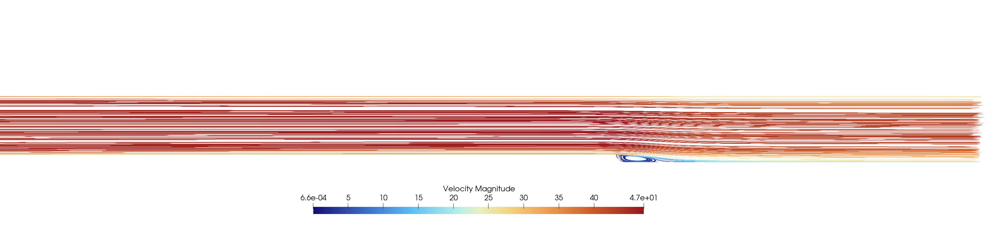

# Turbulent flow over a backward-facing step

This tutorial models steady incompressible turbulent flow through a channel containing a backward-facing step. The sudden expansion forces the boundary layer to separate at the step edge, producing a recirculation bubble, a free shear layer and a downstream reattachment region.

The configuration follows the well-known Driver and Seegmiller benchmark. It is implemented here as a self-contained **code_saturne 9.1** case using the $k$-$\omega$ SST turbulence model.

Maintained by [Simvia](https://Simvia.tech/fr), part of the
[tutoriel-code_saturne](https://github.com/simvia-tech/tutorials-code_saturne) collection.

## Learning objectives

This case illustrates how to:

1. set up a two-dimensional turbulent internal-flow calculation using a thin extruded mesh.
2. apply inlet, outlet, no-slip wall and symmetry boundary conditions.
3. initialize and prescribe the $k$-$\omega$ SST turbulence variables.
4. use local pseudo-time stepping to obtain a steady RANS solution.
5. visualize separation, recirculation and reattachment behind a sudden expansion.

## Prerequisites

| Requirement | Detail |
|---|---|
| code_saturne | **v9.1** |
| Background | Basic notions of incompressible aerodynamics and potential (inviscid) flow theory |

If code_saturne is not yet installed, build it from the
[official homepage](https://code-saturne.org/), pull a
ready-to-use Singularity image from the
[Open Simulation Center](https://open-simulation-center.org/downloads/code_saturne/code_saturne),
or pull the
[Simvia Docker image](https://hub.docker.com/r/Simvia/code_saturne) before continuing.

## Case files

```
Inc_Turbulent_Step/
├── CASE/
│   ├── DATA/
│   │   └── setup.xml          # pre-configured GUI case
├── MESH/
│   └── backwardFacingStep.med
├── FIGURES/                   # figures used in this README
└── README.md
```

## Physical problem

A fully turbulent stream enters a rectangular channel and encounters a downward-facing step at $x=0$. The flow separates from the sharp step edge. A low-speed recirculation zone forms along the lower wall, bounded above by a turbulent shear layer. Farther downstream, the shear layer reaches the wall and the mean flow reattaches.

The principal reference quantities are:

| Quantity | Symbol | Value |
|---|---:|---:|
| Reference velocity | $U_{\mathrm{ref}}$ | $44.2\ \mathrm{m\,s^{-1}}$ |
| Step height | $h$ | $0.0127\ \mathrm{m}$ |
| Density | $\rho$ | $1.0\ \mathrm{kg\,m^{-3}}$ |
| Dynamic viscosity | $\mu$ | $1.56\times10^{-5}\ \mathrm{Pa\,s}$ |
| Kinematic viscosity | $\nu=\mu/\rho$ | $1.56\times10^{-5}\ \mathrm{m^2\,s^{-1}}$ |
| Reference pressure | $p_{\mathrm{ref}}$ | $101325\ \mathrm{Pa}$ |
| Reference temperature | $T_{\mathrm{ref}}$ | $293.15\ \mathrm{K}$ |

The Reynolds number based on the step height is

$$
Re_h=\frac{\rho U_{\mathrm{ref}}h}{\mu}
=\frac{1\times44.2\times0.0127}{1.56\times10^{-5}}
\approx 3.60\times10^4.
$$

The benchmark mean reattachment location is approximately

$$
\frac{x_r}{h}=6.26\pm0.10,
$$

where $x_r$ is measured downstream from the step.

The flow is assumed to be:

- incompressible;
- isothermal;
- single-phase and non-reacting;
- statistically steady;
- two-dimensional, represented by one hexahedral cell layer in the spanwise direction;
- unaffected by gravity and buoyancy.

## Geometry

The domain dimensions are expressed naturally using the step height $h$:

| Direction | Dimensional extent | Normalized extent |
|---|---:|---:|
| Streamwise, $x$ | $-1.651$ to $0.635\ \mathrm{m}$ | $-130h$ to $50h$ |
| Vertical, $y$ | $0$ to $0.1143\ \mathrm{m}$ | $0$ to $9h$ |
| Spanwise, $z$ | $0$ to $0.0127\ \mathrm{m}$ | $0$ to $h$ |

Upstream of the step, the lower wall is located at $y=h$, so the incoming channel height is $8h$. Downstream, the lower wall is located at $y=0$, giving a channel height of $9h$ and an expansion ratio of $9/8$.

The no-slip wall sections start at $x=-1.397\ \mathrm{m}=-110h$. The short regions between the inlet and this position are treated as symmetry boundaries. This allows the imposed uniform inlet flow to enter cleanly before the boundary layers develop over the long upstream wall sections.

## Governing equations

The mean flow is governed by the steady incompressible Reynolds-averaged Navier--Stokes equations:

$$
\nabla\cdot\mathbf{u}=0,
$$

$$
\rho\left(\mathbf{u}\cdot\nabla\right)\mathbf{u}
=-\nabla p
+\nabla\cdot\left[
\left(\mu+\mu_t\right)
\left(\nabla\mathbf{u}+\nabla\mathbf{u}^{T}\right)
\right].
$$

The Reynolds stresses are closed with the $k$-$\omega$ SST eddy-viscosity model. This model blends a near-wall $k$-$\omega$ formulation with a $k$-$\varepsilon$-type behaviour away from walls and is commonly used for adverse-pressure-gradient and separated flows.

## Mesh

The supplied mesh is located at:

```text
MESH/backwardFacingStep.med
```

It is a structured, wall-refined hexahedral mesh containing:

| Mesh quantity | Value |
|---|---:|
| Cells | 20,540 |
| Vertices | 41,748 |
| Interior faces | 40,747 |
| Boundary faces | 41,746 |
| Spanwise cell layers | 1 |

The mesh is strongly refined close to the upper and lower walls, around the step corner and throughout the downstream shear-layer and reattachment region. The front and back faces of the thin extrusion are assigned symmetry conditions, giving an effectively two-dimensional calculation.

<p align="center">
  
  <br>
  <em>Figure 1: Mid-span mesh and boundary-condition assignment. The front and back faces, which are normal to the spanwise direction, are symmetry boundaries and are not visible in this $x$-$y$ slice.</em>
</p>

The mesh boundary groups are:

| Mesh group | code_saturne type | Physical role |
|---|---|---|
| `inlet` | Inlet | Uniform streamwise inflow |
| `outlet` | Outlet | Downstream flow exit |
| `lowerWall` | Wall | Lower no-slip wall and step surface |
| `upperWall` | Wall | Upper no-slip wall |
| `lowerWallStartup` | Symmetry | Short lower inlet-startup section |
| `upperWallStartup` | Symmetry | Short upper inlet-startup section |
| `front` | Symmetry | Front face of the thin extrusion |
| `back` | Symmetry | Back face of the thin extrusion |

## Running the simulation

The commands below start from the tutorial directory:

```bash
cd Inc_Turbulent_Step/
```

### Option A: Graphical interface

```bash
code_saturne gui CASE/DATA/setup.xml &
```

The GUI opens the pre-configured `setup.xml`. Review the setup if you wish,
then launch the run with the **gear (Run) button** in the toolbar. To run in
parallel, set the number of processes under
**Calculation management > Performance settings** before launching.

### Option B: Command line

The command-line launcher is run from inside the case directory:

```bash
cd CASE

# serial
code_saturne run

# parallel (e.g. 2 MPI ranks)
code_saturne run --n 2
```
This small 2D case will run comfortably with 2 parallel cores.

Each run creates a time-stamped directory `CASE/RESU/<YYYYMMDD-HHMM>/` containing:

- `run_solver.log`: solver log and residual history,
- `monitoring/`: probe time series (`probes_*.csv`),
- `postprocessing/`: volume and boundary fields in EnSight Gold format.

### Flow and turbulence models

| Setting | Value |
|---|---|
| Flow model | Incompressible flow |
| Regime | Steady RANS using local pseudo-time stepping |
| Turbulence model | $k$-$\omega$ SST |
| Velocity-pressure coupling | SIMPLEC |
| Gravity | Disabled |
| Number of pseudo-iterations | 2000 |
| Reference pseudo-time step | $10^{-4}\ \mathrm{s}$ |
| Maximum Courant number | 1 |
| Maximum Fourier number | 10 |
| Result output | At the end of the calculation |
| Default parallel execution | 2 MPI processes |

Because local time stepping is used to converge a steady solution, the accumulated value reported as time is a **pseudo-time** and should not be interpreted as the physical duration of a transient event.

### Initial conditions

The complete domain is initialized with the uniform velocity

$$
\mathbf{u}_0=(44.2,\ 0,\ 0)\ \mathrm{m\,s^{-1}}.
$$

The turbulence variables are initialized using the same values imposed at the inlet:

$$
k=0.0010904\ \mathrm{m^2\,s^{-2}},
$$

$$
\omega=7766.6\ \mathrm{s^{-1}}.
$$

### Inlet turbulence quantities

The inlet turbulence intensity is

$$
I=0.061\%=6.1\times10^{-4}.
$$

The turbulent kinetic energy is computed from

$$
k=\frac{3}{2}\left(U_{\mathrm{ref}}I\right)^2,
$$

which gives

$$
k=\frac{3}{2}\left(44.2\times6.1\times10^{-4}\right)^2
\approx 0.0010904\ \mathrm{m^2\,s^{-2}}.
$$

Using an inlet turbulent-to-laminar viscosity ratio

$$
\frac{\nu_t}{\nu}=0.009,
$$

and the $k$-$\omega$ relation $\nu_t=k/\omega$, the specific dissipation rate is

$$
\omega=\frac{k}{0.009\nu}
\approx 7766.6\ \mathrm{s^{-1}}.
$$

These values are prescribed directly in `setup.xml`. A hydraulic diameter of $0.2032\ \mathrm{m}$ is also stored in the inlet definition, although the turbulence quantities are imposed through the explicit formula above.

### Boundary conditions

- **Inlet:** normal velocity of $44.2\ \mathrm{m\,s^{-1}}$ with prescribed $k$ and $\omega$.
- **Outlet:** standard code_saturne outlet condition allowing the flow to leave the domain.
- **Upper and lower walls:** stationary no-slip walls.
- **Upper and lower startup sections:** symmetry conditions.
- **Front and back faces:** symmetry conditions, enforcing the effectively two-dimensional formulation.

## Monitoring

Three probes are defined in `setup.xml`:

| Probe | Coordinates $(x,y,z)$ in m | Purpose |
|---:|---|---|
| 1 | $(-0.05,\ 0.05,\ 0.00635)$ | Upstream flow before the step |
| 2 | $(0.0127,\ 0.004,\ 0.00635)$ | Near-step recirculation region, $x/h=1$ |
| 3 | $(0.0381,\ 0.004,\ 0.00635)$ | Downstream recirculation region, $x/h=3$ |

Probe values are written in CSV format at every pseudo-iteration. Useful monitored fields include the velocity components, pressure, $k$, $\omega$, turbulent viscosity and wall distance.

## Post-processing

The most useful quantities for this case are:

- velocity magnitude and streamlines;
- streamwise velocity $u_x/U_{\mathrm{ref}}$;
- wall shear stress on `lowerWall`;
- skin-friction coefficient;
- pressure coefficient along the lower wall;
- turbulent kinetic energy $k$;
- specific dissipation rate $\omega$;
- turbulent viscosity;
- wall $y^+$;
- velocity profiles at selected downstream positions.

The lower-wall skin-friction coefficient may be defined as

$$
C_f=\frac{\tau_{w,x}}{\tfrac{1}{2}\rho U_{\mathrm{ref}}^2},
$$

where $\tau_{w,x}$ is the streamwise wall shear stress. Inside the recirculation region, $C_f$ is negative. The mean reattachment point is identified where $C_f$ changes from negative to positive downstream of the step.

A pressure coefficient may similarly be defined as

$$
C_p=\frac{p-p_{\mathrm{ref}}}{\tfrac{1}{2}\rho U_{\mathrm{ref}}^2}.
$$

## Results

### Velocity field and recirculation

<p align="center">
  
  <br>
  <em>Figure 2: Streamlines coloured by velocity magnitude in the backward-facing-step channel.</em>
</p>

The streamline pattern shows the principal physical features of the case:

- separation occurs at the sharp step edge;
- a low-velocity recirculation bubble forms immediately downstream of the step;
- a turbulent shear layer develops between the recirculating flow and the high-speed outer stream;
- the shear layer expands toward the lower wall before the flow recovers farther downstream;
- the upstream channel remains predominantly aligned with the streamwise direction.

The recirculation region is visible qualitatively in Figure 2. A streamline image alone is not sufficient for quantitative validation, however. The computed reattachment location should be extracted from the lower-wall shear stress or from the sign change of the near-wall streamwise velocity and compared with the benchmark value $x_r/h=6.26\pm0.10$.

## Validation procedure

For a quantitative comparison:

1. extract the streamwise wall stress on `lowerWall`;
2. compute $C_f$ using $U_{\mathrm{ref}}=44.2\ \mathrm{m\,s^{-1}}$;
3. normalize the streamwise coordinate by the step height, $x/h$;
4. locate the first downstream zero crossing of $C_f$ from negative to positive;
5. compare the resulting $x_r/h$ with $6.26\pm0.10$;
6. optionally compare $C_p$, normalized velocity profiles and Reynolds shear stress with the experimental data.

This tutorial currently provides the configured case and qualitative velocity visualization. It does not include a precomputed quantitative validation curve, so agreement with the experimental reattachment length should not be assumed without carrying out the procedure above.

## Discussion and limitations

The case is suitable for studying turbulent separation and for testing the behaviour of a RANS turbulence model in a strong adverse-pressure-gradient region. Important limitations are:

- the geometry is treated as two-dimensional through a single spanwise cell layer;
- the inlet velocity is uniform rather than a measured experimental boundary-layer profile;
- the startup symmetry sections are a numerical simplification used before the no-slip development length;
- the result depends on near-wall mesh resolution and wall treatment;
- a steady RANS model predicts the mean flow and does not resolve instantaneous turbulent structures;
- quantitative validation requires extraction of wall and profile data, which is not included as a ready-made plot in this version.

The case should therefore be used as a reproducible turbulence benchmark and learning example rather than as a complete high-fidelity representation of every detail of the original experiment.

## References

1. D. M. Driver and H. L. Seegmiller, “Features of a Reattaching Turbulent Shear Layer in Divergent Channel Flow,” *AIAA Journal*, vol. 23, no. 2, pp. 163–171, 1985.
2. NASA Glenn Research Center, *Backward-Facing Step: Study No. 1*: https://www.grc.nasa.gov/WWW/wind/valid/backstep/backstep01/backstep01.html
3. NASA Turbulence Modeling Resource: https://www.nasa.gov/nasa-turbulence-modeling-resource/
4. F. R. Menter, “Two-equation eddy-viscosity turbulence models for engineering applications,” *AIAA Journal*, vol. 32, no. 8, pp. 1598–1605, 1994.
5. code_saturne documentation: https://www.code-saturne.org/
