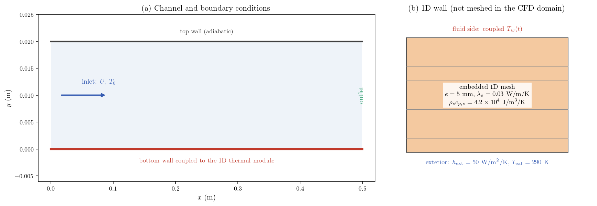
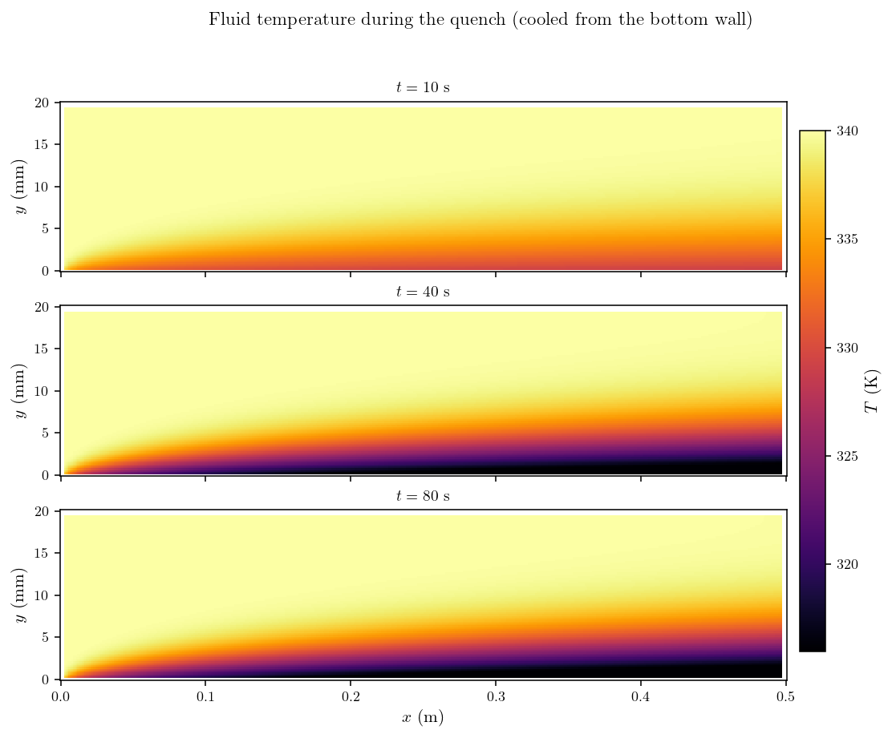
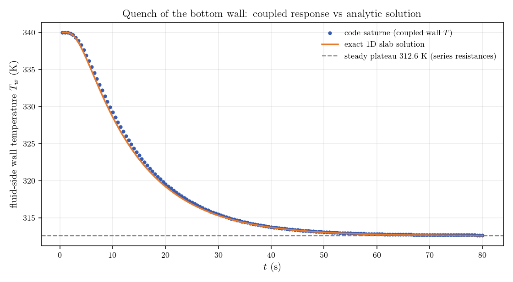

# 1D Wall Thermal Response (Quench of a Heated Channel)

A step-by-step tutorial for the **1D wall thermal module** of **code_saturne**:
the transient conduction across a solid wall is solved on an embedded 1D mesh,
coupled to the flow at the fluid-side face, without meshing the solid. A hot
laminar channel is quenched when the exterior of its bottom wall is suddenly
exposed to a cold environment, and the coupled wall temperature is verified
against the exact analytic solution of the 1D slab.

This module is the lightweight counterpart of conjugate heat transfer: where
[Th_Conjugate_Heat_Transfer](../Th_Conjugate_Heat_Transfer) meshes the solid and
couples volume zones, the 1D wall module only needs boundary faces and a wall
description (thickness, conductivity, capacity).

Maintained by [Simvia](https://Simvia.tech/fr), part of the
[tutoriel-code_saturne](https://github.com/simvia-tech/tutorials-code_saturne) collection.

## Learning objectives

After completing this tutorial you will be able to:

1. Activate the 1D wall thermal module (a routine-only feature, with no GUI path).
2. Select the coupled boundary faces and build the embedded 1D meshes across the wall thickness.
3. Prescribe the wall properties and the exterior boundary condition (Dirichlet with exchange coefficient) at every time step.
4. Run a true transient thermal calculation and monitor the coupled wall temperature.
5. Verify the coupled response against the exact analytic solution of a 1D slab.

## Prerequisites

| Requirement | Detail |
|---|---|
| code_saturne | **v9.1** |
| Background | Basic notions of transient heat conduction and convective heat transfer |

If code_saturne is not yet installed, build it from the
[official homepage](https://code-saturne.org/), pull a
ready-to-use Singularity image from the
[Open Simulation Center](https://open-simulation-center.org/downloads/code_saturne/code_saturne),
or pull the
[Simvia Docker image](https://hub.docker.com/r/Simvia/code_saturne) before continuing.

## Case files

```text
Th_1D_Wall_Thermal/
├── CASE/
│   ├── DATA/
│   │   └── setup.xml                    # pre-configured GUI case
│   └── SRC/
│       └── cs_user_1d_wall_thermal.cpp  # the showcased feature
├── FIGURES/                             # figures used in this README
└── README.md
```

There is no mesh file: the channel grid is built by code_saturne's internal
Cartesian mesher, directly from `setup.xml`.

## Physical model

The flow is **laminar, incompressible and truly transient** (physical time). The
fluid enters hot and in thermal equilibrium with the wall; the transient is
driven entirely by the wall quench. The temperature is a passive scalar:

$$
\rho c_p\left(\frac{\partial T}{\partial t}+\mathbf{u}\cdot\nabla T\right)
=\nabla\cdot(k_f\nabla T).
$$

Inside the bottom wall, the module solves the 1D transient conduction equation
across the thickness on its own embedded mesh:

$$
\rho_s c_{p,s}\frac{\partial T}{\partial t}
=\lambda_s\frac{\partial^2 T}{\partial x_n^2},
\qquad 0\le x_n\le e,
$$

coupled to the fluid at $x_n=0$ (the wall face temperature seen by the flow) and
exposed at $x_n=e$ to a cold exterior through an exchange coefficient:

$$
-\lambda_s\frac{\partial T}{\partial x_n}\Big|_{x_n=e}
=h_{\mathrm{ext}}\left(T-T_{\mathrm{ext}}\right).
$$

At $t=0$ the whole system (fluid and wall) is at $T_0$ and the cold exterior is
switched on: the wall quenches, and its fluid-side temperature relaxes toward
the steady balance between interior convection, wall conduction and exterior
convection.

### Flow parameters

| Parameter | Value | Unit | Source |
|---|---:|---|---|
| Inlet velocity $U$ | 0.5 | $\mathrm{m\,s^{-1}}$ | `setup.xml`: `inlet/velocity_pressure/norm` |
| Inlet and initial temperature $T_0$ | 340 | K | `setup.xml`: `inlet` thermal `dirichlet` |
| Density $\rho$ | 1.2 | $\mathrm{kg\,m^{-3}}$ | `setup.xml`: `density` |
| Dynamic viscosity $\mu$ | $1.8\times10^{-5}$ | $\mathrm{Pa\,s}$ | `setup.xml`: `molecular_viscosity` |
| Specific heat $c_p$ | 1005 | $\mathrm{J\,kg^{-1}\,K^{-1}}$ | `setup.xml`: `specific_heat` |
| Fluid conductivity $k_f$ | 0.025 | $\mathrm{W\,m^{-1}\,K^{-1}}$ | `setup.xml`: `thermal_conductivity` |

With the channel height $H=0.02\ \mathrm{m}$ ($D_h=2H$), the Reynolds number is
$Re_{D_h}=\rho U D_h/\mu\approx1330$ (laminar) and $Pr\approx0.72$.

### Wall parameters (the 1D module)

| Parameter | Value | Unit | Source |
|---|---:|---|---|
| Thickness $e$ | 5 | mm | `cs_user_1d_wall_thermal.cpp` |
| Conductivity $\lambda_s$ | 0.03 | $\mathrm{W\,m^{-1}\,K^{-1}}$ | `cs_user_1d_wall_thermal.cpp` |
| Capacity $\rho_s c_{p,s}$ | $4.2\times10^{4}$ | $\mathrm{J\,m^{-3}\,K^{-1}}$ | `cs_user_1d_wall_thermal.cpp` |
| Points across the thickness | 20 (grading 1.1) | - | `cs_user_1d_wall_thermal.cpp` |
| Exterior temperature $T_{\mathrm{ext}}$ | 290 | K | `cs_user_1d_wall_thermal.cpp` |
| Exterior coefficient $h_{\mathrm{ext}}$ | 50 | $\mathrm{W\,m^{-2}\,K^{-1}}$ | `cs_user_1d_wall_thermal.cpp` |

The wall diffusivity $\alpha_s=\lambda_s/(\rho_s c_{p,s})\approx7.1\times10^{-7}\
\mathrm{m^2\,s^{-1}}$ gives a conduction time $e^2/\alpha_s\approx35\ \mathrm{s}$:
the 80 s simulated reach the steady plateau.

## Geometry and boundary conditions

The domain is a plane channel of length $L=0.5\ \mathrm{m}$ and height
$H=0.02\ \mathrm{m}$, one cell thick in $z$. The grid (100 x 40 cells) is built by
the internal Cartesian mesher and refined geometrically toward the bottom wall.

| Boundary | Type | Condition |
|---|---|---|
| `inlet` ($x=0$) | Inlet | $U=0.5\ \mathrm{m\,s^{-1}}$, $T_0=340\ \mathrm{K}$ |
| `outlet` ($x=L$) | Outlet | Standard outlet |
| `bottom_wall` ($y=0$) | Wall | No slip; thermal BC replaced by the 1D wall module |
| `top_wall` ($y=H$) | Wall | No slip, adiabatic |
| `front` / `back` | Symmetry | Quasi-2D |

<p align="center">
  
  <br>
  <em>Figure 1: (a) Channel and boundary conditions. (b) The 1D wall attached to
  the bottom boundary: it exists only as an embedded 1D conduction mesh, not in
  the CFD domain.</em>
</p>

## The user routine (the feature)

The module has **no GUI path**: it activates when
`CASE/SRC/cs_user_1d_wall_thermal.cpp` declares a positive number of coupled
faces. The routine is called with three purposes:

1. **Call 1**: count the coupled faces. Here the `bottom_wall` GUI zone is
   retrieved with `cs_boundary_zone_by_name` and its face count sets
   `nfpt1d` (a positive value activates the module).
2. **Call 2**: list the faces (`ifpt1d`, in increasing order) and build each
   embedded 1D mesh: `nppt1d` points, thickness `eppt1d`, grading `rgpt1d`
   (refined on the fluid side), initial temperature `tppt1d`.
3. **Call 3** (every time step): set the exterior boundary condition
   (`iclt1d = 1`: Dirichlet with exchange coefficient, `tept1d`, `hept1d`) and
   the wall properties (`xlmbt1`, `rcpt1d`), and advance the 1D solve with the
   local fluid time step (`dtpt1d`).

On the fluid side, the module then imposes the computed wall face temperature as
the thermal boundary condition: no thermal wall setting is needed in the GUI for
`bottom_wall`.

## Numerical setup

| Setting | Value |
|---|---:|
| Time scheme | True transient, fixed $\Delta t=0.01\ \mathrm{s}$ |
| Time steps | 8000 (80 s) |
| Velocity-pressure algorithm | SIMPLEC |
| Turbulence | Off (laminar) |
| Gravity | Off |

## Running the simulation

From the tutorial directory:

### Option A: Graphical interface

```bash
code_saturne gui CASE/DATA/setup.xml &
```

Review the setup, then launch with the **Run** button. The user routine in
`CASE/SRC/` is compiled automatically.

### Option B: Command line

```bash
cd CASE
code_saturne run              # serial
code_saturne run --n 4        # parallel (4 MPI ranks)
```

Each run creates a time-stamped `CASE/RESU/<id>/` containing `run_solver.log`,
`monitoring/` (probe CSV) and `postprocessing/` (EnSight fields, including the
boundary temperature used below).

## Results and verification

### Fluid response

<p align="center">
  
  <br>
  <em>Figure 2: Fluid temperature during the quench. A cold thermal boundary
  layer grows from the bottom wall and thickens downstream while the wall
  temperature drops.</em>
</p>

### Wall temperature vs the exact 1D solution

The coupled wall temperature (averaged on the bottom wall around mid-channel,
$0.2<x<0.3\ \mathrm{m}$) is compared with the **exact analytic solution** of the
1D slab with convection on both faces: interior fluid at $T_0$ with the exchange
coefficient measured from the run
($h_{\mathrm{int}}\approx4.4\ \mathrm{W\,m^{-2}\,K^{-1}}$, close to the laminar
correlation value $Nu_{D_h}=7.54$, i.e. $4.7\ \mathrm{W\,m^{-2}\,K^{-1}}$),
exterior at $T_{\mathrm{ext}}$ with $h_{\mathrm{ext}}$. The solution is the
classical eigenfunction series, and its $t\to\infty$ limit is the plateau given
by the series thermal resistances
$1/h_{\mathrm{int}}+e/\lambda_s+1/h_{\mathrm{ext}}$.

<p align="center">
  
  <br>
  <em>Figure 3: Quench of the bottom wall. The coupled code_saturne response
  follows the exact slab solution within 0.6 K and settles on the
  series-resistance plateau.</em>
</p>

| Quantity | code_saturne | Analytic |
|---|---:|---:|
| Wall temperature history (0 to 80 s) | - | max deviation **0.6 K**, mean 0.2 K |
| Steady plateau | 312.7 K | 312.6 K |

The agreement is within 0.6 K over a 27 K quench (about 2 percent of the
transient amplitude); the residual deviation comes mainly from the slow axial
growth of the thermal boundary layer, which the 1D model represents through a
single constant $h_{\mathrm{int}}$.

## Summary

This tutorial activated the 1D wall thermal module of code_saturne on the bottom
wall of a hot laminar channel and quenched it through a cold exterior condition.
The feature is entirely driven by one user routine (face selection, embedded 1D
meshes, per-step exterior condition), since it has no GUI path, and couples back
to the flow through the wall face temperature. The computed response matches the
exact 1D slab solution within 0.6 K up to the series-resistance plateau. The
module is the light alternative to conjugate heat transfer whenever the wall can
be treated as locally one-dimensional; for meshed solids and multidimensional
conduction, see the internal-coupling tutorial
[Th_Conjugate_Heat_Transfer](../Th_Conjugate_Heat_Transfer).

## References

1. code_saturne documentation: <https://code-saturne.org/doc/>.
2. H. S. Carslaw and J. C. Jaeger, *Conduction of Heat in Solids*, 2nd ed., Oxford University Press, 1959.
3. F. P. Incropera, D. P. DeWitt, T. L. Bergman, and A. S. Lavine, *Fundamentals of Heat and Mass Transfer*, Wiley.

## Authors

[Simvia](https://Simvia.tech/fr) - Questions, remarks and requests are welcome.
