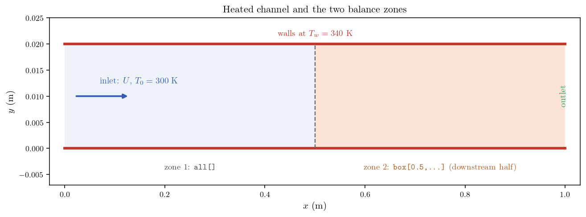
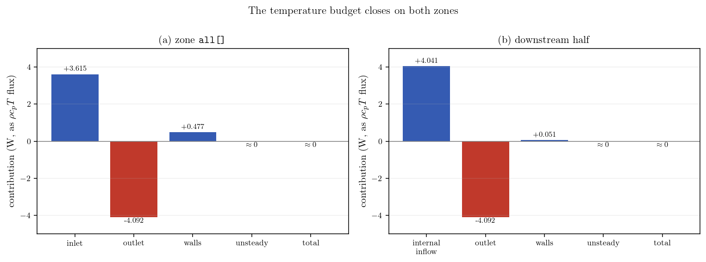
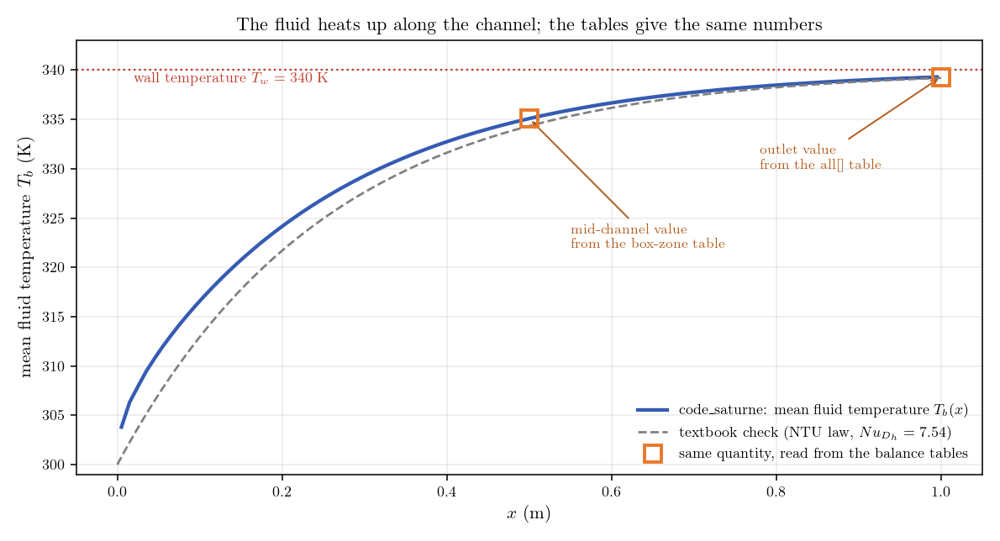

# Balances by Zone (Energy Budget of a Heated Channel)

When you run a thermal calculation, the first engineering question is **"where
does the energy go?"**: how much enters with the flow, how much the walls
supply, how much leaves, and does it all add up. Extracting this by hand from
exported fields is tedious and approximate. code_saturne can print this audit
itself, exactly, during the run: one call to `cs_balance_by_zone` gives the
term-by-term budget of a variable over any group of cells, and
`cs_pressure_drop_by_zone` does the same for the pressure drop.

This tutorial shows how, on a deliberately simple case where every number can be
checked by hand: a laminar channel heated by its walls. The printed budget
closes to machine precision, the wall heat input equals the enthalpy gained by
the flow, and the temperatures deduced from the tables match the analytic
solution.

Maintained by [Simvia](https://Simvia.tech/fr), part of the
[tutoriel-code_saturne](https://github.com/simvia-tech/tutorials-code_saturne) collection.

## Learning objectives

After completing this tutorial you will be able to:

1. Request the budget of a scalar over any zone with `cs_balance_by_zone` in `cs_user_extra_operations`.
2. Read the printed table: convective boundary terms, wall (diffusive) terms, internal-boundary terms of a partial zone, unsteady term and closure.
3. Convert the table entries into physical quantities (wall power, enthalpy rise, bulk temperatures).
4. Request a pressure-drop budget with `cs_pressure_drop_by_zone` and build the mechanical-energy drop from it.
5. Know that zone balances require a uniform time step (a local pseudo-steady time step makes the terms inconsistent).

## Prerequisites

| Requirement | Detail |
|---|---|
| code_saturne | **v9.1** |
| Background | Basic notions of convective heat transfer |

If code_saturne is not yet installed, build it from the
[official homepage](https://code-saturne.org/), pull a
ready-to-use Singularity image from the
[Open Simulation Center](https://open-simulation-center.org/downloads/code_saturne/code_saturne),
or pull the
[Simvia Docker image](https://hub.docker.com/r/Simvia/code_saturne) before continuing.

## Case files

```text
Th_Balance_By_Zone/
├── CASE/
│   ├── DATA/
│   │   └── setup.xml                      # pre-configured GUI case
│   └── SRC/
│       └── cs_user_extra_operations.cpp   # the showcased feature
├── FIGURES/                               # figures used in this README
└── README.md
```

There is no mesh file: the channel grid is built by code_saturne's internal
Cartesian mesher, directly from `setup.xml`.

## Physical model

Air ($\rho=1.2\ \mathrm{kg\,m^{-3}}$, $\mu=1.8\times10^{-5}\ \mathrm{Pa\,s}$,
$c_p=1005\ \mathrm{J\,kg^{-1}\,K^{-1}}$, $k_f=0.025\ \mathrm{W\,m^{-1}\,K^{-1}}$)
enters a plane channel ($L=1\ \mathrm{m}$, $H=0.02\ \mathrm{m}$, one cell in
$z$) at $U=0.1\ \mathrm{m\,s^{-1}}$ and $T_0=300\ \mathrm{K}$; both walls are
held at $T_w=340\ \mathrm{K}$. The flow is laminar
($Re_{D_h}=267$) and marched with a uniform time step to steady state.

For constant wall temperature the bulk temperature follows the analytic NTU law

$$
T_b(x)=T_w-(T_w-T_0)\,e^{-NTU\,x/L},
\qquad
NTU=\frac{h\,P\,L}{\dot m\,c_p},
$$

with $h$ from the laminar fully developed correlation $Nu_{D_h}=7.54$, giving
$NTU=3.91$ and an outlet bulk temperature of 339.2 K.

<p align="center">
  
  <br>
  <em>Figure 1: The heated channel and the two zones on which budgets are
  requested: the whole domain (<code>all[]</code>) and the downstream half
  (a <code>box[...]</code> selection).</em>
</p>

## The balances (the feature)

The whole feature is three calls in `CASE/SRC/cs_user_extra_operations.cpp`,
executed at the last time step:

```c
cs_balance_by_zone("all[]", "temperature");
cs_balance_by_zone("box[0.5, -0.1, -0.1, 1.1, 0.1, 0.1]", "temperature");
cs_pressure_drop_by_zone("all[]");
```

Each call prints a table in `run_solver.log`. For the scalar budget the entries
are the contributions of every mechanism to the zone balance, expressed as
$\rho c_p T$ fluxes integrated over one time step (J per step): boundary
convection (Inlet/Outlet), wall diffusion (Smooth W.), internal-boundary
convection for partial zones (IB inlet/outlet), the unsteady term, and their
Total with a normalized closure indicator.

Two practical points matter:

- **Uniform time step required.** The entries are per-time-step integrals: with
  a local (pseudo-steady) time step each face is weighted by its own
  $\Delta t$ and the table becomes inconsistent (this case marches to steady
  state with a true uniform $\Delta t$ for that reason).
- **Dividing by $\Delta t$ turns entries into powers** (W), and dividing a
  convective entry by $\dot m\,c_p\,\Delta t$ recovers a bulk temperature.

## Numerical setup

| Setting | Value |
|---|---:|
| Time scheme | Uniform $\Delta t=0.005\ \mathrm{s}$, 8000 steps (40 s, steady) |
| Velocity-pressure algorithm | SIMPLEC |
| Turbulence | Off (laminar) |

## Running the simulation

From the tutorial directory:

```bash
cd CASE
code_saturne run              # serial
code_saturne run --n 4        # parallel (4 MPI ranks)
```

The user routine in `CASE/SRC/` is compiled automatically; the three balance
tables appear at the end of `RESU/<id>/run_solver.log`.

## Results and verification

### The budget closes and the wall flux equals the enthalpy rise

<p align="center">
  
  <br>
  <em>Figure 2: The temperature budget printed by
  <code>cs_balance_by_zone</code>, converted to watts. On both zones the terms
  sum to zero (normalized closure $10^{-11}$), and the wall contribution
  balances the convective deficit exactly.</em>
</p>

| Quantity (from the tables) | Whole domain | Downstream half |
|---|---:|---:|
| Normalized closure | $-8\times10^{-12}$ | $-2\times10^{-12}$ |
| Wall power | 0.4771 W | 0.0509 W |
| Convective enthalpy rise | 0.4772 W | 0.0510 W |

### The tables give the physically meaningful numbers

The mean fluid temperature $T_b(x)$ (the flow-rate-weighted average over a
cross-section, i.e. the temperature a perfectly mixed sample would have) rises
from 300 K toward the wall temperature along the channel. Dividing a convective
entry of a table by $\dot m\,c_p\,\Delta t$ gives exactly this temperature at
the boundary of the zone: 335.1 K at mid-channel (from the downstream-zone
table) and 339.3 K at the outlet (from the `all[]` table), identical to the
values computed independently from the exported fields.

<p align="center">
  
  <br>
  <em>Figure 3: Mean fluid temperature along the channel (blue), heating up
  toward the 340 K walls. The two orange squares are not computed from the
  fields: they are read directly from the balance tables, and land exactly on
  the curve. The dashed line is the textbook NTU check; the small offset in the
  first half is the thermal entrance region, where the real transfer exceeds
  the fully developed correlation used by the textbook curve.</em>
</p>

### Mechanical-energy drop from the pressure-drop table

`cs_pressure_drop_by_zone` prints the boundary integrals of $p\,u$, of
$\tfrac12\rho u^2\,u$ and of the flow rate. Combining them gives the drop of
mechanical energy per unit flow rate:

$$
\Delta\Big(p+\tfrac{\rho u^2}{2}\Big)
=\frac{[\,\int(p+\tfrac12\rho u^2)\,\mathbf{u}\cdot\mathrm{d}\mathbf{S}\,]_{\mathrm{in}}^{\mathrm{out}}}{Q}
=0.0547\ \mathrm{Pa},
$$

against $12\,\mu\,U\,L/H^{2}=0.054\ \mathrm{Pa}$ for developed Poiseuille flow
(1.3 percent, the small excess being the entrance loss). Note that the static
pressure drop alone would not match, because part of the inlet pressure is
converted into the kinetic energy of the developing parabolic profile.

## Summary

This tutorial audited the energy of a thermal calculation with three calls in
`cs_user_extra_operations`: the temperature budget over the whole channel and
over its downstream half, and the pressure drop over the domain. The tables
close to machine precision, the wall flux equals the convective enthalpy rise
on both zones, the bulk temperatures recovered from the tables match the
offline averages exactly and follow the analytic NTU law, and the
mechanical-energy drop matches Poiseuille within 1.3 percent. Zone balances are
the quickest rigorous check of a thermal calculation (where does the energy
enter, leave, accumulate), with one caveat: they require a uniform time step.

## References

1. code_saturne documentation: <https://code-saturne.org/doc/>.
2. F. P. Incropera, D. P. DeWitt, T. L. Bergman, and A. S. Lavine, *Fundamentals of Heat and Mass Transfer*, Wiley.

## Authors

[Simvia](https://Simvia.tech/fr) - Questions, remarks and requests are welcome.
