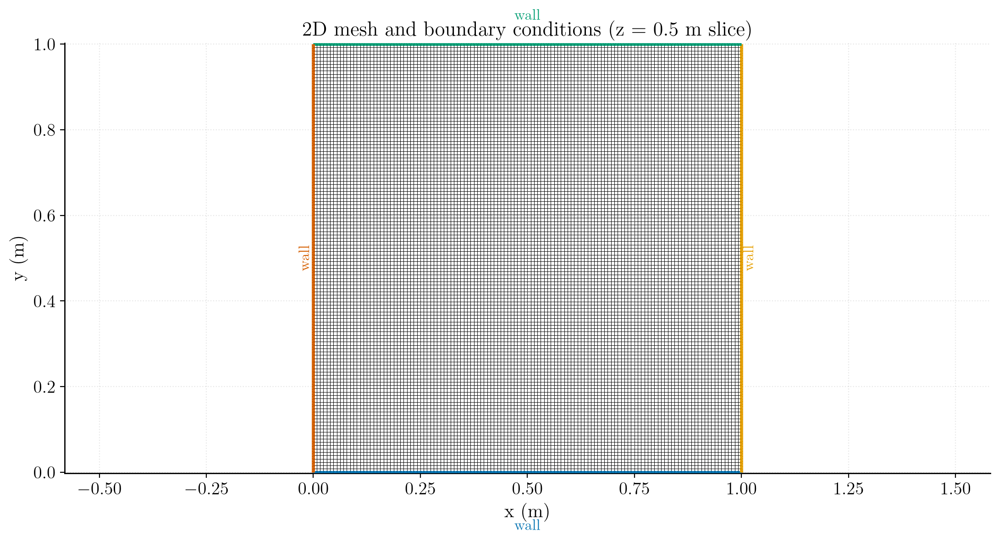
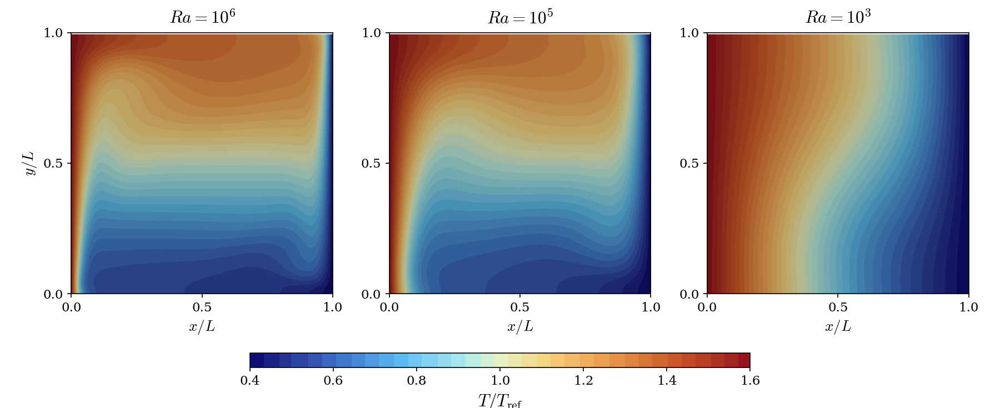
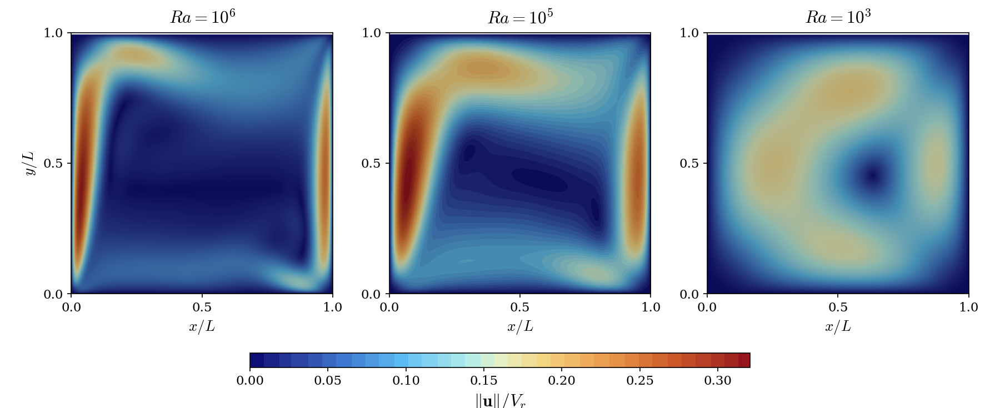
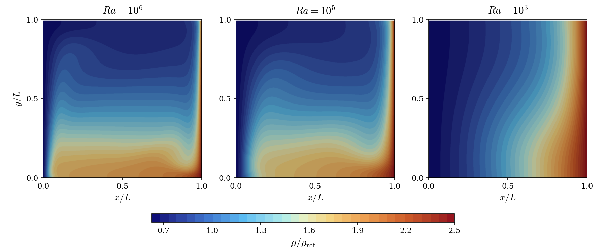
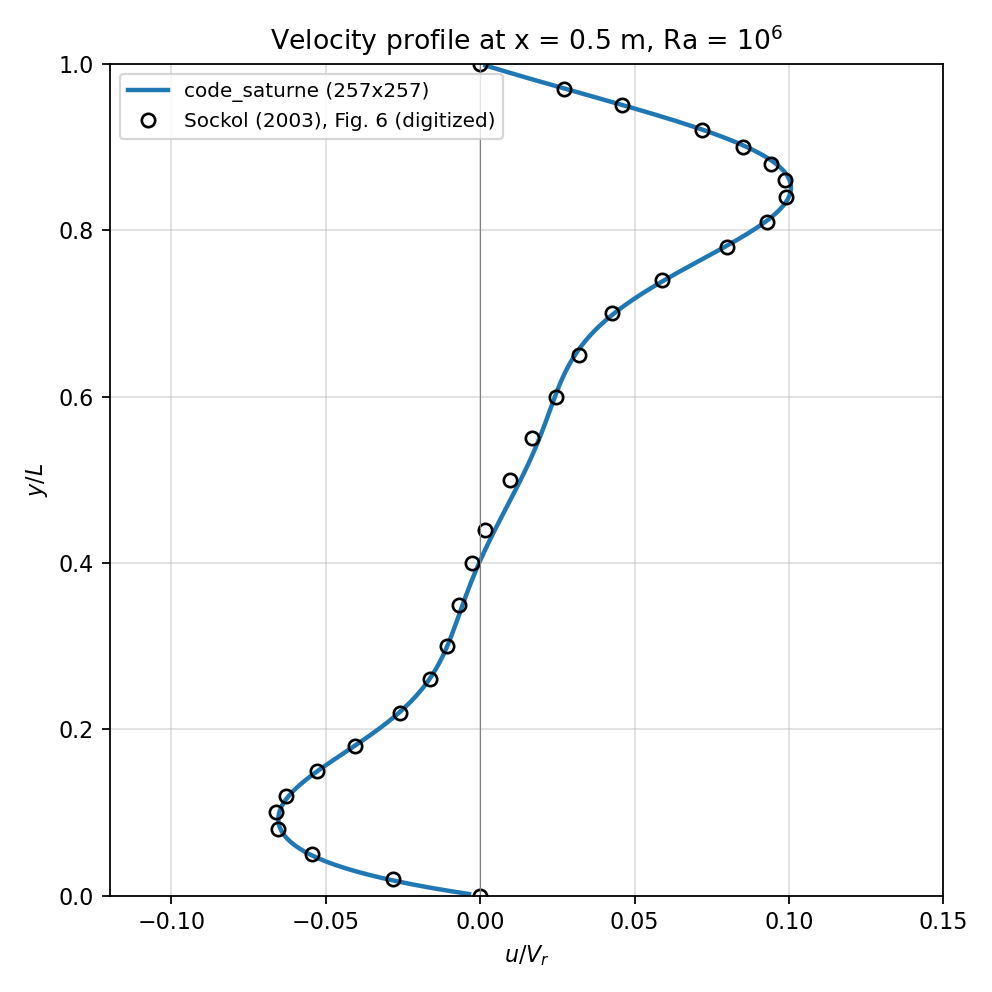

# Buoyancy-Driven Laminar Cavity

A step-by-step tutorial for simulating the steady, laminar, buoyancy-driven flow of air in a closed square cavity with a large temperature difference, using **code_saturne**. The case follows the benchmark of Sockol (2003) and is a good entry point to natural convection with variable density.

Maintained by [Simvia](https://Simvia.tech/fr), part of the
[tutoriel-code_saturne](https://github.com/simvia-tech/tutorials-code_saturne) collection.

## Learning objectives

After completing this tutorial you will be able to:

1. Set up a steady, **buoyancy-driven** simulation in code_saturne from the GUI.
2. Apply no-slip wall (isothermal and adiabatic) and symmetry boundary conditions on a quadrilateral mesh.
3. Model a variable density with an **ideal gas** user law.
4. Choose the operating pressure $p_0$ to target a prescribed **Rayleigh number**.
5. Drive a steady solution with **local (pseudo) time-stepping** and the **SIMPLEC** coupling.
6. Run the case in serial or parallel and locate the solver outputs (log, probes, EnSight fields).

## Prerequisites

| Requirement | Detail |
|---|---|
| code_saturne | **v9.1** |
| Background | Basic notions of natural convection and laminar low Mach number flow theory |

If code_saturne is not yet installed, build it from the
[official homepage](https://www.code-saturne.org/cms/web/Download), pull a
ready-to-use Singularity image from the
[Open Simulation Center](https://open-simulation-center.org/downloads/code_saturne/code_saturne),
or pull the
[Simvia Docker image](https://hub.docker.com/r/Simvia/code_saturne) before continuing.

## Case files

```
Th_Buoyant_Cavity/
├── CASE/
│   └── DATA/
│       ├── setup.xml          # pre-configured GUI case (Ra = 10³)
│       └── run.cfg            # run parameters for `code_saturne run`
├── FIGURES/                   # figures used in this README
└── README.md
```

## Physical model

The flow is **steady, laminar and buoyancy-driven**. The cavity is closed (no inlet or outlet): the motion is generated only by the density differences induced by the heated and cooled vertical walls. Because the wall temperature ratio is large ($T_h/T_c = 4$), the Boussinesq approximation is not valid and the density is treated as a variable through the **ideal gas law**, in the low Mach number limit. Strictly speaking the flow is therefore not incompressible ($\nabla \cdot \mathbf{u} \neq 0$) but **dilatable**: the dynamic pressure $p_{dyn}$ stays decoupled from the density, which depends only on the temperature and the uniform operating pressure $p_0$, so the case is solved with the same pressure-based algorithm as the other cases of this collection.

The solver marches the following coupled system to steady state (viscous dissipation neglected):

$$
\begin{cases}
\rho = \dfrac{p_0}{R_s\,T} \\[8pt]
\nabla \cdot (\rho\,\mathbf{u}) = 0 \\[6pt]
\nabla \cdot (\rho\,\mathbf{u} \otimes \mathbf{u}) =
  -\nabla p_{dyn} + \nabla \cdot \boldsymbol{\tau} + \rho\,\mathbf{g} \\[6pt]
\rho\,c_p\,(\mathbf{u} \cdot \nabla)\,T = \nabla \cdot (\kappa\,\nabla T)
\end{cases}
$$

where $R_s$ is the specific gas constant and $\boldsymbol{\tau} = \mu(\nabla\mathbf{u} + (\nabla\mathbf{u})^T) - \frac{2}{3}\mu(\nabla \cdot \mathbf{u})\,\mathbf{I}$ is the viscous stress tensor, whose $\frac{2}{3}\mu(\nabla \cdot \mathbf{u})$ contribution is retained since $\nabla \cdot \mathbf{u} \neq 0$.

### Flow parameters

| Quantity | Symbol | Value | Source in `setup.xml` |
|---|---|---|---|
| Density | $\rho$ | ideal gas user law (see below) | `physical_properties/density/formula` |
| Dynamic viscosity | $\mu$ | $1.716 \times 10^{-5}\ \mathrm{Pa\,s}$ | `molecular_viscosity` |
| Specific heat | $c_p$ | $1004.703\ \mathrm{J\,kg^{-1}\,K^{-1}}$ | `specific_heat` |
| Thermal conductivity | $\kappa$ | $0.0246295\ \mathrm{W\,m^{-1}\,K^{-1}}$ | `thermal_conductivity` |
| Prandtl number | $Pr = \mu c_p/\kappa$ | $0.70$ (Sockol's value) | derived |
| Hot wall temperature | $T_h$ | $461.04\ \mathrm{K}$ | `wall_left` Dirichlet value |
| Cold wall temperature | $T_c$ | $115.26\ \mathrm{K}$ | `wall_right` Dirichlet value |
| Reference temperature | $T_\mathrm{ref} = (T_h+T_c)/2$ | $288.15\ \mathrm{K}$ | `reference_temperature` |
| Reference length | $L$ | $1\ \mathrm{m}$ | (geometry) |
| Gravity | $g$ | $9.81\ \mathrm{m\,s^{-2}}$ (along $-y$) | `gravity` |
| Rayleigh number | $Ra$ | $10^3$, $10^5$ or $10^6$ | via `reference_pressure` (see below) |

The density is given by the ideal gas user law defined in the GUI:

```
density = p0 / (287.06 * temperature);
```

where `p0` is the **reference pressure** of the case and $R_s = 287.06\ \mathrm{J\,kg^{-1}\,K^{-1}}$ is the specific gas constant of air.

### Targeting a Rayleigh number

Following Sockol (2003), the Rayleigh number is defined with the dimensionless temperature difference $\Delta T = \dfrac{2(T_h - T_c)}{T_h + T_c} = 1.2$:

$$
Ra = \frac{\Delta T \, \rho^2 \, g \, c_p \, L^3}{\mu \, \kappa}
$$

In a closed cavity filled with an ideal gas, the density level is set by the operating pressure $p_0$. Isolating $\rho$ in the Rayleigh number definition gives the reference density required for a target $Ra$, and $p_0$ follows from the ideal gas law at the reference temperature:

$$
\rho_\mathrm{ref} = \sqrt{\frac{Ra \, \mu \, \kappa}{\Delta T \, g \, c_p \, L^3}},
\qquad
p_0 = \rho_\mathrm{ref} \, R_s \, T_\mathrm{ref}
$$

### Final values

| $Ra$ | $\rho_\mathrm{ref}$ (kg/m³) | $p_0$ (Pa) |
|--------|-------------------------|------------|
| $10^3$ | $1.8904 \times 10^{-4}$ | $15.64$ |
| $10^5$ | $1.8904 \times 10^{-3}$ | $156.4$ |
| $10^6$ | $5.9778 \times 10^{-3}$ | $494.5$ |

> **The shipped `setup.xml` is configured for $Ra = 10^3$** (`reference_pressure` = 15.64 Pa, density initial value = 1.8904e-4 kg/m³). To run another Rayleigh number, change these two values in the GUI (**Physical properties > Reference values** for the pressure, **Fluid properties > Density** for the initial value), using the table above.

## Geometry and boundary conditions

The domain is a closed square cavity ($1\ \mathrm{m} \times 1\ \mathrm{m}$) filled with air. All four boundaries are no-slip walls: the two vertical walls are isothermal (hot on the left, cold on the right) while the two horizontal walls are adiabatic. The two spanwise ($xy$) planes carry a **symmetry** condition, so the computation is effectively two-dimensional. Gravity acts in the negative $y$-direction. Heat transfer through the vertical walls causes density changes in the fluid, and the resulting buoyancy forces drive the flow: this is a classical natural convection benchmark for testing the pressure-based solver with heat transfer and variable density.

| Boundary | Location | Nature | Prescribed value | Zone id |
|---|---|---|---|---|
| `wall_top` | top ($y=1$) | Adiabatic wall | $\partial T/\partial n = 0$ | 1002 |
| `wall_bottom` | bottom ($y=0$) | Adiabatic wall | $\partial T/\partial n = 0$ | 1000 |
| `wall_left` | left ($x=0$) | Isothermal wall | $T = T_h = 461.04\ \mathrm{K}$ | 1003 |
| `wall_right` | right ($x=1$) | Isothermal wall | $T = T_c = 115.26\ \mathrm{K}$ | 1001 |
| `sym1` | spanwise plane ($z=0$) | Symmetry | (none) | 600 |
| `sym2` | spanwise plane ($z=1$) | Symmetry | (none) | 601 |

<p align="center">
  
  <br>
  <em>Figure 1: Mesh and boundary conditions (z = 0.5 m slice): walls (blue/green/yellow/orange).</em>
</p>

> The mesh is built directly by code_saturne's **built-in cartesian mesher**
> (defined in `setup.xml`, no external mesh file): 256 x 256 uniform cells (257
> uniformly spaced nodes in both the x- and y-directions).
> The two spanwise planes (`sym1`/`sym2`) carry a symmetry condition, so the
> computation is effectively two-dimensional.

## Numerical setup

| Setting | Value | Rationale |
|---|---|---|
| Velocity-pressure coupling | **SIMPLEC** | Robust segregated coupling for steady low Mach number flow |
| Time-stepping | **Local (pseudo) time step** | Accelerates convergence to steady state by using a per-cell time step |
| Reference time step | $\Delta t_\mathrm{ref}=0.05\ \mathrm{s}$ | Seed value, bounded by min/max factors $[0.1,\,1000]$ |
| Max Courant number | 1 | Caps the local time step |
| Iterations | **2000** | Steady state reached well within this budget |
| Initialization | $\mathbf{u}=(1,0,0)\ \mathrm{m\,s^{-1}}$, $T = 288.15\ \mathrm{K}$ | Uniform seed field; the converged flow is driven by buoyancy only |
| Gradient reconstruction | Automatic | Default choice |

Two monitoring **probes** track convergence inside the cavity at
($x=0.05\ \mathrm{m}$, $y=0.41\ \mathrm{m}$) and ($x=0.86\ \mathrm{m}$, $y=0.43\ \mathrm{m}$). Located in the near-wall boundary layers, they are sensitive indicators of when the flow within the whole cavity has reached steady state.

## Running the simulation

The commands below start from the tutorial directory:

```bash
cd Th_Buoyant_Cavity/
```

### Option A: Graphical interface

```bash
code_saturne gui CASE/DATA/setup.xml &
```

The GUI opens the pre-configured `setup.xml`. Review the setup if you wish,
then launch the run with the **gear (Run) button** in the toolbar. To run in
parallel, set the number of processes under
**Calculation management > Performance settings** before launching.

### Option B: Command line

The command-line launcher is run from inside the case directory:

```bash
cd CASE

# serial
code_saturne run

# parallel (e.g. 2 MPI ranks)
code_saturne run --nprocs 2
```

This 2D case runs fine in serial; 2 MPI processes are enough to speed it up.

Each run creates a time-stamped directory `CASE/RESU/<YYYYMMDD-HHMM>/` containing:

- `run_solver.log`: solver log and residual history,
- `monitoring/`: probe time series (`probes_*.csv`),
- `postprocessing/`: volume and boundary fields in EnSight Gold format.

## Results and verification

The figures below show the converged fields in dimensionless form: the temperature normalized by the reference temperature ($T/T_\mathrm{ref}$), the velocity magnitude normalized by the reference velocity of Sockol's benchmark ($\|\mathbf{u}\|/V_r$ with $V_r = \sqrt{Fr \, g \, L} = 3.431\ \mathrm{m\,s^{-1}}$, where $Fr = 1.2$ is the Froude number of the benchmark), and the density normalized by the reference density ($\rho/\rho_\mathrm{ref}$). For each quantity the three Rayleigh numbers share a single color scale.

### Dimensionless temperature field ($T/T_\mathrm{ref}$)

<p align="center">
  
  <br>
  <em>Figure 2: Dimensionless temperature fields for the three Rayleigh numbers.</em>
</p>

At $Ra = 10^6$, the isotherms are strongly distorted, the core of the cavity exhibits a marked horizontal thermal stratification, and heat transfer is clearly dominated by convection. At $Ra = 10^5$, the convective regime is moderate: convection contributes to the heat transfer without dominating it. Finally, at $Ra = 10^3$, the isotherms are nearly vertical and parallel, indicating very weak convection; the buoyancy forces are too small to significantly deform the thermal field, and heat is transferred essentially by conduction.

### Normalized velocity field ($\|\mathbf{u}\|/V_r$)

<p align="center">
  
  <br>
  <em>Figure 3: Normalized velocity magnitude fields for the three Rayleigh numbers.</em>
</p>

At $Ra = 10^6$, the high velocities are concentrated in thin boundary layers along the walls while the core of the cavity is nearly at rest, indicating an intense convection cell confined to the walls. At $Ra = 10^5$, the kinematic boundary layers thicken slightly and the core velocity remains low, reflecting a moderate convective flow. At $Ra = 10^3$, the velocity field reveals a single recirculation cell filling the whole cavity, with low and more uniformly distributed velocities; the flow is slow and organized, consistent with a regime where viscous forces dominate the buoyancy forces.

### Normalized density ($\rho/\rho_\mathrm{ref}$)

<p align="center">
  
  <br>
  <em>Figure 4: Normalized density fields for the three Rayleigh numbers.</em>
</p>

The normalized density field is directly tied to the temperature field (hot fluid is lighter, cold fluid is denser), so the observations follow the same trend. At $Ra = 10^3$, the iso-density lines are nearly vertical and parallel, with high density on the cold side and low density on the hot side, reflecting a state close to pure conduction with no significant mass redistribution. At $Ra = 10^5$, the density contours begin to deform, reflecting the growing influence of convection. At $Ra = 10^6$, the iso-density lines are strongly distorted and packed near the walls, confirming thin thermal boundary layers and a marked stratification in the core; the intense near-wall density gradients are precisely the driver of the buoyancy forces that sustain the convective flow.

### X-velocity along the vertical centerline for Ra = 10⁶

The profile uses the same Sockol normalization $u/V_r$ as the velocity fields above.

<p align="center">
  
  <br>
  <em>Figure 5: X-velocity profile along the vertical centerline (x = 0.5 m) for Ra = 10⁶: code_saturne compared with the reference solution of Sockol (2003), digitized from Fig. 6 of the paper (256 x 256 grid).</em>
</p>

The reference points were digitized from the published figure and therefore carry a small reading tolerance (about $\pm 0.005$ in $u/V_r$). Note that at this Rayleigh number, Sockol's results differ substantially from the earlier data of Yu et al. that the paper compares against; Sockol supports his own solution with a grid-convergence study up to $512^2$, and code_saturne agrees with it.

## Summary

This tutorial set up a steady, laminar, buoyancy-driven cavity flow with a large temperature difference in code_saturne, using an ideal gas density law and an operating pressure chosen to target the Rayleigh number. The computed centerline velocity profile agrees with the reference solution of Sockol (2003), and the temperature, velocity and density fields reproduce the expected transition from a conduction-dominated regime ($Ra = 10^3$) to a convection-dominated regime ($Ra = 10^6$). This case is a good starting point in natural convection for more complex buoyancy-driven CFD simulations.

## References

- Peter M. Sockol. Multigrid solution of the Navier-Stokes equations at low speeds with large temperature variations. Journal of Computational Physics, 192(2):570-592, 2003, [Buoyancy Driven Flow](https://www.sciencedirect.com/science/article/abs/pii/S0021999103004091)
- [code_saturne documentation](https://www.code-saturne.org/cms/web/documentation)

## Authors

[Simvia](https://Simvia.tech/fr) - Questions, remarks and requests are welcome.
