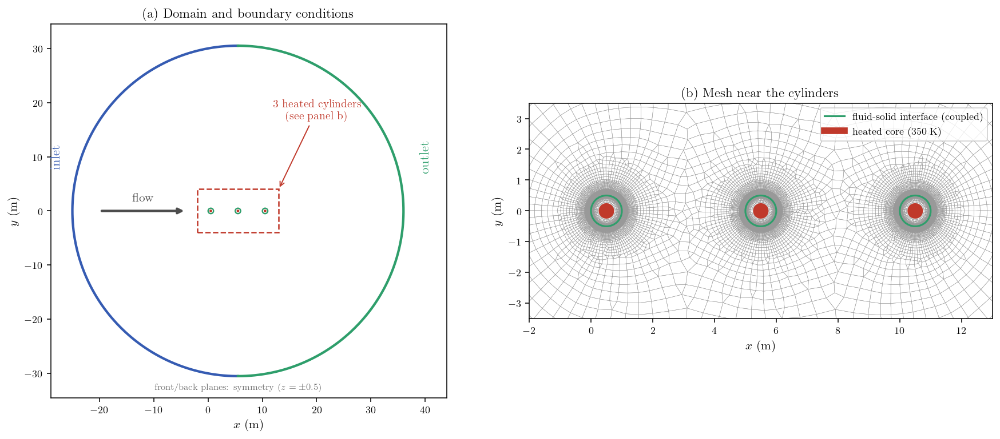
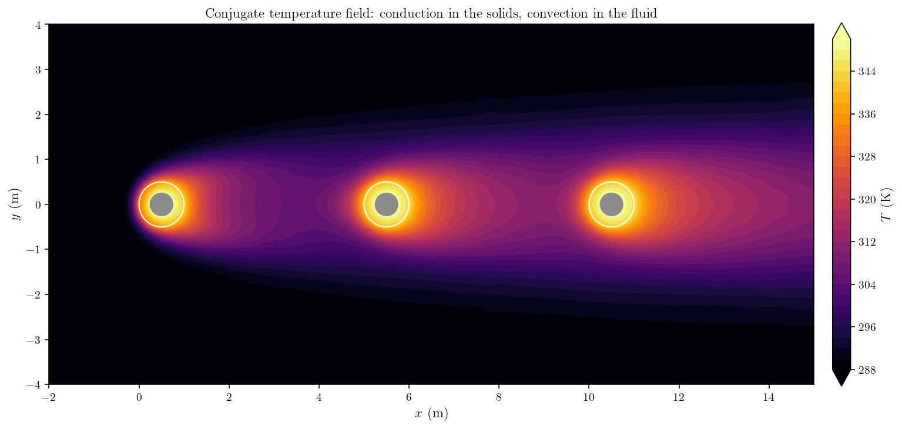

# Steady Conjugate Heat Transfer (CHT)

This tutorial solves a steady conjugate heat-transfer (CHT) problem with **code_saturne**. A laminar incompressible flow passes over three hollow solid cylinders aligned with the streamwise direction. Each cylinder is heated from its inner core, heat is conducted through the solid annulus, and the resulting thermal flux is transferred to the surrounding fluid through internally coupled fluid-solid interfaces.

The supplied setup is configured for **code_saturne 9.1** and uses a pseudo-steady local time-stepping procedure to converge the coupled flow and temperature solution.

Maintained by [Simvia](https://Simvia.tech/fr), part of the
[tutoriel-code_saturne](https://github.com/simvia-tech/tutorials-code_saturne) collection.

## Learning objectives

After completing this tutorial, the user should be able to:

1. Define separate fluid and solid volume zones in a single code_saturne mesh.
2. Activate the temperature equation and internal fluid-solid coupling for the thermal scalar.
3. Prescribe distinct fluid and solid thermal conductivities, with a fixed temperature on the inner cores.
4. Solve a steady laminar incompressible flow with heat transfer and a temperature-dependent density.
5. Converge the problem with the SIMPLEC pseudo-steady algorithm.
6. Visualize the conjugate temperature field and check its physical consistency.

## Prerequisites

| Requirement | Detail |
|---|---|
| code_saturne | **v9.1** |
| Background | Basic notions of convective heat transfer and conduction |

If code_saturne is not yet installed, build it from the
[official homepage](https://code-saturne.org/), pull a
ready-to-use Singularity image from the
[Open Simulation Center](https://open-simulation-center.org/downloads/code_saturne/code_saturne),
or pull the
[Simvia Docker image](https://hub.docker.com/r/Simvia/code_saturne) before continuing.

## Case files

```text
Th_Conjugate_Heat_Transfer/
├── CASE/
│   └── DATA/
│       └── setup.xml
├── MESH/
│   └── cht_3cylinders_code_saturne_split_farfield.msh
├── FIGURES/
│   ├── cht_mesh_boundary_conditions.png
│   └── cht_conjugate_temperature.png
└── README.md
```

## Physical model

### Fluid region

The fluid is modeled as a steady, laminar, incompressible flow with variable density and heat transfer. Turbulence, gravity, radiation, combustion, and compressibility models are disabled.

The steady mass-conservation equation is

$$
\nabla\cdot(\rho\mathbf{u})=0.
$$

The momentum equation may be written as

$$
\nabla\cdot(\rho\mathbf{u}\otimes\mathbf{u})
=-\nabla p
+\nabla\cdot\left[\mu\left(\nabla\mathbf{u}+\nabla\mathbf{u}^{T}\right)\right].
$$

The temperature field in the fluid is governed by the steady advection-diffusion equation

$$
\nabla\cdot(\rho c_p\mathbf{u}T)
=\nabla\cdot(k_f\nabla T),
$$

where $k_f$ is the fluid thermal conductivity.

The fluid density follows the temperature-dependent law used in `setup.xml`:

$$
\rho(T)=\rho_{\mathrm{ref}}\frac{T_{\mathrm{ref}}}{T},
$$

with

$$
\rho_{\mathrm{ref}}=2.10322\times10^{-4}\ \mathrm{kg\,m^{-3}},
\qquad
T_{\mathrm{ref}}=288.15\ \mathrm{K}.
$$

This density scaling is part of the case setup and is chosen together with the viscosity, velocity, and cylinder diameter to obtain the target Reynolds number. It should not be interpreted as standard atmospheric air density.

### Solid regions

The three cylinders are defined as solid volume zones named `solid1`, `solid2`, and `solid3`. No momentum equation is solved in the solids. In the steady case, heat conduction is governed by

$$
\nabla\cdot(k_s\nabla T)=0,
$$

where $k_s$ is the solid thermal conductivity.

The inner surface of each hollow cylinder is maintained at

$$
T_{\mathrm{core}}=350\ \mathrm{K}.
$$

Heat therefore conducts radially through each solid annulus before being transferred to the surrounding fluid.

### Internal conjugate coupling

The thermal scalar `temperature` is activated for internal coupling, and the three solid volume zones are registered as coupled solid zones. code_saturne automatically constructs the internal fluid-solid interfaces from these volume definitions.

At each coupled interface, the solution must satisfy temperature continuity and conservation of normal heat flux:

$$
T_f=T_s,
$$

$$
k_f\frac{\partial T_f}{\partial n}
=k_s\frac{\partial T_s}{\partial n}.
$$

The interface temperature is therefore not prescribed. It is obtained as part of the coupled solution from the balance between conduction in the solid and convection-diffusion in the fluid.

## Flow parameters

The inlet and material properties used by the supplied `setup.xml` are summarized below.

### Fluid properties

| Parameter | Value | Unit | Source in `setup.xml` |
|---|---:|---|---|
| Inlet velocity magnitude $U_\infty$ | 3.40297 | $\mathrm{m\,s^{-1}}$ | `inlet/velocity_pressure/norm` |
| Inlet temperature $T_\infty$ | 288.15 | K | `inlet` thermal `dirichlet` |
| Reference density $\rho_{\mathrm{ref}}$ | $2.10322\times10^{-4}$ | $\mathrm{kg\,m^{-3}}$ | `density/formula` |
| Dynamic viscosity $\mu$ | $1.7893\times10^{-5}$ | $\mathrm{Pa\,s}$ | `molecular_viscosity` |
| Specific heat $c_p$ | 1004.703 | $\mathrm{J\,kg^{-1}\,K^{-1}}$ | `specific_heat` |
| Thermal conductivity $k_f$ | 0.024968265 | $\mathrm{W\,m^{-1}\,K^{-1}}$ | `thermal_conductivity` |

Using the outer cylinder diameter $D=1\ \mathrm{m}$, the inlet Reynolds number is

$$
Re_D=\frac{\rho_{\mathrm{ref}}U_\infty D}{\mu}\approx40.
$$

The corresponding Prandtl number is

$$
Pr=\frac{c_p\mu}{k_f}\approx0.72.
$$

The low Reynolds number supports the laminar-flow assumption used in this tutorial.

### Solid properties

For the steady conduction problem only the solid conductivity and the imposed
core temperature enter the solution (density and specific heat play no role at
steady state). All three solid zones use the same values:

| Parameter | Value | Unit | Source in `setup.xml` |
|---|---:|---|---|
| Thermal conductivity $k_s$ | 0.1028 | $\mathrm{W\,m^{-1}\,K^{-1}}$ | `thermal_conductivity` solid-zone formula |
| Inner-core temperature | 350 | K | `core1/2/3` wall `dirichlet` |

The solid conductivity is approximately $4.12$ times the fluid conductivity:

$$
\frac{k_s}{k_f}\approx4.12.
$$

For the present steady problem, the thermal conductivity directly controls the conductive temperature gradient through the solid annuli.

## Geometry and boundary conditions

### Geometry

Three identical hollow cylinders are arranged in-line along $x$, centered at
$(0.5,0)$, $(5.5,0)$ and $(10.5,0)\ \mathrm{m}$. Each has an outer radius of
$0.5\ \mathrm{m}$ (the fluid-solid interface) and an inner radius of
$0.25\ \mathrm{m}$ (the heated core), so the outer diameter $D=1\ \mathrm{m}$ is
the reference length. They sit inside a circular far-field of radius
$30.5\ \mathrm{m}$ centered at $(5.5,0)$. The domain is extruded by $1\ \mathrm{m}$
in $z$ with the front and back planes ($z=\pm0.5\ \mathrm{m}$) treated as symmetry,
making the calculation quasi-two-dimensional (see Figure 1).

### Mesh

The mesh has four volume zones: `fluid` (33,700 cells) and `solid1`, `solid2`,
`solid3` (4,534 cells each), for a total of **47,302 cells**. It is strongly
refined around the cylinders and their fluid-solid interfaces, and coarsens
toward the far-field boundary.

<p align="center">
  
  <br>
  <em>Figure 1: (a) The circular far-field is split into an upstream inlet (blue)
  and a downstream outlet (green); the three heated cores are at the center.
  (b) Mesh near the cylinders: the green circles are the internally coupled
  fluid-solid interfaces and the red disks are the heated cores.</em>
</p>

### Boundary conditions

| Boundary | Type | Thermal condition | Flow condition |
|---|---|---|---|
| `inlet` | Inlet | $T=288.15\ \mathrm{K}$ | $\mathbf{u}=(3.40297,0,0)\ \mathrm{m\,s^{-1}}$ |
| `outlet` | Outlet | Zero normal temperature gradient | Standard pressure outlet |
| `core1` | Wall | $T=350\ \mathrm{K}$ | Solid inner boundary |
| `core2` | Wall | $T=350\ \mathrm{K}$ | Solid inner boundary |
| `core3` | Wall | $T=350\ \mathrm{K}$ | Solid inner boundary |
| `front` | Symmetry | Symmetry | Symmetry |
| `back` | Symmetry | Symmetry | Symmetry |
| Fluid-solid interfaces | Internal coupling | Temperature and heat-flux continuity | Automatically generated from the solid zones |

The outer cylinder surfaces do not require prescribed wall temperatures. Their interface temperatures are determined by the conjugate heat-transfer solution.

## Numerical setup

The principal numerical settings in `CASE/DATA/setup.xml` are:

| Setting | Value |
|---|---:|
| Fluid-solid coupling | Internal coupling of `temperature` |
| Solid zones | `solid1`, `solid2`, `solid3` |
| Velocity-pressure algorithm | SIMPLEC |
| Time treatment | Pseudo-steady local time step |
| Number of iterations | 1500 |

The pseudo-time used by the steady local-time-step algorithm is a numerical convergence device. Intermediate iteration times should therefore **not** be interpreted as physical transient time.

### Initialization

The fluid is initialized at the inlet conditions
($\mathbf{u}=(3.40297,0,0)\ \mathrm{m\,s^{-1}}$, $T=288.15\ \mathrm{K}$) and the
solids at the core temperature ($T=350\ \mathrm{K}$).

## Running the simulation

The commands below start from the tutorial directory:

```bash
cd Th_Conjugate_Heat_Transfer/
```

### Option A: Graphical interface

```bash
code_saturne gui CASE/DATA/setup.xml &
```

The GUI opens the pre-configured `setup.xml`. Review the setup if you wish,
then launch the run with the **gear (Run) button** in the toolbar. To run in
parallel, set the number of processes under
**Calculation management > Performance settings** before launching.

### Option B: Command line

The command-line launcher is run from inside the case directory:

```bash
cd CASE

# serial
code_saturne run

# parallel (e.g. 4 MPI ranks)
code_saturne run --n 4
```

Each run creates a time-stamped directory `CASE/RESU/<YYYYMMDD-HHMM>/` containing:

- `run_solver.log`: solver log and residual history,
- `monitoring/`: probe time series (`probes_*.csv`),
- `postprocessing/`: volume and boundary fields in EnSight Gold format.

## Results

<p align="center">
  
  <br>
  <em>Figure 2: Conjugate temperature field.</em>
</p>

Each heated core (350 K) warms its solid annulus; the heat crosses the coupled
outer interface and is convected downstream, so a thermal wake trails each
cylinder, and the second and third cylinders meet fluid already warmed by the
upstream ones. The field is smooth across the fluid-solid interfaces (no
artificial jump) and symmetric about the centerline, and the temperature stays
between the inlet value (288 K) and the core value (350 K) as expected.

## Summary

This tutorial set up a steady conjugate heat-transfer calculation in
code_saturne: one laminar fluid region and three solid cylinders in a single
mesh, with the temperature equation coupled across the fluid-solid interfaces so
the outer cylinder temperatures are part of the solution rather than prescribed.
The converged field is bounded, symmetric, and shows the expected conduction in
the solids and thermal wakes in the fluid. It is a reproducible internal-CHT
set-up rather than a validated benchmark: the flow is quasi-2D and laminar
($Re_D\approx40$), gravity and radiation are neglected, the low reference density
is a scaling choice (not atmospheric air), and no mesh-independence study or
external comparison is included. It is a good starting point for studies of
interface heat flux, mesh sensitivity, or higher-Reynolds-number thermal flows.

## References

1. code_saturne documentation, *Conjugate heat transfer: internal fluid-thermal coupling*: <https://code-saturne.org/doc/>.
2. code_saturne project documentation and user resources: <https://www.code-saturne.org/>.
3. S. V. Patankar, *Numerical Heat Transfer and Fluid Flow*, Hemisphere Publishing Corporation, 1980.
4. F. P. Incropera, D. P. DeWitt, T. L. Bergman, and A. S. Lavine, *Fundamentals of Heat and Mass Transfer*, Wiley.

## Authors

[Simvia](https://Simvia.tech/fr) - Questions, remarks and requests are welcome.
