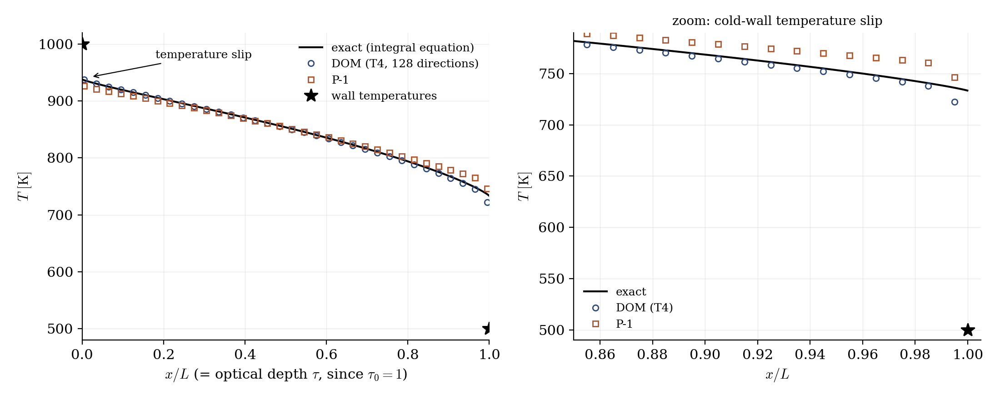
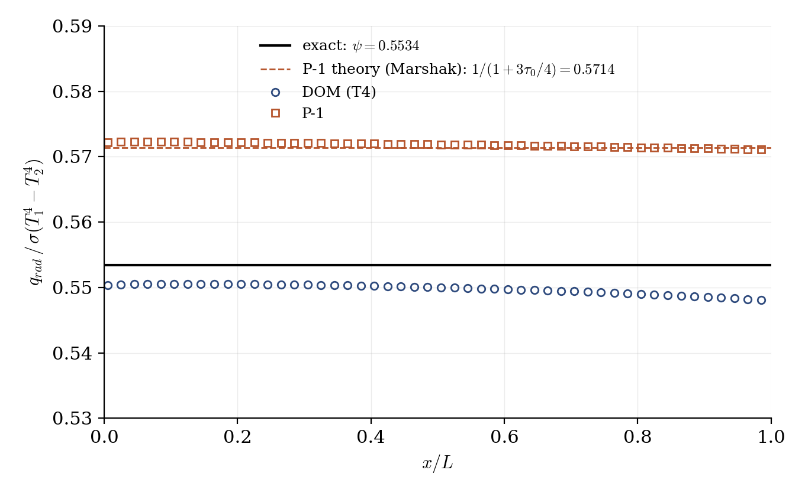

# Radiative Slab (Gray Participating Medium, DOM vs P-1)

A step-by-step tutorial for the **radiative transfer module** of **code_saturne**: a gray absorbing-emitting medium between a hot and a cold black plate, at radiative equilibrium. The exact solution of this classic configuration (the Milne problem of a slab) is known to four digits, which makes it the ideal ground to compare the two radiation models offered by the GUI, the **Discrete Ordinates Method (DOM)** and the spherical-harmonics **P-1** approximation, and to see a phenomenon pure conduction can never produce: the **temperature slip** at the walls. The whole setup is built in the GUI; the tutorial ships two cases differing by one single option, the radiation model.

Maintained by [Simvia](https://Simvia.tech/fr), part of the
[tutoriel-code_saturne](https://github.com/simvia-tech/tutorials-code_saturne) collection.

## Learning objectives

After completing this tutorial you will be able to:

1. Activate the **radiative transfer module** (with its mandatory thermal scalar) and prescribe a gray-medium **absorption coefficient**.
2. Set **radiative wall boundary conditions** (imposed wall temperature and emissivity: black electrodes of the radiative world).
3. Choose between **DOM and P-1**, tune the DOM **angular quadrature**, and know the accuracy each model can deliver on a participating medium.
4. Recognize **radiative equilibrium** (uniform flux, zero radiative source) and the **wall temperature slip** of semi-transparent media.

## Prerequisites

| Requirement | Detail |
|---|---|
| code_saturne | **v9.1** |
| Tutorial | [Th_Buoyant_Cavity](../Th_Buoyant_Cavity) (thermal scalar basics) |

If code_saturne is not yet installed, build it from the
[official homepage](https://code-saturne.org/), pull a
ready-to-use Singularity image from the
[Open Simulation Center](https://open-simulation-center.org/downloads/code_saturne/code_saturne),
or pull the
[Simvia Docker image](https://hub.docker.com/r/Simvia/code_saturne) before continuing.

## Case files

```
Th_Radiative_Slab/
├── CASE_DOM/
│   └── DATA/setup.xml        # DOM, T4 quadrature (128 directions)
├── CASE_P1/
│   └── DATA/setup.xml        # P-1; everything else strictly identical
├── FIGURES/                  # figures used in this README
└── README.md
```

> There is **no MESH directory** (built-in cartesian mesher) and **no SRC directory**: the whole setup lives in the GUI. The two `setup.xml` differ only by the `radiative_transfer` model attribute: diff them to convince yourself.

## Physical model

A gray medium of absorption coefficient $K = 1\ \mathrm{m^{-1}}$ fills the gap $L = 1$ m between two black plates ($\varepsilon = 1$) at $T_1 = 1000$ K and $T_2 = 500$ K: the optical thickness of the slab is $\tau_0 = K L = 1$. The fluid is at rest and its conductivity is chosen negligible ($\lambda = 10^{-3}\ \mathrm{W/m/K}$, six orders of magnitude below the radiative transfer), so the steady state is a **radiative equilibrium**: the divergence of the radiative flux vanishes, the flux $q_{rad}$ is uniform across the slab, and the temperature field is the solution of the classic integral equation of the Milne slab problem (solved here to high accuracy for the reference curve, and tabulated by Heaslet & Warming).

Two features of this solution have no equivalent in pure conduction:

- the normalized flux $\psi = q_{rad}\,/\,\sigma(T_1^4 - T_2^4)$ depends only on $\tau_0$; for $\tau_0 = 1$, $\psi = 0.5534$, i.e. $q_{rad} = 29\,417\ \mathrm{W/m^2}$;
- the medium temperature does **not** meet the wall temperature: the gas facing the hot wall settles at $936$ K, the gas facing the cold wall at $736$ K. This **temperature slip** is physical: with radiation as the only transport mechanism, the near-wall fluid balances emission from the whole slab against the wall, not a local gradient.

The P-1 model has a closed-form prediction for this configuration (Marshak boundary conditions): $\psi_{P1} = 1/(1 + 3\tau_0/4) = 0.5714$, i.e. $+3.3\%$ above the exact transport solution at $\tau_0 = 1$: comparing the two shipped cases quantifies the model error, not just the code.

### Flow parameters

| Quantity | Symbol | Value | Source |
|---|---|---|---|
| Plate temperatures | $T_1$, $T_2$ | $1000$, $500$ K | wall + radiative BCs |
| Wall emissivities | $\varepsilon$ | $1$ (black) | `radiative_data` |
| Absorption coefficient | $K$ | $1\ \mathrm{m^{-1}}$ ($\tau_0 = 1$) | `absorption_coefficient` |
| Slab width | $L$ | $1$ m | `mesh_cartesian` |
| Conductivity (negligible) | $\lambda$ | $10^{-3}$ W/m/K | `fluid_properties` |
| Other properties | $\rho$, $c_p$, $\mu$ | $1$, $1000$, $10^{-5}$ (SI) | `fluid_properties` |
| Expected flux | $\psi$, $q_{rad}$ | $0.5534$, $29\,417\ \mathrm{W/m^2}$ | exact (Heaslet & Warming) |
| Expected slip temperatures | | $936$ / $736$ K | exact |

## Geometry and boundary conditions

The domain is a $100 \times 1 \times 1$-cell cartesian bar ($1 \times 0.05 \times 0.05$ m), generated by the built-in mesher. The plates are walls with an imposed fluid temperature **and** an imposed radiative wall temperature (the `itpimp` radiative condition: internal temperature and emissivity).

The lateral faces deserve attention: this version treats **symmetry** faces as pseudo-reflecting (diffusely reflecting) boundaries for the DOM, which would bias the angular distribution of a one-dimensional radiation field. The clean way to make the problem truly 1D is **translational periodicity** on both lateral pairs: periodic faces become internal faces, exact for a field with no transverse variation.

## Numerical setup

| Setting | Value | Rationale |
|---|---|---|
| Radiation model | **DOM** (`CASE_DOM`) / **P-1** (`CASE_P1`) | the comparison is the point |
| DOM quadrature | **T4, 128 directions** | angular accuracy (see Results for S4) |
| Radiative source term mode | **corrected semi-analytic** (Advanced options) | required for the source term to be active (see below) |
| Solve frequency | every time step | pseudo-transient relaxation to equilibrium |
| Thermal scalar | Temperature (Kelvin) | mandatory with radiation |
| Time | $\Delta t = 0.05$ s, $500$ steps | ~10 radiative relaxation times |

One setting must be changed from its default, in **Thermophysical models → Thermal model → Advanced options**: set *Radiative source term computation mode* to **corrected semi-analytic**. With the dialog left untouched, the solver runs with the radiative source term disabled: the radiance is solved and the wall fluxes are computed, but the energy equation never sees the radiation and the medium temperature stays at its initial value. This tutorial pins the corresponding node (`thermal_radiative_source_term`) in both `setup.xml`.

## Running the simulation

The commands below start from the tutorial directory:

```bash
cd Th_Radiative_Slab/
```

### Option A: Graphical interface

```bash
code_saturne gui CASE_DOM/DATA/setup.xml &
```

The radiation settings live in **Thermophysical models → Thermal model**: the model dropdown (DOM / P-1), the constant absorption coefficient, and the Advanced options dialog (quadrature, source term mode). Review, then launch with the **gear (Run) button**.

### Option B: Command line

```bash
cd CASE_DOM
code_saturne run --id dom_tau1      # a few seconds, serial

cd ../CASE_P1
code_saturne run --id p1_tau1
```

The listing prints, at each output step, the wall radiative balance (`Information on wall temperature`): at equilibrium the hot and cold net fluxes are equal and opposite.

## Results

<p align="center">
  
  <br>
  <em>Figure 1: temperature across the slab at radiative equilibrium. The medium never meets the wall temperatures (stars): the exact slip values are $936$ K and $736$ K against walls at $1000$ K and $500$ K. DOM (T4) follows the exact integral-equation solution; P-1 deviates near the walls, where its diffusion-like character is weakest. The last DOM cell dips low: the cell value reflects the gradient reconstruction against the wall, not the solution.</em>
</p>

<p align="center">
  
  <br>
  <em>Figure 2: normalized radiative flux $\psi$ across the slab. Both models produce the uniform flux of radiative equilibrium (flat to $0.5\%$). P-1 lands within $0.1\%$ of its own closed-form prediction ($0.5714$, dashes): the $+3.3\%$ offset from the exact transport value is the model, faithfully computed. The DOM cell field sits $\approx 0.6\%$ low; the wall net flux, the physically meaningful output, is within $+0.3\%$ (table below).</em>
</p>

The wall net fluxes give the headline numbers:

| | $\psi$ | vs exact $0.5534$ |
|---|---|---|
| DOM, T4 (128 dir.) | $0.5550$ | $+0.3\%$ |
| DOM, S4 (24 dir.) | $0.5449$ | $-1.5\%$ |
| P-1 | $0.5721$ | $+3.4\%$ (Marshak theory: $0.5714$) |

Two lessons in one table: the DOM error at this optical thickness is dominated by the **angular quadrature** (S4 → T4 divides it by five, for a run still measured in seconds), and the P-1 error is a **model** error that no refinement will remove. P-1 improves as the medium gets optically thick ($\psi_{P1}$ is asymptotically exact for $\tau_0 \gg 1$) and is markedly cheaper: one diffusion equation instead of 128 transport solves.

## Summary

This tutorial activated the radiative transfer module on the one configuration where everything is known exactly: a gray slab at radiative equilibrium. The GUI-built setup (thermal scalar, absorption coefficient, `itpimp` radiative walls, angular quadrature) reproduces the exact flux to $+0.3\%$ with the DOM/T4 and exhibits the wall temperature slip of semi-transparent media; the P-1 case, identical but for one dropdown, lands exactly on its own analytic prediction and quantifies the price of the diffusion approximation in a moderately thick medium. Lateral periodicity (rather than symmetry) is the trick that makes a truly 1D radiation problem.

## References

- M.A. Heaslet, R.F. Warming. Radiative transport and wall temperature slip in an absorbing planar medium, Int. J. Heat Mass Transfer, 8, 979-994, 1965.
- M.F. Modest. Radiative Heat Transfer, 3rd ed., Academic Press, 2013 (chapter 14: exact solutions for one-dimensional gray media).
- [code_saturne documentation](https://code-saturne.org/doc/)

## Authors

[Simvia](https://Simvia.tech/fr) - Questions, remarks and requests are welcome.
