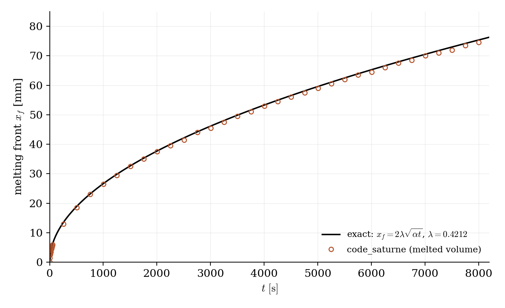
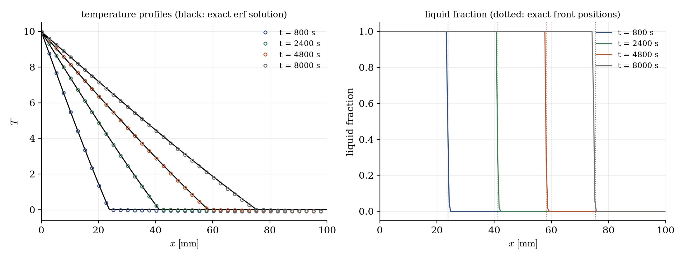

# Stefan Melting Front (CDO Solidification Module)

A step-by-step tutorial for the **solidification/melting module** of **code_saturne**, on the one phase-change problem with an exact solution: the Stefan problem. A solid bar sits at its fusion temperature; the left wall suddenly heats up, and a melting front invades the bar following the exact law $x_f(t) = 2\lambda\sqrt{\alpha t}$, with erf temperature profiles behind it. 

This module lives in the **CDO framework** of code_saturne and has **no GUI page**: the entire physical setup fits in one commented user file, and the case doubles as the catalogue's first tour of the CDO world (zones declared in code, properties and equations set through the `cs_property` / `cs_equation` API).

CDO (**Compatible Discrete Operators**) is the second discretization engine of code_saturne, next to the historical cell-centered finite-volume solver used everywhere else in this collection: a mimetic framework where unknowns may live on vertices, faces or cells, and where the discrete gradient/divergence operators reproduce the algebraic properties of the continuous ones exactly: robust on polyhedral or low-quality meshes, and the foundation of the code's most recent modules (solidification, groundwater flows, Maxwell). A run can be CDO-only, as here, or combine CDO and finite-volume equations.

Maintained by [Simvia](https://Simvia.tech/fr), part of the
[tutoriel-code_saturne](https://github.com/simvia-tech/tutorials-code_saturne) collection.

## Learning objectives

After completing this tutorial you will be able to:

1. Activate the **solidification module** with the `STEFAN` model (pure thermal phase change, sharp front), and set its two physical parameters: fusion temperature and latent heat.
2. Follow the **CDO setup sequence**: zones in `cs_user_zones`, model and boundaries in `cs_user_model`, properties and thermal initial/boundary conditions in `cs_user_finalize_setup`.
3. Avoid the classic numerical trap: **never initialize the solid exactly at the fusion temperature** (a small subcooling is required for a front to exist), and monitor the phase change through the module's log blocks and `solidification.dat` file.

## Prerequisites

| Requirement | Detail |
|---|---|
| code_saturne | **v9.1** |
| Tutorial | [Th_Radiative_Slab](../Th_Radiative_Slab) (transient thermal cases of this section) |

If code_saturne is not yet installed, build it from the
[official homepage](https://code-saturne.org/), pull a
ready-to-use Singularity image from the
[Open Simulation Center](https://open-simulation-center.org/downloads/code_saturne/code_saturne),
or pull the
[Simvia Docker image](https://hub.docker.com/r/Simvia/code_saturne) before continuing.

## Case files

```
Th_Stefan_Melting/
├── CASE/
│   ├── DATA/setup.xml               # mesh, time stepping, outputs only
│   └── SRC/cs_user_parameters.cpp   # the whole physics (CDO, no GUI page)
├── FIGURES/                         # figures used in this README
└── README.md
```

> The `setup.xml` only carries what the GUI still handles in a CDO run: the built-in cartesian mesh, the time stepping and the writers. Everything physical is in the user file.

## Physical model

The one-phase Stefan problem: a bar ($0 < x < 0.1$ m) of solid at its fusion temperature $T_m = 0$; at $t = 0$ the left wall jumps to $T_w = 10$. A melting front $x_f(t)$ separates liquid (where heat diffuses) from solid (which stays at $T_m$), absorbing the latent heat $L$ as it advances:

$$
x_f(t) = 2\lambda\sqrt{\alpha t},
\qquad
\lambda\, e^{\lambda^2} \mathrm{erf}(\lambda) = \frac{St}{\sqrt{\pi}},
\qquad
St = \frac{c_p\,(T_w - T_m)}{L}
$$

with an erf-shaped temperature profile in the liquid. The material ($\rho = c_p = 1000$, $\lambda_{th} = 1$, SI) gives $\alpha = 10^{-6}\ \mathrm{m^2/s}$, and $L = 25\,000$ J/kg sets $St = 0.4$, hence $\lambda = 0.42124$ (computed independently from the transcendental equation).

### The setup, function by function

- **`cs_user_zones`**: in the CDO framework, zones are declared before being used: the two bar ends and the lateral faces are defined from the cartesian-mesher groups.
- **`cs_user_model`**: switch to CDO-only mode, declare the boundaries as walls, activate the module (`CS_SOLIDIFICATION_MODEL_STEFAN`: sharp front, solidus equal to liquidus, no fluid motion: no velocity field exists in this run) and set $T_m$ and $L$. The internal temperature/enthalpy coupling of the model is also tightened here (iteration cap and enthalpy tolerance). The module offers richer models beyond Stefan: `VOLLER_PRAKASH_87` and `BINARY_ALLOY` solve the Navier-Stokes equations in the melt (Boussinesq buoyancy, velocity driven to zero in the solid through a Kozeny-Carman mushy-zone penalization): Stefan is the exactly-solvable entry point of that ladder.
- **`cs_user_finalize_setup`**: material properties (`mass_density`, `thermal_capacity`, `thermal_conductivity` through the `cs_property` API), initial temperature, and the two Dirichlet conditions at the bar ends (the default elsewhere is a homogeneous Neumann).

One trap is worth the tutorial on its own: the solid must start a **hair below** the fusion temperature ($T_{ini} = -0.1$ here, $1\%$ of $\Delta T$). Initialized exactly *at* $T_m$, every cell is classified liquid from the first step, no latent heat is ever absorbed, and the run silently degenerates to pure conduction: the subcooling is numerically necessary and physically negligible.

## Running the simulation

The commands below start from the tutorial directory:

```bash
cd Th_Stefan_Melting/
cd CASE
code_saturne run --id stefan
```

($1600$ steps of $5$ s, a few seconds serial.) The module reports the phase change as it goes: the log prints periodic `Solidification monitoring` blocks (solid/mushy/liquid cell counts: about $97\%$ solid at start, $25\%$ at the end), and the run directory carries a `solidification.dat` monitoring file with the melted volume history: it is the front-position data used below.

## Results

<p align="center">
  
  <br>
  <em>Figure 1: the melting front against the exact law $x_f = 2\lambda\sqrt{\alpha t}$. The computed points (from the melted volume in <code>solidification.dat</code>) ride the curve over the whole history: $26.5$ / $53.0$ / $74.5$ mm at $t = 1000$ / $4000$ / $8000$ s for $26.6$ / $53.3$ / $75.4$ mm exact.</em>
</p>

<p align="center">
  
  <br>
  <em>Figure 2: left, temperature profiles at four times on the exact erf solution (black); right, the liquid fraction, a sharp step riding the exact front positions (dotted).</em>
</p>

The front stays within about $1\%$ of the exact position over the full run, and the temperature profiles sit on the erf solution (the only visible offset is the deliberate $-0.1$ subcooling in the solid). One honest note: during the first few dozen steps, when the front is being born in the very first cells, the model's internal coupling hits its iteration cap before reaching the tightened tolerance; the effect is not visible on the front history.

## Summary

This tutorial activated the CDO solidification module on the Stefan problem: one user file declares the zones, switches to CDO mode, activates the `STEFAN` model with its fusion temperature and latent heat, and sets properties and thermal conditions through the CDO API. The computed melting front follows the exact $2\lambda\sqrt{\alpha t}$ law within about $1\%$ and the temperature profiles match the erf solution. Two things to remember: the CDO setup sequence (zones, then model, then properties and conditions), and the subcooled start, without which no front ever exists.

## References

- H.S. Carslaw, J.C. Jaeger. Conduction of Heat in Solids, 2nd ed., Oxford University Press, 1959 (chapter XI: the Stefan problem and its exact solution).
- [code_saturne documentation: CDO solidification module](https://www.code-saturne.org/doc/code_saturne-9.2/cs_ug_cdo_solidification.html)

## Authors

[Simvia](https://Simvia.tech/fr) - Questions, remarks and requests are welcome.
