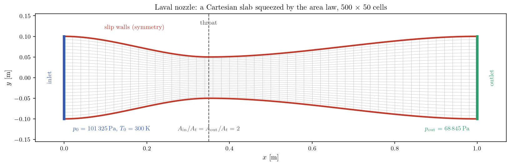
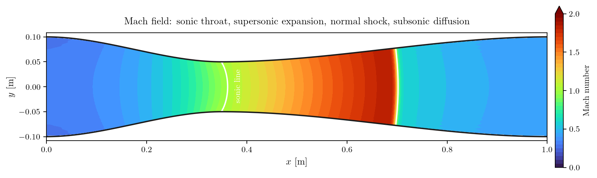
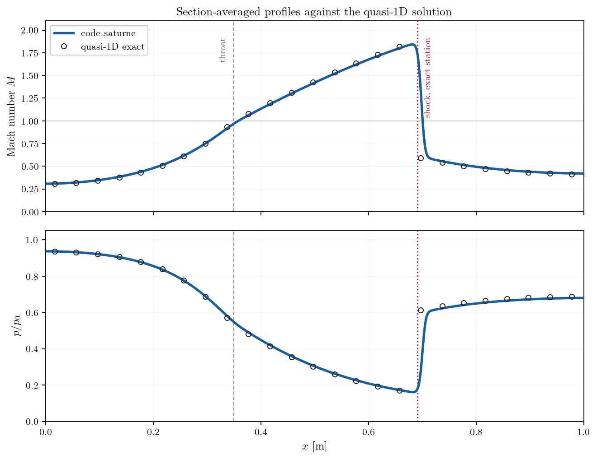

# Laval Nozzle with a Normal Shock

This tutorial computes **one operating point** with the compressible module of
**code_saturne**: a choked nozzle with a normal shock standing in the divergent.
A single run therefore contains a subsonic acceleration, a sonic throat, a
supersonic expansion, a shock, and a subsonic recompression to the imposed exit
pressure, and every one of those is verified against the **quasi-1D exact
solution**.

Maintained by [Simvia](https://Simvia.tech/fr), part of the
[tutoriel-code_saturne](https://github.com/simvia-tech/tutorials-code_saturne) collection.

## Learning objectives

After completing this tutorial you will be able to:

1. Set the operating point of a compressible internal flow with the pair of boundary conditions that decides it: **total conditions** ($P_t$, $H_t$) at the inlet and an imposed **static pressure at a subsonic outlet**.
2. Build a shaped duct **without any mesh file**, by squeezing a Cartesian slab in `cs_user_mesh_modify`.
3. Verify a computation against the **area-Mach relation**, and locate a normal shock from the back pressure alone.

## Prerequisites

| Requirement | Detail |
|---|---|
| code_saturne | **v9.1** |
| Tutorials | [Comp_Sod_Tube](../Comp_Sod_Tube) (compressible module, exact Euler limit), [Comp_Supersonic_Ramp](../Comp_Supersonic_Ramp) (shock capture) |
| Background | Gas dynamics: isentropic relations, normal shock relations |

If code_saturne is not yet installed, build it from the
[official homepage](https://code-saturne.org/), pull a
ready-to-use Singularity image from the
[Open Simulation Center](https://open-simulation-center.org/downloads/code_saturne/code_saturne),
or pull the
[Simvia Docker image](https://hub.docker.com/r/Simvia/code_saturne) before continuing.

## Case files

```text
Comp_Laval_Nozzle/
├── CASE/
│   ├── DATA/
│   │   └── setup.xml            # pre-configured GUI case
│   └── SRC/
│       └── cs_user_mesh.cpp     # the nozzle geometry: slab, then area law
├── FIGURES/                     # figures used in this README
└── README.md
```

There is no mesh file. The nozzle is a Cartesian slab whose height is squeezed
by the area law, and that law is written once, in `cs_user_mesh.cpp`, which is
also the function the verification below uses. There is no second copy of the
geometry to keep in step with the first.

## Physical model

The flow is **steady, two-dimensional and inviscid**: the Euler equations for a
perfect gas with $\gamma = 1.4$. The inviscid limit is enforced exactly by GUI
**user laws** setting the molecular viscosity, the volume viscosity and the
thermal conductivity to zero, as in [Comp_Sod_Tube](../Comp_Sod_Tube) (a GUI
*constant* cannot be zero, a user-law formula can).

### What the theory predicts

For a slender duct the flow is nearly one-dimensional, and the isentropic
relations tie the local Mach number to the local area alone:

$$
\frac{A}{A^*} = \frac{1}{M}\left[\frac{2}{\gamma+1}
\left(1 + \frac{\gamma-1}{2}M^2\right)\right]^{\frac{\gamma+1}{2(\gamma-1)}}
$$

where $A^*$ is the sonic section. Once the throat is choked, $A^* = A_t$
upstream of the shock, the mass flow is fixed at its critical value, and the
back pressure can no longer influence the convergent at all.

A normal shock in the divergent does not change the mass flow, but it destroys
total pressure, so the sonic section **grows** across it:

$$
\frac{A_2^*}{A_1^*} = \frac{p_{t1}}{p_{t2}}
$$

Downstream of the shock the flow is subsonic again and follows the same
area-Mach relation, now with $A_2^*$. That chain closes the problem: the shock
sits exactly where the resulting exit pressure matches the imposed one. Here,
$p_\mathrm{out}/p_0 = 0.679$ places it at $x = 0.691$ m, with $M_1 = 1.902$
just upstream and $M_2 = 0.595$ just downstream.

### Flow parameters

| Quantity | Symbol | Value | Source in `setup.xml` |
|---|---|---:|---|
| Heat capacity ratio | $\gamma$ | $1.4$ | from `specific_heat` ($1004.85$) and `reference_molar_mass` |
| Inlet total pressure | $p_0$ | $101\,325$ Pa | `inlet/velocity_pressure/total_pressure` |
| Inlet total enthalpy | $H_t = c_p T_0$ | $301\,455$ J/kg | `inlet/velocity_pressure/enthalpy` |
| Inlet total temperature | $T_0$ | $300$ K | (derived from $H_t$) |
| Imposed exit pressure | $p_\mathrm{out}$ | $68\,845$ Pa | `outlet/dirichlet name="pressure"` |
| Pressure ratio | $p_\mathrm{out}/p_0$ | $0.679$ | (derived) |
| Viscosity, conductivity | $\mu$, $\lambda$ | $0$ (exact Euler limit) | user laws in `fluid_properties` |

## Geometry and boundary conditions

The nozzle is 1 m long. Its half height follows a smoothstep on each side of
the throat, which puts $\mathrm{d}A/\mathrm{d}x = 0$ at the throat (a genuine
sonic section) and at both ends (so the inlet and outlet planes are flat and
the boundary conditions stay one-dimensional):

$$
h(x) = h_t + (h_e - h_t)\, s^2(3 - 2s), \qquad
s = \frac{x - x_t}{L - x_t} \ \ \text{in the divergent}
$$

| Station | $x$ [m] | Half height [m] | $A/A_t$ |
|---|---:|---:|---:|
| Inlet | $0.00$ | $0.100$ | $2$ |
| Throat | $0.35$ | $0.050$ | $1$ |
| Outlet | $1.00$ | $0.100$ | $2$ |

The maximum wall slope of the divergent is **6.6 degrees**. That number is a
design constraint, not a detail: quasi-1D theory assumes the flow stays nearly
axial, so the nozzle has to be slender for the comparison below to mean
anything.

<p align="center">
  
  <br>
  <em>Figure 1: The nozzle and its mesh. The Cartesian slab of 500 x 50 cells is
  generated in <code>cs_user_mesh_cartesian_define</code>, then every vertex is
  pulled towards the axis in proportion to the local half height. Faces normal
  to x stay planar, only the horizontal faces tilt.</em>
</p>

| Boundary | Location | Nature | Prescribed value |
|---|---|---|---|
| `INLET` | $x = 0$ | Compressible **subsonic inlet** ($P_t$, $H_t$) | $101\,325$ Pa, $301\,455$ J/kg |
| `OUTLET` | $x = 1$ | Compressible **subsonic outlet** | $p = 68\,845$ Pa |
| `WALL` | nozzle contour | Slip wall (symmetry) | (none) |
| `SIDES` | spanwise planes | Symmetry | (none) |

This pair of conditions is the whole point of the case. Nothing prescribes the
velocity, the mass flow or the regime: the inlet says what the reservoir holds,
the outlet says what pressure the flow must reach, and the solution in between
is the answer. Since the flow is inviscid, the nozzle contour is a **slip wall**
imposed as a symmetry, the standard trick for Euler computations.

## Numerical setup

| Setting | Value | Rationale |
|---|---:|---|
| Compressible algorithm | pressure-based, `constant gamma` | code_saturne compressible module |
| Mesh | $500 \times 50$ cells ($\Delta x = 2$ mm) | uniform along the nozzle |
| Time-stepping | adaptive, max CFL $= 1$ | pseudo-transient march to the steady state |
| Iterations | $8000$ | the field extrema are frozen to five digits well before the end |
| Convection scheme | 1st-order upwind | forced by the compressible module for every variable, whatever the GUI blending factor (`cs_cf_model.cpp`) |
| Initialization | $u = 105$ m/s, $p = 90\,000$ Pa, $T = 295$ K | a plausible uniform guess, not the solution |

## Running the simulation

```bash
cd Comp_Laval_Nozzle/
```

### Option A: Graphical interface

```bash
code_saturne gui CASE/DATA/setup.xml &
```

The GUI opens the pre-configured `setup.xml`. Review the setup if you wish,
then launch the run with the **gear (Run) button** in the toolbar.

### Option B: Command line

```bash
cd CASE
code_saturne run --n 4
```

The run takes a few minutes on four cores and writes a time-stamped directory
`CASE/RESU/<YYYYMMDD-HHMM>/`.

## Results and verification

<p align="center">
  
  <br>
  <em>Figure 2: Mach field. The white line is the sonic contour. The flow
  accelerates through the throat, expands in the divergent, crosses a normal
  shock and recompresses to the imposed exit pressure.</em>
</p>

The section-averaged profiles are compared with the exact quasi-1D solution
below. The averaging is mass-flux weighted, which is the meaningful average when
the comparison is with a one-dimensional theory.

<p align="center">
  
  <br>
  <em>Figure 3: Section-averaged Mach number and static pressure. The symbols are
  the exact quasi-1D solution for the imposed back pressure. The computed curve
  lies on it everywhere except across the shock, which any shock-capturing
  scheme spreads over a few cells.</em>
</p>

The agreement is good. The computed profiles lie on the exact solution over the
whole isentropic branch, the shock appears where the back pressure says it
should, and the flow leaves at the imposed pressure. The choked mass flow, which
depends on nothing but the throat being properly sonic, comes out within half a
percent of the theoretical value; it can be read directly from the **boundary
mass flow** block of `run_solver.log`, where the inlet and outlet values also
balance, the sign that the pseudo-transient run has reached its steady state.

Two small differences are visible on Figure 3 and are worth naming. The shock
stands a few cells downstream of its theoretical station and its peak Mach
number is slightly clipped: the compressible module convects at first order, so
the front is spread over several cells and settles where the discrete momentum
balance closes. And the section-averaged Mach number at the geometric throat
falls just short of 1, because in a two-dimensional nozzle the sonic line is
curved, as Figure 2 shows, so no plane section is uniformly sonic. That one is a
property of the flow rather than of the mesh.

## Summary

A single operating point of a Laval nozzle, computed with the compressible
module and verified against quasi-1D theory. The regime is set by two boundary
conditions and nothing else: total conditions at the inlet, static pressure at a
subsonic outlet. The solver chokes the throat at the right mass flow, follows
the isentropic branch, and puts the normal shock where the back pressure
requires, a few cells from its theoretical station.

The geometry is generated by deforming a Cartesian slab in a user routine, so
the case ships without a mesh file and the area law that is verified is the same
function that builds the mesh.

## References

1. J.D. Anderson. *Modern Compressible Flow: With Historical Perspective*, 3rd edition, McGraw-Hill, 2003 (chapter 5, quasi-one-dimensional flow).
2. [NASA, NACA Report 1135, *Equations, Tables and Charts for Compressible Flow*, 1953.](https://ntrs.nasa.gov/citations/19930091059)
3. [code_saturne documentation](https://code-saturne.org/doc/)

## Authors

[Simvia](https://Simvia.tech/fr) - Questions, remarks and requests are welcome.
