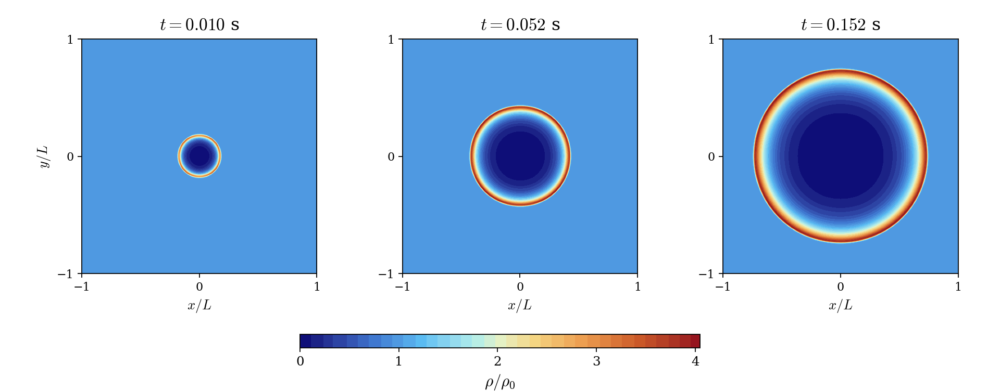
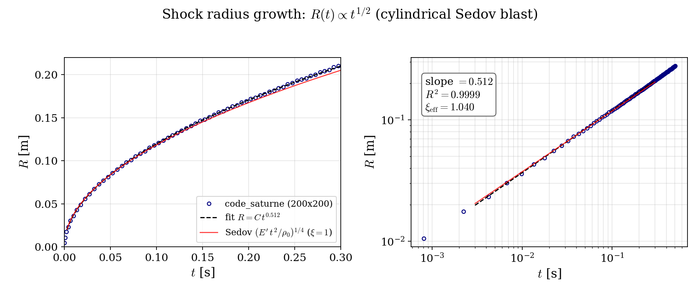

# Sedov Blast Wave (cylindrical)

A step-by-step tutorial for simulating a **Sedov blast wave** with the **compressible module** of **code_saturne**: a finite amount of energy released at a point in a uniform gas at rest drives a self-similar shock wave. The computed shock trajectory is validated against the **Sedov similarity law** $R(t) \propto t^{1/2}$, and the total energy conservation is verified.

Maintained by [Simvia](https://Simvia.tech/fr), part of the
[tutoriel-code_saturne](https://github.com/simvia-tech/tutorials-code_saturne) collection.

## Learning objectives

After completing this tutorial you will be able to:

1. **Override the GUI initialization** with a `cs_user_initialization.cpp` user routine (localized energy deposit).
2. Exploit the problem symmetry: quarter-plane domain with **symmetry planes** on the blast axes.
3. Use **supersonic outlet** boundary conditions of the compressible module.
4. Run a strongly transient computation with a **CFL-controlled variable time step**.
5. Validate a computation against a **self-similarity law** (shock radius exponent and prefactor).

## Prerequisites

| Requirement | Detail |
|---|---|
| code_saturne | **v9.1** |
| Background | Gas dynamics; the [Comp_Sod_Tube](../Comp_Sod_Tube) tutorial is the natural first step |

If code_saturne is not yet installed, build it from the
[official homepage](https://www.code-saturne.org/cms/web/Download), pull a
ready-to-use Singularity image from the
[Open Simulation Center](https://open-simulation-center.org/downloads/code_saturne/code_saturne),
or pull the
[Simvia Docker image](https://hub.docker.com/r/Simvia/code_saturne) before continuing.

## Case files

```
Comp_Sedov_Blast_Wave/
├── CASE/
│   ├── DATA/
│   │   └── setup.xml                    # pre-configured GUI case
│   └── SRC/
│       └── cs_user_initialization.cpp   # energy deposit (overrides GUI init)
├── FIGURES/                             # figures used in this README
└── README.md
```

> As for the Sod tube, there is **no MESH directory**: the mesh is generated at run time by the built-in cartesian mesher ($200 \times 200 \times 1$ cells on $[0, 0.2]^2$).

## Physical model

The flow is governed by the **Euler equations** for a perfect gas with $\gamma = 1.4$ (see the [Comp_Sod_Tube](../Comp_Sod_Tube) tutorial for the equation set), solved with the compressible module in the inviscid limit: the viscosities and the conductivity are set exactly to zero through GUI user laws (see the [Comp_Sod_Tube](../Comp_Sod_Tube) tutorial for details on this trick).

The **Sedov problem**: at $t = 0$, an energy $E'$ is deposited at the origin of a uniform gas at rest ($\rho_0 = 1$, $p_\infty = 0.01$). The energy deposit is modeled by a small high-pressure disc, set by the user routine (which overrides the uniform GUI initialization):

$$
p(r) = \begin{cases} p_\mathrm{hot} = 100 & r < r_0 = 0.005 \\ p_\infty = 0.01 & r \ge r_0 \end{cases}
\qquad \Longrightarrow \qquad
E' = \frac{(p_\mathrm{hot} - p_\infty)}{\gamma - 1} \, \pi r_0^2 = 1.963 \times 10^{-2}
$$

($E'$ is the energy **per unit length** of the full cylindrical blast; the computation covers a quarter of it.)

Since the only parameters are $E'$, $\rho_0$ and $t$, dimensional analysis imposes the **self-similar propagation law** of the shock. In this 2D planar computation the blast is **cylindrical**, hence:

$$
R(t) = \xi \left( \frac{E' \, t^2}{\rho_0} \right)^{1/4} \; \propto \; t^{1/2}
$$

with $\xi$ a constant of order one depending on $\gamma$ (Sedov, 1959). A spherical blast would give the famous $t^{2/5}$ instead. Behind the shock, the strong-shock density jump is bounded by $(\gamma+1)/(\gamma-1) = 6$, and the core of the blast empties almost completely.

### Flow parameters

| Quantity | Symbol | Value | Source in `setup.xml` / `SRC` |
|---|---|---|---|
| Heat capacity ratio | $\gamma$ | $1.4$ | derived from `specific_heat` and `reference_molar_mass` |
| Ambient state | $\rho_0$, $p_\infty$ | $1.0$, $0.01$ | `cs_user_initialization.cpp` |
| Energy deposit | $p_\mathrm{hot}$, $r_0$ | $100$, $0.005$ m | `cs_user_initialization.cpp` |
| Deposited energy (per unit length) | $E'$ | $1.963 \times 10^{-2}$ | derived |
| Domain (quarter plane) | | $[0, 0.2]^2$, $200 \times 200$ cells | `mesh_cartesian` |
| Time step | $\Delta t$ | variable, CFL $\le 1$ (seed $5 \times 10^{-5}$ s) | `time_parameters` |
| Final time | $t_{end}$ | $0.5$ s | `maximum_time` |

## Geometry and boundary conditions

The domain is a quarter plane: the blast is centered on the corner $(0,0)$, and the two axes $x = 0$ and $y = 0$ are **symmetry planes**, so a quarter of the cylindrical blast is computed. The outer boundaries carry the **supersonic outlet** condition of the compressible module, which lets the shock leave the domain freely at late times. The two spanwise ($xy$) planes carry a symmetry condition, so the computation is effectively two-dimensional.

| Boundary | Location | Nature | Zone |
|---|---|---|---|
| `x0`, `y0` | blast axes ($x=0$, $y=0$) | Symmetry | `X0`, `Y0` |
| `x1`, `y1` | outer boundaries ($x=0.2$, $y=0.2$) | Supersonic outlet | `X1`, `Y1` |
| `z0`, `z1` | spanwise planes | Symmetry | `Z0`, `Z1` |

The initial state is set by `SRC/cs_user_initialization.cpp`, compiled automatically at the beginning of the run; the routine logs `>>> cs_user_initialization: Sedov init.` in `run_solver.log` so you can check it was taken into account.

## Numerical setup

| Setting | Value | Rationale |
|---|---|---|
| Compressible algorithm | pressure-based, `constant gamma` | code_saturne compressible module |
| Time-stepping | **Variable time step**, max CFL $= 1$ | Follows the fast initial transient, relaxes later |
| Convection scheme | 1st-order upwind | Robust, monotone shock capturing |
| Viscosities, conductivity | $0$ (user laws) | Exact Euler limit |
| Turbulence | none | Inviscid benchmark |
| Output frequency | every 10 time steps | Time-resolved EnSight series for $R(t)$ |

## Running the simulation

The commands below start from the tutorial directory:

```bash
cd Comp_Sedov_Blast_Wave/
```

### Option A: Graphical interface

```bash
code_saturne gui CASE/DATA/setup.xml &
```

The GUI opens the pre-configured `setup.xml`. Review the setup if you wish,
then launch the run with the **gear (Run) button** in the toolbar.

### Option B: Command line

The command-line launcher is run from inside the case directory:

```bash
cd CASE

# serial
code_saturne run

# parallel (e.g. 4 MPI ranks)
code_saturne run --nprocs 4
```

The user routine `SRC/cs_user_initialization.cpp` is compiled automatically at the beginning of the run.

Each run creates a time-stamped directory `CASE/RESU/<YYYYMMDD-HHMM>/` containing:

- `run_solver.log`: solver log (including the Sedov init message),
- `postprocessing/`: time series of volume fields in EnSight Gold format.

## Results and verification

### Blast structure

<p align="center">
  
  <br>
  <em>Figure 1: Normalized density $\rho/\rho_0$ at three times, with axes normalized by the domain size $L = 0.2$ m (the quarter-plane solution is mirrored across the two symmetry axes to display the full cylindrical blast; all panels share the same color scale).</em>
</p>

The solution shows the classical Sedov structure: a thin dense shell right behind the shock and a nearly evacuated core. The peak density reaches $\rho/\rho_0 \approx 4$, approaching the strong-shock limit $(\gamma+1)/(\gamma-1) = 6$ from below (the shock here has a finite strength, and the first-order scheme smears the peak over a few cells). The front remains circular on the cartesian grid: measuring the shock radius along rays at $0$, $45$ and $90$ degrees gives a relative anisotropy of $0.5\%$ on average (max $1.9\%$).

### Shock trajectory vs the Sedov similarity law

The shock radius $R(t)$ is extracted from the time-resolved EnSight output as the position of the maximum radial pressure gradient along the domain diagonal.

<p align="center">
  
  <br>
  <em>Figure 2: Shock radius versus time in linear (left) and log-log (right) scales: code_saturne (circles), power-law fit (dashed) and dimensional Sedov law $(E' t^2/\rho_0)^{1/4}$ with $\xi = 1$ (red).</em>
</p>

Two quantitative checks:

- **Exponent**: the log-log fit over $0.004 \le t \le 0.24$ s gives $R \propto t^{0.512}$ with $R^2 = 0.9999$, against the theoretical $t^{1/2}$. The small excess comes from the finite size of the initial deposit (self-similarity is only reached for $R \gg r_0$) and from the gradient-based detection.
- **Prefactor**: the fitted prefactor corresponds to an effective similarity constant $\xi_\mathrm{eff} = 1.04$, of order one as required by the theory, and within a few percent of the dimensional estimate $\xi = 1$.

## Summary

This tutorial set up a cylindrical Sedov blast wave with the compressible module of code_saturne: energy deposit through a user initialization routine, quarter-plane symmetry, supersonic outlets and a CFL-controlled variable time step. The computed shock follows the self-similar law $R \propto t^{1/2}$ with exponent $0.512$ ($R^2 = 0.9999$) and an order-one similarity constant, the total energy is conserved to better than $10^{-4}$, and the front stays circular within $1\%$ on the cartesian grid. Together with the Sod tube, it covers the two canonical compressible verification problems before application-oriented cases.

## References

- L.I. Sedov. Similarity and Dimensional Methods in Mechanics, Academic Press, 1959.
- G.I. Taylor. The formation of a blast wave by a very intense explosion, [Proc. R. Soc. Lond. A, 201:159-174, 1950.](https://doi.org/10.1098/rspa.1950.0049)
- [code_saturne documentation](https://www.code-saturne.org/cms/web/documentation)

## Authors

[Simvia](https://Simvia.tech/fr) - Questions, remarks and requests are welcome.
