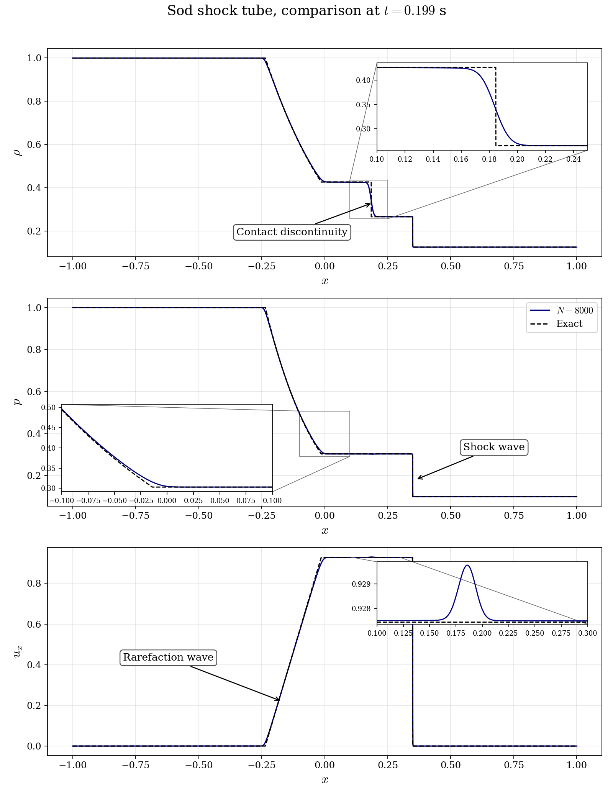

# Sod Shock Tube

A step-by-step tutorial for simulating the classical **Sod shock tube** with the **compressible module** of **code_saturne**, and validating the result against the **exact solution of the Riemann problem**. This is the entry case of the compressible series: one dimensional, inviscid, with an analytic reference for every wave of the solution.

Maintained by [Simvia](https://Simvia.tech/fr), part of the
[tutoriel-code_saturne](https://github.com/simvia-tech/tutorials-code_saturne) collection.

## Learning objectives

After completing this tutorial you will be able to:

1. Enable the **compressible module** (constant $\gamma$ perfect gas) in code_saturne from the GUI.
2. Build a mesh with the **built-in cartesian mesher** (no mesh file needed).
3. Initialize a **discontinuous state** with volume zones and per-zone formulas.
4. Run a **time-accurate transient** with a fixed time step chosen from an acoustic CFL condition.
5. Validate a shock-capturing computation against the **exact Riemann solution**.

## Prerequisites

| Requirement | Detail |
|---|---|
| code_saturne | **v9.1** |
| Background | Basic notions of gas dynamics (shock, contact, rarefaction) |

If code_saturne is not yet installed, build it from the
[official homepage](https://www.code-saturne.org/cms/web/Download), pull a
ready-to-use Singularity image from the
[Open Simulation Center](https://open-simulation-center.org/downloads/code_saturne/code_saturne),
or pull the
[Simvia Docker image](https://hub.docker.com/r/Simvia/code_saturne) before continuing.

## Case files

```
Comp_Sod_Tube/
├── CASE/
│   └── DATA/
│       └── setup.xml          # pre-configured GUI case
├── FIGURES/                   # figures used in this README
└── README.md
```

> There is **no MESH directory**: the mesh is generated at run time by the cartesian mesher configured in `setup.xml` (**Mesh > Cartesian mesh** in the GUI).

## Physical model

The flow is **one-dimensional, unsteady and inviscid**: the Euler equations for a perfect gas,

$$
\frac{\partial}{\partial t}
\begin{pmatrix} \rho \\ \rho u \\ \rho E \end{pmatrix}
+
\frac{\partial}{\partial x}
\begin{pmatrix} \rho u \\ \rho u^2 + p \\ (\rho E + p)\, u \end{pmatrix}
= 0,
\qquad
p = (\gamma - 1)\, \rho \left( E - \tfrac{1}{2} u^2 \right)
$$

solved with the code_saturne **compressible module** (`constant gamma` thermodynamics, total energy as thermal variable). The molecular viscosity, the volume viscosity and the thermal conductivity are set **exactly to zero** through GUI **user laws** (e.g. `molecular_viscosity = 0.0;`): the GUI does not accept zero for a *constant* molecular viscosity, but a user-law formula can be zero. The computation therefore solves the Euler equations exactly. The heat capacity ratio comes from the perfect gas constants entered in the GUI: $\gamma = c_p / (c_p - R/M) = 1005/(1005 - 287.06) = 1.4$.

The **Riemann problem** consists of two uniform states separated by a diaphragm at $x = 0$, released at $t = 0$:

| State | $\rho$ | $u$ | $p$ |
|---|---|---|---|
| Left ($x < 0$) | $1.0$ | $0$ | $1.0$ |
| Right ($x \ge 0$) | $0.125$ | $0$ | $0.1$ |

The exact solution (Toro, 2009) is self-similar and contains, from left to right: a **rarefaction wave**, a **contact discontinuity** and a **shock wave**.

> The states use the classical unit-free convention of the benchmark ($p$ and $\rho$ of order one). Only $\rho$, $p$ and $\gamma$ matter for the inviscid dynamics; the associated temperatures are not physically meaningful.

### Flow parameters

| Quantity | Symbol | Value | Source in `setup.xml` |
|---|---|---|---|
| Heat capacity ratio | $\gamma$ | $1.4$ | derived from `specific_heat` and `reference_molar_mass` |
| Left/right density | $\rho_L$, $\rho_R$ | $1.0$, $0.125$ | `density` formulas on zones `Left`/`Right` |
| Left/right pressure | $p_L$, $p_R$ | $1.0$, $0.1$ | `pressure` formulas on zones `Left`/`Right` |
| Left sound speed | $c_L = \sqrt{\gamma p_L/\rho_L}$ | $1.183$ | derived |
| Domain | $x \in [-1, 1]$ | $8000$ uniform cells | `mesh_cartesian` |
| Time step | $\Delta t$ | $1.1416 \times 10^{-4}\ \mathrm{s}$ (fixed) | `time_step_ref` |
| Final time | $t_{end}$ | $0.199\ \mathrm{s}$ ($1744$ iterations) | `iterations` |

The fixed time step corresponds to a maximum acoustic CFL of $\max(|u|+c)\,\Delta t / \Delta x \approx 1.0$ over the converged solution.

## Geometry and boundary conditions

The domain is a thin box of $2 \times 0.01 \times 1$ m meshed with $8000 \times 1 \times 1$ cells: a 1D problem computed on a 3D mesh. All six boundaries are **symmetry planes**: the waves never reach the ends of the tube before $t_{end}$, so no inlet or outlet condition is needed.

The initial discontinuity is built with two **volume zones** defined by selection criteria (`x < 0` and `x >= 0`), each carrying its own initialization formulas for the density and the pressure; the velocity is zero everywhere.

| Boundary | Nature | Zone / selection |
|---|---|---|
| all six faces | Symmetry | `X0`, `X1`, `Y0`, `Y1`, `Z0`, `Z1` |
| `Left` (volume) | Initialization $\rho = 1$, $p = 1$ | `x < 0` |
| `Right` (volume) | Initialization $\rho = 0.125$, $p = 0.1$ | `x >= 0` |

## Numerical setup

| Setting | Value | Rationale |
|---|---|---|
| Compressible algorithm | pressure-based, `constant gamma` | code_saturne compressible module |
| Time-stepping | **Fixed time step** | Time-accurate transient (self-similar solution) |
| Time step | $1.1416 \times 10^{-4}\ \mathrm{s}$ | Acoustic CFL $\approx 1$ on the finest wave speed |
| Iterations | $1744$ | Reaches $t = 0.199$ s before any wave hits a boundary |
| Convection scheme | 1st-order upwind (velocity, energy) | Robust, monotone shock capturing |
| Viscosities, conductivity | $0$ (user laws) | Exact Euler limit; a GUI constant cannot be zero, a user law can |
| Turbulence | none | Inviscid benchmark |

## Running the simulation

The commands below start from the tutorial directory:

```bash
cd Comp_Sod_Tube/
```

### Option A: Graphical interface

```bash
code_saturne gui CASE/DATA/setup.xml &
```

The GUI opens the pre-configured `setup.xml`. Review the setup if you wish
(in particular **Mesh > Cartesian mesh** and the two initialization zones),
then launch the run with the **gear (Run) button** in the toolbar.

### Option B: Command line

The command-line launcher is run from inside the case directory:

```bash
cd CASE

# serial
code_saturne run

# parallel (e.g. 2 MPI ranks)
code_saturne run --nprocs 2
```

Each run creates a time-stamped directory `CASE/RESU/<YYYYMMDD-HHMM>/` containing:

- `run_solver.log`: solver log and residual history,
- `postprocessing/`: volume and boundary fields in EnSight Gold format (final time).

## Results and verification

The figure below compares the computed profiles at $t = 0.199$ s with the exact solution of the Riemann problem (computed with an exact iterative Riemann solver following Toro, 2009).

<p align="center">
  
  <br>
  <em>Figure 1: Density (top), pressure (middle) and x-velocity (bottom) at $t = 0.199$ s: code_saturne with 8000 cells (solid) vs exact Riemann solution (dashed), with zooms on the contact discontinuity, the rarefaction foot and the post-shock plateau.</em>
</p>

The three waves are quantitatively reproduced:

- The **shock position, strength and speed** match the exact solution; the shock is captured over a few cells.
- The **rarefaction wave** matches the exact fan, with a slight rounding at its foot (visible in the pressure zoom), typical of the first-order upwind scheme.
- The **contact discontinuity** is the most smeared feature (about $0.02$ m, i.e. $\sim 85$ cells at 10-90%): a contact carries no pressure jump to steepen it, so a first-order scheme diffuses it steadily. This is the expected behavior, honestly visible in the density zoom.
- A tiny velocity bump ($< 0.1\%$ of $u$) subsists at the contact position (velocity zoom), also a known artifact of pressure-based shock capturing.

The mean absolute errors over the domain are $\overline{|\Delta \rho|} = 1.0 \times 10^{-3}$, $\overline{|\Delta p|} = 5.5 \times 10^{-4}$ and $\overline{|\Delta u|} = 1.0 \times 10^{-3}$.

## Summary

This tutorial set up the Sod shock tube with the compressible module of code_saturne: constant $\gamma$ perfect gas, cartesian built-in mesh, discontinuous initialization by volume zones, a **1st-order upwind** convection scheme, and a fixed time step at acoustic CFL $\approx 1$. The computed rarefaction, contact and shock match the exact Riemann solution, with the expected first-order smearing of the contact discontinuity. This case is the natural starting point before multi-dimensional compressible cases (blast waves, supersonic ramps).

## References

- G.A. Sod. A survey of several finite difference methods for systems of nonlinear hyperbolic conservation laws, [Journal of Computational Physics, 27(1):1-31, 1978.](https://doi.org/10.1016/0021-9991(78)90023-2)
- E.F. Toro. Riemann Solvers and Numerical Methods for Fluid Dynamics, 3rd edition, Springer, 2009 (chapters 4-5).
- [code_saturne documentation](https://www.code-saturne.org/cms/web/documentation)

## Authors

[Simvia](https://Simvia.tech/fr) - Questions, remarks and requests are welcome.
