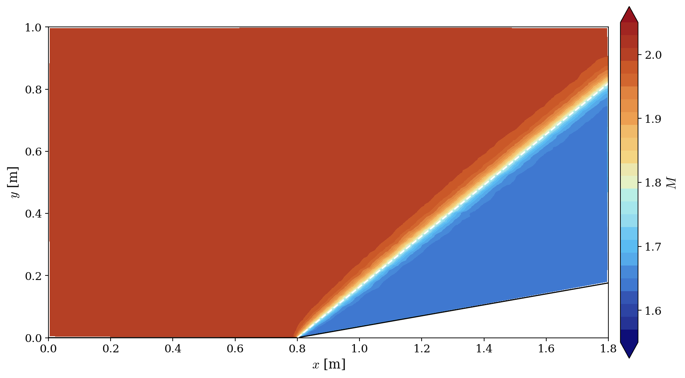

# Supersonic Compression Ramp at Mach 2

A step-by-step tutorial for simulating the **supersonic flow over a 10 degree compression ramp** at $M_1 = 2$ with the **compressible module** of **code_saturne**, and validating the attached **oblique shock** against the exact $\theta$-$\beta$-$M$ relations.

Maintained by [Simvia](https://Simvia.tech/fr), part of the
[tutoriel-code_saturne](https://github.com/simvia-tech/tutorials-code_saturne) collection.

## Learning objectives

After completing this tutorial you will be able to:

1. Compute a **supersonic external flow** with the compressible module (constant $\gamma$).
2. Prescribe an inlet through its **total conditions** ($P_t$, $H_t$) derived from the isentropic relations.
3. Model **slip walls** for an inviscid flow with symmetry boundary conditions.
4. Force the **exact Euler limit** with zero-valued GUI **user laws** for the viscosities and the conductivity.
5. Validate a shock-capturing computation against the **oblique shock relations**.

## Prerequisites

| Requirement | Detail |
|---|---|
| code_saturne | **v9.1** |
| Background | Gas dynamics (oblique shocks); the [Comp_Sod_Tube](../Comp_Sod_Tube) tutorial is the natural first step |

If code_saturne is not yet installed, build it from the
[official homepage](https://code-saturne.org/), pull a
ready-to-use Singularity image from the
[Open Simulation Center](https://open-simulation-center.org/downloads/code_saturne/code_saturne),
or pull the
[Simvia Docker image](https://hub.docker.com/r/Simvia/code_saturne) before continuing.

## Case files

```
Comp_Supersonic_Ramp/
├── CASE/
│   └── DATA/
│       └── setup.xml                        # pre-configured GUI case
├── MESH/
│   ├── ramp_10deg_shockref.msh              # mesh, refined along the shock (gmsh)
│   └── ramp_10deg_shockref.geo              # gmsh geometry and size-field source
├── FIGURES/                                 # figures used in this README
└── README.md
```

## Physical model

The flow is **steady, two-dimensional, supersonic and inviscid**: the Euler equations for a perfect gas with $\gamma = 1.4$ (see the [Comp_Sod_Tube](../Comp_Sod_Tube) tutorial for the equation set). The inviscid limit is enforced **exactly** by GUI **user laws** setting the molecular viscosity, the volume viscosity and the thermal conductivity to zero (a GUI *constant* cannot be zero, but a user-law formula can; see the [Comp_Sod_Tube](../Comp_Sod_Tube) tutorial).

A uniform stream at $M_1 = 2$ meets a $\theta = 10$ degree compression ramp. The exact solution is an **attached oblique shock** emanating from the ramp corner, whose angle $\beta$ satisfies the $\theta$-$\beta$-$M$ relation:

$$
\tan\theta = \frac{2}{\tan\beta} \, \frac{M_1^2 \sin^2\beta - 1}{M_1^2 (\gamma + \cos 2\beta) + 2}
$$

For $M_1 = 2$, $\theta = 10°$, $\gamma = 1.4$ (weak solution): $\beta = 39.3°$, and the normal-shock relations applied to $M_{1n} = M_1 \sin\beta$ give the pressure ratio $p_2/p_1 = 1.706$ and the downstream Mach number $M_2 = 1.64$.

### Inlet total conditions

The inlet is prescribed through its **total pressure and total enthalpy** (compressible inlet of type $P_t$, $H_t$), computed from the target static state ($p_1 = 101325$ Pa, $T_1 = 287.5$ K, $M_1 = 2$) with the isentropic relations:

$$
P_t = p_1 \left( 1 + \frac{\gamma - 1}{2} M_1^2 \right)^{\gamma/(\gamma-1)} = 792812\ \mathrm{Pa},
\qquad
H_t = c_p \, T_1 \left( 1 + \frac{\gamma - 1}{2} M_1^2 \right) = 520010\ \mathrm{J\,kg^{-1}}
$$

together with the velocity magnitude $u_1 = M_1 \sqrt{\gamma R_s T_1} = 679.8\ \mathrm{m\,s^{-1}}$. Consistency matters here: these values are computed with $c_p = 1004.85\ \mathrm{J\,kg^{-1}\,K^{-1}}$ (which gives exactly $\gamma = c_p/(c_p - R_s) = 1.4$ with $R_s = 287.06$), and the same $c_p$ is set in `setup.xml`. With this setup the computed upstream state comes out at $M_1 = 2.0000$ and $p_1 = 101328$ Pa.

### Flow parameters

| Quantity | Symbol | Value | Source in `setup.xml` |
|---|---|---|---|
| Heat capacity ratio | $\gamma$ | $1.4$ | derived from `specific_heat` ($1004.85$) and `reference_molar_mass` |
| Upstream Mach number | $M_1$ | $2.0$ | via inlet total conditions |
| Upstream static state | $p_1$, $T_1$ | $101325$ Pa, $287.5$ K | targets of the $P_t$/$H_t$ derivation |
| Ramp angle | $\theta$ | $10°$ | (geometry) |
| Inlet velocity | $u_1$ | $679.8\ \mathrm{m\,s^{-1}}$ | `inlet/velocity_pressure/norm` |
| Viscosity, conductivity | $\mu$, $\lambda$ | $0$ (exact Euler limit) | user laws in `fluid_properties` |

## Geometry and boundary conditions

The domain is a channel of height $1.0$ m: a flat plate from $x = 0$ to $0.8$ m, followed by a $10°$ ramp up to $x = 1.8$ m. The height is chosen so that the oblique shock ($\beta = 39.3°$ from the corner, reaching $y = 0.82$ m at the outlet) **leaves the domain through the outlet without touching the top boundary**: the solution contains the single attached shock and nothing else. The mesh (`MESH/ramp_10deg_shockref.msh`, generated from the shipped `ramp_10deg_shockref.geo` with gmsh) is unstructured (recombined quadrangles, extruded one cell in $z$), with a background cell size of $10$ mm refined to $2.5$ mm in a band centered on the **theoretical shock ray**: since $\beta$ is known in advance, the resolution is concentrated where the physics happens ($\approx 29\,000$ cells, only $1.6$ times a uniform $10$ mm mesh, for a shock captured four times more sharply).

Since the flow is inviscid, the plate, the ramp and the upper boundary are **slip walls**, which are imposed with **symmetry** boundary conditions (zero normal velocity, no wall friction): this is the standard trick for Euler computations. The supersonic outlet requires no prescribed value.

| Boundary | Location | Nature | Prescribed value | Zone id |
|---|---|---|---|---|
| `INLET` | left ($x=0$) | Compressible inlet ($P_t$, $H_t$) | $792812.3$ Pa, $520009.9$ J/kg, norm $679.8$ m/s | 100 |
| `OUTLET` | right ($x=1.8$) | Supersonic outlet | (none) | 200 |
| `WALL` | plate + ramp | Slip wall (symmetry) | (none) | 500 |
| `UP` | top ($y=1.0$) | Slip wall (symmetry) | (none) | 300 |
| `SYM`, `SYM_TOP` | spanwise planes | Symmetry | (none) | 600, 601 |

> Note on gmsh meshes: code_saturne selects boundary zones of a `.msh` file by the **numeric physical tags** (here 100, 200, 300, 500, 600, 601, set explicitly in `ramp_10deg_shockref.geo`), not by the physical names.

## Numerical setup

| Setting | Value | Rationale |
|---|---|---|
| Compressible algorithm | pressure-based, `constant gamma` | code_saturne compressible module |
| Time-stepping | Variable time step, max CFL $= 1$ | Pseudo-transient march to the steady state |
| Iterations | $6000$ | Steady state reached well within this budget |
| Convection scheme | 1st-order upwind | Forced by the compressible module for all variables, whatever the GUI blending factor (`cs_cf_model.cpp`) |
| Gradients | Least-squares (extended) | Accuracy on the stretched mesh |
| Initialization | $\mathbf{u} = (679.8, 0, 0)$, $p = 101325$ Pa, $T = 287.5$ K | Uniform upstream state |
| Viscosities, conductivity | $0$ (user laws) | Exact Euler limit |

## Running the simulation

The commands below start from the tutorial directory:

```bash
cd Comp_Supersonic_Ramp/
```

### Option A: Graphical interface

```bash
code_saturne gui CASE/DATA/setup.xml &
```

The GUI opens the pre-configured `setup.xml`. Review the setup if you wish,
then launch the run with the **gear (Run) button** in the toolbar.

### Option B: Command line

The command-line launcher is run from inside the case directory:

```bash
cd CASE

# serial
code_saturne run

# parallel (e.g. 4 MPI ranks)
code_saturne run --n 4
```

Each run creates a time-stamped directory `CASE/RESU/<YYYYMMDD-HHMM>/` containing:

- `run_solver.log`: solver log and residual history,
- `postprocessing/`: volume and boundary fields in EnSight Gold format (final state).

## Results and verification

<p align="center">
  
  <br>
  <em>Figure 1: Mach number field at convergence. The white dashed line is the theoretical oblique shock ($\beta = 39.3°$) drawn from the ramp corner; the shock leaves the domain through the outlet without touching the top boundary.</em>
</p>

The computed shock is attached to the corner (the measured shock line extrapolates to $x_0 = 0.797$ m for a corner at $0.8$ m) and follows the theoretical angle. The quantitative comparison against the oblique shock relations, using the measured upstream state ($M_1 = 2.0000$):

| Quantity | code_saturne | Oblique shock theory | Error |
|---|---|---|---|
| Shock angle $\beta$ | $39.4°$ | $39.3°$ | $0.2\%$ |
| Pressure ratio $p_2/p_1$ | $1.707$ | $1.706$ | $0.01\%$ |
| Downstream Mach $M_2$ | $1.638$ | $1.641$ | $0.2\%$ |

The shock angle is measured by locating, on each vertical line between $x = 0.90$ and $1.60$ m, the crossing of the mid-jump isobar $p = (p_1 + p_2)/2$, and fitting a straight line through these points ($R^2 = 0.99999$); the post-shock values are averaged between the ramp surface and the shock. The captured shock keeps a finite numerical thickness: the 1st-order upwind convection scheme diffuses the discontinuity over a few cells, which is why the mesh is refined along the shock. Away from this transition the upstream state remains strictly uniform at $M = 2.0000$.

## Summary

This tutorial computed the $M_1 = 2$ flow over a $10°$ compression ramp with the compressible module of code_saturne: inlet prescribed by its total conditions derived from the isentropic relations, slip walls imposed as symmetries, and exact Euler limit enforced by zero user laws.

## References

- J.D. Anderson. Modern Compressible Flow: With Historical Perspective, 3rd edition, McGraw-Hill, 2003 (chapter 4, oblique shocks).
- [NACA Report 1135, Equations, Tables and Charts for Compressible Flow, 1953.](https://ntrs.nasa.gov/citations/19930091059)
- [code_saturne documentation](https://code-saturne.org/doc/)

## Authors

[Simvia](https://Simvia.tech/fr) - Questions, remarks and requests are welcome.
