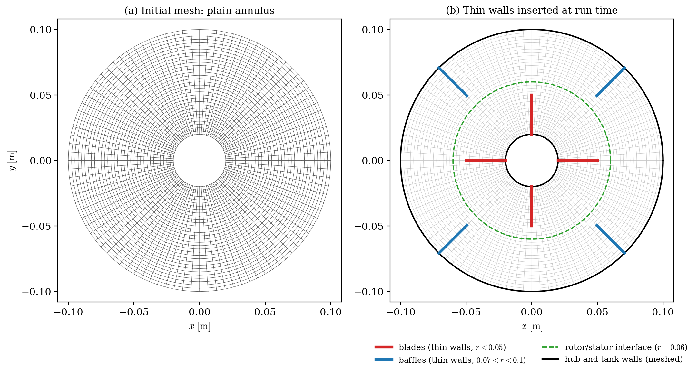
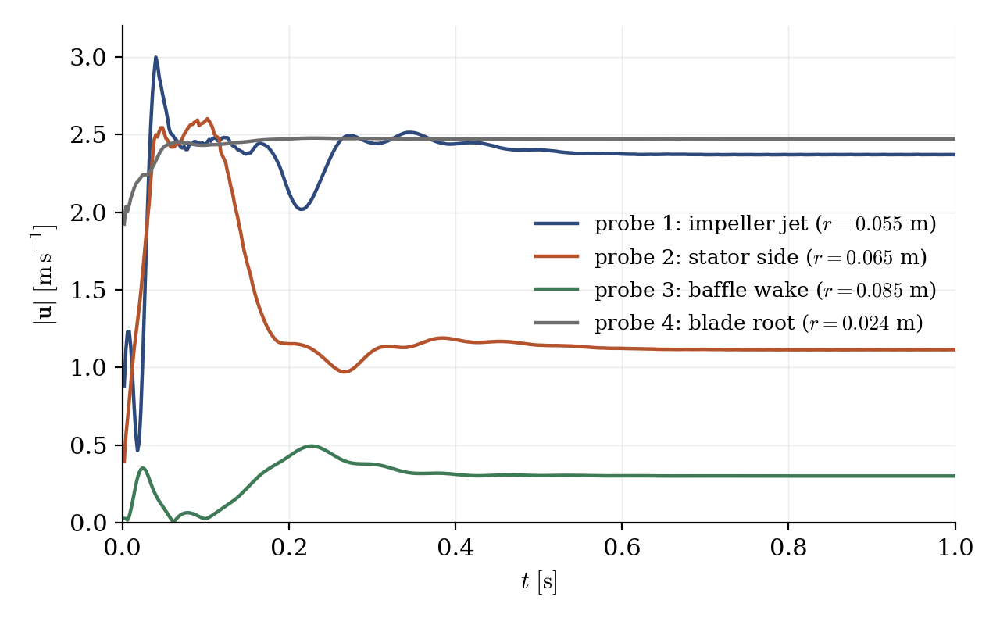
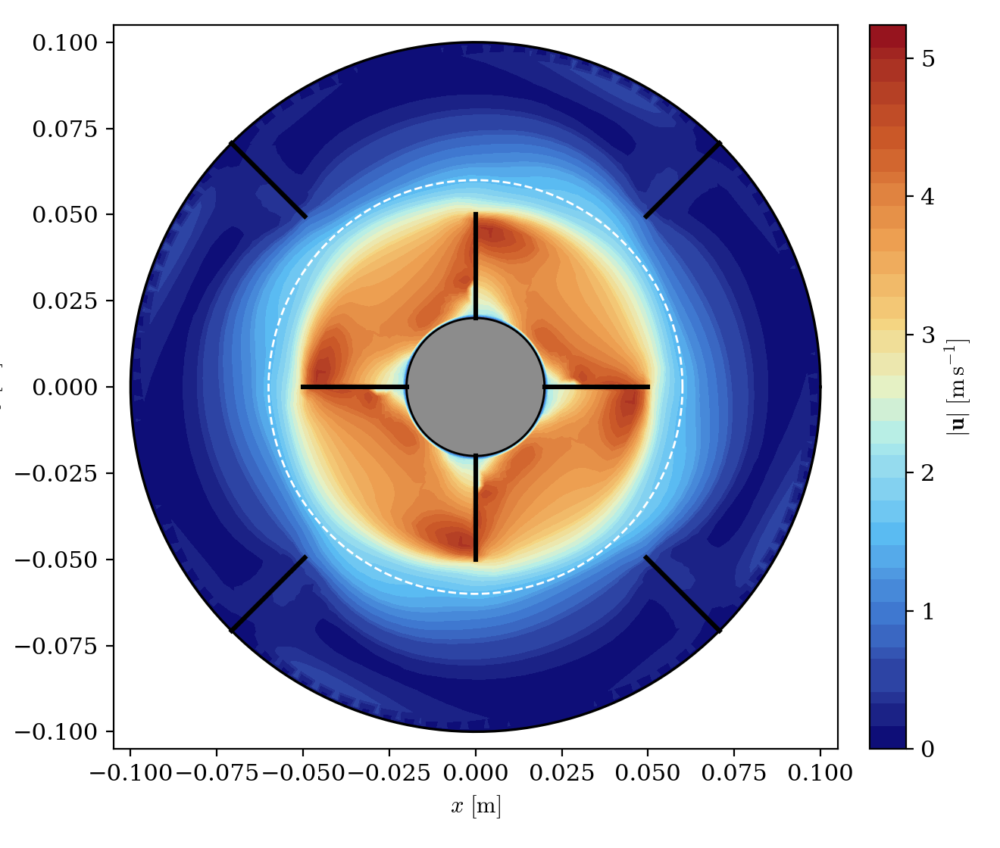

# 2D Mixer Vessel: Frozen Rotor

A step-by-step tutorial for simulating a **baffled stirred tank** with the **turbomachinery module** of **code_saturne**: a four-blade impeller rotating at 1000 rpm inside a cylindrical vessel equipped with four baffles, computed with the **frozen rotor** approach. The case is a compact demonstration of the turbomachinery workflow: a rotor zone defined by a geometric criterion, blades and baffles created as **thin walls**, and monitoring probes to assess convergence.

Maintained by [Simvia](https://Simvia.tech/fr), part of the
[tutoriel-code_saturne](https://github.com/simvia-tech/tutorials-code_saturne) collection.

## Learning objectives

After completing this tutorial you will be able to:

1. Enable the **frozen rotor** turbomachinery model and define the rotor zone with a geometric criterion.
2. Create internal zero-thickness walls (**thin walls**) from geometric selectors, without meshing them.
3. Set up a RANS computation with the **k-ε Linear Production** model and scalable wall functions.
4. Place **monitoring probes** and use them to assess the convergence of a pseudo-steady run.

## Prerequisites

| Requirement | Detail |
|---|---|
| code_saturne | **v9.1** |
| Background | RANS turbulence modelling basics; a first incompressible tutorial such as [Inc_Inviscid_Hydrofoil](../../00_foundations/Inc_Inviscid_Hydrofoil) |

If code_saturne is not yet installed, build it from the
[official homepage](https://code-saturne.org/), pull a
ready-to-use Singularity image from the
[Open Simulation Center](https://open-simulation-center.org/downloads/code_saturne/code_saturne),
or pull the
[Simvia Docker image](https://hub.docker.com/r/Simvia/code_saturne) before continuing.

## Case files

```
Tbm_Mixer_Vessel_2D/
├── CASE/
│   └── DATA/
│       └── setup.xml            # pre-configured GUI case
├── MESH/
│   └── mixerVessel2D.msh        # annular quasi-2D mesh (gmsh)
├── FIGURES/                     # figures used in this README
└── README.md
```

Note that the mesh contains **neither the blades nor the baffles**: it is a plain annulus. Both are inserted at run time as thin walls (see below).

## Physical model

The flow is incompressible and turbulent. Its physics is governed by the impeller Reynolds number, built on the rotation rate $N$ (in revolutions per second) and the impeller diameter $D = 0.1$ m:

$$
Re = \frac{N D^2}{\nu} = \frac{16.67 \times 0.1^2}{10^{-5}} \approx 1.7 \times 10^4
$$

Turbulence is modelled with the **k-ε Linear Production** variant (which limits the spurious production of turbulent energy in highly strained regions, such as the blade tips) and **scalable wall functions**.

The **frozen rotor** approach computes a **steady** approximation of the rotor-stator interaction: the equations are solved in the rotating frame inside the rotor zone (with the corresponding Coriolis and centrifugal terms) and in the fixed frame outside, with the rotor *frozen* at one angular position. It is the cheapest turbomachinery model, and the natural first step before a transient rotor-stator computation with mesh rotation.

### Flow parameters

| Quantity | Symbol | Value | Source in `setup.xml` |
|---|---|---|---|
| Density | $\rho$ | $1\ \mathrm{kg\,m^{-3}}$ | `density` |
| Molecular viscosity | $\mu$ | $10^{-5}\ \mathrm{Pa\,s}$ | `molecular_viscosity` |
| Rotation rate | $\omega$ | $104.72\ \mathrm{rad\,s^{-1}}$ (1000 rpm) | `turbomachinery/rotor/velocity` |
| Blade tip speed | $\omega\, r_{tip}$ | $5.24\ \mathrm{m\,s^{-1}}$ | derived ($r_{tip} = 0.05$ m) |
| Impeller Reynolds number | $Re$ | $1.7 \times 10^4$ | derived |

## Geometry and boundary conditions

The vessel is an annulus of outer radius $0.1$ m (tank wall) and inner radius $0.02$ m (hub), extruded one cell over a thickness of $0.01$ m: the computation is quasi-2D. From the axis outwards:

| Radius [m] | Element |
|---|---|
| $0.02$ | hub (no-slip wall) |
| $0.02 - 0.05$ | 4 impeller blades at $0°/90°/180°/270°$ (thin walls) |
| $0.06$ | rotor/stator interface (`rotor/criteria`, dashed circle in Figure 3) |
| $0.07 - 0.10$ | 4 baffles at $45°/135°/225°/315°$ (thin walls) |
| $0.10$ | tank wall (no-slip wall) |

The mesh (`MESH/mixerVessel2D.msh`) is a structured polar grid of $96 \times 32 \times 1 = 3072$ hexahedra, radially refined towards the hub:

<p align="center">
  
  <br>
  <em>Figure 1: (a) the mesh as read from <code>mixerVessel2D.msh</code>: a plain annulus, with no obstacle inside. (b) the blades (red) and baffles (blue) inserted at run time as thin walls; the dashed green circle is the rotor/stator interface, which is not a wall but the limit of the rotating zone.</em>
</p>

### Thin walls

The blades and baffles are **not meshed** (Figure 1a): they are created at run time by a mesh preprocessing operation that turns interior faces selected by geometric criteria into pairs of coincident boundary faces (Figure 1b). In the GUI, open **Mesh → Preprocessing**, tab **Other**, box **Interior to boundary faces (boundary insertion)**: the **Add** button creates one row per insertion, and each row holds one selection criterion. For instance the row creating the two blades lying along the $x$ axis reads:

```
plane[0, 1, 0, 0, 0.001] and cylinder[0, 0, -1, 0, 0, 1, 0.05]
```

that is: interior faces within $0.001$ m of the plane $y = 0$, inside the cylinder of radius $0.05$ m. This is a convenient way to add zero-thickness internal obstacles to an existing mesh.

Note that the insertion itself is a pure **mesh operation**, performed before the boundary conditions are applied: it does not decide the boundary condition of the new faces. The inserted faces carry **no group name** (the *zone id* column of the GUI table is only a row counter), so they belong to no boundary zone, and code_saturne then applies its **default condition: smooth wall**. This is exactly what blades and baffles require, so this setup adds nothing: the boundary conditions section simply ignores these faces. If another nature were needed (a symmetry would make the obstacles slip walls, for instance), one would define a boundary zone whose selection criterion catches the inserted faces, e.g. the same geometric criterion, or `not (2 or 3 or 4 or 5)` (all boundary faces outside the four mesh groups); keep in mind that such a criterion catches **both** coincident faces of each inserted pair.

### Boundary conditions

| Boundary | Location | Nature | Zone selector |
|---|---|---|---|
| `walls` | hub + tank wall | Smooth wall (no-slip) | `4 or 5` |
| `z0`, `z1` | spanwise planes | Symmetry | `2`, `3` |
| (thin walls) | blades + baffles | Smooth wall (**default**, no zone defined) | (none) |

> Note on gmsh meshes: code_saturne selects boundary zones of a `.msh` file by the **numeric physical tags** (here 2, 3, 4, 5), not by the physical names (`z0`, `z1`, `hub`, `tank_wall`).

## Numerical setup

| Setting | Value | Rationale |
|---|---|---|
| Turbomachinery model | **Frozen rotor** | Steady rotor-stator approximation |
| Rotor zone | `cylinder[0, 0, -0.1, 0, 0, 0.1, 0.06]` | Cells with $r < 0.06$ m rotate |
| Velocity-pressure coupling | **SIMPLEC** | Standard segregated coupling |
| Time-stepping | Fixed $\Delta t = 2 \times 10^{-3}$ s | Pseudo-transient march (mean CFL $\approx 1.4$); larger steps trigger a numerical oscillation in the blade-root corner cells |
| Iterations | $500$ ($t = 1$ s $\approx 17$ rotor revolutions) | Steady state reached well within this budget (Figure 2) |
| Turbulence | k-ε Linear Production, scalable wall functions | Robust on the coarse near-wall mesh |
| Relaxation | $0.3$ (pressure), $0.5$ (velocity, $k$, $\varepsilon$) | Pseudo-steady convergence |
| Initialization | fluid at rest | The impeller spins the fluid up from rest |

## Running the simulation

The commands below start from the tutorial directory:

```bash
cd Tbm_Mixer_Vessel_2D/
```

### Option A: Graphical interface

```bash
code_saturne gui CASE/DATA/setup.xml &
```

The GUI opens the pre-configured `setup.xml`. Review the setup if you wish,
then launch the run with the **gear (Run) button** in the toolbar.

### Option B: Command line

The command-line launcher is run from inside the case directory:

```bash
cd CASE

# serial
code_saturne run

# parallel (e.g. 2 MPI ranks)
code_saturne run --n 2
```

Each run creates a time-stamped directory `CASE/RESU/<YYYYMMDD-HHMM>/` containing:

- `run_solver.log`: solver log (check the *boundary faces type* table: 448 wall faces including the thin walls, 6144 symmetry faces, 0 undefined),
- `monitoring/probes_*.csv`: probe histories,
- `postprocessing/`: volume fields in EnSight Gold format.

## Results

### Convergence

Four probes monitor the velocity magnitude at representative locations: the impeller jet just beyond the blade tips ($r = 0.055$ m), the stator side of the rotor/stator interface ($r = 0.065$ m), the near wake of a baffle ($r = 0.085$ m), and a blade-root corner cell ($r = 0.024$ m), the most numerically sensitive point of the case.

<p align="center">
  
  <br>
  <em>Figure 2: Velocity magnitude at the four monitoring probes. After the spin-up transient (about 0.4 s, i.e. 7 rotor revolutions), all probes settle on a strictly flat plateau: the frozen-rotor steady state is reached. The blade-root probe converges to $2.47\ \mathrm{m\,s^{-1}}$, the local entrainment velocity $\omega r$.</em>
</p>

### Velocity field

<p align="center">
  
  <br>
  <em>Figure 3: Velocity magnitude at convergence. The four blades (thick lines, $r < 0.05$ m) drive the rotating core; the white dashed circle is the rotor/stator interface ($r = 0.06$ m); the four baffles ($0.07 < r < 0.1$ m) hold the outer region nearly still, which is precisely their role in a stirred tank. The maximum velocity, $4.85\ \mathrm{m\,s^{-1}}$, stays below the blade tip speed of $5.24\ \mathrm{m\,s^{-1}}$.</em>
</p>

The solution shows the expected stirred-tank pattern: a nearly solid-body rotating core carried by the impeller, thin high-speed jets leaving the blade tips, and an outer region kept almost at rest by the baffles. Keep in mind the frozen-rotor caveat: the steady solution depends on the angular position at which the rotor is frozen (here, blades at $45°$ from the baffles); a transient rotor-stator computation would resolve the actual blade-passing dynamics.

## Summary

This tutorial computed a baffled stirred tank with the frozen rotor model of code_saturne: rotor zone defined by a geometric criterion, blades and baffles inserted as zero-thickness thin walls into a plain annular mesh, k-ε Linear Production turbulence with scalable wall functions, and a relaxed SIMPLEC pseudo-transient monitored by four probes until a strictly steady state.

## References

- [code_saturne documentation](https://code-saturne.org/doc/)
- E.L. Paul, V.A. Atiemo-Obeng, S.M. Kresta (eds). Handbook of Industrial Mixing: Science and Practice, Wiley, 2004.

## Authors

[Simvia](https://Simvia.tech/fr) - Questions, remarks and requests are welcome.
