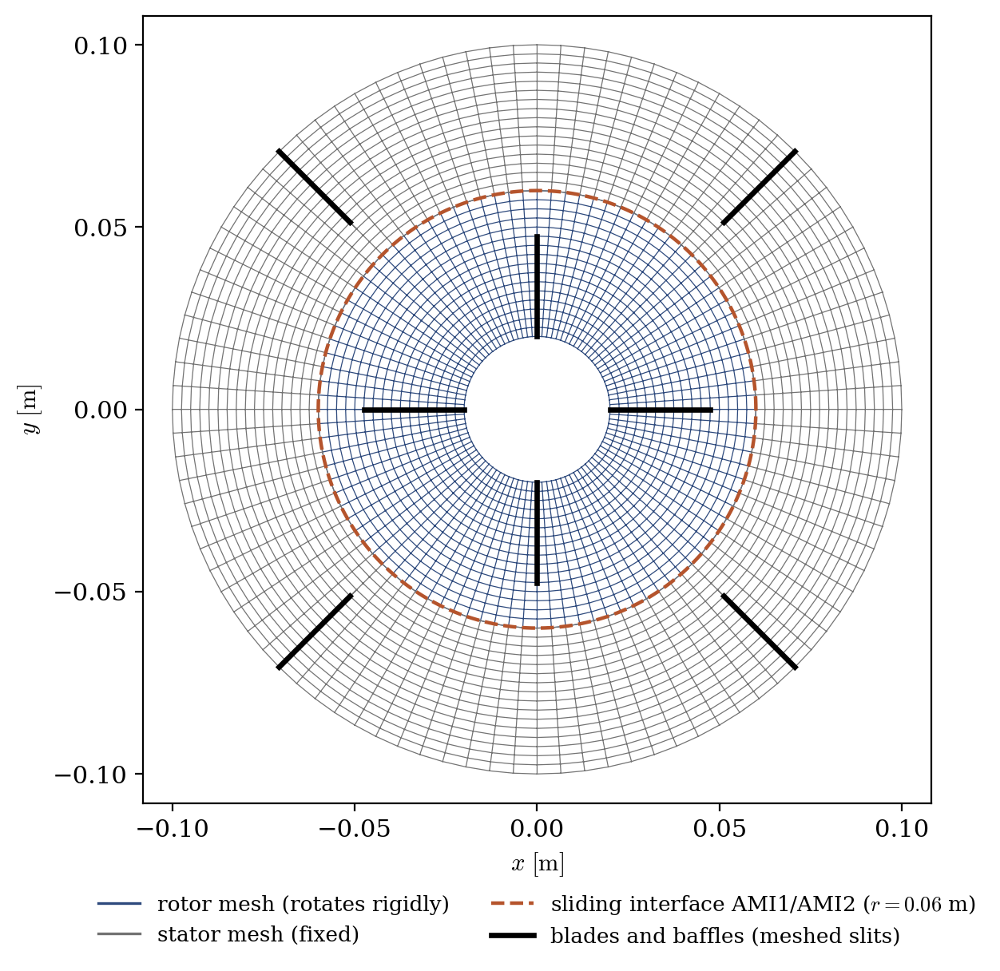
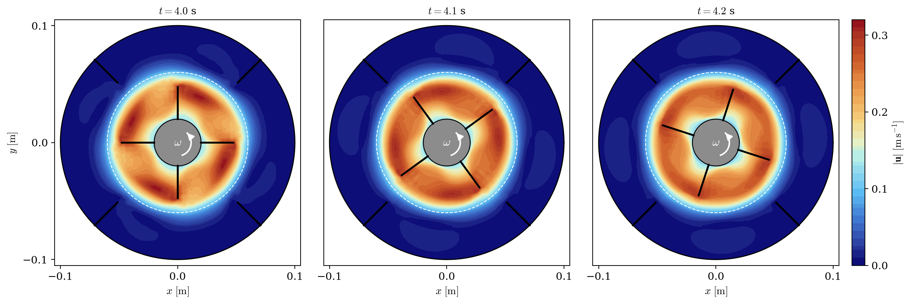
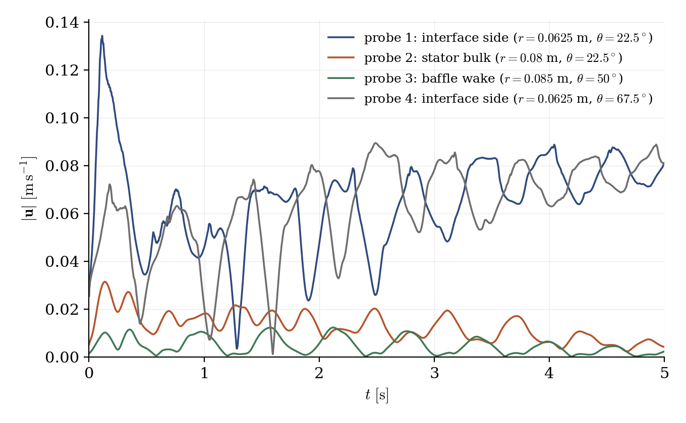

# 2D Mixer Vessel: Sliding Mesh

A step-by-step tutorial for simulating a **baffled stirred tank** with the **transient rotor (sliding mesh)** turbomachinery model of **code_saturne**: a four-blade impeller rotating at 60 rpm inside a cylindrical vessel equipped with four baffles. The companion tutorial [Tbm_Mixer_Vessel_2D](../Tbm_Mixer_Vessel_2D) computes a similar configuration with the *frozen rotor* approximation on a single mesh; this one resolves the **actual rotation**: the rotor mesh turns rigidly at every time step, and the rotor/stator interface is re-joined on the fly.

Maintained by [Simvia](https://Simvia.tech/fr), part of the
[tutoriel-code_saturne](https://github.com/simvia-tech/tutorials-code_saturne) collection.

## Learning objectives

After completing this tutorial you will be able to:

1. Enable the **transient rotor** turbomachinery model (true sliding mesh).
2. Assemble a computation from **two independent meshes** (rotor + stator) connected by a **face joining recomputed at every time step**.
3. Choose a time step compatible with the sliding interface (fraction of a cell swept per step).
4. Post-process a rotating-mesh transient (probes in the fixed frame, EnSight output with transient connectivity).

## Prerequisites

| Requirement | Detail |
|---|---|
| code_saturne | **v9.1** |
| Case | [Tbm_Mixer_Vessel_2D](../Tbm_Mixer_Vessel_2D) (frozen rotor companion case) |

If code_saturne is not yet installed, build it from the
[official homepage](https://code-saturne.org/), pull a
ready-to-use Singularity image from the
[Open Simulation Center](https://open-simulation-center.org/downloads/code_saturne/code_saturne),
or pull the
[Simvia Docker image](https://hub.docker.com/r/Simvia/code_saturne) before continuing.

## Case files

```
Tbm_Mixer_Vessel_2D_Transient/
├── CASE/
│   └── DATA/
│       └── setup.xml            # pre-configured GUI case
├── MESH/
│   ├── rotor.msh                # rotating annulus, blades meshed as slits (gmsh, msh 4.1)
│   └── stator.msh               # fixed annulus, baffles meshed as slits (gmsh, msh 4.1)
├── FIGURES/                     # figures used in this README
└── README.md
```

## Physical model

The flow is incompressible and **laminar**: at 60 rpm ($N = 1$ rev/s) the impeller Reynolds number, built on the impeller diameter $D = 0.095$ m, is

$$
Re = \frac{N D^2}{\nu} = \frac{1 \times 0.095^2}{10^{-5}} \approx 900
$$

so no turbulence model is used (contrast with the frozen rotor case at 1000 rpm, $Re \approx 1.7 \times 10^4$).

The **transient rotor** model is the reference approach for rotor/stator interaction: the cells of the rotor zone (and their walls) physically **rotate** at each time step, and the interface between the rotating and fixed parts of the mesh is a **sliding, non-conforming joining** whose connectivity is recomputed at every iteration. Unlike the frozen rotor model, it captures the true blade/baffle relative motion, at the price of a time-accurate (and therefore more expensive) computation.

### Flow parameters

| Quantity | Symbol | Value | Source in `setup.xml` |
|---|---|---|---|
| Density | $\rho$ | $1\ \mathrm{kg\,m^{-3}}$ | `density` |
| Molecular viscosity | $\mu$ | $10^{-5}\ \mathrm{Pa\,s}$ | `molecular_viscosity` |
| Rotation rate | $\omega$ | $6.2832\ \mathrm{rad\,s^{-1}}$ (60 rpm) | `turbomachinery/rotor/velocity` |
| Blade tip speed | $\omega\, r_{tip}$ | $0.298\ \mathrm{m\,s^{-1}}$ | derived ($r_{tip} = 0.0475$ m) |
| Impeller Reynolds number | $Re$ | $\approx 900$ (laminar) | derived |

## Geometry and meshes

The vessel is the same annular, quasi-2D layout as the frozen rotor case (outer radius $0.1$ m, hub radius $0.02$ m, one cell over a thickness of $0.01$ m), but the domain is now split into **two independent gmsh meshes** that meet at the interface radius $r = 0.06$ m:

| Mesh | Extent | Cells | Obstacles |
|---|---|---|---|
| `rotor.msh` | $0.02 \le r \le 0.06$ | $96 \times 16 = 1536$ hexahedra | 4 blades at $0°/90°/180°/270°$, $0.02 < r < 0.0475$ |
| `stator.msh` | $0.06 \le r \le 0.10$ | $96 \times 16 = 1536$ hexahedra | 4 baffles at $45°/135°/225°/315°$, $0.0725 < r < 0.10$ |

<p align="center">
  
  <br>
  <em>Figure 1: the two-mesh assembly. The rotor mesh (blue) rotates rigidly; the stator mesh (gray) is fixed; they meet at the sliding interface (dashed circle, $r = 0.06$ m), carried by the boundary groups <code>AMI1</code> (rotor side) and <code>AMI2</code> (stator side). Blades and baffles are <strong>meshed as zero-thickness slits</strong> (duplicated nodes), so no thin-wall insertion is needed here, unlike in the frozen rotor case.</em>
</p>

### The sliding interface

Each mesh is a closed annulus: the outer boundary of `rotor.msh` (group `AMI1`) and the inner boundary of `stator.msh` (group `AMI2`) are two coincident rings of 96 boundary faces each. Without further action they would be **two watertight default walls**. The `face_joining` defined **inside the turbomachinery section** (selector `AMI1 or AMI2`) glues them into interior faces; being attached to the transient rotor model, this joining is **recomputed at every time step**, after the rotor mesh has rotated: this is the sliding-mesh mechanism, and the joined faces are generally non-conforming.

### Rotor zone and boundary conditions

Only the rotating part is declared: the rotor zone is selected by the volume group `rotor_fluid` of `rotor.msh`, and everything else is stator (fixed) by default. The walls carried by rotor cells (hub and blades) automatically rotate with the zone.

| Boundary | Location | Nature | Zone selector |
|---|---|---|---|
| `rotor_wall` | hub + blades | Smooth wall (rotating) | `rotor` |
| `stator_wall` | tank wall + baffles | Smooth wall | `stator` |
| `front`, `back` | spanwise planes | Symmetry | `front`, `back` |

> Note on gmsh formats: these meshes are in **msh 4.1** format, for which code_saturne attaches the physical **names** to the groups (selectors like `rotor`, `AMI1` or `rotor_fluid` work directly). This differs from the older msh 2.2 format used in the frozen rotor case, where only the numeric physical tags are available.

## Numerical setup

| Setting | Value | Rationale |
|---|---|---|
| Turbomachinery model | **Transient rotor** | True sliding mesh |
| Rotor zone | `rotor_fluid` | The whole rotor mesh rotates |
| Interface | `face_joining` on `AMI1 or AMI2` | Re-joined at every time step |
| Velocity-pressure coupling | **SIMPLEC** | Standard segregated coupling |
| Time-stepping | Fixed $\Delta t = 10^{-3}$ s | $0.36°$ of rotation per step, about $1/10$ of an azimuthal cell at the interface |
| Simulated time | $5$ s ($5000$ steps, 5 revolutions) | Rotating-core flow established; see the spin-up caveat below |
| Turbulence | none (laminar) | $Re \approx 900$ |
| Output | EnSight every $100$ steps, **transient connectivity** | The mesh moves: the geometry is rewritten at each output |
| Probes | 4, recorded every step | All in the fixed stator region |

## Running the simulation

The commands below start from the tutorial directory:

```bash
cd Tbm_Mixer_Vessel_2D_Transient/
```

### Option A: Graphical interface

```bash
code_saturne gui CASE/DATA/setup.xml &
```

The GUI opens the pre-configured `setup.xml`. Review the setup if you wish,
then launch the run with the **gear (Run) button** in the toolbar.

### Option B: Command line

The command-line launcher is run from inside the case directory:

```bash
cd CASE

# serial
code_saturne run

# parallel (e.g. 2 MPI ranks)
code_saturne run --n 2
```

Each run creates a time-stamped directory `CASE/RESU/<YYYYMMDD-HHMM>/` containing:

- `run_solver.log`: solver log (look for the *unsteady rotor/stator treatment* summary and the joining information at each step),
- `monitoring/probes_*.csv`: probe histories,
- `postprocessing/`: time series of volume fields in EnSight Gold format, with one geometry per output time.

## Results

### The rotor really rotates

<p align="center">
  
  <br>
  <em>Figure 2: Velocity magnitude at $t = 4.0$, $4.1$ and $4.2$ s (the white arrow marks the rotation direction). Between two snapshots the impeller advances by $36°$ while the baffles stay fixed: the blade/baffle relative position, frozen by assumption in the companion case, is resolved here. The high-velocity lobes trail the blades, and the baffled outer region stays quiet.</em>
</p>

### Spin-up and probes

<p align="center">
  
  <br>
  <em>Figure 3: Velocity magnitude at the four monitoring probes (all in the fixed stator region). The near-interface probes (1 and 4) oscillate as the rotor structures sweep past them; the bulk and baffle-wake probes show the slow laminar spin-up of the outer region.</em>
</p>

An honest caveat on convergence: at $Re \approx 900$ the flow spins up on the **viscous time scale** $\tau_\nu \sim \Delta r^2/\nu \sim 10^2$ s, so after 5 revolutions ($5$ s) only the rotor core is established; the stator bulk is still slowly accelerating, as probe 2 shows. This is the physics of laminar stirred tanks, not a numerical artifact; running the case longer simply continues the spin-up. The purpose of this tutorial is the **sliding-mesh workflow**, which is fully exercised here.

## Summary

This tutorial computed a baffled stirred tank with the transient rotor (sliding mesh) model of code_saturne: two independent gmsh meshes glued by a face joining recomputed at every time step, a rotor zone selected by its volume group, blades and baffles meshed as zero-thickness slits, and a time step chosen so the interface slides by a fraction of a cell per step. Together with [Tbm_Mixer_Vessel_2D](../Tbm_Mixer_Vessel_2D) (frozen rotor), it covers the two turbomachinery approaches of code_saturne.

## References

- [code_saturne documentation](https://code-saturne.org/doc/)
- E.L. Paul, V.A. Atiemo-Obeng, S.M. Kresta (eds). Handbook of Industrial Mixing: Science and Practice, Wiley, 2004.

## Authors

[Simvia](https://Simvia.tech/fr) - Questions, remarks and requests are welcome.
