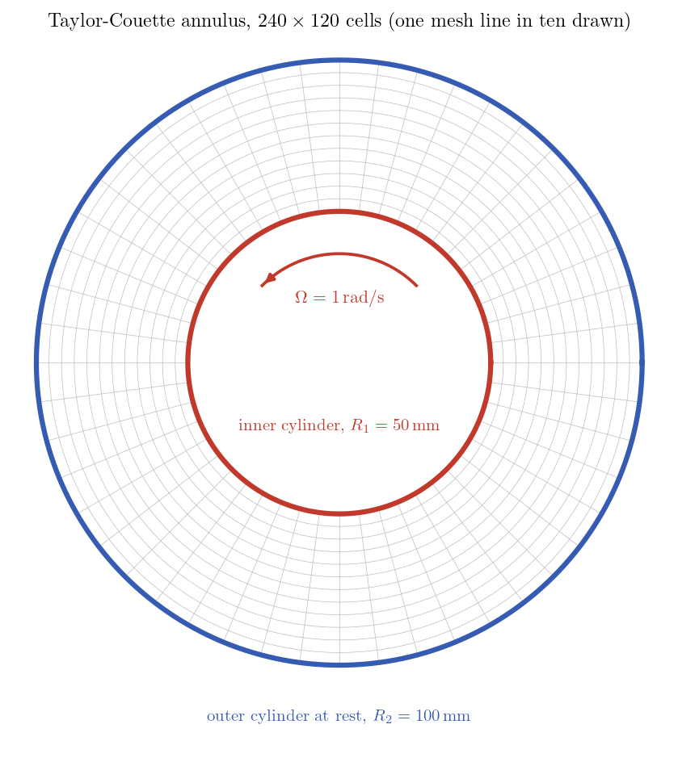
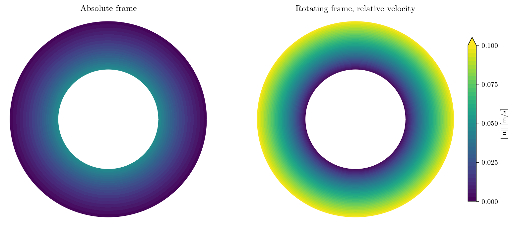
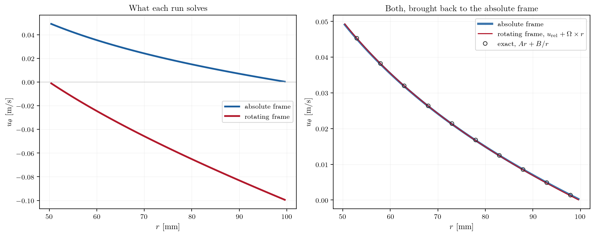
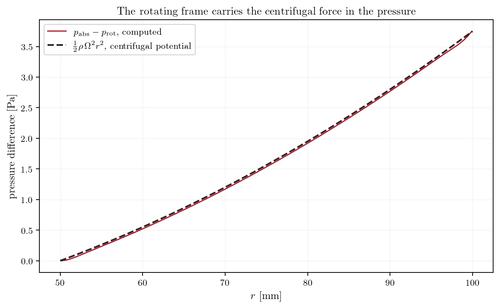

# Taylor-Couette Flow in a Rotating Frame

There are two ways to compute a rotating machine. Either the frame stands still
and the walls move through it, or the frame turns with the machine and the
equations carry the extra terms that rotation brings. The first is what the
mixer tutorials of this section do, with a rotating zone joined to a fixed one.
The second is what you reach for when a single blade passage is enough: no
interface, no sliding mesh, just a domain that turns and a Coriolis term in the
momentum equation.

code_saturne offers that second option from the GUI, as a global angular
velocity, and this tutorial exercises it on the one rotating flow that has an
exact solution in closed form: the laminar flow between two concentric
cylinders.

The same flow is computed **twice**, once in each frame. That gives two
independent verifications for the price of one small mesh: each result is
compared with the exact profile, and the two are compared with each other. A
rotating frame is a change of variables, nothing more, so once the frame motion
is added back the two computations must return the same physical field. If they
do not, the extra terms are wrong.

Maintained by [Simvia](https://Simvia.tech/fr), part of the
[tutoriel-code_saturne](https://github.com/simvia-tech/tutorials-code_saturne) collection.

## Learning objectives

After completing this tutorial you will be able to:

1. Put a whole domain in a **rotating frame** from the GUI, and check in `setup.log` that the solver has activated the Coriolis source term.
2. Impose a **rotating wall**, which the GUI cannot express, with a short analytic-function boundary condition.
3. Verify a rotating computation twice: against an exact solution, and by **frame invariance**.
4. Know where the centrifugal force went, and why the pressure a rotating computation reports is not the physical pressure.

## Prerequisites

| Requirement | Detail |
|---|---|
| code_saturne | **v9.1** |
| Tutorials | [Tbm_Mixer_Vessel_2D](../Tbm_Mixer_Vessel_2D) (the other way to handle rotation, a rotating zone in a fixed frame) |
| Background | Rotating frames: Coriolis and centrifugal acceleration |

If code_saturne is not yet installed, build it from the
[official homepage](https://code-saturne.org/), pull a
ready-to-use Singularity image from the
[Open Simulation Center](https://open-simulation-center.org/downloads/code_saturne/code_saturne),
or pull the
[Simvia Docker image](https://hub.docker.com/r/Simvia/code_saturne) before continuing.

## Case files

```text
Tbm_Taylor_Couette/
├── CASE_ABSOLUTE/                   # fixed frame, the inner cylinder turns
│   ├── DATA/setup.xml
│   └── SRC/cs_user_boundary_conditions.cpp
├── CASE_ROTATING/                   # frame turning with the inner cylinder
│   ├── DATA/setup.xml
│   └── SRC/cs_user_boundary_conditions.cpp
├── MESH/
│   ├── annulus.msh                  # structured annulus (gmsh)
│   └── annulus.geo                  # its source
├── FIGURES/
└── README.md
```

The two cases differ by three things only: the frame angular velocity, which
cylinder is given a wall velocity, and nothing else. Everything about the fluid,
the mesh and the time stepping is identical, which is what makes the comparison
between them meaningful.

## Physical model

The flow is **incompressible, laminar and isothermal**, in the annulus between
two concentric cylinders. The inner one turns at $\Omega$, the outer one is at
rest. The steady solution is purely azimuthal and depends on the radius alone:

$$
u_\theta(r) = A\,r + \frac{B}{r},
\qquad
A = -\frac{\Omega R_1^2}{R_2^2 - R_1^2},
\qquad
B = \frac{\Omega R_1^2 R_2^2}{R_2^2 - R_1^2}
$$

which satisfies the Navier-Stokes equations exactly, not approximately. The
viscous torque on the inner cylinder follows from it in closed form, per unit
length:

$$
\mathcal{T} = 4\pi\mu B
$$

so the case offers both a profile and a scalar to check.

### Flow parameters

| Quantity | Symbol | Value | Source in `setup.xml` |
|---|---|---:|---|
| Inner radius | $R_1$ | $50$ mm | (geometry) |
| Outer radius | $R_2$ | $100$ mm | (geometry) |
| Angular velocity | $\Omega$ | $1$ rad/s | `cs_user_boundary_conditions.cpp`, and `omega_z` for the rotating frame |
| Density | $\rho$ | $1000$ kg/m³ | `density` |
| Dynamic viscosity | $\mu$ | $1$ Pa s | `molecular_viscosity` |
| Reynolds number | $\Omega R_1 d/\nu$ | $2.5$ | (derived) |

The Reynolds number is deliberately small. Above a threshold the circular
Couette flow gives way to Taylor vortices, axially periodic rolls that this
purely azimuthal solution knows nothing about. At $Re = 2.5$ the flow is far
below that threshold, and the mesh has a single cell across the span in any
case, so the rolls could not appear even if they wanted to.

## Geometry and boundary conditions

<p align="center">
  
  <br>
  <em>Figure 1: The annulus and its structured mesh. A full annulus has exactly
  two lateral boundaries, so the case needs neither periodicity nor mesh
  joining.</em>
</p>

The two runs differ only in the frame and in which wall is given a velocity:

| Boundary | `CASE_ABSOLUTE` | `CASE_ROTATING` |
|---|---|---|
| Frame | fixed | rotating at $\Omega$ about $z$ |
| Inner cylinder | wall, $\mathbf{u} = \mathbf{\Omega} \times \mathbf{r}$ | wall at rest |
| Outer cylinder | wall at rest | wall, $\mathbf{u} = -\mathbf{\Omega} \times \mathbf{r}$ |
| $z$ planes | symmetry | symmetry |

The rotating frame is declared in the GUI as a global angular velocity, under
**Physical properties**. Setting it is enough: the solver reports
`icorio: 1 (apply Coriolis source terms)` in `setup.log`, together with the
rotation axis and rate, and that line is worth checking before trusting a
rotating computation.

### Why a rotating wall needs a user routine

The GUI can give a wall a velocity, but only a **uniform** one, three constants.
A cylinder turning about its axis needs a velocity that varies from face to
face, so it goes through a short analytic function instead:

```c
static void
_rotating_wall(cs_real_t time, cs_lnum_t n_elts, const cs_lnum_t *elt_ids,
               const cs_real_t *coords, bool dense_output, void *input,
               cs_real_t *val)
{
  const cs_real_t omega = *(const cs_real_t *)input;
  const cs_real_3_t *xyz = (const cs_real_3_t *)coords;
  cs_real_3_t *v = (cs_real_3_t *)val;

  for (cs_lnum_t i = 0; i < n_elts; i++) {
    const cs_lnum_t e_id = (elt_ids == nullptr) ? i : elt_ids[i];
    const cs_lnum_t j = dense_output ? i : e_id;

    v[j][0] = -omega*xyz[e_id][1];
    v[j][1] =  omega*xyz[e_id][0];
    v[j][2] =  0.;
  }
}
```

attached to the zone in `cs_user_boundary_conditions_setup`:

```c
cs_equation_add_bc_by_analytic(cs_equation_param_by_name("velocity"),
                               CS_BC_DIRICHLET, "inner",
                               _rotating_wall, (void *)&_omega);
```

The rotating-frame case uses the same function with the opposite sign on the
outer cylinder, since a wall at rest in the absolute frame turns backwards in a
frame that follows the inner one.

## Numerical setup

| Setting | Value |
|---|---:|
| Mesh | $240 \times 120$ cells, one across the span |
| Turbulence | none, laminar |
| Time step | $0.01$ s, constant |
| Iterations | $2000$, that is $20$ s |
| Viscous time across the gap | $d^2/\nu = 2.5$ s |

Twenty seconds is eight viscous times, so the steady state is reached with a
wide margin; the velocity extrema in the log stop moving well before the end.

## Running the simulation

```bash
cd Tbm_Taylor_Couette/

cd CASE_ABSOLUTE && code_saturne run --n 4 && cd ..
cd CASE_ROTATING && code_saturne run --n 4 && cd ..
```

Each run takes a few minutes on four cores. The GUI opens either case with
`code_saturne gui CASE_ABSOLUTE/DATA/setup.xml &`.

## Results and verification

<p align="center">
  
  <br>
  <em>Figure 2: Velocity magnitude, same colour scale. In the absolute frame the
  fluid is fastest against the inner cylinder that drives it; in the frame
  turning with that cylinder the picture inverts, the fluid is at rest on the
  inner wall and sweeps past the outer one. Two different fields, one flow.</em>
</p>

<p align="center">
  
  <br>
  <em>Figure 3: Left, the field each run actually solves: the two have nothing in
  common, one going to zero at the outer wall and the other at the inner wall.
  Right, the same two results once the frame motion is added back, against the
  exact solution.</em>
</p>

The agreement is good, and the frame invariance holds: the rotating-frame result,
plus $\mathbf{\Omega} \times \mathbf{r}$, falls back onto the absolute-frame
result and onto the exact profile. The torque on the inner cylinder agrees with
$4\pi\mu B$ to a few tenths of a percent in both runs, with the sign it should
have, the fluid resisting the rotation.

What remains is discretisation, not a modelling error: halving the cell size
halves the residual gap, which is also why the shipped mesh is the finer of the
two that were tried.

### Where the centrifugal force went

<p align="center">
  
  <br>
  <em>Figure 4: Difference between the pressures computed in the two frames,
  compared with the centrifugal potential.</em>
</p>

A rotating frame introduces two accelerations, Coriolis and centrifugal, but the
solver only ever adds the first one: the log says so, `apply Coriolis source
terms`, and the source contains no centrifugal term. The reason is that the
centrifugal acceleration is a gradient, so it can be folded into the pressure,
and that is what the rotating formulation does.

Figure 4 confirms it: the pressure difference between the two runs follows
$\frac{1}{2}\rho\Omega^2r^2$ over the whole gap. The consequence is practical.
In a rotating frame, the pressure the solver writes is a **reduced** pressure.
To recover the physical one, add the centrifugal potential back. Forget it, and
a pressure map or an integrated force on a blade will be wrong by a term that
grows as the square of the radius.

## Summary

The same laminar annular flow, computed in a fixed frame with a rotating wall and
in a frame rotating with the inner cylinder. Both match the exact circular
Couette profile and the exact viscous torque, and they match each other once the
frame motion is added back, which is the check that the rotation terms are right.

Two practical points came out of it. A rotating wall cannot be expressed in the
GUI and needs a few lines of analytic boundary condition. And the rotating
formulation carries the centrifugal force inside the pressure, so the pressure it
reports is not the physical one.

## References

1. G.I. Taylor, "Stability of a viscous liquid contained between two rotating cylinders", *Philosophical Transactions of the Royal Society A*, 223, pp. 289-343, 1923.
2. G.K. Batchelor. *An Introduction to Fluid Dynamics*, Cambridge University Press, 1967 (section 4.5, steady flow between rotating cylinders).
3. [code_saturne documentation](https://code-saturne.org/doc/)

## Authors

[Simvia](https://Simvia.tech/fr) - Questions, remarks and requests are welcome.
