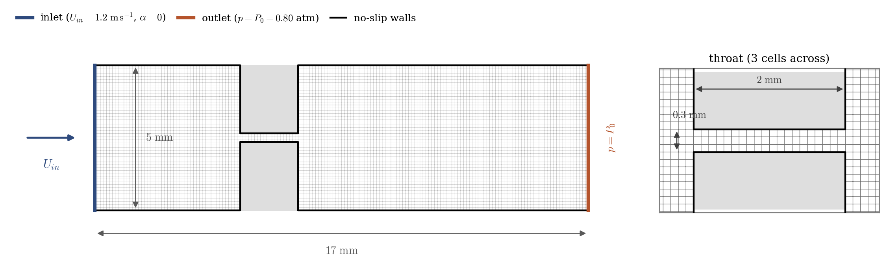
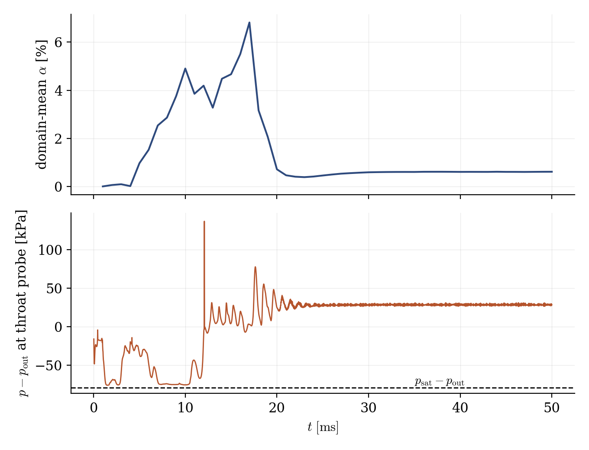
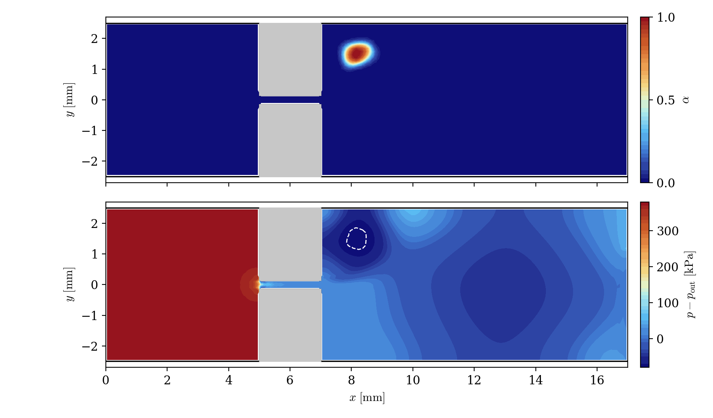

# Cavitating Throttle (VOF Cavitation Model)

A step-by-step tutorial for simulating **cavitation** with the **VOF cavitation model (Merkle)** of **code_saturne**: the pressure drop through a small 2D throttle (orifice) creates a steady vapor pocket in which the pressure locks onto the saturation pressure. The case teaches the complete cavitation workflow, including the one **mandatory user routine** without which the model silently produces no vapor at all.

Maintained by [Simvia](https://Simvia.tech/fr), part of the
[tutoriel-code_saturne](https://gitlab.com/Simvia/common-tools/tutoriel-code_saturne) collection.

## Learning objectives

After completing this tutorial you will be able to:

1. Enable the **cavitation model** (VOF homogeneous mixture with Merkle mass-transfer source terms).
2. Set the mandatory model parameters (`presat`, `uinf`, `linf`) in `cs_user_parameters.cpp`, and understand why the run produces **no vapor at all** without this file.
3. Size a cavitating case with the **cavitation number**, using the system pressure as the control knob (as in a cavitation tunnel).
4. Monitor the health of a cavitating run (VOF mass balance, void-fraction clipping messages).

## Prerequisites

| Requirement | Detail |
|---|---|
| code_saturne | **v9.1** |
| Case | [Vof_Kelvin_Helmholtz](../Vof_Kelvin_Helmholtz) (basics of the VOF model) |

If code_saturne is not yet installed, build it from the
[official homepage](https://www.code-saturne.org/cms/web/Download), pull a
ready-to-use Singularity image from the
[Open Simulation Center](https://open-simulation-center.org/downloads/code_saturne/code_saturne),
or pull the
[Simvia Docker image](https://hub.docker.com/r/Simvia/code_saturne) before continuing.

## Case files

```
Vof_Cavitating_Throttle/
├── CASE/
│   ├── DATA/
│   │   └── setup.xml                # pre-configured GUI case
│   └── SRC/
│       └── cs_user_parameters.cpp   # cavitation model parameters (MANDATORY)
├── MESH/
│   └── throttle.med                 # 2D throttle mesh, 7710 hexahedra
├── FIGURES/                         # figures used in this README
└── README.md
```

## Physical model

The cavitation model of code_saturne is the **VOF homogeneous mixture model with mass transfer**: one set of incompressible momentum equations for the mixture, one transport equation for the void fraction $\alpha$ (vapor volume fraction), and a **Merkle source term** $\Gamma_v$ that vaporizes liquid where the pressure drops below the saturation pressure $p_{\mathrm{sat}}$ and condenses vapor where it rises back above:

$$
\frac{\partial \alpha}{\partial t} + \mathbf{u} \cdot \nabla \alpha = \frac{\Gamma_v}{\rho_v},
\qquad
\rho = (1-\alpha)\,\rho_l + \alpha\,\rho_v
$$

The Merkle source terms are proportional to $\min(p - p_{\mathrm{sat}}, 0)$ (vaporization) and $\max(p - p_{\mathrm{sat}}, 0)$ (condensation), with empirical constants and a time scale built from the model reference velocity and length ($u_\infty$, $\ell_\infty$).

The classic signature of cavitation, visible in the results below: wherever the vapor pocket sits, the source terms drive the local pressure to **lock onto $p_{\mathrm{sat}}$**.

### The single most important file: `cs_user_parameters.cpp`

The cavitation model parameters are **not exposed in the GUI**: they can only be set in `cs_user_parameters.cpp`. If you activate the cavitation model in the GUI and do not provide this file, the run proceeds normally but **no vapor is ever created**: the model reference velocity `uinf` keeps an unset sentinel value which makes the source terms numerically zero. This is the single most common cavitation setup mistake. The shipped file sets:

- `presat = 2340` Pa: saturation pressure of water at 20 °C. It is compared to the **total (absolute) pressure**, which includes the reference pressure $P_0$ set in the GUI;
- `uinf = 21` m/s, `linf = 2e-3` m: bulk velocity in the throat and throat length, which calibrate the vaporization/condensation time scale ($t_\infty = \ell_\infty/u_\infty$);
- the empirical constants `cdest`, `cprod` keep their defaults.

### Sizing: the cavitation number

Whether and how much a device cavitates is governed by the **cavitation number**, built here on the throat velocity $U_t$:

$$
\sigma = \frac{p_{\mathrm{out}} - p_{\mathrm{sat}}}{\tfrac{1}{2} \rho_l U_t^2} \approx 0.26
$$

This case controls $\sigma$ through the **system pressure**, exactly as a laboratory cavitation tunnel does: the outlet is held at $P_0 = 81325$ Pa (0.80 atm absolute) rather than atmospheric. With water at 20 °C everywhere ($\rho_l$, $\mu_l$, $p_{\mathrm{sat}}$ all consistent), this places the operating point in a **steady, bounded pocket** regime: the depression peak of the developed flow exceeds the cavitation threshold by a controlled margin (about 10 kPa). Two pitfalls of sizing such a case on a coarse mesh, found the hard way while building it, are worth recording: the suction peak at the throat corners is **smeared by the mesh** (it grows far more slowly with the inlet velocity than the ideal $U^2$ scaling suggests), and an operating point *marginally* above the threshold produces a bistable, non-reproducible flow in which the vapor pocket created by the impulsive start may or may not survive. Size for a clear margin, on the knob that acts directly on the threshold.

### Flow parameters

| Quantity | Symbol | Value | Source |
|---|---|---|---|
| Liquid (water, 20 °C) | $\rho_l$, $\mu_l$ | $998\ \mathrm{kg\,m^{-3}}$, $10^{-3}\ \mathrm{Pa\,s}$ | `density`, `molecular_viscosity` (`value_0`) |
| Vapor | $\rho_v$, $\mu_v$ | $1\ \mathrm{kg\,m^{-3}}$, $10^{-5}\ \mathrm{Pa\,s}$ | (`value_1`) |
| Saturation pressure | $p_{\mathrm{sat}}$ | $2340$ Pa (absolute) | `cs_user_parameters.cpp` |
| System (outlet) pressure | $P_0$ | $81325$ Pa (0.80 atm) | `reference_pressure` |
| Inlet velocity | $U_{in}$ | $1.2\ \mathrm{m\,s^{-1}}$ | `inlet/velocity_pressure/norm` |
| Throat velocity | $U_t$ | $\approx 24.6\ \mathrm{m\,s^{-1}}$ | computed |
| Cavitation number | $\sigma$ | $\approx 0.26$ | derived |
| Time step | $\Delta t$ | $2 \times 10^{-6}$ s (fixed, CFL $\approx 0.5$) | `time_step_ref` |
| Simulated time | $t_{end}$ | $50$ ms ($25000$ steps) | `iterations` |

## Geometry and boundary conditions

The geometry is the throttle of Winklhofer et al. (2001): a channel of height $5$ mm and length $17$ mm, restricted by a throat of height $0.3$ mm and length $2$ mm ($x = 5$ to $7$ mm). The mesh (`MESH/throttle.med`) has $7710$ hexahedra, one cell thick, with only **3 cells across the throat**: this is a deliberately coarse, minimal case (about 10 minutes on 4 cores).

<p align="center">
  
  <br>
  <em>Figure 1: computational domain and mesh. Velocity inlet (blue), pressure outlet at the system pressure $P_0$ (orange), no-slip walls (black); the spanwise planes (not shown) carry the symmetry condition. Right: zoom on the throat and its 3 cells across.</em>
</p>

| Boundary | Location | Nature | Prescribed value | Zone selector |
|---|---|---|---|---|
| `Inlet` | left | Velocity inlet | $1.2\ \mathrm{m\,s^{-1}}$, $\alpha = 0$ | `inlet` |
| `Outlet` | right | Free outlet | $p = P_0$ | `outlet` |
| `Walls` | channel + throat walls | Smooth wall | (none) | `walls` |
| `Sym` | spanwise planes | Symmetry | (none) | `not (inlet or outlet or walls)` |

## Numerical setup

| Setting | Value | Rationale |
|---|---|---|
| Two-phase model | VOF + Merkle cavitation (`merkle_model`) | Mass transfer between phases |
| Velocity-pressure coupling | **SIMPLEC** | Standard segregated coupling |
| Velocity convection scheme | 1st-order upwind (`blending_factor` 0) | Robustness on the coarse mesh |
| Gradients | Iterative (Green) | Default, robust |
| Time-stepping | Fixed $\Delta t = 2 \times 10^{-6}$ s | Time-accurate transient, CFL $\approx 0.5$ |
| Turbulence | none (laminar) | The point is the cavitation model |
| Initialization | fluid at rest, $\alpha = 0$ | Impulsive start |

## Running the simulation

The commands below start from the tutorial directory:

```bash
cd Vof_Cavitating_Throttle/
```

### Option A: Graphical interface

```bash
code_saturne gui CASE/DATA/setup.xml &
```

The GUI opens the pre-configured `setup.xml`. Review the setup if you wish,
then launch the run with the **gear (Run) button** in the toolbar.

### Option B: Command line

The command-line launcher is run from inside the case directory:

```bash
cd CASE

# serial
code_saturne run

# parallel (e.g. 4 MPI ranks)
code_saturne run --nprocs 4
```

The user routine `SRC/cs_user_parameters.cpp` is compiled automatically at the beginning of the run.

Each run creates a time-stamped directory `CASE/RESU/<YYYYMMDD-HHMM>/` containing:

- `run_solver.log`: solver log,
- `monitoring/probes_*.csv`: throat probe histories,
- `postprocessing/`: time series of volume fields in EnSight Gold format.

Two log messages deserve a comment. Warnings about **void-fraction clipping** are expected in cavitating runs (the min/max principle criterion is dominated by the worst near-empty cell; violations are handled by clipping). The health indicator to watch instead is the **`VOF model, mass balance`** line: transient spikes while the vapor structures develop, then back to round-off level ($\sim 10^{-11}$ kg/s here) once the pocket is steady.

## Results

<p align="center">
  
  <br>
  <em>Figure 2: time histories. Top: domain-mean void fraction; the impulsive start triggers a large transient vapor burst (up to 7% of the domain), which collapses around $t = 20$ ms, after which the flow settles onto a <strong>steady bounded pocket</strong> (flat plateau to the end of the run). Bottom: pressure at the throat-axis probe; during the burst the probe reads the saturation pressure (dashed line), then settles with the steady flow.</em>
</p>

<p align="center">
  
  <br>
  <em>Figure 3: fields at $t = 50$ ms. Top: void fraction; the steady vapor pocket ($\alpha \approx 1$) sits in the <strong>recirculation eddy</strong> of the sudden expansion, on the side the jet detaches from (the jet issuing from the throat attaches to one wall, a Coanda effect classical in sudden expansions). Bottom: pressure; inside the pocket the pressure locks onto $p_{\mathrm{sat}}$ (white dashed contour; computed minimum $-79014$ Pa vs. $p_{\mathrm{sat}} - P_0 = -78985$ Pa, i.e. 0.04%).</em>
</p>

## Summary

This tutorial computed a cavitating throttle with the VOF cavitation model (Merkle) of code_saturne: model activated in the GUI but parameterized by the mandatory `cs_user_parameters.cpp` (`presat`, `uinf`, `linf`), operating point sized through the cavitation number with the system pressure as control knob, and a steady bounded vapor pocket whose internal pressure locks onto the saturation pressure to within 0.04%.

## References

- E. Winklhofer, E. Kull, E. Kelz, A. Morozov. Comprehensive hydraulic and flow field documentation in model throttle experiments under cavitation conditions, ILASS-Europe, 2001.
- C.L. Merkle, J. Feng, P.E.O. Buelow. Computational modeling of the dynamics of sheet cavitation, 3rd Int. Symp. on Cavitation, 1998.
- [code_saturne documentation](https://www.code-saturne.org/cms/web/documentation)

## Authors

[Simvia](https://Simvia.tech/fr) - Questions, remarks and requests are welcome.
