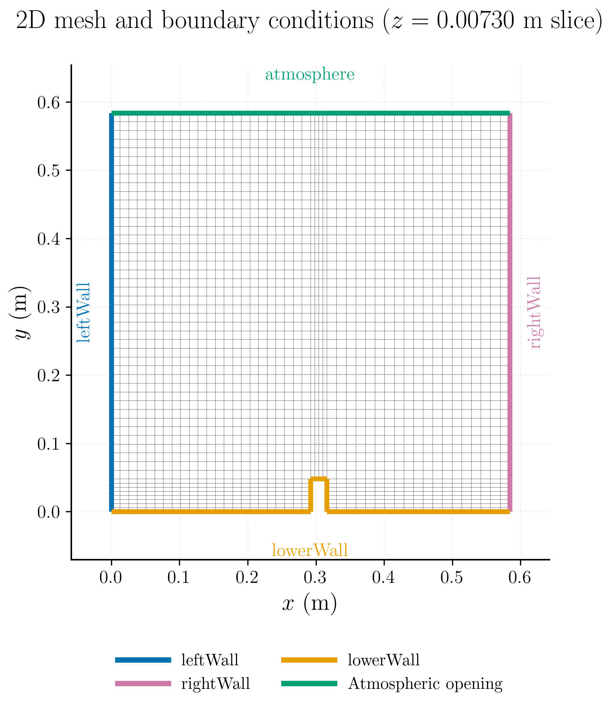
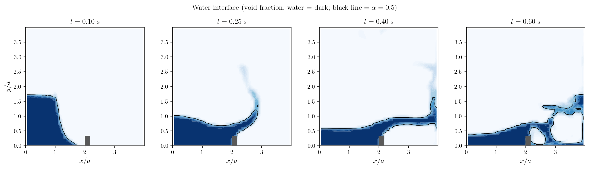

# Dam Break with a Bottom Obstacle (VOF)

This tutorial simulates the gravity-driven collapse of a water column inside a two-dimensional tank. The liquid front propagates across the dry section of the tank, impacts a rectangular obstacle, rises along its upstream face, and subsequently overtops it. The case is designed as a compact demonstration of free-surface flow modelling with the homogeneous Volume-of-Fluid (VOF) model in code_saturne.

The supplied setup is configured for **code_saturne 9.1** and uses a water-air mixture without interphase mass transfer.

Maintained by [Simvia](https://Simvia.tech/fr), part of the
[tutoriel-code_saturne](https://github.com/simvia-tech/tutorials-code_saturne) collection.

## Learning objectives

After completing this tutorial, the user should be able to:

1. Activate the homogeneous VOF model for an incompressible water-air flow.
2. Initialize two phases in different volume zones using the `void_fraction` field.
3. Define phase-dependent density and dynamic viscosity.
4. Include gravity and surface-tension effects.
5. Run a transient free-surface calculation with a fixed time step.
6. Visualize the interface from the VOF field and assess the main stages of the dam-break motion.

## Prerequisites

| Requirement | Detail |
|---|---|
| code_saturne | **v9.1** |
| Background | Basic notions of multiphase modelling with the VOF method |

If code_saturne is not yet installed, build it from the
[official homepage](https://code-saturne.org/), pull a
ready-to-use Singularity image from the
[Open Simulation Center](https://open-simulation-center.org/downloads/code_saturne/code_saturne),
or pull the
[Simvia Docker image](https://hub.docker.com/r/Simvia/code_saturne) before continuing.

## Case files

```
Vof_Dam_Break/
├── CASE/
│   └── DATA/
│       └── setup.xml
├── MESH/
│   └── damBreak_with_groups.med
├── FIGURES/                   # figures used in this README
└── README.md
```

## Physical model

### Homogeneous two-phase formulation

The case uses the homogeneous VOF model with **no interphase mass transfer**. Both phases share a single velocity field and a single pressure field. The interface is represented by the scalar field

$$
\alpha = \texttt{void\_fraction},
$$

where, in this case:

- $\alpha=0$ represents water.
- $\alpha=1$ represents air.
- $0<\alpha<1$ identifies cells crossed by the numerically captured interface.

The phase indicator is transported in conservative form. In the VOF formulation, the transport equation may be written as

$$
\frac{\partial \alpha}{\partial t}
+ \nabla\cdot(\alpha\mathbf{u})
+ \nabla\cdot\left[\alpha(1-\alpha)\mathbf{u}_r\right]
=0,
$$

where $\mathbf{u}$ is the mixture velocity and $\mathbf{u}_r$ represents the interface-compression or drift contribution used by the VOF discretization. The right-hand side is zero because vaporization, condensation, and other phase-change mechanisms are disabled.

The local mixture properties are obtained from the volume fraction:

$$
\rho=(1-\alpha)\rho_w+\alpha\rho_a,
$$

$$
\mu=(1-\alpha)\mu_w+\alpha\mu_a,
$$

where subscripts $w$ and $a$ denote water and air, respectively.

### Momentum equation

The incompressible variable-density momentum equation is solved for the mixture:

$$
\frac{\partial(\rho\mathbf{u})}{\partial t}
+\nabla\cdot(\rho\mathbf{u}\otimes\mathbf{u})
=-\nabla p
+\nabla\cdot\left[\mu\left(\nabla\mathbf{u}+\nabla\mathbf{u}^{T}\right)\right]
+\rho\mathbf{g}
+\mathbf{f}_{\sigma},
$$

where $\mathbf{g}$ is gravity and $\mathbf{f}_{\sigma}$ is the surface-tension force. Surface tension is represented through the continuum-surface-force approach implemented by code_saturne.

The turbulence model is disabled. The calculation is therefore performed as a laminar, transient two-phase simulation.

## Flow parameters

The two phases are initialized at rest. The motion is generated entirely by gravity after the idealized instantaneous removal of the gate retaining the water column.

| Parameter | Water | Air | Unit | Source in `setup.xml` |
|---|---:|---:|---|---|
| Density $\rho$ | 1000 | 1 | $\mathrm{kg\,m^{-3}}$ | `density/value_0`, `value_1` |
| Dynamic viscosity $\mu$ | $1.0\times10^{-3}$ | $1.48\times10^{-5}$ | $\mathrm{Pa\,s}$ | `molecular_viscosity/value_0`, `value_1` |

Additional physical parameters are:

| Parameter | Value | Unit | Source in `setup.xml` |
|---|---:|---|---|
| Surface tension $\sigma$ | 0.07 | $\mathrm{N\,m^{-1}}$ | `surface_tension` |
| Gravity | $(0,-9.81,0)$ | $\mathrm{m\,s^{-2}}$ | `gravity/gravity_y` |
| Initial velocity | $(0,0,0)$ | $\mathrm{m\,s^{-1}}$ | `velocity/initialization` |
| Reference pressure | 101325 | Pa | `reference_pressure` |
| Reference temperature | 293.15 | K | `reference_temperature` |

## Geometry and boundary conditions

### Geometry

The domain is a square tank, $0.584\times0.584\ \mathrm{m}$, one cell thick in the
spanwise direction. A rectangular obstacle ($0.024\ \mathrm{m}$ wide,
$0.048\ \mathrm{m}$ tall) sits on the floor with its leading edge at
$x=0.292\ \mathrm{m}$. The initial water column occupies the bottom-left corner,
$0.1461\ \mathrm{m}$ wide and $0.292\ \mathrm{m}$ tall; the rest of the tank is
air (see Figure 1 for the mesh and boundary layout).

The two phases are set in `setup.xml` by initializing the whole domain with
$\alpha=1$ (air), then the water-column zone
($0\le x\le0.1461$, $0\le y\le0.292$) with $\alpha=0$ (water).

### Mesh

The MED mesh is a structured five-block mesh extruded through one cell in the spanwise direction. It contains:

- 2268 hexahedral cells.
- 4746 vertices.
- One cell across the quasi-2D thickness.
- Local refinement around the bottom obstacle and the lower part of the tank.

The front and back planes are symmetry boundaries, so the solution is effectively two-dimensional.

<p align="center">
  
  <br>
  <em>Figure 1: Mesh and boundary conditions (z = 0.00730 m slice).</em>
</p>

### Boundary conditions

| Boundary zone | Type | Definition |
|---|---|---|
| `leftWall` | Wall | No-slip velocity |
| `rightWall` | Wall | No-slip velocity |
| `lowerWall` | Wall | No-slip velocity; includes the tank floor and obstacle |
| `atmosphere` | Outlet | Free outlet at the tank top |
| `front` | Symmetry | Quasi-2D plane |
| `back` | Symmetry | Quasi-2D plane |

The top of the tank (`atmosphere`) is a standard **outlet** (imposed reference
pressure, zero-gradient velocity) through which air leaves as the water sloshes
up. It is not a rigorously open in/outflow boundary, but the net flux through the
top stays small, so a plain outlet is adequate here and needs no user routine.

## Numerical setup

The main numerical settings stored in `CASE/DATA/setup.xml` are summarized below.

| Setting | Value |
|---|---:|
| code_saturne setup version | 9.1 |
| Calculation type | Unsteady |
| Velocity-pressure coupling | SIMPLEC |
| Time step | $2.5\times10^{-4}\ \mathrm{s}$ |
| Number of time steps | 3000 |
| Final simulated time | 0.75 s |
| Turbulence model | Off |
| VOF model | Homogeneous mixture, no mass transfer |

Three probes are also defined at the mid-thickness plane:

| Probe | $x$ (m) | $y$ (m) | $z$ (m) |
|---|---:|---:|---:|
| 1 | 0.06983 | 0.14371 | 0.00730 |
| 2 | 0.27296 | 0.02700 | 0.00730 |
| 3 | 0.30700 | 0.06714 | 0.00730 |

They can be used to monitor the local pressure, velocity, and phase indicator during the collapse and obstacle impact.

The fixed time step should be checked against the maximum Courant number reported by code_saturne. A finer mesh or a more violent interface motion may require a smaller value.

## Running the simulation

The commands below start from the tutorial directory:

```bash
cd Vof_Dam_Break/
```

### Option A: Graphical interface

```bash
code_saturne gui CASE/DATA/setup.xml &
```

The GUI opens the pre-configured `setup.xml`. Review the setup if you wish,
then launch the run with the **gear (Run) button** in the toolbar. To run in
parallel, set the number of processes under
**Calculation management > Performance settings** before launching.

### Option B: Command line

The command-line launcher is run from inside the case directory:

```bash
cd CASE

# serial
code_saturne run

# parallel (e.g. 4 MPI ranks)
code_saturne run --n 4
```

The mesh is light, so the case runs quickly; serial runs easily.

Each run creates a time-stamped directory `CASE/RESU/<YYYYMMDD-HHMM>/` containing:

- `run_solver.log`: solver log and residual history,
- `monitoring/`: probe time series (`probes_*.csv`),
- `postprocessing/`: volume and boundary fields in EnSight Gold format.

## Results and verification

### Interface evolution

The `void_fraction` field is post-processed at four instants. Water is dark,
air is light, and the intermediate shades show the numerically captured
interface. The obstacle (grey) is at $x/a=2$, using the initial column width
$a=0.1461\ \mathrm{m}$ as length scale.

<p align="center">
  
  <br>
  <em>Figure 2: Interface evolution. The column collapses and the surge front
  advances along the floor (0.10 s), impacts the obstacle and forms a rising jet
  (0.25 s), overtops it (0.40 s), and surges downstream while entrapping an air
  pocket under the overturning sheet (0.60 s).</em>
</p>

The snapshots reproduce the expected sequence for a dam break interacting with a
bottom obstacle: gravity-driven collapse, propagation of the surge front along
the floor, impact on the obstacle and jet formation, overtopping, and air
entrapment under the overturning sheet. The verification here is **qualitative**:
the purpose of this tutorial is to show a complete, reproducible VOF *set-up*
(model, phases, initialization, boundary conditions), not to provide a quantitative
benchmark.

## Summary

This tutorial set up a gravity-driven dam break with a bottom obstacle using the
homogeneous VOF model of code_saturne: water-air mixture properties, void-fraction
initialization of the water column with the flow at rest, surface tension and
gravity, and a free outlet at the tank top. The interface evolution
reproduces the expected stages (collapse, floor surge, obstacle impact, jet,
overtopping and air entrapment). It is meant as a reproducible VOF set-up example
rather than a validated benchmark: the mesh is intentionally coarse, the flow is
treated as quasi-2D, and the verification is qualitative. It is a good starting
point for more advanced free-surface simulations.

## References

1. code_saturne documentation, *VOF model for free-surface or dispersed flow*, homogeneous-mixture modelling module: <https://www.code-saturne.org/documentation/9.0/doxygen/src/group__vof.html>.
2. C. W. Hirt and B. D. Nichols, “Volume of Fluid (VOF) Method for the Dynamics of Free Boundaries,” *Journal of Computational Physics*, vol. 39, no. 1, pp. 201-225, 1981. <https://doi.org/10.1016/0021-9991(81)90145-5>.
3. J. U. Brackbill, D. B. Kothe, and C. Zemach, “A Continuum Method for Modeling Surface Tension,” *Journal of Computational Physics*, vol. 100, no. 2, pp. 335-354, 1992. <https://doi.org/10.1016/0021-9991(92)90240-Y>.
4. S. Koshizuka and Y. Oka, “Moving-Particle Semi-Implicit Method for Fragmentation of Incompressible Fluid,” *Nuclear Science and Engineering*, vol. 123, no. 3, pp. 421-434, 1996. <https://doi.org/10.13182/NSE96-A24205>.
5. [code_saturne documentation](https://code-saturne.org/doc/)

## Authors

[Simvia](https://Simvia.tech/fr) - Questions, remarks and requests are welcome.