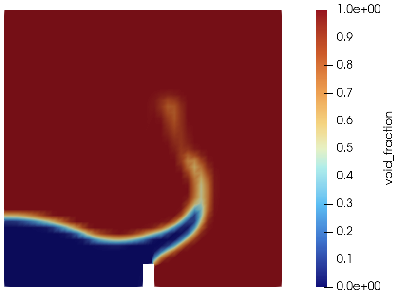
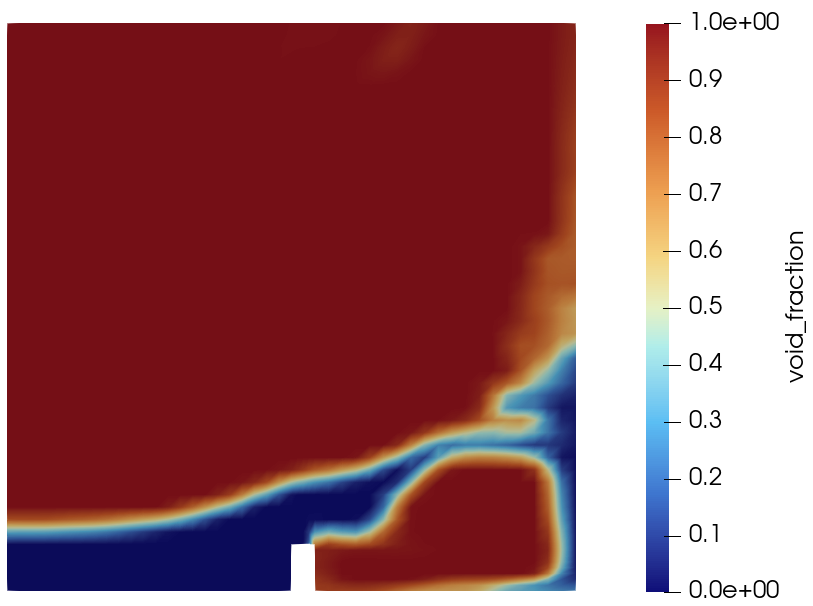

# VOF Dam Break 

This tutorial simulates the gravity-driven collapse of a water column inside a two-dimensional tank. The liquid front propagates across the dry section of the tank, impacts a rectangular obstacle, rises along its upstream face, and subsequently overtops it. The case is designed as a compact demonstration of free-surface flow modelling with the homogeneous Volume-of-Fluid (VOF) model in code_saturne.

The supplied setup is configured for **code_saturne 9.1** and uses a water-air mixture without interphase mass transfer.

Maintained by [Simvia](https://Simvia.tech/fr), part of the
[tutoriel-code_saturne](https://github.com/simvia-tech/tutorials-code_saturne) collection.

## Learning objectives

After completing this tutorial, the user should be able to:

1. activate the homogeneous VOF model for an incompressible water-air flow.
2. initialize two phases in different volume zones using the `void_fraction` field;
3. define phase-dependent density and dynamic viscosity;
4. include gravity and surface-tension effects;
5. configure wall, symmetry, and atmospheric-opening boundary conditions;
6. use a user boundary-condition function for a mixed inflow/outflow opening;
7. run a transient free-surface calculation with a fixed time step;
8. visualize the interface from the VOF field and assess the main stages of the dam-break motion.

## Prerequisites

| Requirement | Detail |
|---|---|
| code_saturne | **v9.1** |
| Background | Basic notions of multiphase modelling using vof |

If code_saturne is not yet installed, build it from the
[official homepage](https://code-saturne.org/), pull a
ready-to-use Singularity image from the
[Open Simulation Center](https://open-simulation-center.org/downloads/code_saturne/code_saturne),
or pull the
[Simvia Docker image](https://hub.docker.com/r/Simvia/code_saturne) before continuing.

## Case files

```
Vof_Dam_Break/
├── CASE/
│   ├── DATA/
│   │   ├── run.cfg
│   │   └── setup.xml
│   └── SRC/
│       └── cs_user_boundary_conditions.cpp
├── MESH/
│   └── damBreak_with_groups.med
├── FIGURES/
└── README.md
```

## Physical model

### Homogeneous two-phase formulation

The case uses the homogeneous VOF model with **no interphase mass transfer**. Both phases share a single velocity field and a single pressure field. The interface is represented by the scalar field

$$
\alpha = \texttt{void\_fraction},
$$

where, in this case:

- $\alpha=0$ represents water;
- $\alpha=1$ represents air;
- $0<\alpha<1$ identifies cells crossed by the numerically captured interface.

The phase indicator is transported in conservative form. In the VOF formulation, the transport equation may be written as

$$
\frac{\partial \alpha}{\partial t}
+ \nabla\cdot(\alpha\mathbf{u})
+ \nabla\cdot\left[\alpha(1-\alpha)\mathbf{u}_r\right]
=0,
$$

where $\mathbf{u}$ is the mixture velocity and $\mathbf{u}_r$ represents the interface-compression or drift contribution used by the VOF discretization. The right-hand side is zero because vaporization, condensation, and other phase-change mechanisms are disabled.

The local mixture properties are obtained from the volume fraction:

$$
\rho=(1-\alpha)\rho_w+\alpha\rho_a,
$$

$$
\mu=(1-\alpha)\mu_w+\alpha\mu_a,
$$

where subscripts $w$ and $a$ denote water and air, respectively.

### Momentum equation

The incompressible variable-density momentum equation is solved for the mixture:

$$
\frac{\partial(\rho\mathbf{u})}{\partial t}
+\nabla\cdot(\rho\mathbf{u}\otimes\mathbf{u})
=-\nabla p
+\nabla\cdot\left[\mu\left(\nabla\mathbf{u}+\nabla\mathbf{u}^{T}\right)\right]
+\rho\mathbf{g}
+\mathbf{f}_{\sigma},
$$

where $\mathbf{g}$ is gravity and $\mathbf{f}_{\sigma}$ is the surface-tension force. Surface tension is represented through the continuum-surface-force approach implemented by code_saturne.

The turbulence model is disabled. The calculation is therefore performed as a laminar, transient two-phase simulation.

## Flow parameters

The two phases are initialized at rest. The motion is generated entirely by gravity after the idealized instantaneous removal of the gate retaining the water column.

| Parameter | Water | Air | Unit |
|---|---:|---:|---|
| Density $\rho$ | 1000 | 1 | $\mathrm{kg\,m^{-3}}$ |
| Dynamic viscosity $\mu$ | $1.0\times10^{-3}$ | $1.48\times10^{-5}$ | $\mathrm{Pa\,s}$ |

Additional physical parameters are:

| Parameter | Value | Unit |
|---|---:|---|
| Surface tension $\sigma$ | 0.07 | $\mathrm{N\,m^{-1}}$ |
| Gravity | $(0,-9.81,0)$ | $\mathrm{m\,s^{-2}}$ |
| Initial velocity | $(0,0,0)$ | $\mathrm{m\,s^{-1}}$ |
| Reference pressure | 101325 | Pa |
| Reference temperature | 293.15 | K |

Using the initial water height $H_0=0.292\ \mathrm{m}$, the gravity velocity scale is

$$
U_g=\sqrt{gH_0}\approx1.69\ \mathrm{m\,s^{-1}}.
$$

This value is useful for estimating the characteristic time scale and for assessing temporal and spatial resolution.

## Geometry and boundary conditions

### Geometry

The computational domain is a square tank containing a rectangular obstacle attached to the bottom wall.

| Geometrical quantity | Value |
|---|---:|
| Tank length | 0.584 m |
| Tank height | 0.584 m |
| Quasi-2D thickness | 0.0146 m |
| Initial water-column width | 0.1461 m |
| Initial water-column height | 0.292 m |
| Distance from the initial column to the obstacle | 0.1459 m |
| Obstacle width | 0.024 m |
| Obstacle height | 0.048 m |
| Obstacle leading-edge position | $x=0.292\ \mathrm{m}$ |

The initial water region is defined in `setup.xml` by

```text
0 <= x <= 0.1461 m
0 <= y <= 0.2920 m
```

The entire domain is initialized with $\alpha=1$, after which the water-column zone is assigned $\alpha=0$.

### Mesh

The MED mesh is a structured five-block mesh extruded through one cell in the spanwise direction. It contains:

- 2268 hexahedral cells;
- 4746 vertices;
- one cell across the quasi-2D thickness;
- local refinement around the bottom obstacle and the lower part of the tank.

The front and back planes are symmetry boundaries, so the solution is effectively two-dimensional.

<p align="center">
  
  <br>
  <em>Figure 1: Mesh and boundary conditions (z = 0.00730 m slice).</em>
</p>

### Boundary conditions

| Boundary zone | Type | Definition |
|---|---|---|
| `leftWall` | Wall | No-slip velocity |
| `rightWall` | Wall | No-slip velocity |
| `lowerWall` | Wall | No-slip velocity; includes the tank floor and obstacle |
| `atmosphere` | Imposed-pressure outlet | Relative pressure $p=0\ \mathrm{Pa}$ |
| `front` | Symmetry | Quasi-2D plane |
| `back` | Symmetry | Quasi-2D plane |

The atmospheric opening must permit both outflow and possible local inflow. The file `cs_user_boundary_conditions.cpp` applies the following velocity treatment on the zone named `atmosphere`:

- for predicted outflow, a homogeneous Neumann condition is imposed on velocity;
- for predicted inflow, the normal velocity uses a Neumann condition and the tangential components are set to zero.

The sign of the predicted normal flux is evaluated from the previous-time-step cell velocity and the outward boundary-face normal. The zone name `atmosphere` must therefore remain unchanged unless the user function is updated accordingly.

## Numerical setup

The main numerical settings stored in `CASE/DATA/setup.xml` are summarized below.

| Setting | Value |
|---|---:|
| code_saturne setup version | 9.1 |
| Calculation type | Unsteady |
| Velocity-pressure coupling | SIMPLEC |
| Time step | $2.5\times10^{-4}\ \mathrm{s}$ |
| Number of time steps | 3000 |
| Final simulated time | 0.75 s |
| Turbulence model | Off |
| VOF model | Homogeneous mixture, no mass transfer |
| Void-fraction RHS reconstruction | 1 sweep |
| Velocity RHS reconstruction | 1 sweep |
| Pressure RHS reconstruction | 2 sweeps |
| Post-processing format | EnSight Gold, separate meshes |
| Output period | 0.01 s |

Three probes are also defined at the mid-thickness plane:

| Probe | $x$ (m) | $y$ (m) | $z$ (m) |
|---|---:|---:|---:|
| 1 | 0.06983 | 0.14371 | 0.00730 |
| 2 | 0.27296 | 0.02700 | 0.00730 |
| 3 | 0.30700 | 0.06714 | 0.00730 |

They can be used to monitor the local pressure, velocity, and phase indicator during the collapse and obstacle impact.

The fixed time step should be checked against the maximum Courant number reported by code_saturne. A finer mesh or a more violent interface motion may require a smaller value.

## Running the simulation

The commands below start from the tutorial directory:

```bash
cd Vof_Dam_Break/
```

### Option A: Graphical interface

```bash
code_saturne gui CASE/DATA/setup.xml &
```

The GUI opens the pre-configured `setup.xml`. Review the setup if you wish,
then launch the run with the **gear (Run) button** in the toolbar. To run in
parallel, set the number of processes under
**Calculation management > Performance settings** before launching.

### Option B: Command line

The command-line launcher is run from inside the case directory:

```bash
cd CASE

# serial
code_saturne run

# parallel (e.g. 4 MPI ranks)
code_saturne run --n 4
```

The mesh is light, so the case runs quickly; serial runs easily.

Each run creates a time-stamped directory `CASE/RESU/<YYYYMMDD-HHMM>/` containing:

- `run_solver.log`: solver log and residual history,
- `monitoring/`: probe time series (`probes_*.csv`),
- `postprocessing/`: volume and boundary fields in EnSight Gold format.

## Results and verification

The following snapshots show the computed `void_fraction` field. Blue regions correspond to water $(\alpha\approx0)$, red regions correspond to air $(\alpha\approx1)$, and the intermediate colors show the numerically captured interface.

### Interface at $t=0.25\ \mathrm{s}$

<p align="center">
  
  <br>
  <em>Figure 2: Development of phase fractions at t= 0.25s </em>
</p>

At $t=0.25\ \mathrm{s}$, the released water column has propagated along the bottom of the tank and reached the obstacle. The liquid is redirected upward along the upstream face, producing a narrow rising jet. The curved interface and the beginning of the overturning motion are characteristic of this stage of the benchmark.

### Interface at $t=0.50\ \mathrm{s}$

<p align="center">
  
  <br>
  <em>Figure 3: Development of phase fractions at t= 0.50s </em>
</p>

At $t=0.50\ \mathrm{s}$, the water has overtopped the obstacle and entered the downstream part of the tank. The interface displays strong deformation, and an air region is enclosed beneath the overturning liquid sheet downstream of the obstacle. These features demonstrate that the case captures the main gravity-driven propagation, impact, jet formation, overtopping, and air-entrapment mechanisms expected in the dam-break-with-obstacle problem.

The present verification is **qualitative**. The snapshots reproduce the expected sequence of interface configurations, but the case does not yet include a quantitative comparison of wave-front position, obstacle pressure, or liquid-volume conservation against reference data.

Recommended verification quantities for further development are:

1. the water-front position as a function of time;
2. the maximum rise of the jet on the obstacle;
3. pressure histories on the upstream obstacle face;
4. the total liquid volume, $V_w(t)=\int_{\Omega}(1-\alpha)\,\mathrm{d}\Omega$;
5. sensitivity to mesh resolution and time-step size;
6. minimum and maximum values of `void_fraction` to confirm boundedness.

## Summary and limitations

This tutorial demonstrates a complete gravity-driven, free-surface calculation with code_saturne using:

- the homogeneous VOF model;
- water-air variable mixture properties;
- surface tension and gravity;
- volume-zone initialization of the phase field;
- a pressure opening with a user-defined mixed velocity treatment;
- a quasi-two-dimensional structured mesh;
- transient EnSight output for interface visualization.

The supplied results reproduce the principal qualitative stages of a dam break interacting with a bottom obstacle. However, the following limitations should be kept in mind:

- the mesh is intentionally coarse and contains only 2268 cells;
- the spanwise direction contains one cell, so three-dimensional effects are excluded;
- the turbulence model is disabled;
- the retaining gate is not modelled explicitly and is removed instantaneously at $t=0$;
- no dedicated dynamic contact-angle model is specified;
- no dedicated hydrostatic-pressure initialization is supplied;
- the current verification is visual rather than quantitative;
- mesh and time-step convergence studies remain necessary before using the case for predictive engineering analysis.

The case is therefore best considered a reproducible introductory VOF tutorial and a basis for subsequent validation and refinement studies.

## References

1. code_saturne documentation, *VOF model for free-surface or dispersed flow*, homogeneous-mixture modelling module: <https://www.code-saturne.org/documentation/9.0/doxygen/src/group__vof.html>.
2. C. W. Hirt and B. D. Nichols, “Volume of Fluid (VOF) Method for the Dynamics of Free Boundaries,” *Journal of Computational Physics*, vol. 39, no. 1, pp. 201-225, 1981. <https://doi.org/10.1016/0021-9991(81)90145-5>.
3. J. U. Brackbill, D. B. Kothe, and C. Zemach, “A Continuum Method for Modeling Surface Tension,” *Journal of Computational Physics*, vol. 100, no. 2, pp. 335-354, 1992. <https://doi.org/10.1016/0021-9991(92)90240-Y>.
4. S. Koshizuka and Y. Oka, “Moving-Particle Semi-Implicit Method for Fragmentation of Incompressible Fluid,” *Nuclear Science and Engineering*, vol. 123, no. 3, pp. 421-434, 1996. <https://doi.org/10.13182/NSE96-A24205>.
5. [code_saturne documentation](https://code-saturne.org/doc/)

## Authors

[Simvia](https://Simvia.tech/fr) - Questions, remarks and requests are welcome.