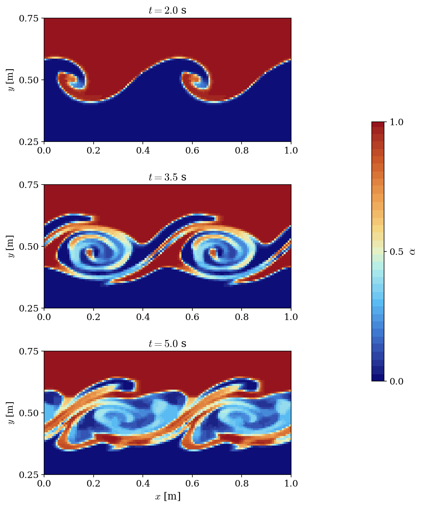

# Kelvin-Helmholtz Instability (VOF)

A step-by-step tutorial for simulating the **Kelvin-Helmholtz instability** with the **VOF (Volume of Fluid) model** of **code_saturne**: two fluid layers in opposite motion destabilize at their interface, and the seeded perturbation grows into the classical rolling billows. The case is a compact demonstration of a two-phase VOF setup: per-phase properties, user initialization of the void fraction, and streamwise periodicity.

Maintained by [Simvia](https://Simvia.tech/fr), part of the
[tutoriel-code_saturne](https://github.com/simvia-tech/tutorials-code_saturne) collection.

## Learning objectives

After completing this tutorial you will be able to:

1. Enable the **VOF homogeneous two-phase model** (no mass transfer) and set **per-phase properties**.
2. Initialize the **void fraction and the velocity field** with a `cs_user_initialization.cpp` user routine.
3. Set up a **streamwise translational periodicity**.
4. Run a time-accurate two-phase transient with a fixed time step.
5. Run the case and visualize the void fraction field (roll-up of the interface).

## Prerequisites

| Requirement | Detail |
|---|---|
| code_saturne | **v9.1** |
| Background | Basic notions of hydrodynamic stability (shear instabilities) |

If code_saturne is not yet installed, build it from the
[official homepage](https://www.code-saturne.org/cms/web/Download), pull a
ready-to-use Singularity image from the
[Open Simulation Center](https://open-simulation-center.org/downloads/code_saturne/code_saturne),
or pull the
[Simvia Docker image](https://hub.docker.com/r/Simvia/code_saturne) before continuing.

## Case files

```
Vof_Kelvin_Helmholtz/
├── CASE/
│   ├── DATA/
│   │   └── setup.xml                    # pre-configured GUI case
│   └── SRC/
│       └── cs_user_initialization.cpp   # shear profile + wavy interface
├── FIGURES/                             # figures used in this README
└── README.md
```

> There is **no MESH directory**: the mesh is generated at run time by the built-in cartesian mesher ($128 \times 64 \times 1$ cells on $[0,1] \times [0.25, 0.75]$).

## Physical model

The **VOF homogeneous model** solves a single set of incompressible momentum equations for the mixture, plus **one** transport equation for the void fraction $\alpha$ (fraction of phase 1). The interface is not tracked explicitly: it is the thin region where $\alpha$ switches from 0 to 1, and the $\alpha = 0.5$ contour used in the post-processing below is a diagnostic, not a solved variable:

$$
\frac{\partial \alpha}{\partial t} + \mathbf{u} \cdot \nabla \alpha = 0,
\qquad
\rho = (1-\alpha)\,\rho_0 + \alpha\,\rho_1,
\qquad
\mu = (1-\alpha)\,\mu_0 + \alpha\,\mu_1
$$

The flow is laminar, without gravity and without surface tension: the only physics at play is the **shear instability**.

The initial state, set by `cs_user_initialization.cpp`, is a hyperbolic-tangent shear layer with a sinusoidally displaced interface:

$$
u(y) = U_0 \tanh\!\left(\frac{y - y_0}{\delta}\right),
\qquad
\alpha(x, y) = \frac{1}{2}\left[1 + \tanh\!\left(\frac{y - y_0 - \varepsilon \sin(k x)}{\delta}\right)\right]
$$

with the seeded mode $k = 4\pi$ (two wavelengths in the periodic box). The shear destabilizes the perturbed interface, which rolls up into the classical Kelvin-Helmholtz billows.

### Flow parameters

| Quantity | Symbol | Value | Source in `setup.xml` / `SRC` |
|---|---|---|---|
| Phase densities | $\rho_0$, $\rho_1$ | $1.0$, $2.0$ | `density` (per-phase values) |
| Phase viscosities | $\mu_0$, $\mu_1$ | $10^{-4}$, $10^{-4}$ | `molecular_viscosity` |
| Surface tension, gravity | $\sigma_s$, $g$ | $0$, $0$ | `surface_tension`, `gravity` |
| Shear velocity | $\pm U_0$ | $\pm 0.5\ \mathrm{m\,s^{-1}}$ | `cs_user_initialization.cpp` |
| Shear layer thickness | $\delta$ | $0.01$ m | `cs_user_initialization.cpp` |
| Seeded mode, amplitude | $k$, $\varepsilon$ | $4\pi$, $0.005$ m | `cs_user_initialization.cpp` |
| Domain | | $[0,1] \times [0.25,0.75]$, $128 \times 64$ cells | `mesh_cartesian` |
| Time step | $\Delta t$ | $0.004$ s (fixed, CFL $\approx 0.26$) | `time_step_ref` |
| Final time | $t_{end}$ | $10$ s | `maximum_time` |

## Geometry and boundary conditions

The domain is a thin box, **periodic in $x$** (the two lateral faces are joined by a translational periodicity, exactly as in the streamwise periodic tutorial) with symmetry planes at the top and bottom, far enough from the interface not to influence the instability. The two spanwise ($xy$) planes carry a symmetry condition, so the computation is effectively two-dimensional.

| Boundary | Location | Nature | Zone |
|---|---|---|---|
| periodic pair | $x = 0$ and $x = 1$ | Periodicity (translation) | `X0`, `X1` |
| `Y0`, `Y1` | $y = 0.25$, $y = 0.75$ | Symmetry | `Y0`, `Y1` |
| `Z0`, `Z1` | spanwise planes | Symmetry | `Z0`, `Z1` |

The initial state is set by `SRC/cs_user_initialization.cpp`, compiled automatically at the beginning of the run (the routine does not overwrite the fields on a restart).

## Numerical setup

| Setting | Value | Rationale |
|---|---|---|
| Velocity-pressure coupling | **SIMPLEC** | Standard segregated coupling |
| Two-phase model | VOF, no mass transfer | Single transport equation for the void fraction; the interface is implicit (the thin region where alpha switches from 0 to 1) |
| Time-stepping | Fixed $\Delta t = 0.004$ s | Time-accurate transient, CFL $\approx 0.26$ |
| Turbulence | none (laminar) | Laminar two-phase demonstration |
| Output frequency | every $0.05$ s | Time-resolved series to animate the roll-up |

## Running the simulation

The commands below start from the tutorial directory:

```bash
cd Vof_Kelvin_Helmholtz/
```

### Option A: Graphical interface

```bash
code_saturne gui CASE/DATA/setup.xml &
```

The GUI opens the pre-configured `setup.xml`. Review the setup if you wish,
then launch the run with the **gear (Run) button** in the toolbar.

### Option B: Command line

The command-line launcher is run from inside the case directory:

```bash
cd CASE

# serial
code_saturne run

# parallel (e.g. 2 MPI ranks)
code_saturne run --nprocs 2
```

The user routine `SRC/cs_user_initialization.cpp` is compiled automatically at the beginning of the run.

Each run creates a time-stamped directory `CASE/RESU/<YYYYMMDD-HHMM>/` containing:

- `run_solver.log`: solver log,
- `postprocessing/`: time series of volume fields in EnSight Gold format.

## Results

<p align="center">
  
  <br>
  <em>Figure 1: Void fraction $\alpha$ at $t = 2.0$, $3.5$ and $5.0$ s: the seeded perturbation grows into two billows, rolls up into spirals, then mixes the two phases.</em>
</p>

## Summary

This tutorial set up a two-phase Kelvin-Helmholtz instability with the VOF model of code_saturne: per-phase properties, user-routine initialization of the void fraction and of the shear profile, and streamwise periodicity. The seeded perturbation grows and rolls up into the classical billows, mixing the two phases. This case is the entry point of the VOF series.

## References

- H. von Helmholtz. On discontinuous movements of fluids, Phil. Mag., 36:337-346, 1868.
- Lord Kelvin (W. Thomson). Hydrokinetic solutions and observations, Phil. Mag., 42:362-377, 1871.
- [code_saturne documentation](https://www.code-saturne.org/cms/web/documentation)

## Authors

[Simvia](https://Simvia.tech/fr) - Questions, remarks and requests are welcome.
