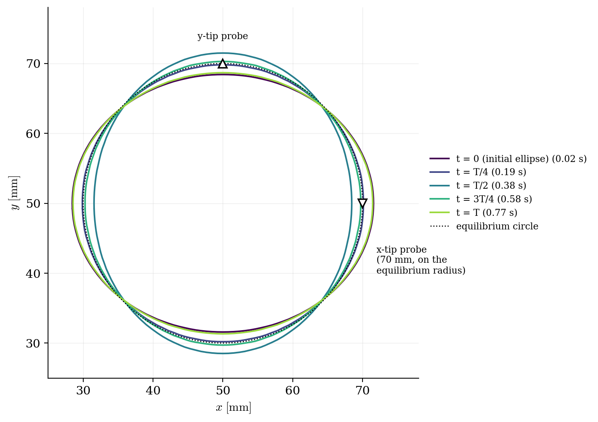
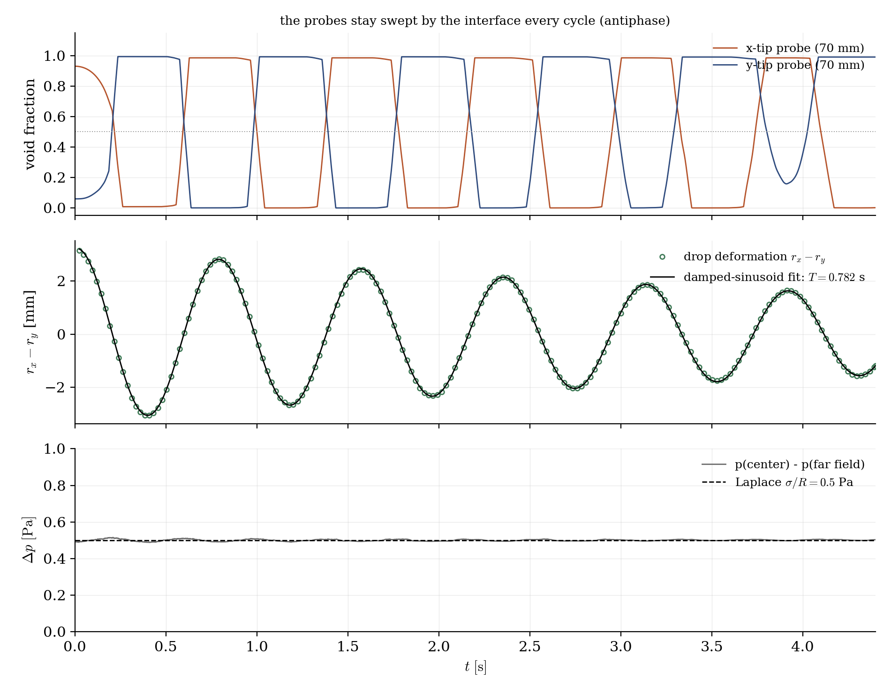

# Oscillating Drop (VOF Surface Tension)

A step-by-step tutorial for the **surface tension** of the VOF model of **code_saturne**: the one ingredient the other VOF cases of this collection leave switched off. A liquid drop is released as an ellipse in weightlessness; surface tension pulls it back toward the circle, inertia overshoots, and the drop oscillates at the capillary frequency of Rayleigh. The case checks two independent exact results at once: the **oscillation period** and the **Laplace pressure jump**.

Maintained by [Simvia](https://Simvia.tech/fr), part of the
[tutoriel-code_saturne](https://gitlab.com/Simvia/common-tools/tutoriel-code_saturne) collection.

## Learning objectives

After completing this tutorial you will be able to:

1. Activate **surface tension** in the VOF model (a single fluid property once the homogeneous model is on), driving the Continuum Surface Force (CSF).
2. Verify a capillary flow against two exact results: the **Rayleigh oscillation period** and the **Laplace jump** $\sigma/R$.
3. Respect the **capillary time-step limit**, and see what happens when the adaptive time step ignores it.

## Prerequisites

| Requirement | Detail |
|---|---|
| code_saturne | **v9.1** |
| Tutorial | [Vof_Rayleigh_Taylor](../Vof_Rayleigh_Taylor) (the VOF model and its MEG interface initialization) |

If code_saturne is not yet installed, build it from the
[official homepage](https://www.code-saturne.org/cms/web/Download), pull a
ready-to-use Singularity image from the
[Open Simulation Center](https://open-simulation-center.org/downloads/code_saturne/code_saturne),
or pull the
[Simvia Docker image](https://hub.docker.com/r/Simvia/code_saturne) before continuing.

## Case files

```
Vof_Oscillating_Drop/
├── CASE/
│   ├── DATA/setup.xml                # VOF + surface tension, all GUI
│   └── SRC/cs_user_initialization.cpp # the elliptic drop
├── FIGURES/                          # figures used in this README
└── README.md
```

> Built-in cartesian mesher ($128 \times 128$ over $0.1 \times 0.1$ m, one cell thick). The only user code is the initial shape.

## Physical model

A drop (liquid, $\rho_i = 100$, $\mu_i = 10^{-3}$) sits in a lighter ambient fluid ($\rho_o = 10$, $\mu_o = 10^{-5}$, SI) inside a closed box with **no gravity**, all boundaries symmetry. Surface tension is $\sigma = 0.01$ N/m. The drop is initialized as an **ellipse**, a circle of radius $R = 0.02$ m deformed by $\pm 8\%$ (mode 2), and left to relax.

**Why it oscillates.** Surface tension is an energy per unit area: the drop's equilibrium shape is the one of least perimeter, the circle. An ellipse is therefore charged with surface energy, and the non-uniform Laplace pressure ($\Delta p = \sigma\kappa$, higher at the sharply curved tips) pushes liquid from the tips toward the flatter sides. Passing through the circle, the fluid is in motion and overshoots into the perpendicular ellipse: the axes swap, and the cycle repeats. This is a spring-mass oscillator, the spring being surface tension ($\sim \sigma/R^3$) and the mass the inertia of **both** fluids ($\rho_i + \rho_o$). The mode-2 angular frequency (2D, inviscid) is

$$
\omega^2 = \frac{n(n^2-1)\,\sigma}{(\rho_i + \rho_o)\,R^3}\bigg|_{n=2}
= \frac{6\,\sigma}{(\rho_i + \rho_o)\,R^3},
\qquad T = \frac{2\pi}{\omega} = 0.761\ \mathrm{s}
$$

Viscosity does not enter the period at first order: it only damps the amplitude cycle after cycle (the Ohnesorge number is $\approx 7 \times 10^{-3}$ here, so the drop is weakly damped, ideal for reading the period over three cycles). At rest the drop would carry a uniform Laplace overpressure $\Delta p = \sigma/R = 0.5$ Pa.

This is exactly the principle of the **oscillating-drop method** used to measure the surface tension of levitated liquid metals: film the oscillation, invert the Rayleigh formula.

### The capillary time-step limit

The capillary force sets its own stability limit, $\Delta t < \sqrt{\rho\,\Delta x^3 / (2\pi\sigma)}$. The case uses a **constant** $\Delta t = 5 \times 10^{-4}$ s (about 78% of that limit). A first attempt with the adaptive time step piloted by the Courant number alone silently drifted (the measured period wandered from $0.755$ to $0.825$ s) because it violated the capillary limit: on any surface-tension flow, cap the time step for the capillary wave, not just for convection.

## Running the simulation

The commands below start from the tutorial directory:

```bash
cd Vof_Oscillating_Drop/CASE
code_saturne run --id drop
```

$4800$ steps of $5 \times 10^{-4}$ s (three oscillation periods), a few minutes serial. Four probes record the void fraction at the two ellipse tips (the oscillation signal) and the pressure at the center and in the far field (the Laplace jump).

## Results

<p align="center">
  
  <br>
  <em>Figure 1: the interface (void-fraction $0.5$ contour) over one period. The drop swings from the initial horizontal ellipse, through the equilibrium circle at $T/4$, to the perpendicular ellipse, and back: the mode-2 oscillation. The two triangles mark the tip probes: the x-tip probe (on the horizontal axis) enters the drop when the ellipse is horizontal, the y-tip probe (on the vertical axis) when it is vertical, hence their antiphase signals in Figure 2.</em>
</p>

<p align="center">
  
  <br>
  <em>Figure 2: top, void fraction at the two tip probes, placed on the equilibrium radius so the interface sweeps them every cycle: they alternate in antiphase (the axes swapping). Middle, the drop deformation $r_x - r_y$ (a continuous geometric measure of the oscillation), fitted by a damped sinusoid giving the period and the viscous damping time. Bottom, the center-to-far-field pressure difference, steady on the Laplace value.</em>
</p>

The two exact targets are met:

| Check | Computed | Exact |
|---|---|---|
| Oscillation period | $0.782$ s | $0.761$ s ($+2.8\%$) |
| Laplace pressure jump | $0.500$ Pa | $\sigma/R = 0.500$ Pa |

The period (from the damped-sinusoid fit of the deformation) agrees to within $2.8\%$. The small excess is expected: Rayleigh's formula assumes an *infinitesimal* deformation, whereas the drop is initialized at $\pm 8\%$ (semi-axes $R(1 \pm 0.08)$, see the physical model). At finite amplitude the restoring force is slightly softer than the linear theory, which lengthens the period, and $2.8\%$ is the consistent order of magnitude for an $8\%$ deformation. The Laplace jump, read as a time average over the oscillations, is exact to the milli-pascal.

## Summary

This tutorial switched on the surface tension of the VOF model, the one ingredient absent from the other VOF cases, on the oscillating-drop problem where two exact results are available. An elliptic drop relaxes at the Rayleigh capillary frequency (period within $2.8\%$, the residual being the finite deformation amplitude) and carries the exact Laplace overpressure ($\sigma/R$ to the milli-pascal). The lesson that carries beyond this case: cap the time step for the capillary wave, not just for the Courant number.

## References

- Lord Rayleigh. On the capillary phenomena of jets, Proc. R. Soc. London, 29, 71-97, 1879 (the drop oscillation frequency).
- [code_saturne documentation](https://www.code-saturne.org/cms/web/documentation)

## Authors

[Simvia](https://Simvia.tech/fr) - Questions, remarks and requests are welcome.
