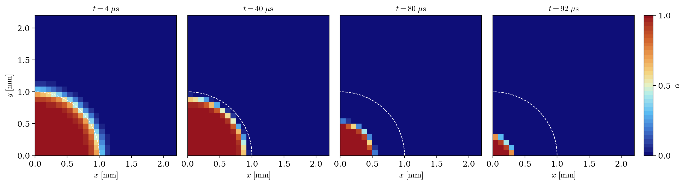
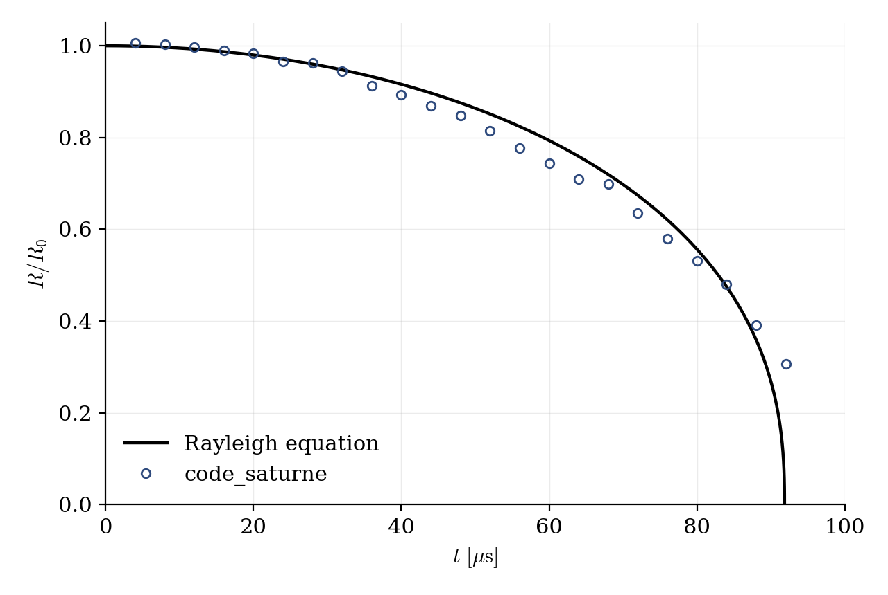

# Rayleigh Bubble Collapse (VOF Cavitation Model)

A step-by-step tutorial for simulating the **collapse of a vapor bubble** with the **cavitation model** of **code_saturne**: a spherical vapor bubble at rest in pressurized water implodes under the ambient overpressure. The case is the academic companion of [Vof_Cavitating_Throttle](../Vof_Cavitating_Throttle): the throttle exercises the **vaporization** source term in a realistic device, this case exercises the **condensation** term in the simplest possible geometry, on a built-in Cartesian mesh with no mesh file at all. As a bonus, the classical **Rayleigh solution** (1917) provides a reference to quantify the result.

Maintained by [Simvia](https://Simvia.tech/fr), part of the
[tutoriel-code_saturne](https://github.com/simvia-tech/tutorials-code_saturne) collection.

## Learning objectives

After completing this tutorial you will be able to:

1. Set up a **bubble collapse** with the VOF cavitation model (Merkle) on the built-in Cartesian mesher.
2. Exploit **spherical symmetry** with an octant domain (three symmetry planes).
3. Initialize the void fraction with a `cs_user_initialization.cpp` user routine and set the mandatory cavitation parameters in `cs_user_parameters.cpp`.
4. Post-process the bubble radius history and compare it with the **Rayleigh solution**.

## Prerequisites

| Requirement | Detail |
|---|---|
| code_saturne | **v9.1** |
| Case | [Vof_Cavitating_Throttle](../Vof_Cavitating_Throttle) (cavitation model basics and its mandatory user file) |

If code_saturne is not yet installed, build it from the
[official homepage](https://code-saturne.org/), pull a
ready-to-use Singularity image from the
[Open Simulation Center](https://open-simulation-center.org/downloads/code_saturne/code_saturne),
or pull the
[Simvia Docker image](https://hub.docker.com/r/Simvia/code_saturne) before continuing.

## Case files

```
Vof_Rayleigh_Collapse/
├── CASE/
│   ├── DATA/
│   │   └── setup.xml                    # pre-configured GUI case
│   └── SRC/
│       ├── cs_user_initialization.cpp   # spherical vapor bubble at rest
│       └── cs_user_parameters.cpp       # cavitation model parameters (MANDATORY)
├── FIGURES/                             # figures used in this README
└── README.md
```

> There is **no MESH directory**: the mesh is generated at run time by the built-in cartesian mesher ($48^3$ cells on the octant $[0, 4R_0]^3$).

## Physical model

A spherical vapor bubble of radius $R_0$ rests in quiescent water whose far-field pressure $p_\infty$ exceeds the vapor pressure $p_{\mathrm{sat}}$: the bubble collapses. Neglecting viscosity, surface tension and gas content, the interface obeys the **Rayleigh equation**

$$
R\ddot{R} + \frac{3}{2}\dot{R}^2 = -\frac{\Delta p}{\rho_l},
\qquad \Delta p = p_\infty - p_{\mathrm{sat}}
$$

whose solution reaches $R = 0$ in the finite **Rayleigh collapse time**

$$
\tau = 0.915\, R_0 \sqrt{\frac{\rho_l}{\Delta p}} = 91.9\ \mathrm{\mu s}
$$

for the present values ($R_0 = 1$ mm, $\Delta p = 98985$ Pa). The final stage concentrates the liquid inertia into a tiny volume, producing a violent **pressure spike** at the implosion point: this mechanism, which motivated Rayleigh's 1917 paper, is the root cause of cavitation erosion on ship propellers and pump impellers.

In code_saturne the bubble is handled by the VOF cavitation model (see the [throttle tutorial](../Vof_Cavitating_Throttle) for the equations): inside the bubble $p < p_{\mathrm{sat}}$ is maintained by the vapor, the surrounding liquid is driven inward by the pressure gradient, and the **condensation** branch of the Merkle source term destroys the vapor as the interface sweeps in. The same two user files as the throttle are used: `cs_user_parameters.cpp` (mandatory model parameters, here $u_\infty = \sqrt{\Delta p/\rho_l} \approx 10\ \mathrm{m/s}$ and $\ell_\infty = R_0$) and `cs_user_initialization.cpp` (a smoothed spherical void-fraction profile, fluid at rest).

### Flow parameters

| Quantity | Symbol | Value | Source |
|---|---|---|---|
| Initial bubble radius | $R_0$ | $1$ mm | `cs_user_initialization.cpp` |
| Liquid (water, 20 °C) | $\rho_l$, $\mu_l$ | $998\ \mathrm{kg\,m^{-3}}$, $10^{-3}\ \mathrm{Pa\,s}$ | `density`, `molecular_viscosity` (`value_0`) |
| Vapor | $\rho_v$, $\mu_v$ | $1\ \mathrm{kg\,m^{-3}}$, $10^{-5}\ \mathrm{Pa\,s}$ | (`value_1`) |
| Far-field pressure | $p_\infty$ | $101325$ Pa | `reference_pressure` |
| Saturation pressure | $p_{\mathrm{sat}}$ | $2340$ Pa | `cs_user_parameters.cpp` |
| Driving pressure | $\Delta p$ | $98985$ Pa | derived |
| Rayleigh time | $\tau$ | $91.9\ \mathrm{\mu s}$ | derived |
| Domain (octant) | | $[0, 4\ \mathrm{mm}]^3$, $48^3$ cells | `mesh_cartesian` |
| Time step | $\Delta t$ | $2 \times 10^{-7}$ s (fixed) | `time_step_ref` |
| Simulated time | $t_{end}$ | $240\ \mathrm{\mu s}$ ($1200$ steps) | `iterations` |

## Geometry and boundary conditions

One **octant** of the bubble is computed: the three coordinate planes carry symmetry conditions, and the bubble center sits at the origin. The three far faces are free outlets holding the far-field pressure $p_\infty$; they are $4 R_0$ away from the center, which is sufficient here since the liquid inflow they must supply decays as $(R/r)^2$.

| Boundary | Location | Nature | Zone selector |
|---|---|---|---|
| `SymX`, `SymY`, `SymZ` | $x=0$, $y=0$, $z=0$ | Symmetry | `X0`, `Y0`, `Z0` |
| `Far` | far faces | Free outlet ($p = p_\infty$) | `X1 or Y1 or Z1` |

With $48^3$ cells the initial bubble radius spans **12 cells**, and the interface is initialized with a $\tanh$ profile about one cell thick.

## Numerical setup

| Setting | Value | Rationale |
|---|---|---|
| Two-phase model | VOF + Merkle cavitation (`merkle_model`) | Condensation drives the collapse |
| Velocity-pressure coupling | **SIMPLEC** | Standard segregated coupling |
| Velocity convection scheme | 1st-order upwind (`blending_factor` 0) | Robustness |
| Time-stepping | Fixed $\Delta t = 2 \times 10^{-7}$ s ($\tau/460$) | Resolves the collapse acceleration |
| Turbulence | none (laminar) | Radial laminar flow |
| Output | EnSight every 20 steps | $\approx 23$ frames over the collapse |
| Probe | bubble center | Pressure and void fraction monitoring |

## Running the simulation

The commands below start from the tutorial directory:

```bash
cd Vof_Rayleigh_Collapse/
```

### Option A: Graphical interface

```bash
code_saturne gui CASE/DATA/setup.xml &
```

The GUI opens the pre-configured `setup.xml`. Review the setup if you wish,
then launch the run with the **gear (Run) button** in the toolbar.

### Option B: Command line

The command-line launcher is run from inside the case directory:

```bash
cd CASE

# serial
code_saturne run

# parallel (e.g. 4 MPI ranks)
code_saturne run --nprocs 4
```

The two user routines are compiled automatically at the beginning of the run. The case takes a few minutes on 4 cores.

## Results

<p align="center">
  
  <br>
  <em>Figure 1: void fraction in the $z \approx 0$ cell layer at $t = 4$, $40$, $80$ and $92\ \mathrm{\mu s}$ (the dashed quarter-circle marks $R_0$). The bubble stays spherical while it shrinks, and the collapse accelerates: half of the radius is lost in the last quarter of the collapse time.</em>
</p>

<p align="center">
  
  <br>
  <em>Figure 2: equivalent bubble radius $R(t) = (3V_{vap}/4\pi)^{1/3}$ (symbols, shown while the bubble remains resolved by the mesh, i.e. $R \gtrsim 3$ cells) against the integrated Rayleigh equation (line).</em>
</p>

The computed radius follows the Rayleigh law throughout the resolved phase of the collapse; the small deviations are largely attributable to the deliberately modest mesh used in this tutorial ($48^3$, i.e. 12 cells on the initial radius, with an interface smeared over a few cells). The very last stage ($R$ below a few cells) is not shown: no mesh resolves a collapse to a point, and the residual sub-cell vapor is not physics.

## Summary

This tutorial set up the collapse of a spherical vapor bubble with the cavitation model of code_saturne: an octant domain on the built-in Cartesian mesher, a void-fraction sphere initialized by a user routine, and the mandatory cavitation parameters file. The computed radius history follows the Rayleigh solution closely, which quantifies the quality of the result. Together with [Vof_Cavitating_Throttle](../Vof_Cavitating_Throttle), it covers both directions of the Merkle mass transfer: vaporization in the throttle, condensation here.

## References

- Lord Rayleigh. On the pressure developed in a liquid during the collapse of a spherical cavity, [Phil. Mag., 34:94-98, 1917.](https://doi.org/10.1080/14786440808635681)
- J.P. Franc, J.M. Michel. Fundamentals of Cavitation, Kluwer, 2004.
- [code_saturne documentation](https://code-saturne.org/doc/)

## Authors

[Simvia](https://Simvia.tech/fr) - Questions, remarks and requests are welcome.
