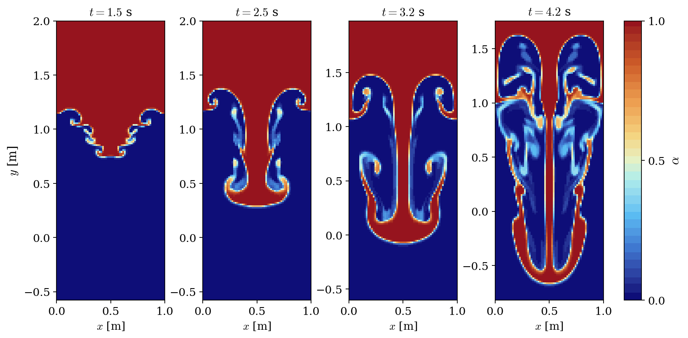

# Rayleigh-Taylor Instability (VOF)

A step-by-step tutorial for simulating the **Rayleigh-Taylor instability** with the **VOF (Volume of Fluid) model** of **code_saturne**: a heavy fluid rests on top of a light fluid under gravity, and any perturbation of the interface grows into the characteristic falling spikes and rising bubbles. Together with [Vof_Kelvin_Helmholtz](../Vof_Kelvin_Helmholtz), it is a compact demonstration of a two-phase VOF setup.

Maintained by [Simvia](https://Simvia.tech/fr), part of the
[tutoriel-code_saturne](https://github.com/simvia-tech/tutorials-code_saturne) collection.

## Learning objectives

After completing this tutorial you will be able to:

1. Set up a **gravity-driven two-phase problem** with the VOF homogeneous model.
2. Initialize the **void fraction** with a `cs_user_initialization.cpp` user routine (the velocity stays at rest: the instability is driven by gravity alone).
3. Use a **CFL-controlled adaptive time step** for a flow whose velocities grow in time.
4. Run the case and visualize the void fraction field (spikes, bubbles, mushrooms).

## Prerequisites

| Requirement | Detail |
|---|---|
| code_saturne | **v9.1** |
| Case | [Vof_Kelvin_Helmholtz](../Vof_Kelvin_Helmholtz) (details of the VOF model) |

If code_saturne is not yet installed, build it from the
[official homepage](https://www.code-saturne.org/cms/web/Download), pull a
ready-to-use Singularity image from the
[Open Simulation Center](https://open-simulation-center.org/downloads/code_saturne/code_saturne),
or pull the
[Simvia Docker image](https://hub.docker.com/r/Simvia/code_saturne) before continuing.

## Case files

```
Vof_Rayleigh_Taylor/
├── CASE/
│   ├── DATA/
│   │   └── setup.xml                    # pre-configured GUI case
│   └── SRC/
│       └── cs_user_initialization.cpp   # sinusoidally perturbed interface
├── FIGURES/                             # figures used in this README
└── README.md
```

> There is **no MESH directory**: the mesh is generated at run time by the built-in cartesian mesher ($64 \times 192 \times 1$ cells on $[0,1] \times [-1, 2]$).

## Physical model

The **VOF homogeneous model** solves the incompressible momentum equations for the mixture plus **one** transport equation for the void fraction $\alpha$, from which the mixture density and viscosity follow algebraically; the interface is implicit (see the [Vof_Kelvin_Helmholtz](../Vof_Kelvin_Helmholtz) tutorial for the equations).

Here the heavy phase ($\alpha = 1$, $\rho_1 = 5$) rests **on top of** the light phase ($\alpha = 0$, $\rho_0 = 1$) under a downward gravity $g = 1\ \mathrm{m\,s^{-2}}$: the configuration is unstable, with an Atwood number

$$
A = \frac{\rho_1 - \rho_0}{\rho_1 + \rho_0} = 0.667
$$

The initial state, set by `cs_user_initialization.cpp`, is a fluid at rest with a sinusoidally displaced interface (single mode $k = 2\pi$, one wavelength in the periodic box):

$$
\alpha(x, y) = \frac{1}{2}\left[1 + \tanh\!\left(\frac{y - y_0 - \varepsilon \sin(k x)}{\delta_s}\right)\right]
$$

The perturbation grows under gravity: the heavy fluid sinks as a **spike**, the light fluid rises as **bubbles**, and the shear along the spike flanks triggers secondary Kelvin-Helmholtz roll-ups, producing the classical mushroom shapes.

### Flow parameters

| Quantity | Symbol | Value | Source in `setup.xml` / `SRC` |
|---|---|---|---|
| Phase densities | $\rho_0$, $\rho_1$ | $1.0$, $5.0$ | `density` (per-phase values) |
| Atwood number | $A$ | $0.667$ | derived |
| Phase viscosities | $\mu_0$, $\mu_1$ | $10^{-3}$, $10^{-3}$ | `molecular_viscosity` |
| Gravity | $g$ | $(0, -1, 0)\ \mathrm{m\,s^{-2}}$ | `gravity` |
| Surface tension | $\sigma_s$ | $0$ | `surface_tension` |
| Interface position, amplitude | $y_0$, $\varepsilon$ | $1.0$, $0.03$ m | `cs_user_initialization.cpp` |
| Seeded mode | $k$ | $2\pi$ | `cs_user_initialization.cpp` |
| Domain | | $[0,1] \times [-1,2]$, $64 \times 192$ cells | `mesh_cartesian` |
| Time step | $\Delta t$ | adaptive, CFL $\le 1$ (seed $5 \times 10^{-4}$ s) | `time_parameters` |
| Final time | $t_{end}$ | $4.4$ s | `maximum_time` |

## Geometry and boundary conditions

The domain is a tall box, **periodic in $x$**, with symmetry planes at the top and bottom. The interface starts at $y_0 = 1$, which leaves two meters of fall for the heavy spike below and one meter above for the rising bubbles. The two spanwise ($xy$) planes carry a symmetry condition, so the computation is effectively two-dimensional.

| Boundary | Location | Nature | Zone |
|---|---|---|---|
| periodic pair | $x = 0$ and $x = 1$ | Periodicity (translation) | `X0`, `X1` |
| `Y0`, `Y1` | $y = -1$, $y = 2$ | Symmetry | `Y0`, `Y1` |
| `Z0`, `Z1` | spanwise planes | Symmetry | `Z0`, `Z1` |

The initial state is set by `SRC/cs_user_initialization.cpp`, compiled automatically at the beginning of the run (the routine does not overwrite the fields on a restart).

## Numerical setup

| Setting | Value | Rationale |
|---|---|---|
| Velocity-pressure coupling | **SIMPLEC** | Standard segregated coupling |
| Two-phase model | VOF, no mass transfer | Single $\alpha$ transport equation, implicit interface |
| Time-stepping | **Adaptive**, max CFL $= 1$ | The fall velocity grows in time: the step adapts (contrast with the fixed step of the Kelvin-Helmholtz case) |
| Turbulence | none (laminar) | Laminar two-phase demonstration |
| Output frequency | every 10 time steps | Time series of the void fraction |

## Running the simulation

The commands below start from the tutorial directory:

```bash
cd Vof_Rayleigh_Taylor/
```

### Option A: Graphical interface

```bash
code_saturne gui CASE/DATA/setup.xml &
```

The GUI opens the pre-configured `setup.xml`. Review the setup if you wish,
then launch the run with the **gear (Run) button** in the toolbar.

### Option B: Command line

The command-line launcher is run from inside the case directory:

```bash
cd CASE

# serial
code_saturne run

# parallel (e.g. 2 MPI ranks)
code_saturne run --nprocs 2
```

The user routine `SRC/cs_user_initialization.cpp` is compiled automatically at the beginning of the run.

Each run creates a time-stamped directory `CASE/RESU/<YYYYMMDD-HHMM>/` containing:

- `run_solver.log`: solver log,
- `postprocessing/`: time series of volume fields in EnSight Gold format.

## Results

<p align="center">
  
  <br>
  <em>Figure 1: Void fraction $\alpha$ at $t = 1.5$, $2.5$, $3.2$ and $4.2$ s: the perturbed interface steepens, the heavy spike falls while the light bubbles rise, secondary Kelvin-Helmholtz roll-ups develop on the spike flanks, and the flow evolves into the classical mushroom structures. The fields are shifted along the periodic $x$ direction to center the spike, and the vertical window of each panel follows the falling structure (same window height on all panels).</em>
</p>

## Summary

This tutorial set up a Rayleigh-Taylor instability with the VOF model of code_saturne: heavy fluid over light fluid under gravity, void fraction initialized by a user routine with the flow at rest, streamwise periodicity, and a CFL-controlled adaptive time step. The interface evolves into the classical spikes, bubbles and mushrooms, with secondary Kelvin-Helmholtz roll-ups along the spike. Together with [Vof_Kelvin_Helmholtz](../Vof_Kelvin_Helmholtz), it covers the two canonical interfacial instabilities with the VOF model.

## References

- Lord Rayleigh. Investigation of the character of the equilibrium of an incompressible heavy fluid of variable density, Proc. London Math. Soc., 14:170-177, 1883.
- G.I. Taylor. The instability of liquid surfaces when accelerated in a direction perpendicular to their planes, [Proc. R. Soc. Lond. A, 201:192-196, 1950.](https://doi.org/10.1098/rspa.1950.0052)
- [code_saturne documentation](https://www.code-saturne.org/cms/web/documentation)

## Authors

[Simvia](https://Simvia.tech/fr) - Questions, remarks and requests are welcome.
